# Command Line Introduction

Learn what a command line interface is
and learn the basics of navigating and manipulating your filesystem in a Unix shell.

<!-- slide-include ../../BANNER.md -->

<!-- START doctoc generated TOC please keep comment here to allow auto update -->
<!-- DON'T EDIT THIS SECTION, INSTEAD RE-RUN doctoc TO UPDATE -->

- [A short history of computers & computer interfaces](#a-short-history-of-computers--computer-interfaces)
  - [In the beginning (1830s)](#in-the-beginning-1830s)
  - [Analytical engine (1837)](#analytical-engine-1837)
  - [A century later (1940s)](#a-century-later-1940s)
  - [ENIAC (1946)](#eniac-1946)
  - [Automated Computing Engine (1950s)](#automated-computing-engine-1950s)
  - [Punched cards for computers (1950s)](#punched-cards-for-computers-1950s)
  - [TeleTYpewriter (1960s)](#teletypewriter-1960s)
  - [Video terminals (1970s)](#video-terminals-1970s)
    - [Unix & shells](#unix--shells)
  - [Graphical User Interfaces (1980s)](#graphical-user-interfaces-1980s)
  - [More user interfaces](#more-user-interfaces)
- [Back to the command line](#back-to-the-command-line)
  - [What is a Command Line Interface (CLI)?](#what-is-a-command-line-interface-cli)
  - [Why use it?](#why-use-it)
  - [Open a CLI](#open-a-cli)
  - [Install Git Bash (Windows users only)](#install-git-bash-windows-users-only)
- [How to use the CLI](#how-to-use-the-cli)
  - [Work in progress...](#work-in-progress)
  - [Writing commands](#writing-commands)
  - [Options vs. arguments](#options-vs-arguments)
    - [Options with values](#options-with-values)
  - [Naming things when using CLI](#naming-things-when-using-cli)
  - [Auto-completion](#auto-completion)
  - [Getting help](#getting-help)
    - [Interactive help pages](#interactive-help-pages)
    - [Unix Command Syntax](#unix-command-syntax)
- [Using the filesystem](#using-the-filesystem)
  - [The `pwd` command](#the-pwd-command)
  - [The `ls` command](#the-ls-command)
  - [The `cd` command](#the-cd-command)
    - [The `.` path](#the--path)
    - [The `..` path](#the--path)
    - [Path reference](#path-reference)
    - [Your projects directory](#your-projects-directory)
  - [The `mkdir` command](#the-mkdir-command)
  - [The `touch` command](#the-touch-command)
  - [The `echo` command](#the-echo-command)
  - [The `cat` command](#the-cat-command)
  - [Stopping running commands](#stopping-running-commands)
  - [Windows users](#windows-users)
- [Vim](#vim)
  - [WHY?!](#why)
  - [How vim works](#how-vim-works)
  - [Normal mode](#normal-mode)
  - [Command mode](#command-mode)
- [Nano](#nano)
  - [An alternative to Vim](#an-alternative-to-vim)
  - [Editing files with Nano](#editing-files-with-nano)
    - [Saving files](#saving-files)
    - [Confirming the filename](#confirming-the-filename)
  - [Setting Nano as the default editor](#setting-nano-as-the-default-editor)
- [The `PATH` variable](#the-path-variable)
  - [Understanding the `PATH`](#understanding-the-path)
  - [Finding commands](#finding-commands)
  - [Using non-system commands](#using-non-system-commands)
    - [Custom command example](#custom-command-example)
    - [Executing a command in a directory that's not in the `PATH`](#executing-a-command-in-a-directory-thats-not-in-the-path)
  - [Updating the `PATH` variable](#updating-the-path-variable)
    - [Does it work?](#does-it-work)
    - [What have I done?](#what-have-i-done)
- [Unleash your terminal](#unleash-your-terminal)
  - [Oh My Zsh](#oh-my-zsh)

<!-- END doctoc generated TOC please keep comment here to allow auto update -->


## A short history of computers & computer interfaces

<!-- slide-front-matter class: center, middle -->

For old time's sake.

### In the beginning (1830s)

<!-- slide-front-matter class: center -->

<!-- slide-column -->

<p class='center'></p>

[**Charles Babbage**][charles-babbage]

Originated the concept of a [digital][digital] [programmable][programmable],
[general-purpose computer][general-purpose-computer].

<!-- slide-column -->

<p class='center'></p>

[**Ada Lovelace**][ada-lovelace]

Published the first [algorithm][algorithm] to be carried out by such a machine.

### Analytical engine (1837)

<!-- slide-column -->

<p class='center'></p>

<!-- slide-column -->

The [Analytical Engine][analytical-engine] was a proposed mechanical
[general-purpose computer][general-purpose-computer] designed by English
mathematician and computer pioneer [Charles Babbage][charles-babbage].

In 1842, [Ada Lovelace][ada-lovelace] translated into English and extensively
annotated a description of the engine, including a way to calculate [Bernoulli
numbers][bernoulli-numbers] using the machine (widely considered to be the first
complete computer program). She has been described as the first computer
programmer.

### A century later (1940s)

<!-- slide-front-matter class: center -->

<p class='center'></p>

[**Alan Turing**][alan-turing]

Formalized the concepts of [algorithm][algorithm] and [computation][computation]
with the [Turing machine][turing-machine]. He is widely considered to be the
father of theoretical [computer science][computer-science] and [artificial
intelligence][artificial-intelligence].

### ENIAC (1946)

At that time, there was no such thing as a stored computer program.
Programs were **physically hard-coded**.
On the [ENIAC][eniac], this was done using function tables with **hundreds of ten-way switches**, which took weeks.

<p class='center'></p>

### Automated Computing Engine (1950s)

<p class='center'></p>

The [Automatic Computing Engine (ACE)][ace] was a British early electronic
serial [stored-program computer][stored-program-computer] designed by [Alan
Turing][alan-turing]. It used [mercury delay lines for its main
memory][delay-line-memory].

### Punched cards for computers (1950s)

<!-- slide-column -->

Many early general-purpose digital computers used [punched cards][punched-card]
for data input, output and storage.

Someone had to use a [keypunch][keypunch] machine to write your cards, then feed them to the computer.

This is what a **program** looked like:

<p class='center'></p>

<!-- slide-column 40 -->


> Punched cards are much older than computers.
> They were first invented around 1725.

### TeleTYpewriter (1960s)

Teletypewriters (TTYs) became the most popular **computer terminals** in the 1960s.
They were basically electromechanical typewriters adapted as a user interface for early [mainframe computers][mainframe].

This is when the first **command line interfaces (CLI)** were created.
As you typed commands, a program running on the computer would interpret that input,
and the output would be printed on physical paper.

<p class='center'></p>

### Video terminals (1970s)

<!-- slide-column -->

As available memory increased, **video terminals** such as the [VT100][vt100] replaced TTYs in the 1970s.

Initially they only displayed text.
Hence they were fundamentally the same as TTYs: textual input/output devices.

<!-- slide-column 65 -->

<p class='center'></p>

#### Unix & shells

It's also in this period that the [Unix][unix] operating system was developed.
Compared to earlier systems, Unix was the first **portable operating system**
because it was written in the [C programming language][c], allowing it to be installed on multiple platforms.

Unix is the ancestor of [Linux][linux].
[FreeBSD][freebsd], a Unix-like system, is also used as the basis for [macOS][macos] (since Mac OS X).

<!-- slide-column -->

In Unix-like systems, The program serving as the **command line interpreter**
(handling input/output from the terminal) is called a [**shell**][unix-shell].

> It is called this way because it is the outermost layer around the operating
> system; it wraps and hides the lower-level kernel interface).

<!-- slide-column 40 -->

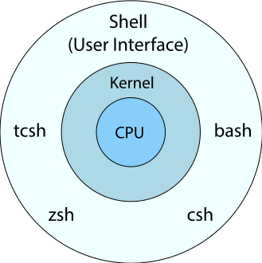

### Graphical User Interfaces (1980s)

<!-- slide-column -->

Eventually, [graphical user interfaces (GUIs)][gui] were introduced
in reaction to the perceived steep learning curve of command line interfaces.

They are one of the most common end user computer interface today.

> Note that the GUI of a computer is also a shell. It's simply a different way
> to interact with the kernel.

<!-- slide-column 60 -->


### More user interfaces

Today:

* [Touch user interface][tui]
* [Voice user interface][vui]
* [Motion sensing][motion-sensing]
* [Augmented][augmented-reality] and [virtual][virtual-reality] reality

Tomorrow:

* [Brain-computer interface?][brain-interface]


## Back to the command line

<!-- slide-front-matter class: center, middle -->

[Command line interfaces][cli] are still in wide use today.


### What is a Command Line Interface (CLI)?

A CLI is a tool that allows you to use your computer by **writing** what you want to do (i.e. **commands**), instead of clicking on things.

It's been installed on computers for a long time, but it has evolved ["a
little"][building-the-future-of-the-command-line] since then. It usually looks
something like this:

<p class='center'>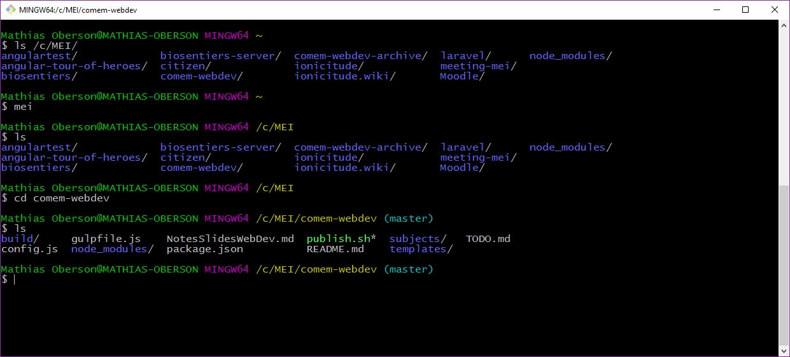</p>


### Why use it?

A CLI is not very user-friendly or visually appealing but it has several advantages:

* It requires very **few resources** (e.g. memory),
  which is convenient where resources are scarce
  (e.g. embedded systems, web servers).
* It can be easily **automated** through scripting.
* Is is ultimately **more powerful and efficient** than any GUI for many computing tasks.

For these reasons, a lot of tools, **especially development tools**,
don't have any GUI and are only usable through a CLI.
Or they have a limited GUI that does not have as many options as the CLI.

**Thus, using a CLI is a requirement for any developer today.**


### Open a CLI

**CLIs are available on every operating system.**

<!-- slide-column 50 -->

On **Unix-like** systems _(like macOS or Linux)_, it's an application called the **Terminal**.

You can use it right away, as it's the _de-facto_ standard.

<!-- slide-column -->

On **Windows**, the default CLI is called **cmd** (or **Invite de commandes** in French)

However, it does not use the same syntax as Unix-like CLIs _(plus, it's bad)_.

> **You'll need to install an alternative.**

<!-- slide-container -->

> Software terminals are an emulation of old physical terminals like [TTYs][tty] or the [VT100][vt100].
> You will still find references to the term "TTY" in the documentation of some modern command line tools.


### Install Git Bash (Windows users only)

You're going to install **Git Bash**, a software terminal that emulates the popular [Bourne-again shell (Bash)][bash] on Windows.

<!-- slide-column 30 -->

<p class='center'></p>

<!-- slide-column -->

You can download the **Git Bash Installer** on the [Git for Windows website][gitbash].

When it's done, install the software, without changing any default options.

Then, search and open the **Git Bash** software.

<!-- slide-container -->

> Installing **Git Bash** will also install **Git** and **Git GUI** _(see the [Git tutorial][slide-git] for more information)_.

As an alternative, you may also use the [Windows Subsystem for Linux][windows-subsystem-for-linux],
but it sometimes has issues when integrating with other programs not installed in that CLI.


## How to use the CLI

When you open the CLI you will find a blank screen that looks like this:

```bash
$>
```

These symbols represent **the prompt** and are used to indicate that you have
the lead. **The computer is waiting for you to type something** for it to
execute.

<!-- slide-column -->

The prompt is not always `$>`.

For example, on earlier macOS versions, it used to be `bash3.2$`, indicating the
name of the shell ([Bash][bash]) and its version.

On more recent macOS versions using [the Z shell (Zsh)][zsh], the prompt might
indicate your computer's name, your username and the current directory, e.g.
`MyComputer:~ root#`.

<!-- slide-column 30 -->

<p class='center'></p>

<p class='center'>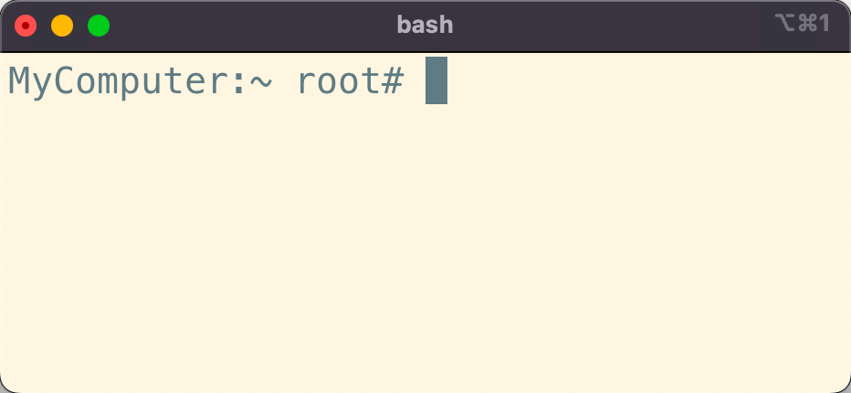</p>

<!-- slide-container -->

**For consistency, we will always use `$>` to represent the prompt.**

### Work in progress...

<!-- slide-column -->

When the computer is working, the prompt disappear and you no longer have the
lead.

> The `sleep` command tells the computer to do nothing for the specified number
> of seconds.

<!-- slide-column -->

<p class='center'></p>

<!-- slide-container -->

<!-- slide-column -->

When the computer is done working, it will indicate that you are back in control
by showing the prompt again.

<!-- slide-column -->

<p class='center'></p>


### Writing commands

A command is a **word** that you have to type in the CLI that will **tell the computer what to do**.

The syntax for using commands looks like this:

```bash
$> name arg1 arg2 arg3 ...
```
Note the use of **spaces** to separate the differents **arguments** of a command.

* `name` represents the **command** you want to execute.
* `arg1 arg2 arg3 ...` represent the **arguments of the command**, each of them **separated by a space**.


### Options vs. arguments

There are two types of arguments to use with a command (if needed):

<!-- slide-column -->

**Options** usually specify **how** the command will behave.
By convention, they are preceded by `-` or `--`:

```bash
$> ls `-a` `-l`
```

We use the `ls` command to list the content of the current directory. The options tell `ls` **how** it should do so:

* `-a` tells it to print **a**ll elements (including hidden ones).
* `-l` tells it to print elements in a **l**ist format, rather than on one line.

<!-- slide-column -->

**Other arguments** not preceded by anything usually specify **what** will be used by the command:

```bash
$> cd `/Users/Batman`
```

Here, we use the `cd` command to move to another directory.

And the argument `/Users/Batman` tells the command **what** directory we want to move to.

<!-- slide-notes -->

In the **first example**, we use the `ls` command to list elements in the current directory. We also use options to tell `ls` how it should print elements:

* `--all` tells it to print all elements.
* `-l` tells it to print elements in a list format, rather than on one line..

#### Options with values

Some options require a **value**:

```bash
tar -c -v `-f compressed.tar.gz` file-to-compress
```

`tar` is a command to bundle and compress files.
In this example, it takes **three options**:

* `-c` tells it to compress (instead of uncompressing).
* `-v` tells it to be verbose (print more information to the CLI).
* `-f` tells it where to store the compressed file;
  this is followed **immediately** by `compressed.tar.gz` which is the **value** of that option.

It then takes **one argument**:

* `file-to-compress` is the file (or directory) to compress


### Naming things when using CLI

You should avoid the following characters in directories and file names you want to manipulate with the CLI:

* **spaces** _(they're used to separate arguments in command)_.
* **accents** (e.g. `é`, `à`, `ç`, etc).

They can cause **errors** in some scripts or tools, and will inevitably complicate using the CLI.
If you have a `Why So Serious` directory, this **WILL NOT work**:

```bash
$> ls `Why` `So` `Serious`
```
This command will be interpreted as a call to the `ls` command with **three arguments**: `Why`, `So` and `Serious`.

You **can** use arguments containing spaces, but you have to **escape** them first, either with **quotation marks** or **backslashes**:

<!-- slide-column -->

```bash
$> ls `"Why So Serious"`
```

<!-- slide-column -->

```bash
$> ls `Why\ So\ Serious`
```


### Auto-completion

It's not fun to type directory names, especially when they have spaces you must escape in them,
so the CLI has **auto-completion**. Type the first few characters of the file or directory you
need, then hit the `Tab` key:

<!-- slide-column -->

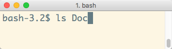

<!-- slide-column -->

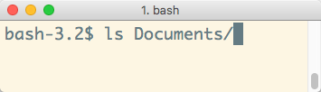

<!-- slide-container -->

If there are multiple files or directories that begin with the **same characters**,
pressing `Tab` will not display anything.
You need hit `Tab` **a second time** to display the list of available choices:

<p class='center'></p>

You can type just enough characters so that the CLI can determine which one you want (in this case `c` or `w`),
then hit `Tab` again to get the full path.


### Getting help

You can get help on most advanced commands by executing them with the `--help` option.
As the option's name implies, it's designed to **give you some help** on how to use the command:

<p class='center'>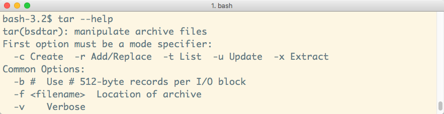</p>

Some commands don't have the `--help` option, but there are alternative sources
of information depending on what operating system you're on:

* On Linux or macOS, use `man ls` to display the **manual** for the `ls` command.
* On Windows, use `help cd` to display help for the `cd` command;
  you can also type `help` to list available commands (only system commands).
* If you have [Node.js and npm][node] installed, there is also [tldr
  pages][tldr-pages]: a cross-platform tool that provides simplified and
  community-driven manual pages.

#### Interactive help pages

Some help pages or commands will take over the screen to display their content, hiding the prompt and previous interactions.

Usually, it means that there is content that takes more than one screen to be shown.
You can "scroll" up and down line-by-line using the arrow keys or the `Enter` key.

To quit these interactive documentations, use the `q` (**q**uit) key.

<p class='center'>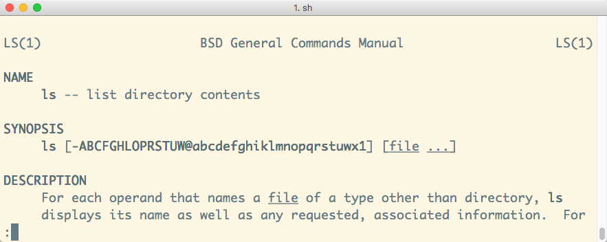</p>

#### Unix Command Syntax

When reading a command's manual or documentation,
you may find some strange syntax that make little sense to you, like:

```bash
cd [-L|[-P [-e]] [-@]] [dir]
ls [-ABCFGHLOPRSTUW@abcdefghiklmnopqrstuwx1] [file ...]
```

Here are some explanations:

* `[]`: Whatever's inside is **optionnal** (ex: `[-e]`).
* `|`: You have to **chose between** options (ex: `-L|-P`).
* `...`: Whatever's before can be **repeated** (ex: `[file ...]`).

Depending on the documentation, you will also see symbols like this:

* `<value>`
* `--option=VALUE`

**DON'T WRITE `<value>` or `VALUE`**.
Replace it by an appropriate value for that option or argument.


## Using the filesystem

<!-- slide-front-matter class: center, middle -->


### The `pwd` command

When you open a CLI, it places you in your **home directory**.
From there you can navigate your filesystem to go to other directories _(more on that later)_.

But first, you might want to check **where** you currently are.
Use the `pwd` command:

```bash
$> pwd
/Users/Batman
```

> `pwd` means "print working directory": it gives you the absolute path to the directory you're currently in.


### The `ls` command

Now that you know where you are, you might want to know **what your current directory is containing**.

Use the `ls` command:

```bash
$> ls
(lots and lots of files)
```
> `ls` means "list": it lists the contents of a directory.

By default, `ls` doesn't list **hidden elements**.
By convention in Unix-like systems, files that start with `.` (a dot) are hidden.

If you want it to do that, you need to pass the `-a` (**a**ll) option:

```bash
$> ls -a
(lots and lots of files, including the hidden ones)
```


### The `cd` command

It's time to go out a little and move to another directory.

Suppose you have a `Documents` directory in your home directory, that contains another directory `TopSecret` where you want to go.
Use the `cd` command, passing it as argument **the path to the directory** you want to go to:

```bash
$> pwd
/Users/Batman
$> cd Documents/TopSecret
```

This is a **relative path**: it is relative to the current working directory.

You can also go to a specific directory anywhere on your filesystem like this:

```bash
$> cd /Users/Batman/Documents
```

This is an **absolute path** because it starts with a `/` character. It starts
at the root of your filesystem so it does not matter where you are now.

> You also have **auto-completion** with the `cd` command. Hit the `Tab` key after entering some letters.

#### The `.` path

The `.` path represents the current directory.
The following sequences of commands are strictly equivalent:

<!-- slide-column -->

```bash
$> pwd
/Users/Batman
$> cd Documents/TopSecret
```

<!-- slide-column -->

```bash
$> pwd
/Users/Batman
$> cd ./Documents/TopSecret
```

<!-- slide-container -->

You can also *not go anywhere*:

```bash
$> pwd
/Users/Batman
$> `cd .`
$> pwd
/Users/Batman
```

Or compress the current directory:

```bash
tar -c -v -f /somewhere/compressed.tar.gz `.`
```

This does not seem very useful now, but it will be in further tutorials.

#### The `..` path

To go up into the parent directory, use the `..` path (**don't forget the space between `cd` and `..`**):

```bash
$> pwd
/Users/Batman/Documents
$> `cd ..`
$> pwd
/Users/Batman
```

You can also drag and drop a directory from your Explorer or your Finder to the CLI to see its absolute path automaticaly written:

```bash
$> cd
(Drag and drop a directory from your Explorer/Finder, and...)
$> cd /Users/Batman/Pictures/
```

At anytime and from anywhere, you can return to your **home directory** with the `cd` command, without any argument or with a `~` (tilde):

<!-- slide-column -->

```bash
$> cd
$> pwd
/Users/Batman
```

<!-- slide-column -->

```bash
$> cd ~
$> pwd
/Users/Batman
```

<!-- slide-notes -->

> To type the `~` character, use this combination:
> * `AltGr-^` on **Windows**
> * `Alt-N` on **Mac**

#### Path reference

Path        | Where
:---------- | :----------------------------------------------------------------------------------------------------------------
`.`         | The current directory.
`..`        | The parent directory.
`foo/bar`   | The file/directory `bar` inside the directory `foo` in the current directory. This is a **relative path**.
`./foo/bar` | *Same as the above*
`/foo/bar`  | The file/directory `bar` inside the directory `foo` at the root of your filesystem. This is an **absolute path**.
`~`         | Your home directory. This is an **absolute path**.
`~/foo/bar` | The file/directory `bar` inside the directory `foo` in your home directory. This is an **absolute path**.

#### Your projects directory

Throughout this course, you will often see the following command (_or something resembling it_):

```bash
$> cd `/path/to/projects`
```

This means that you use **the path to the directory in which you store your projects**.
For example, on John Doe's macOS system, it could be `/Users/jdoe/Projects`.

> Do not actually write `/path/to/projects`. It will obviously fail, unless you
> happen to have a `path` directory that contains a `to` directory that contains
> a `projects` directory...

**WARNING:** if your Windows/Linux/macOS username contains **spaces** or **accents**, you should **NOT** store your projects under your home directory.
You should find a path elsewhere on your filesystem.
This will save you **a lot of needless pain and suffering**.


### The `mkdir` command

You can create directories with the CLI.

Use the `mkdir` (**m**a**k**e **dir**ectory) command to create a new directory in the current directory:

```bash
$> mkdir BatmobileSchematics
```

You can also create a directory elsewhere:

```bash
$> mkdir ~/Documents/TopSecret/BatmobileSchematics
```

This will only work if all directories down to `TopSecret` already exist.
To automatically create all intermediate directories, add the `-p` option:

```bash
$> mkdir -p ~/Documents/TopSecret/BatmobileSchematics
```


### The `touch` command

The `touch` command updates the last modification date of a file.
It also has the useful property of creating the file if it doesn't exist.

Hence, it's a **quick way to create an empty file** in the CLI:

```bash
$> touch foo.txt

$> ls
foo.txt
```


### The `echo` command

The `echo` command simply **echo**es its arguments back to you:

```bash
$> echo Hello World
Hello World
```

This seems useless, but can be quite powerful when combined with Unix features like [redirection][redirection].
For example, you can **redirect the output to a file**.

The `>` operator means *"**write** the output of the previous command into a file"*.
This allows you to quickly create a simple text file:

```bash
$> echo foo `>` bar.txt

$> ls
bar.txt
```

If the file already exists, it is overwritten.
You can also use the `>>` operator, which means *"**append** the output of the previous command to the end of a file"*:

```bash
$> echo bar `>>` bar.txt
```


### The `cat` command

The `cat` command can display one file or con**cat**enate multiple files in the CLI.
For example, this displays the contents of the previous example's file:

```bash
$> cat bar.txt
foo
bar
```

This creates a new `hello.txt` file and displays the result of concatenating the two files:

```bash
$> echo World > hello.txt

$> cat bar.txt hello.txt
foo
bar
World
```


### Stopping running commands

Sometimes a command will take too long to execute.

As an example, run this command which will wait one hour before exiting:

```bash
$> sleep 3600
```

As you can see, the command keeps executing and you **no longer have a prompt**.
Anything you type is ignored, as it is no longer interpreted by the shell,
but by the `sleep` command instead (which doesn't do anything with it).

By convention in Unix shells, you can always terminate a running command by typing `Ctrl-C`.

> Note that `Ctrl-C` **forces termination** of a running command.
> It might not have finished what it was doing.


### Windows users

This is how you reference or use your **drives** (`C:`, `D:`, etc) in Git Bash on Windows:

```bash
$> cd /c/foo/bar
$> cd /d/foo
```

(In the Windows Subsystem for Linux, it's `/mnt/c` instead of `/c`.)

**Copy/Paste**

Since `Ctrl-C` is used to stop the current process, it **can't** be used as a shortcut to copy things from the CLI.

Instead, Git Bash has two custom shortcuts:

* `Ctrl-Insert` to **copy** things from the CLI
* `Shift-Insert` to **paste** things to the CLI

> You can also use **Right-click > Paste** if you don't have an `Insert` key.


## Vim

<!-- slide-front-matter class: center, middle -->

> [**Vim**][vim] is an infamous CLI editor originally developed in 1976 (WHAT?!)
> for the Unix operating system.


### WHY?!

Why would you need to learn it?

Sometimes it's just the **only editor you have** (e.g. on a server).
Also **some developer tools might open vim** for user input.

If this happens (_and it will_), there's **one** imperative rule to follow:

**DO NOT PANIC!**

Open a file by running the `vim` command with the path to the file you want to create/edit:

```bash
vim test.txt
```


### How vim works

Vim can be unsettling at first, until you know how it works.

*Let go of your mouse*, it's mostly useless in Vim.
You control Vim by **typing**.

The first thing to understand whith Vim is that it has *3 modes*:

* **Normal** mode (the one you're in when Vim starts).
* **Command** mode (the one to use to save or quit).
* **Insert** mode (the one to use to insert text).

To go into each mode use this keys :

| From           | Type    | To go to |
| :------------- | :------ | :----    |
| Normal         | `:`     | Command  |
| Normal         | `i`     | Insert   |
| Command/Insert | `Esc`   | Normal   |


### Normal mode

The **Normal** mode of Vim is the one you're in when it starts.
In this mode, you can move the cursor around with the arrow keys.

You can also use some commands to interact with the text:

| Command | Effect                                                           |
| :------ | :--------------------------------------------------------------- |
| `:`     | Enter **Command** mode (to save and/or quit)                     |
| `i`     | Enter **Insert** mode (to type text)                             |
| `x`     | Delete the character under the cursor                            |
| `dw`    | Delete a word, with the cursor standing before the first letter  |
| `dd`    | Delete the complete line the cursor is on                        |
| `u`     | Undo the last command                                            |

> At anytime, you can hit the `Esc` key to go back to the **Normal** mode.


### Command mode

The **Command** mode, which you can only access from the **Normal** mode,
is the one you'll mostly use to save and/or quit.

To enter the **Command** mode, hit the `:` key.
From there, you can use some commands:

| Command     | Effect                                                     |
| :---------- | :--------------------------------------------------------- |
| `q`         | **Q**uit Vim (will fail if you have unsaved modifications) |
| `w`         | **W**rite (save) the file and all its modifications        |
| `q!`        | Force Vim to quit (any unsaved modification will be lost)  |
| `wq` or `x` | **W**rite and **q**uit, i.e. save the file then quit Vim.  |

<!-- TODO: add link http://www.openvim.com/ -->


## Nano

<!-- slide-front-matter class: center, middle, image-header -->

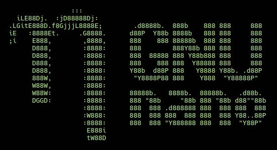

> Nano: a simpler CLI editor to keep your sanity.


### An alternative to Vim

If vim is a bit too much for you, [Nano][nano] is another CLI editor that is
much simpler to use and is also usually installed on most Unix-like systems (and
in Git Bash).

You can open a file with Nano in much the same way as vim, using the `nano`
command instead:

```bash
$> nano test.txt
```


### Editing files with Nano

Editing files is much more straightforward and intuitive with Nano. Once the
file is open, you can simply type your text and move around with arrow keys:

<p class='center'></p>

> Nano also helpfully prints its main keyboard shortcuts at the bottom of the
> window. The most important one is `^X` for Exit. In keyboard shortcut
> parlance, the `^` symbol always represents the control key.

So, **to exit from Nano, type `Ctrl-X`**.

#### Saving files

When you exit Nano with `Ctrl-X`, it will ask you whether you want to save your
changes:

<p class='center'></p>

Press the `y` key to save or the `n` key to discard your changes.

#### Confirming the filename

When saving changes, Nano will always ask you to **confirm the filename** where
the changes should be saved:

<p class='center'></p>

As you can see, it tells you the name of the file you opened. Now you can:

* Simply **press `Enter`** to save the file.
* Or, change the name to save your changes to another file (and keep the
  unmodified original).


### Setting Nano as the default editor

Editing the shell configuration will depend on your shell: for Zsh (the default
terminal shell on macOS) or Bash shell (the default in Git Bash and most Linux
systems), you have to set the `$EDITOR` environment variable. You can do that by
adding the following line to your **`~/.zshrc` or `~/.bash_profile` file**
depending on which shell you are using:

```
export EDITOR=nano
```

Remember that you must **relaunch your terminal** for this change to take
effect.

If you are unsure of what shell you are using, type in the following
command. The output will display the name of your current shell.

```bash
$> echo $0
bash
```

> **Hint:** now that you know how to use Nano, you can edit your Bash profile
> file with the following command: `nano ~/.bash_profile`.

<!-- slide-notes -->

On Ubuntu, you can list available editors and choose the default one with the
following command:

```bash
$> sudo update-alternatives --config editor
```


## The `PATH` variable

When you type a command in the CLI, it will try to see **if it knows this command** by looking in some directories to see if there is an **executable file that matches the command name**.

```bash
$> rubbish
bash: rubbish: command not found
```
> This means that the CLI failed to found the executable named `rubbish` in any of the directories where it looked.

The list of the directories (and their paths) in which the CLI searches is stored in the `PATH` environment variable, each of them being separated with a `:`.

You can print the content of your `PATH` variable to see this list:

```bash
$> echo $PATH
/usr/local/bin:/bin:/usr/bin:/custom/dir
```


### Understanding the `PATH`

Assuming your `PATH` looks like this:

```bash
$> echo $PATH
/usr/local/bin:/bin:/usr/bin:/custom/dir
```

What happens when you run the following command?

```bash
$> ls -a -l
```

1. The shell will look in the `/usr/local/bin` directory. *There is no
   executable named `ls` there, moving on...*
2.  The shell will look in the `/bin` directory. **There is an executable named
    `ls` there!** Execute it with arguments `-a` and `-l`.
3. We're done here. No need to look at the rest of the `PATH`. If there happens
   to be an `ls` executable in the `/custom/dir` directory, it will **not be
   used**.

### Finding commands

You can check where a command is with the `which` command:

```bash
$> which ls
/bin/ls
```

If there are multiple versions of a command in your `PATH`, you can add the `-a`
option to list them all:

```bash
$> which -a
/opt/homebrew/bin/git
/usr/bin/git
```

> Remember, the shell will use the first one it finds, so in this example it
> would use `/opt/homebrew/bin/git` if you type `git`, completely ignoring
> `/usr/bin/git`.


### Using non-system commands

Many development tools you install come with executables that you can run from the CLI (e.g. Git, Node.js, MongoDB).

Some of these tools will install their executable in a **standard directory** like `/usr/local/bin`, which is already in your `PATH`.
Once you've installed them, you can simply run their new commands.
Git and Node.js, for example, do this.

However, sometimes you're downloading only an executable and saving it in a directory somewhere that is **not in the `PATH`**.

#### Custom command example

Run the following commands to download a simple Hello World shell script and make it into an executable:

```bash
$> mkdir -p ~/hello-program/bin
$> curl -o ~/hello-program/bin/hello https://gist.githubusercontent.com/AlphaHydrae/8e09bf8790cbd6e3c7d9974988da3c28/raw/74372a1be35e973897c0a1fc946f3d18012a860c/hello.sh
$> chmod 755 ~/hello-program/bin/hello
```

You should now be able to find it in the `~/hello-program/bin` directory:

```bash
$> ls ~/hello-program/bin
hello
```

It's now installed, we can find it using the CLI, but it still cannot be run. Why?

```bash
$> hello
command not found: hello
```

#### Executing a command in a directory that's not in the `PATH`

You can run a command from anywhere by writing **the absolute path to the executable**:

```bash
$> ~/hello-program/bin/hello
Hello World
```

You can also **manually go to the directory** containing the executable and **run the command there**:

```bash
$> cd ~/hello-program/bin
$> ./hello
Hello World
```

> When the first word on the CLI starts with `/`, `~/`, `./` or `../`, the shell interprets it as a file path.
> Instead of looking for a command in the `PATH`, it simply executes that file.

But, ideally, you want to be able to **just type `hello`**, and have the script be executed.
For this, you need to **add the directory containing the executable** to your `PATH` variable.


### Updating the `PATH` variable

To add a new path in your `PATH` variable, you have to edit a special file, used
by your CLI interpreter (shell). This file depends upon the shell you are using:

| CLI                        | File to edit      |
| :------------------------- | :---------------- |
| Git Bash                   | `~/.bash_profile` |
| Terminal / [Zsh][zsh-site] | `~/.zshrc`        |

Open the adequate file (`.bash_profile` for this example) from the CLI with
`nano` or your favorite editor if it can display hidden files:

```bash
$> nano ~/.bash_profile
```

Add this line at the bottom of your file (use `i` to enter _insert_ mode if
using Vim):

```vim
export PATH="$HOME/hello-program/bin:$PATH"
```

If you're in Vim, press `Esc` when you're done typing, then `:wq` and `Enter` to
save and quit. If you're in Nano, press `Ctrl-X`, then ansert `Yes` and confirm
the filename.

#### Does it work?

> Remember to **close and re-open your CLI** to have the shell reload its configuration file.

You should now be able to run the Hello World shell script as a command simply by typing `hello`:

```bash
$> hello
Hello World
```

You don't even have to be in the correct directory:

```bash
$> cd
$> pwd
/Users/jdoe
$> hello
Hello World
```

And your CLI knows where it is:

```bash
$> which hello
/Users/jdoe/hello-program/bin/hello
```

#### What have I done?

You have **added a directory to the `PATH`**:

```vim
export PATH="~/hello-program/bin:$PATH"
```

This line says:

* Modify the `PATH` variable.
* In it, put the new directory `~/hello-program/bin` and the previous value of the `PATH`, separated by `:`.

The next time you run a command, your shell will **first look** in this directory for executables, then in the **rest of the `PATH`**.

**Common mistakes**

* What you must put in the `PATH` is **NOT** the path to the executable,
  but the path to the **directory containing the executable**.

* You must re-open your CLI for the change to take effect:
  the shell configuration file (e.g. `~/.bash_profile`) is only applied when the shell starts.

## Unleash your terminal

<!-- slide-front-matter class: center, middle -->


### Oh My Zsh

Command-line shells have been worked on for a very long time. Modern shells
such as the [Z shell (Zsh)][zsh] have a whole community that created many
plugins to simplify your daily command-line work.

On macOS, you may want to install [Oh My Zsh][oh-my-zsh] to fully unleash the
power of your Terminal. It has [plugins][oh-my-zsh-plugins] to integrate with
Homebrew, Git, various programming languages like Ruby, PHP, Go, and much more.

On Windows, you may want to [install the Windows Subsystem for Linux][wsl] so
you can install a Linux distribution like Ubuntu. You can then [install Zsh and
Oh My Zsh as well][oh-my-zsh-windows].


[ace]: https://en.wikipedia.org/wiki/Automatic_Computing_Engine
[ada-lovelace]: https://en.wikipedia.org/wiki/Ada_Lovelace
[alan-turing]: https://en.wikipedia.org/wiki/Alan_Turing
[algorithm]: https://en.wikipedia.org/wiki/Algorithm
[analytical-engine]: https://en.wikipedia.org/wiki/Analytical_Engine
[artificial-intelligence]: https://en.wikipedia.org/wiki/Artificial_intelligence
[augmented-reality]: https://en.wikipedia.org/wiki/Augmented_reality
[bash]: https://en.wikipedia.org/wiki/Bash_(Unix_shell)
[bernoulli-numbers]: https://en.wikipedia.org/wiki/Bernoulli_number
[brain-interface]: https://en.wikipedia.org/wiki/Brain–computer_interface
[building-the-future-of-the-command-line]: https://github.com/readme/featured/future-of-the-command-line
[c]: https://en.wikipedia.org/wiki/C_(programming_language)
[cat]: https://en.wikipedia.org/wiki/Cat_(Unix)
[charles-babbage]: https://en.wikipedia.org/wiki/Charles_Babbage
[cli]: https://en.wikipedia.org/wiki/Command-line_interface
[computation]: https://en.wikipedia.org/wiki/Computation
[computer-science]: https://en.wikipedia.org/wiki/Computer_science
[delay-line-memory]: https://en.wikipedia.org/wiki/Delay-line_memory
[digital]: https://en.wikipedia.org/wiki/Digital_data
[eniac]: https://en.wikipedia.org/wiki/ENIAC
[freebsd]: https://en.wikipedia.org/wiki/FreeBSD
[general-purpose-computer]: https://en.wikipedia.org/wiki/Computer
[gitbash]: https://gitforwindows.org
[gui]: https://en.wikipedia.org/wiki/Graphical_user_interface
[keypunch]: https://en.wikipedia.org/wiki/Keypunch
[lfm]: https://en.wikipedia.org/wiki/Luigi_Federico_Menabrea
[linux]: https://en.wikipedia.org/wiki/Linux
[macos]: https://en.wikipedia.org/wiki/MacOS
[mainframe]: https://en.wikipedia.org/wiki/Mainframe_computer
[motion-sensing]: https://en.wikipedia.org/wiki/Motion_detection
[nano]: https://en.wikipedia.org/wiki/GNU_nano
[node]: https://nodejs.org
[oh-my-zsh]: https://ohmyz.sh
[oh-my-zsh-plugins]: https://github.com/ohmyzsh/ohmyzsh/wiki/Plugins
[oh-my-zsh-windows]: http://kevinprogramming.com/using-zsh-in-windows-terminal/
[programmable]: https://en.wikipedia.org/wiki/Computer_program
[punched-card]: https://en.wikipedia.org/wiki/Punched_card
[redirection]: https://en.wikipedia.org/wiki/Redirection_(computing)
[slide-git]: ../git
[stored-program-computer]: https://en.wikipedia.org/wiki/Stored-program_computer
[tldr-pages]: https://tldr.sh
[tty]: https://en.wikipedia.org/wiki/Teleprinter
[tui]: https://en.wikipedia.org/wiki/Touch_user_interface
[turing-machine]: https://en.wikipedia.org/wiki/Turing_machine
[unix]: https://en.wikipedia.org/wiki/Unix
[unix-shell]: https://en.wikipedia.org/wiki/Unix_shell
[vim]: https://en.wikipedia.org/wiki/Vim_(text_editor)
[virtual-reality]: https://en.wikipedia.org/wiki/Virtual_reality
[vt100]: https://en.wikipedia.org/wiki/VT100
[vui]: https://en.wikipedia.org/wiki/Voice_user_interface
[windows-subsystem-for-linux]: https://docs.microsoft.com/en-us/windows/wsl/about
[wsl]: https://learn.microsoft.com/en-us/windows/wsl/install
[zsh]: https://en.wikipedia.org/wiki/Z_shell
[zsh-site]: http://zsh.sourceforge.net/

# Secure Shell (SSH)

Learn about the SSH cryptographic network protocol and how to use the SSH command line tool to connect to other computers.

<!-- slide-include ../../BANNER.md -->

**You will need**

* A Unix CLI

**Recommended reading**

* [Command Line Introduction](../cli/)

<!-- START doctoc generated TOC please keep comment here to allow auto update -->
<!-- DON'T EDIT THIS SECTION, INSTEAD RE-RUN doctoc TO UPDATE -->

- [What is SSH?](#what-is-ssh)
  - [How does it work?](#how-does-it-work)
  - [How is it secure?](#how-is-it-secure)
- [Secure channel](#secure-channel)
  - [Symmetric encryption](#symmetric-encryption)
    - [Example: symmetric encryption with AES](#example-symmetric-encryption-with-aes)
    - [Example: symmetric encryption with AES (decryption)](#example-symmetric-encryption-with-aes-decryption)
    - [Symmetric encryption over an insecure network](#symmetric-encryption-over-an-insecure-network)
  - [Asymmetric cryptography](#asymmetric-cryptography)
    - [How does asymmetric cryptography work?](#how-does-asymmetric-cryptography-work)
  - [Asymmetric encryption](#asymmetric-encryption)
    - [Example: asymmetric encryption with RSA (key pair)](#example-asymmetric-encryption-with-rsa-key-pair)
    - [Example: asymmetric encryption with RSA (encryption)](#example-asymmetric-encryption-with-rsa-encryption)
    - [Example: asymmetric encryption with RSA (decryption)](#example-asymmetric-encryption-with-rsa-decryption)
    - [Asymmetric encryption and forward secrecy](#asymmetric-encryption-and-forward-secrecy)
  - [Asymmetric key exchange](#asymmetric-key-exchange)
    - [Diffie-Hellman key exchange](#diffie-hellman-key-exchange)
  - [Man-in-the-Middle attack on Diffie-Hellman](#man-in-the-middle-attack-on-diffie-hellman)
  - [Asymmetric digital signature](#asymmetric-digital-signature)
    - [Example: digital signature with RSA (signing)](#example-digital-signature-with-rsa-signing)
    - [Example: digital signature with RSA (verifying)](#example-digital-signature-with-rsa-verifying)
  - [Cryptographic hash functions](#cryptographic-hash-functions)
  - [Combining it all together in SSH](#combining-it-all-together-in-ssh)
    - [Man-in-the-Middle attack on SSH](#man-in-the-middle-attack-on-ssh)
    - [Threats countered](#threats-countered)
    - [Threats not countered](#threats-not-countered)
- [The `ssh` command](#the-ssh-command)
- [SSH known hosts](#ssh-known-hosts)
  - [Are you really the SSH server I'm looking for?](#are-you-really-the-ssh-server-im-looking-for)
    - [How can I solve this problem?](#how-can-i-solve-this-problem)
  - [Known hosts file](#known-hosts-file)
    - [Adding public keys to the known hosts file](#adding-public-keys-to-the-known-hosts-file)
    - [Preventing future man-in-the-middle attacks](#preventing-future-man-in-the-middle-attacks)
- [Password authentication](#password-authentication)
- [Logging in with SSH](#logging-in-with-ssh)
  - [Typing commands while connected through SSH](#typing-commands-while-connected-through-ssh)
  - [Disconnecting](#disconnecting)
  - [Where am I?](#where-am-i)
- [Logging in or running a command](#logging-in-or-running-a-command)
- [Public key authentication](#public-key-authentication)
  - [How does it work?](#how-does-it-work-1)
  - [Do I already have a key pair?](#do-i-already-have-a-key-pair)
  - [The `ssh-keygen` command](#the-ssh-keygen-command)
    - [Generate a private-public key pair](#generate-a-private-public-key-pair)
  - [How does public key authentication work?](#how-does-public-key-authentication-work)
  - [The `authorized_keys` file](#the-authorized_keys-file)
    - [Using `ssh-copy-id`](#using-ssh-copy-id)
  - [Using multiple keys](#using-multiple-keys)
  - [Key management](#key-management)
- [SSH for other network services](#ssh-for-other-network-services)
  - [Using `scp`](#using-scp)
    - [Secure copy tips](#secure-copy-tips)
  - [Using SFTP](#using-sftp)
- [SSH agent](#ssh-agent)
  - [Running an SSH agent](#running-an-ssh-agent)
  - [Using the SSH agent](#using-the-ssh-agent)
- [References](#references)

<!-- END doctoc generated TOC please keep comment here to allow auto update -->


## What is SSH?

<!-- slide-front-matter class: center, middle -->

> SSH is a **cryptographic network protocol** for operating network services **securely over an unsecured network**.

> Its main uses are **remote command-line login** and **securing network services like Git or FTP**.

### How does it work?

SSH is a **client-server** protocol.

<p class='center'></p>

Using an SSH client, a user (or application) on machine A can connect to an SSH server running on machine B,
either to log in (with a command line shell) or to execute programs.

### How is it secure?

<!-- slide-column -->

**Step 1:** SSH establishes a **secure channel** using various **cryptographic techniques**.
This is handled automatically by the SSH client and server.

<!-- slide-column 50 -->

<p class='center'></p>

<!-- slide-container -->

<!-- slide-column -->

**Step 2:** The user or service that wants to connect to the SSH server must **authenticate** to gain access,
for example with a password.

<p class='center'></p>

**Step 3:** The logged-in user or service can do stuff on the server.

> Note that steps 1 and 2 are **separate and unrelated processes**.


## Secure channel

SSH establishes a **secure channel** between two computers **over an insecure network** (e.g. a local network or the internet).

<p class='center'></p>

Establishing and using this secure channel requires a combination of:

* [**Symmetric encryption**][symmetric-encryption]
* [**Asymmetric cryptography**][pubkey]
  * A **key exchange** method
  * **Digital signatures**
* [**Hash-based Message Authentication Codes (HMAC)**][hmac]

### Symmetric encryption

[Symmetric-key algorithms][symmetric-encryption] can be used to encrypt communications between two or more parties using a **shared secret**.
[AES][aes] is one such algorithm.

<p class='center'></p>

**Assuming all parties possess the secret key**, they can encrypt data, send it over an insecure network, and decrypt it on the other side.
An attacker who intercepts the data **cannot decrypt it without the key** (unless a weakness is found in the algorithm or [its implementation][enigma-operating-shortcomings]).

#### Example: symmetric encryption with AES

> **Windows users using Git Bash** may want to open a new shell with the command `winpty bash` before attempting to reproduce these examples.
> This is because of a [bug in Git Bash](https://github.com/mintty/mintty/issues/540) which causes problems with some interactive commands.

Create a **plaintext** file containing the words "too many secrets":

```bash
$> cd /path/to/projects

$> mkdir aes-example

$> cd aes-example

$> echo 'too many secrets' > plaintext.txt
```

You may encrypt that file with the [OpenSSL library][openssl] (installed on most computers).
Executing the following command pipeline will prompt you for an encryption key:

```bash
$> cat plaintext.txt | openssl aes-256-cbc > ciphertext.aes
enter aes-256-cbc encryption password:
Verifying - enter aes-256-cbc encryption password:
```

#### Example: symmetric encryption with AES (decryption)

The resulting `ciphertext.aes` file cannot be decrypted without the key.
Executing the following command pipeline and entering the same key as before when prompted will decrypt it:

```bash
$> cat ciphertext.aes | openssl aes-256-cbc -d
enter aes-256-cbc decryption password:
too many secrets
```

#### Symmetric encryption over an insecure network

Both parties must already possess the shared encryption key to perform symmetric cryptography.
It used to be **physically transferred**,
for example in the form of the codebooks used to operate the German [Enigma machine][enigma] during World War II.
But that is **impractical for modern computer networks**.
And **sending the key over the insecure network risks it being compromised** by a [Man-in-the-Middle attack][mitm].

<p class='center'></p>

### Asymmetric cryptography

[Public-key or asymmetric cryptography][pubkey] is any cryptographic system that uses pairs of keys:
**public keys** which may be disseminated widely, while **private keys** which are known only to the owner.
It has several use cases:

<!-- slide-column -->

**Encryption**

Encrypt and decrypt data.


<!-- slide-column -->

**Key exchange**

Securely exchange shared secret keys.


<!-- slide-column -->

**Digital Signatures**

Verify identity and protect against tampering.

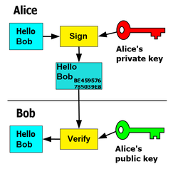

#### How does asymmetric cryptography work?

There is a mathematical relationship between a public and private key,
based on problems that currently admit no efficient solution
such as [integer factorization][integer-factorization], [discrete logarithm][discrete-logarithm] and [elliptic curve][elliptic-curve] relationships.

Here's a [mathematical example][pubkey-math] based on integer factorization.

Basically, these problems allow a private-public key pair to have the following properties:

* It is easy and **computationally economical to generate a key pair**.
* It is too **computationally expensive to find the private key** from its paired public key.
* Possession of the the private key allows you to solve complex mathematical problems based on the public key,
  thus **proving that you own that public key**.

Effective security only requires keeping the private key private;
**the public key can be openly distributed without compromising security**.

### Asymmetric encryption

<p class='center'></p>

One use case of asymmetric cryptography is **asymmetric encryption**, where the **sender encrypts a message with the recipient's public key**.
The message can only be **decripted by the recipient using the matching private key**.

#### Example: asymmetric encryption with RSA (key pair)

Let's try encryption with [RSA][rsa] this time, an asymmetric algorithm.
To do that, we need to generate a **key pair, i.e. a private and public key**.
The following commands will generate first a private key in a file named `private.pem`,
then a corresponding public key in a file named `public.pem`:

```bash
$> cd /path/to/projects

$> mkdir rsa-example

$> cd rsa-example

$> openssl genrsa -out private.pem 1024
Generating RSA private key, 1024 bit long modulus
.............++++++
.................................++++++
e is 65537 (0x10001)

$> openssl rsa -in private.pem -out public.pem -outform PEM -pubout
writing RSA key

$> ls
private.pem public.pem
```

#### Example: asymmetric encryption with RSA (encryption)

Create a file containing your **plaintext**:

```bash
$> echo 'too many secrets' > plaintext.txt
```

**Encrypt it with the public key** using the OpenSSL library:

```bash
$> openssl rsautl -encrypt -inkey public.pem -pubin \
   -in plaintext.txt -out ciphertext.rsa
```

In addition to your key pair, you should have two additional files containing the plaintext and ciphertext:

```bash
$> ls
ciphertext.rsa plaintext.txt private.pem public.pem
```

#### Example: asymmetric encryption with RSA (decryption)

The ciphertext can now be **decrypted with the corresponding private key**:

```bash
$> openssl rsautl -decrypt -inkey private.pem -in ciphertext.rsa
too many secrets
```

Note that you **cannot decrypt the ciphertext using the public key**:

```bash
$> openssl rsautl -decrypt -inkey public.pem -in ciphertext.rsa
unable to load Private Key [...]
```

Of course, a hacker using **another private key cannot decrypt it either**:

```bash
$> openssl genrsa -out hacker-private.pem 1024
Generating RSA private key, 1024 bit long modulus [...]

$> openssl rsautl -decrypt -inkey hacker-private.pem -in ciphertext.rsa
RSA operation error [...]
```

Hence, you can encrypt data and send it to another party provided that you have their public key.
**No single shared key needs to be exchanged** (the private key remains a secret known only to the recipient).

#### Asymmetric encryption and forward secrecy

Asymmetric encryption protects data sent over an insecure network from attackers,
but **only as long as the private keys remain private**.
It does not provide **forward secrecy**, meaning that if the private keys are compromised in the future,
all data encrypted in the past is also compromised.


### Asymmetric key exchange

So far we learned that:

* Symmetric encryption works but provides no solution
  to the problem of securely transmitting the shared secret key.
* Asymmetric encryption works even better as it does not require a shared secret key,
  but it does not provide forward secrecy.

Additionally, it's important to note that **symmetric encryption is much faster than asymmetric encryption**.
It's also less complex and can easily be implemented as hardware (most modern processors support hardware-accelerated AES encryption).

Ideally, we would want to be able to share a fast symmetric encryption key without transmitting it physically or over the network.
This is where asymmetric cryptography comes to the rescue again.
Encryption is not all it can do; it can also do **key exchange**.

The [Diffie-Hellman Key Exchange][dh], invented in 1976 by Whitfield Diffie and Martin Hellman,
was one of the first public key exchange protocols allowing users to **securely exchange secret keys**
even if an attacker is monitoring the communication channel.

#### Diffie-Hellman key exchange

<!-- slide-column -->

This conceptual diagram illustrates the general idea behind the protocol:

* Alice and Bob choose a **random, public starting color** (yellow).
* Then they choose a **secret color known only to themselves** (orange and blue-green).
* Then they **mix their own secret color with the mutually shared color**,
  (resulting in orange-tan and light-blue), and **publicly exchange** the two mixed colors.
* Finally, Alice and Bob **mix the color he or she received** from each other **with his or her own private color** (yellow-brown).

<!-- slide-column 35 -->


<!-- slide-container -->

The result is a final color mixture that is **identical to the partner's final color mixture**,
and which was never shared publicly.
When using large numbers rather than colors,
it would be computationally difficult for a third party to determine the secret numbers.

### Man-in-the-Middle attack on Diffie-Hellman

The Diffie-Hellman key exchange solves the problem of transmitting
the shared secret key over the network by computing it using asymmetric cryptography.
It is therefore never transmitted.

However, **a Man-in-the-Middle attack is still possible** if the attacker can position himself
between the two parties to **intercept and relay all communications**.

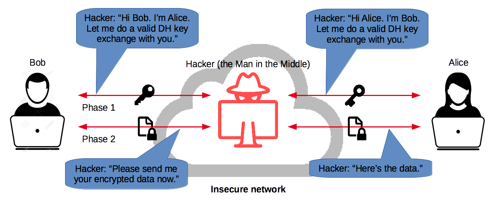

### Asymmetric digital signature

One of the other main uses of asymmetric cryptography is performing **digital signatures**.
A signature proves that the message came from a particular sender.

<!-- slide-column -->

* Assuming **Alice wants to send a message to Bob**,
  she can **use her private key to create a digital signature based on the message**,
  and send both the message and the signature to Bob.
* Anyone with **Alice's public key can prove that Alice sent that message**
  (only the corresponding private key could have generated a valid signature for that message).
* **The message cannot be tampered with without detection**,
  as the digital signature will no longer be valid
  (since it based on both the private key and the message).

<!-- slide-column 30 -->


<!-- slide-container -->

> Note that a digital signature **does not provide confidentiality**.
> Although the message is protected from tampering, it is **not encrypted**.

#### Example: digital signature with RSA (signing)

In the same directory as the previous example (asymmetric encryption with RSA),
create a `message.txt` file with the message that we want to digitally sign:

```bash
$> echo "Hello Bob, I like you" > message.txt
```

The following OpenSSL command will use the private key file `private.pem` (from the previous example)
and generate a digital signature based on the message file `message.txt`.
The signature will be stored in the file `signature.rsa`.

```bash
$> openssl dgst -sha256 -sign private.pem -out signature.rsa message.txt
```

If you open the file, you can see that it's simply binary data.
You can see it base64-encoded with the following command:

```bash
$> openssl base64 -in signature.rsa
```

#### Example: digital signature with RSA (verifying)

The following command uses the public key to check that the signature is valid for the message:

```bash
$> openssl dgst -sha256 -verify public.pem -signature signature.rsa message.txt
Verified OK
```

If you modify the message file and run the command again,
it will detect that the digital signature no longer matches the message:

```bash
$> openssl dgst -sha256 -verify public.pem -signature signature.rsa message.txt
Verification Failure
```

### Cryptographic hash functions

<!-- slide-column -->

A [cryptographic hash function][hash] is a [hash function][hash-non-crypto] that has the following properties:

* The same message always results in the same hash (deterministic).
* Computing the hash value of any message is quick.
* It is infeasible to generate a message from its hash value except by trying all possible messages (one-way).

<!-- slide-column 45 -->


<!-- slide-container -->

* A small change to a message should change the hash value so extensively that the new hash value appears uncorrelated with the old hash value.
* It is infeasible to find two different messages with the same hash value (collisions).

SSH uses [Message Authentication Codes (MAC)][mac], which are based on cryptographic hash functions,
to protect both the data integrity and authenticity of all messages sent through the secure channel.

### Combining it all together in SSH

SSH uses most of the previous cryptographic techniques together to achieve as secure a channel as possible:

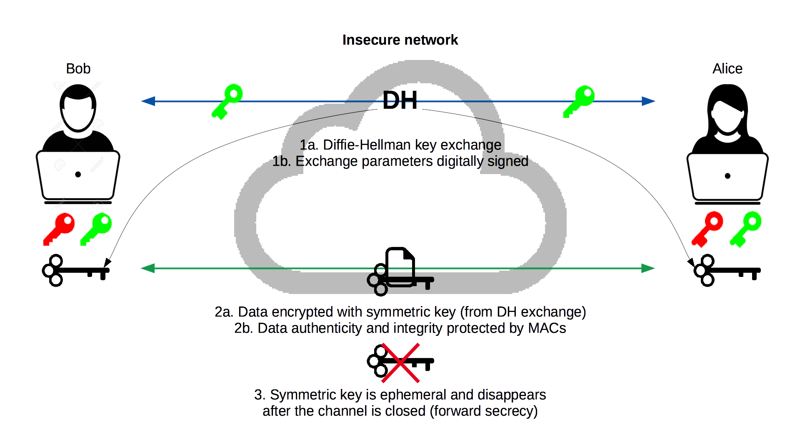

#### Man-in-the-Middle attack on SSH


#### Threats countered

SSH counters the following threats:

* **Eavesdropping:** an attacker can intercept but not decrypt communications going through SSH's secure channel.
* **Connection hijacking:** an active attacker can hijack TCP connections due to a weakness in TCP.
  SSH's integrity checking detects this and shuts down the connection without using the corrupted data.
* **DNS and IP spoofing:** an attacker may hack your naming service to direct you to the wrong machine.
* **Man-in-the-Middle attack:** an attacker may intercept all traffic between you and the real target machine.

The last two are countered by the asymmetric digital signature performed by the server on the DH key exchange,
**as long as the client actually checks the server-supplied public key**.
Otherwise, there is no guarantee that the server is genuine.

#### Threats not countered

SSH does not counter the following threats

<!-- slide-column -->

* **Password cracking:** if password authentication is enabled,
  a weak password might be easily brute-forced or obtained through [side-channel attacks][side-channel].
  Consider using public key authentication instead to mitigate some of these risks.

<!-- slide-column -->


<!-- slide-container -->

* **IP/TCP denial of service:** since SSH operates on top of TCP,
  it is vulnerable to some attacks against weaknesses in TCP and IP,
  such as [SYN flood][syn-flood].
* **Traffic analysis:** although the encrypted traffic cannot be read,
  an attacker can still glean a great deal of information by simply analyzing
  the amount of data, the source and target addresses, and the timing.
* **Carelessness and coffee spills:** SSH doesn't protect you if you write
  your password on a post-it note and paste it on your computer screen.


## The `ssh` command

The `ssh` command is available on most Unix-like systems (e.g. Linux & macOS)
and in Unix shells on Windows (e.g. Git Bash or WSL). Its basic syntax is:

```
ssh [user@]hostname [command]
```

Here's a few examples:

* `ssh example.com` - Connect to the SSH server at `example.com` and log in (with the same username as in your current shell).
* `ssh jdoe@example.com` - Connect to the SSH server at `example.com` and log in
  as user `jdoe`.
* `ssh jdoe@192.168.50.4 hostname` - Run the `hostname` command as user `jdoe`
  on the SSH server at `192.168.50.4`.

Run `man ssh` to see available options (or just `ssh` in Git Bash).


## SSH known hosts

When you connect to an SSH server for the first time,
you will most likely get a message similar to this:

```bash
$> ssh example.com
The authenticity of host 'example.com (192.168.50.4)' can't be established.
ECDSA key fingerprint is SHA256:colYVucS/YU0JSK7woiLAf5ChPgJYAR1BWJlET2EwDI=
Are you sure you want to continue connecting (yes/no)?
```

What does this mean? *I thought SSH was **secure**?*

### Are you really the SSH server I'm looking for?

As we've seen, when SSH establishes a secure channel,
a Diffie-Hellman asymmetric key exchange will occur to agree on a secret symmetric encryption key.
To secure this exchange, the server will perform an asymmetric digital signature
so that no attacker can impersonate the server.

To verify the signature, **your SSH client will ask the server for its public key**.
**This is where a man-in-the-middle attack is possible.**
SSH warns you that someone is sending you a public key,
but it has no way of verifying whether it's actually the server's public key,
or whether it's the public key of an attacker performing a man-in-the-middle attack.

Basically, **SSH makes the following guarantee**:

* Once you have established a secure channel to a given server,
  no third party can decrypt your communications.
  Forward secrecy is also guaranteed in the event your credentials are compromised in the future.

**SSH does not guarantee** that:

* You are connecting to the correct server.
  You may be connecting to an attacker's server.

#### How can I solve this problem?

If you are using SSH to transmit sensitive data,
**you should check that the server's public key is the correct one before connecting.**

One way to do this is to use the **key fingerprint** that is shown to you when first connecting.
The key fingerprint is a [cryptographic hash][hash] of the public key:

```bash
ECDSA key fingerprint is SHA256:colYVucS/YU0JSK7woiLAf5ChPgJYAR1BWJlET2EwDI=
```

Some services that allow you to connect over SSH, like GitHub,
[publish their SSH key fingerprints on their website][github-fingerprints]
so that users may check them.
In other cases, the key may be physically transmitted to you, or dictated over the phone.

You should **check that both fingerprints match** before proceeding with the
connection. If it does not, either you typed the wrong server address, or an
attacker may be trying to hack your connection.

### Known hosts file

If you accept the connection, SSH will save the server's address and public key in its **known hosts file**.
You can see the contents of this file with the following command:

```bash
$> cat ~/.ssh/known_hosts
example.com,192.168.50.4 ecdsa-sha2-nistp256 eTJtK2wrRzhW5RQzUHprbFJa...
```

The format of each line in this file is `[domain],[ipaddr] algorithm pubkey`.

The line above means that when SSH connects to `example.com` at IP address `192.168.50.4`,
it expects the server to send this specific public key (`eTJtK2wrRzhW5RQzUHprbFJa...`)
using the [ECDSA][ecdsa] algorithm
(another asymmetric algorithm like RSA, based on elliptic curve cryptography).

#### Adding public keys to the known hosts file

Another solution to SSH man-in-the-middle attacks when first connecting
is to put the server's public key in the known hosts file yourself.

If you have previously obtained the server's public key (the full key, not just the fingerprint),
you can **add it to the known hosts file** before attempting to connect.

If you do that, SSH will consider that the server is already a *known host*,
and will not prompt you to accept the public key.

#### Preventing future man-in-the-middle attacks

The known hosts file has another purpose.
Once SSH knows to expect a specific public key for a given domain or IP address,
it will warn you if that public key changes:

```
$> ssh 192.168.50.4
@@@@@@@@@@@@@@@@@@@@@@@@@@@@@@@@@@@@@@@@@@@@@@@@@@@@@@@@@@@
@    WARNING: REMOTE HOST IDENTIFICATION HAS CHANGED!     @
@@@@@@@@@@@@@@@@@@@@@@@@@@@@@@@@@@@@@@@@@@@@@@@@@@@@@@@@@@@
IT IS POSSIBLE THAT SOMEONE IS DOING SOMETHING NASTY!
Someone could be eavesdropping on you right now (man-in-the-middle attack)!
It is also possible that a host key has just been changed.
The fingerprint for the ECDSA key sent by the remote host is
SHA256:FUwFoK/hcqRAvJgDFmljwOur8t/mhfbm4tfIxdaVTQ==.
Please contact your system administrator.
Add correct host key in /path/to/.ssh/known_hosts to get rid of this message.
Offending ECDSA key in /path/to/.ssh/known_hosts:33
ECDSA host key for 192.168.50.4 has changed and you have requested strict checking.
Host key verification failed.
```

As the message mentions, either the server changed its SSH key pair,
or **an attacker may be intercepting your communications**.

If you're sure it's not an attack, for example if you know the server actually changed its key pair,
you can eliminate this warning by putting the correct public key in the known hosts file
(or by removing the offending line).


## Password authentication

Establishing a secure channel is one thing,
but that only ensures an attacker cannot intercept communications.
Once the channel is established, you must still **authenticate**,
i.e. **prove that you are in fact the user you are attempting to log in as**.

How you authenticate depends on how the SSH server is configured.
**Password authentication** is one method.
When enabled, the SSH server will prompt you for the correct password;
in this example, the password of the user named `jdoe` in the server's user database:

```bash
$> ssh jdoe@192.168.50.4

The authenticity of host '192.168.50.4 (192.168.50.4)' can't be established.
ECDSA key fingerprint is SHA256:E4GYJCEoz+G5wv+EdkPyRLytgP7aTj9BS9lr1d38Xg==.
Are you sure you want to continue connecting (yes/no)? yes
Warning: Permanently added '192.168.50.4' (ECDSA) to the list of known hosts.

jdoe@192.168.50.4's password:
```

> Most SSH clients will not display anything while you type your password.
> Simply press `Enter` when you're done to submit it.


## Logging in with SSH

If you run the `ssh` command with no extra arguments and authenticate with your password,
**SSH will run the default [shell][shell]** configured for that user, typically [Bash][bash] on Linux servers:

```bash
$> ssh jdoe@192.168.50.4
jdoe@192.168.50.4's password:
Welcome to Ubuntu 18.04.1 LTS (GNU/Linux 4.15.0-33-generic x86_64)

  System information as of Fri Sep  7 13:16:56 UTC 2018
  ...

$
```

> Note that you may have a different command line prompt once you are connected,
in this example `$` instead of `$>`.

### Typing commands while connected through SSH

You are now **connected to a Bash shell running on the server**.
Anything you type is encrypted through SSH's secure channel and interpreted by that shell.
Any data it outputs is sent back through the channel and displayed in your terminal.

<p class='center'>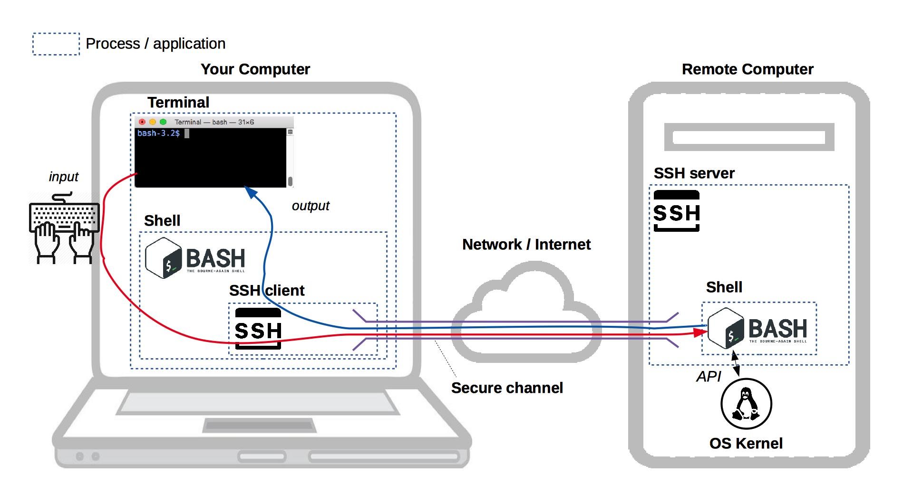</p>

### Disconnecting

Disconnect with the command `exit` (or with `Ctrl-D` on Linux or macOS).
You should be back to the shell running on your local computer, with your usual prompt:

```bash
$ exit
Connection to 192.168.50.4 closed.

$>
```

### Where am I?

Sometimes, you might forget what shell your terminal is connected to.
Is it a shell on your local machine or one running on the server?

If you're not sure, the `hostname` command may help you.
It prints the network name of the current machine:

```bash
$> hostname
MyComputer.local

$> ssh jdoe@192.168.50.4
jdoe@192.168.50.4's password:

$ hostname
example.com
```

In this example, the local computer is named `MyComputer.local`,
while the server is named `example.com`.

As you can see, the `hostname` command returns different results before and after connecting to the server with SSH,
because it's running on your local machine the first time, but is running on the server the second time.


## Logging in or running a command

When you execute `ssh` with the `[command]` option,
it will execute the command and close the connection as soon as that command is done.

Run this from your local shell:

```bash
$> hostname
MyComputer.local

$> ssh jdoe@192.168.50.4 echo Hello World
Hello World

$> hostname
MyComputer.local
```

As you can see, you are still in your local shell.
The connection was closed as soon as the `echo` command completed.


## Public key authentication

Password authentication works, but it has some drawbacks:

* Attackers may try to [brute force][brute-force] your password.
* If an attacker succeeds in performing a man-in-the-middle attack
  (for example if you forget to check the public key the first time you connect),
  he may steal your password.
* If the server is compromised, an attacker may modify the SSH server
  to steal your password.

As explained earlier, SSH uses asymmetric cryptography (among other techniques) to establish its secure channel.
It's **also possible to use asymmetric cryptography to authenticate**.

### How does it work?

If you have a **private-public key pair**, you can **give your public key to the server**.
Using **your private key**, your SSH client **can prove to the SSH server that you are the owner of that public key**.

This has advantages over password authentication:

* It's virtually impossible to brute-force
  (it is larger and probably has much more [entropy][entropy] than your password).
* Your private key will not be compromised by a man-in-the-middle attack or if the server is compromised,
  as it is never transmitted to the server, only used to solve mathematical problems based on the public key.

> Note that **public key authentication is only as secure as the file containing your private key**.
> If you publish that file anywhere or allow your local machine to be compromised,
> the attacker will be able to impersonate you on any server or service where you put your public key.

### Do I already have a key pair?

By default, SSH keys are stored in the `.ssh` directory in your home directory:

```bash
$> ls ~/.ssh
id_rsa  id_rsa.pub
```

If you have the `id_rsa` and `id_rsa.pub` files, you're good to go,
since SSH expects to find your main RSA private key at `~/.ssh/id_rsa`.
(You might also have a default key pair using another algorithm,
such as an ECDSA key pair with files named `id_ecdsa` and `id_ecdsa.pub`.)

If the directory doesn't exist or is empty, you don't have a key pair yet.

> You may have a key with a different name, e.g. `github_rsa` &
> `github_rsa.pub`, as is sometimes generated by some software. You can use this
> key if you want, but since it doesn't have the default name, you will have to
> add a `-i ~/.ssh/github_rsa` option to all your SSH commands. Generating a new
> key with the default name for command line use would probably be easier.

> On Windows, you can display hidden files to access your `.ssh` directory manually.
> On macOS, type `open ~/.ssh` in your Terminal.

### The `ssh-keygen` command

The `ssh-keygen` command is usually installed along with SSH and can generate a key pair for you.
It will ask you a couple of questions about the key:

* Where do you want to save it?
  Simply press enter to use the proposed default location (`~/.ssh/id_rsa` for an RSA key).
* What password do you want to protect the key with?
  Enter a password or simply press enter to use no password.

> **Should I protect my key with a password?**
>
> If you enter no password, your key will be stored in the clear.
> This will be convenient as you will not have to enter a password when you use it.
> However, any malicious code you allow to run on your machine could easily steal it.
>
> If your key is protected by a password,
> you can run an [SSH agent][ssh-agent] to unlock it only once per session instead of every time you use it.

#### Generate a private-public key pair

Simply running `ssh-keygen` with no arguments will ask you the required information and generate a new RSA key pair:

```bash
$> ssh-keygen
Generating public/private rsa key pair.
Enter file in which to save the key (/home/jdoe/.ssh/id_rsa):
Created directory '/home/jdoe/.ssh'.
Enter passphrase (empty for no passphrase):
Enter same passphrase again:
Your identification has been saved in /home/jdoe/.ssh/id_rsa.
Your public key has been saved in /home/jdoe/.ssh/id_rsa.pub.
The key fingerprint is:
SHA256:MmwL9n4KOUCuLoyvGJ7nWRDXjTSGAXO8AcCNVqmDJH0 jdoe@497820feb22a
The key's randomart image is:
+---[RSA 2048]----+
|.o===oo+         |
|.=.oE++ +        |
|= oo .oo .       |
|.=  oo           |
|  +.o = S        |
| . o.= +         |
|=   +.o          |
|*o..o+  .        |
|+*+o  oo         |
+----[SHA256]-----+
```

### How does public key authentication work?

To authenticate you, the server will need your **public key**.
That way, you will be able to prove, using your **private key**, that you are the owner of that public key.

> Remember, **your private key MUST remain private** (i.e. the `id_rsa` file).
> You should **never** give it to any person, server or web service.
> Only give your public key (i.e. the `id_rsa.pub` file).

### The `authorized_keys` file

To authenticate you, the SSH server will look for the **authorized keys** file for your user account (there is one for each user).
By default, the path to this file is `~/.ssh/authorized_keys` on the computer where the SSH server is running (not your local machine).

This file is simply a list of the public keys that should be granted access to that account
(provided that you can prove ownership of the key):

```
ssh-rsa AAAAB3NzaC1yc2E... key1
ssh-rsa fE2deXdtagpHXsa... key2
...
```

You can see its contents by running `cat ~/.ssh/authorized_keys` on the target machine.

It may not exist yet if you have never authenticated with a public key.

#### Using `ssh-copy-id`

The `ssh-copy-id` uses the same syntax as the `ssh` command to connect to another computer (e.g. `ssh-copy-id jdoe@192.168.50.4`).
Instead of opening a new shell, however, it will **copy your local public key(s) to your user account's
`authorized_keys` file** on the target computer.

You will probably have to enter your password, so `ssh-copy-id` can log in and copy your key.
But once that is done, **SSH should switch to public key authentication** and you should not have to enter your password again to log in.
SSH will use your private key to authenticate you instead.
(You may have to enter your private key's password though, if it is protected by one.)

Log out and connect again with `ssh` to see it in action.

> You can also create the `authorized_keys` file manually.
> Note that both the file and its parent directory must have permissions that make it accessible only to your user account,
> or the SSH server will refuse to use it for security reasons.
> The following commands can set up the file on the target machine:
>
>     $> mkdir -p ~/.ssh && chmod 700 ~/.ssh
>     $> touch ~/.ssh/authorized_keys && chmod 600 ~/.ssh/authorized_keys

### Using multiple keys

You may have multiple key pairs:

* Some key pairs may have been generated by other programs or web services.
  For example, some Git user interfaces generate a key pair to access GitHub,
  or Amazon Web Services' Elastic Compute Cloud (EC2) generates key pairs to give you access to their virtual machines.
* You may manually generate a key pair with a non-default name by specifying a different filename when running `ssh-keygen`.

Having multiple key pairs may be part of a security strategy to limit the access an attacker might gain if one of them is compromised.

To use a specific key pair, use the `ssh` command's `-i` option,
which allows you to choose the private key file you want to use:

```bash
$> ssh -i ~/.ssh/custom_key_rsa jdoe@192.168.50.4
```

> Note: it is the private key file you want to use with the `-i` option, not the public key,
> as the private key is the one your SSH client will use to prove that it owns the public key.

### Key management

A few tips on managing your key pairs:

* You may disseminate your **public key** freely to authenticate to other computers or services.
* **NEVER give your private key to anyone**.
* Conversely, you may copy your private key to another computer of yours if you want it to have the same access to other computers or services.
* You may want to **back up your private and public key files** (`id_rsa` and `id_rsa.pub`)
  so that you don't have to regenerate a pair if you lose your computer or switch to another computer.
  (You would then have to replace the old public key with the new one everywhere you used it.)
* Use `ssh-copy-id` to copy your public key to other computers to use public key authentication instead of password authentication.
* For web services using public key authentication (e.g. GitHub),
  you usually have to manually copy the public key file's contents (`id_rsa.pub`) and provide it to them in your account's settings.
* **If a private key is compromised** (e.g. your computer is stolen),
  you should **remove the corresponding public key** from computers and web services you have copied it to.


## SSH for other network services

As mentionned initially, SSH is a network protocol.
It can be used not only for command line login, but to secure other network services.

A few examples are:

* [Secure Copy (`scp`)][scp] - A means of securely transferring computer files between a local and remote host.
* [rsync][rsync] - Utility for efficiently transferring and synchronizing files across computer systems.
* [SSH File Transfer Protocol (SFTP)][sftp] - Network protocol that provides file access, file transfer and file management.
* [Git][git] - Version control system that can use SSH (among other protocols) to transfer versioned data.

### Using `scp`

In principle, the `scp` command works like the Unix `cp` (copy) command, except that it can copy files to and from other computers that have an SSH server running,
using the SSH syntax for connection:

```bash
$> echo bar > foo.txt
$> scp foo.txt jdoe@192.168.50.4:foo.txt
foo.txt 100% 4 0.6KB/s 00:00
```

This command copies your local `foo.txt` file to the home directory of the `jdoe` user account on the remote computer.
You can check that the file was indeed copied with a quick SSH command:

```bash
$> ssh jdoe@192.168.50.4 cat foo.txt
bar
```

You can also copy files from the remote computer to your local computer:

```bash
$> scp jdoe@10.192.167.228:foo.txt foo2.txt
foo.txt 100% 4 5.7KB/s 00:00

$> cat foo2.txt
bar
```

#### Secure copy tips

Here's a few additional examples of how to use the `scp` command:

* `scp foo.txt jdoe@192.168.50.4:bar.txt`

  Copy the local file `foo.txt` to a file named `bar.txt` in `jdoe`'s home directory on the remote computer.
* `scp foo.txt jdoe@192.168.50.4:`

  Copy the file to `jdoe`'s home directory with the same filename.
* `scp foo.txt jdoe@192.168.50.4:/tmp/foo.txt`

  Copy the file to the absolute path `/tmp/foo.txt` on the remote computer.
* `scp jdoe@192.168.50.4:foo.txt jsmith@192.168.50.5:bar.txt`

  Copy the file from one remote computer to another.
* `scp -r foo jdoe@192.168.50.4:foo`

  Recursively copy the contents of directory `foo` to the remote computer.

### Using SFTP

[SFTP][sftp] is an alternative to the original [FTP][ftp] protocol to transfer files.
Since FTP is [insecure][ftp-security] (e.g. passwords are sent unencrypted),
SFTP is an alternative that goes through SSH's secure channel and therefore poses fewer security risks.

Most modern FTP clients support SFTP.
Here's a couple:

* [FileZilla][filezilla]
* [WinSCP][winscp]

Many code editors also have SFTP support available through plugins.


## SSH agent

If you use a **private key that is password-protected**,
you lose part of the convenience of public key authentication:
you don't have to enter a password to authenticate to the server,
but **you still have to enter the key's password** to unlock it.

The `ssh-agent` command can help you there.
It runs a helper program that will let you unlock your private key(s) once,
then use it multiple times without entering the password again each time.

### Running an SSH agent

There are several ways to run an SSH agent.
You can run it in the background:

* [Single sign-on using SSH][ssh-agent-run]
* [Generating a new SSH key and adding it to the ssh-agent (GitHub)][ssh-agent-run-github]

Or you can run an agent and have it start a new shell for you:

```bash
$> ssh-agent bash
```

> The advantage of this last technique is that the agent will automatically quit when you exit the shell,
> which is good since it's not necessarily a good idea to keep an SSH agent running forever [for security reasons][ssh-agent-security].

### Using the SSH agent

The associated `ssh-add` command will take your default private key (e.g. `~/.ssh/id_rsa`)
and prompt you for your password to unlock it:

```bash
$> ssh-add
Enter passphrase for /Users/jdoe/.ssh/id_rsa:
Identity added: /Users/jdoe/.ssh/id_rsa (/Users/jdoe/.ssh/id_rsa)
```

The **unlocked key** is now **kept in memory by the agent**.
The `ssh` command (and other SSH-related commands like `scp`)
will not prompt you for that key's password as long as the agent keeps running.

If you want to load another key than the default one, you can specify its path:

```bash
$> ssh-add /path/to/custom_id_rsa
```


## References

* [How does SSH Work](https://www.hostinger.com/tutorials/ssh-tutorial-how-does-ssh-work)
* [Demystifying Symmetric and Asymmetric Methods of Encryption](https://www.cheapsslshop.com/blog/demystifying-symmetric-and-asymmetric-methods-of-encryption)
* [Understanding the SSH Encryption and Connection Process](https://www.digitalocean.com/community/tutorials/understanding-the-ssh-encryption-and-connection-process)
* [Diffie-Hellman Key Exchange][dh]
* [Simplest Explanation of the Math Behind Public Key Cryptography][pubkey-math]
* [SSH, The Secure Shell: The Definitive Guide](https://books.google.ch/books/about/SSH_The_Secure_Shell_The_Definitive_Guid.html?id=9FSaScltd-kC&redir_esc=y)


[aes]: https://en.wikipedia.org/wiki/Advanced_Encryption_Standard
[authorized_keys]: https://www.ssh.com/ssh/authorized_keys/openssh
[bash]: https://en.wikipedia.org/wiki/Bash_(Unix_shell)
[brute-force]: https://en.wikipedia.org/wiki/Brute-force_attack
[dh]: https://en.wikipedia.org/wiki/Diffie%E2%80%93Hellman_key_exchange
[discrete-logarithm]: https://en.wikipedia.org/wiki/Discrete_logarithm
[ecdsa]: https://en.wikipedia.org/wiki/Elliptic_Curve_Digital_Signature_Algorithm
[elliptic-curve]: https://en.wikipedia.org/wiki/Elliptic-curve_cryptography
[enigma]: https://en.wikipedia.org/wiki/Enigma_machine#Operation
[enigma-operating-shortcomings]: https://en.wikipedia.org/wiki/Cryptanalysis_of_the_Enigma#Operating_shortcomings
[entropy]: https://en.wikipedia.org/wiki/Password_strength#Entropy_as_a_measure_of_password_strength
[filezilla]: https://filezilla-project.org/
[forward-secrecy]: https://en.wikipedia.org/wiki/Forward_secrecy
[ftp]: https://en.wikipedia.org/wiki/File_Transfer_Protocol
[ftp-security]: https://en.wikipedia.org/wiki/File_Transfer_Protocol#Security
[github-fingerprints]: https://docs.github.com/en/github/authenticating-to-github/githubs-ssh-key-fingerprints
[git]: https://git-scm.com
[hash]: https://en.wikipedia.org/wiki/Cryptographic_hash_function
[hash-non-crypto]: https://en.wikipedia.org/wiki/Hash_function
[hmac]: https://en.wikipedia.org/wiki/HMAC
[integer-factorization]: https://en.wikipedia.org/wiki/Integer_factorization
[key-exchange]: https://en.wikipedia.org/wiki/Key_exchange
[mac]: https://en.wikipedia.org/wiki/Message_authentication_code
[mitm]: https://en.wikipedia.org/wiki/Man-in-the-middle_attack
[openssl]: https://www.openssl.org
[pubkey]: https://en.wikipedia.org/wiki/Public-key_cryptography
[pubkey-math]: https://www.onebigfluke.com/2013/11/public-key-crypto-math-explained.html
[rsa]: https://en.wikipedia.org/wiki/RSA_(cryptosystem)
[rsync]: https://en.wikipedia.org/wiki/Rsync
[scp]: https://en.wikipedia.org/wiki/Secure_copy
[sftp]: https://en.wikipedia.org/wiki/SSH_File_Transfer_Protocol
[shell]: https://en.wikipedia.org/wiki/Shell_(computing)
[ssh-agent]: https://kb.iu.edu/d/aeww
[ssh-agent-run]: https://www.ssh.com/ssh/agent
[ssh-agent-run-github]: https://help.github.com/articles/generating-a-new-ssh-key-and-adding-it-to-the-ssh-agent/
[ssh-agent-security]: https://www.commandprompt.com/blog/security_considerations_while_using_ssh-agent/
[side-channel]: https://en.wikipedia.org/wiki/Cryptanalysis#Side-channel_attacks
[symmetric-encryption]: https://en.wikipedia.org/wiki/Symmetric-key_algorithm
[syn-flood]: https://en.wikipedia.org/wiki/SYN_flood
[winscp]: https://winscp.net/


# Shell Scripting

Learn the basics of shell scripting with Bash.

<!-- slide-include ../../BANNER.md -->

**You will need**

* A Unix CLI

**Recommended reading**

* [Command Line Introduction](../cli/)
* [Unix basics](../unix-admin/)
  * [Unix environment variables](../unix-env-vars/)
  * [Unix processes](../unix-processes/)

<!-- START doctoc generated TOC please keep comment here to allow auto update -->
<!-- DON'T EDIT THIS SECTION, INSTEAD RE-RUN doctoc TO UPDATE -->

- [What is a script?](#what-is-a-script)
  - [How is a script executed?](#how-is-a-script-executed)
  - [What can I put in a script?](#what-can-i-put-in-a-script)
  - [How do I create a script?](#how-do-i-create-a-script)
  - [All kinds of scripts](#all-kinds-of-scripts)
- [What is shell scripting?](#what-is-shell-scripting)
- [Shell script basics](#shell-script-basics)
  - [Commands](#commands)
  - [Working directory](#working-directory)
  - [Variables](#variables)
    - [Store the output of commands](#store-the-output-of-commands)
    - [Environment variables](#environment-variables)
  - [Conditionals](#conditionals)
    - [The `test` built-in command](#the-test-built-in-command)
  - [Loops](#loops)
  - [Special variables](#special-variables)
  - [The `set` built-in command](#the-set-built-in-command)
  - [Functions](#functions)
    - [Variable scope](#variable-scope)
- [References](#references)

<!-- END doctoc generated TOC please keep comment here to allow auto update -->


## What is a script?

In a Unix-like operating system, a file that can be executed (someone has the
`x` permission on it) should be one of the following:

* A **binary file**, which contains machine-readable binary code that has been
  compiled from source code.
* A **script**, which is a file containing code that is dynamically interpreted.

### How is a script executed?

When an executable text file is run, a Unix-like operating system looks for a **shebang** on the first line.
A shebang is a line with the following format:

```
#!`interpreter` optional-args
```

For example, the following is a valid shebang:

```
#!/bin/bash
```

In this example, it tells the operating system that the **interpreter** which should run this file is `/bin/bash`,
meaning that this is a [Bash][bash] script.

### What can I put in a script?

In a bash script, you can put anything you could type in a Bash shell:

```bash
#!/bin/bash
echo Hello World
```

In a PHP script, you can put any PHP code you want:

```php
#!/usr/bin/php
<?php
echo 'Hello World';
?>
```

Basically, what you can put in a script depends on the interpreter you're using.

### How do I create a script?

Simply create your script:

```bash
$> printf '#!/bin/bash\necho Hello World' > test.sh
```

Make it an executable:

```bash
$> chmod +x test.sh
```

And run it:

```bash
$> ./test.sh
Hello World
```

### All kinds of scripts

The following a few examples of shebangs, but it is nowhere near exhaustive:

Shebang             | Script contents
:---                | :---
`#!/bin/sh`         | [Bourne shell][sh] commands
`#!/bin/bash`       | [Bash shell][bash] commands
`#!/bin/zsh`        | [Z shell][zsh] commands
`#!/usr/bin/node`   | [Node.js][node] code
`#!/usr/bin/php`    | [PHP][php] code
`#!/usr/bin/python` | [Python][python] code
`#!/usr/bin/ruby`   | [Ruby][ruby] code

> Of course, the path to the interpreter must correspond to the actual path of the command used (`sh`, `bash`, `php`, etc).
> It might differ on your machine. Use `which bash` to find the location of the Bash executable, for example.


## What is shell scripting?

**Shell scripting** is the practice of writing scripts that contain series of
shell commands that you want to be able to reuse.

Any script with a shell as the interpreter is a "shell script".

> A script using PHP as the interpreter is still a script, but it's not a "shell
> script". It's a PHP script.


## Shell script basics

<!-- slide-front-matter class: center, middle -->

> A few pointers on writing Bash scripts
> (compatible with most POSIX shells).

### Commands

You can use any shell command in a shell script:

```bash
#!/bin/bash
echo Hello World
date
ls
```

This script could print:

```
Hello World
Thu Jan 10 23:46:52 CET 2019
file.txt directory ...
```

### Working directory

By default, a script executes in the current shell directory.

You can use `cd` to move around to other directories:

```bash
#!/bin/bash
pwd
cd /home
pwd
```

This script could print:

```
/some/where/over/the/rainbow
/home
```

Assuming it was executed from the `/some/where/over/the/rainbow` directory.

### Variables

You can declare and reuse variables in scripts:

```bash
#!/bin/bash
FOO=bar
echo $FOO
```

If your variable contains whitespace (spaces, new lines, etc),
be sure to quote it when declaring and using it to avoid issues:

```bash
#!/bin/bash
FOO="bar baz"
echo "$FOO"
```

#### Store the output of commands

You can store the result of a command in a variable by wrapping it with backticks:

```bash
#!/bin/bash
FILES=\`ls -1`
NUMBER_OF_FILES=\`echo "$FILES" | wc -l`
echo There are $NUMBER_OF_FILES files
```

This script would output 10 if there are 10 files in the current directory.

#### Environment variables

Environment variables are also available as variables in shell scripts:

```bash
#!/bin/bash
echo $PATH
```

To set an environment variable, do it like you would in any Bash shell:

```bash
#!/bin/bash
export FOO=bar
```

> Of course, the `$FOO` environment variable in this example will only be set in the context of this script and its child processes (if any).

### Conditionals

Bash has a classic `if/then/else` construct:

```bash
#!/bin/bash
FOO="bar"

if [[ "$FOO" -eq "foo" ]]; then
  echo FOO is foo
elif [[ "$FOO" -eq "bar" ]]; then
  echo FOO is bar
else
  echo foo is something else
fi
```

> The `[[  ]]` syntax is a Bash [test construct][bash-test-constructs].
> Also see Bash [other comparison operators][bash-comparison-operators].

#### The `test` built-in command

The `test` command which comes with Bash is another way to write some conditions:

```bash
#!/bin/bash

EMPTY_VAR=
FULL_VAR="full"
FILE="/path/to/some/file"

if test -z "$EMPTY_VAR"; then
  echo variable is empty
fi

if test -n "$FULL_VAR"; then
  echo variable is not empty
fi

if test -f "$FILE"; then
  echo file exists
else
  echo file does not exist
fi
```

> See Bash [file test operators][bash-file-test-operators] and [other comparison operators][bash-comparison-operators].

### Loops

Bash has a `for` loop:

```bash
for item in one two three; do
  echo $item
done
```

The above code would print:

```
one
two
three
```

> Bash also has `while` and `until`.
> See [loops & branches][bash-loops].

### Special variables

Bash has a number of [special variables][bash-special-vars] which are always available:

Variable | Description
:---     | :---
`$0`     | Name of the command being executed.
`$1`     | First argument passed to the script on the command line (and so on with `$2`, `$3`, etc).
`$@`     | All arguments passed to the script.
`$?`     | Exit value of the last executed command.

For example, this script says hello to the name passed as the first argument:

```bash
#!/bin/bash
echo Hello $1
```

### The `set` built-in command

The `set` command is specific to Bash and can be used to toggle its [option flags][bash-option-flags].

For example, the `-e` option aborts the script if an error occurs, while the `-x` option prints commands before executing them:

```bash
#!/bin/bash
set -ex
echo Hello World
cat file-that-does-not-exist
echo Done
```

This script could print:

```
+ echo Hello World
Hello World
+ cat file-that-does-not-exist
cat: file-that-does-not-exist: No such file or directory
```

> Note that each command is printed with a leading `+` before being executed,
> and that the script stops as soon as an error occurs
> (which is **not the case by default**).

### Functions

You can isolate pieces of code in a function.
The special argument variables `$1`, `$2`, etc represent the arguments to the function:

```bash
#!/bin/bash

print_hello() {
  echo Hello $1
}

print_hello World
```

This script would print `Hello World`.

#### Variable scope

Note that normal Bash variables have no scope, i.e. they are available in the whole file and every function.

To declare a variable that is local to a function, use the `local` keyword:

```bash
#!/bin/bash

print_hello() {
  local name=$1
  echo Hello $name
}

print_hello World
echo $name
```

This script would print `Hello World` and an empty line,
since `$name` is only defined within the `print_hello` function.


## References

* [Advanced Bash Scripting Guide](https://www.tldp.org/LDP/abs/html/)
  * [Test Constructs][bash-test-constructs]
  * [File Test Operators][bash-file-test-operators]
  * [Other Comparison Operators][bash-comparison-operators]
  * [Loops & Branches][bash-loops]
  * [Local Variables][bash-locals]
  * [Special Shell Variables][bash-special-vars]
  * [Starting Off With a Sha-Bang][bash-shebang]
* [Shell Script][shell-script]


[bash]: https://en.wikipedia.org/wiki/Bash_(Unix_shell)
[bash-comparison-operators]: https://www.tldp.org/LDP/abs/html/comparison-ops.html
[bash-file-test-operators]: https://www.tldp.org/LDP/abs/html/fto.html
[bash-locals]: https://www.tldp.org/LDP/abs/html/localvar.html
[bash-loops]: https://www.tldp.org/LDP/abs/html/loops.html
[bash-option-flags]: https://www.tldp.org/LDP/abs/html/options.html#OPTIONSREF
[bash-shebang]: https://tldp.org/LDP/abs/html/sha-bang.html
[bash-special-vars]: https://tldp.org/LDP/abs/html/refcards.html#AEN22402
[bash-test-constructs]: https://www.tldp.org/LDP/abs/html/testconstructs.html
[node]: https://nodejs.org
[php]: http://php.net
[python]: https://www.python.org
[ruby]: https://www.ruby-lang.org
[sh]: https://en.wikipedia.org/wiki/Bourne_shell
[shell-script]: https://en.wikipedia.org/wiki/Shell_script
[zsh]: https://en.wikipedia.org/wiki/Z_shell
# Git Introduction

Learn the basics of [Git][git], one of the most popular distributed version control systems.
This is a condensed version of the first chapters of the [Git Book](https://git-scm.com/book/en/v2), which you should read if you want more detailed information on the subject.

<!-- slide-include ../../BANNER.md -->

**You will need**

* A Unix CLI

**Recommended reading**

* [Command line](../cli/)

<!-- START doctoc generated TOC please keep comment here to allow auto update -->
<!-- DON'T EDIT THIS SECTION, INSTEAD RE-RUN doctoc TO UPDATE -->

- [What is Git?](#what-is-git)
- [What is version control?](#what-is-version-control)
- [A short history](#a-short-history)
  - [**Local** version control systems](#local-version-control-systems)
  - [**Centralized** version control systems](#centralized-version-control-systems)
  - [**Distributed** version control systems](#distributed-version-control-systems)
- [Git basics](#git-basics)
  - [Snapshots, not differences](#snapshots-not-differences)
  - [Git has integrity](#git-has-integrity)
  - [What's in a Git project?](#whats-in-a-git-project)
    - [The Git directory](#the-git-directory)
    - [The working directory (also called the working tree)](#the-working-directory-also-called-the-working-tree)
    - [The staging area (also called the index)](#the-staging-area-also-called-the-index)
  - [The basic Git workflow](#the-basic-git-workflow)
    - [Using the staging area](#using-the-staging-area)
- [Getting started](#getting-started)
  - [Git and the command line](#git-and-the-command-line)
    - [Installing Git](#installing-git)
  - [First-time Git setup](#first-time-git-setup)
  - [Choosing a default branch name](#choosing-a-default-branch-name)
  - [Creating a new repository](#creating-a-new-repository)
  - [Checking the status of your files](#checking-the-status-of-your-files)
  - [Adding new files](#adding-new-files)
    - [Tracking new files](#tracking-new-files)
    - [Checking staged changes](#checking-staged-changes)
  - [Committing your changes](#committing-your-changes)
  - [Modifying files](#modifying-files)
    - [Staging modified files](#staging-modified-files)
    - [Modifying a staged file](#modifying-a-staged-file)
    - [Checking staged and unstaged changes](#checking-staged-and-unstaged-changes)
    - [Staging area versus working directory](#staging-area-versus-working-directory)
    - [Committing partially staged changes](#committing-partially-staged-changes)
  - [Moving and removing files](#moving-and-removing-files)
    - [Adding all changes](#adding-all-changes)
- [Viewing the commit history](#viewing-the-commit-history)
  - [Viewing the changes in the history](#viewing-the-changes-in-the-history)
  - [Other log options](#other-log-options)
- [Ignoring files](#ignoring-files)
  - [Committing the ignore file](#committing-the-ignore-file)
  - [Status of ignored files](#status-of-ignored-files)
  - [Global ignore file](#global-ignore-file)
- [Undoing things](#undoing-things)
  - [Unmodifying a modified file](#unmodifying-a-modified-file)
  - [Unstaging a staged file](#unstaging-a-staged-file)
  - [Changing the commit message](#changing-the-commit-message)
  - [Adding changes to a commit](#adding-changes-to-a-commit)

<!-- END doctoc generated TOC please keep comment here to allow auto update -->


## What is Git?

<a href='https://git-scm.com'></a>

Git is a **version control system (VCS)** originally developed by Linus Torvalds, the creator of Linux.
Its goals are:

* **Speed**
* **Simple** design
* Strong support for **non-linear development** (thousands of parallel branches)
* Fully **distributed**
* Able to handle **large projects** like the Linux kernel efficiently (speed and data size)


## What is version control?

> A system that records changes to a file or set of files over time so that you can recall specific versions later.

<p class='center'></p>

What can I do with it?

* **Revert** specific files (or an entire project) back to a previous state.
* **Compare** changes over time.
* See who last modified something that might be causing a problem, when the issue was introduced, and more.
* **Recover** if you screw things up or lose files.
* **Collaborate** on a project as a distributed team.


## A short history

<!-- slide-front-matter class: center, middle -->


### **Local** version control systems

<!-- slide-column -->

Basically, you **manually** copy your files into other directories to keep old versions.

Systems such as [RCS][rcs] automate this process.

<!-- slide-column -->


<!-- slide-container -->

**But:**

* It's easy to accidentally edit the wrong files
* It's hard to **collaborate** on different versions with other people


### **Centralized** version control systems

<!-- slide-column -->

Systems such as [CVS][cvs] and [Subversion][svn] use a **single central server** that keeps all the versioned files.
and clients get files from there.

Administrators have **fine-grained control** over who can do what.

<!-- slide-column -->


<!-- slide-container -->

**But:**

* The centralized server is a **single point of failure**
* If proper backups are not kept, the history of the project **can be lost**

> (You could also consider storing your files in a shared Dropbox, Google Drive, etc. to be a kind of centralized version control system.
> However, it's doesn't have as many tools for **consulting and manipulating the history** of your project, or to **collaborate on source code**.)


### **Distributed** version control systems

<!-- slide-column -->

Systems such as [Git][git] and [Mercurial][mercurial] are **distributed**.
Clients **fully mirror** the repository, not just the latest snapshot.

* Each client has a **full backup** of the project
* Different [types of collaborative workflows][distributed-workflows] can be used

<!-- slide-column -->


## Git basics

<!-- slide-front-matter class: center, middle -->


### Snapshots, not differences

<!-- slide-column 45 -->

Unlike other version control systems, Git stores its data as **snapshots** instead of file-based changes.

Because Git stores all versions of all files **locally**, most Git operations are almost instantaneous and do not require a connection to a server:

* Browsing the history
* Checking a file's changes from a month ago
* Committing

<!-- slide-column -->

**Changes (Subversion)**


**Snapshots (Git)**


<!-- slide-notes -->

Git thinks of its data more like a set of **snapshots** of a miniature filesystem.

Every time you save the state of your project in Git, it basically takes a picture of what all your files look like at that moment and stores a reference to that snapshot.
To be efficient, **if files have not changed, Git doesn't store the file again**, just a link to the previous identical file it has already stored.
Git thinks about its data more like a stream of snapshots.


### Git has integrity

All Git objects are identified by a [SHA-1][sha1] hash that looks like this:

```
24b9da6552252987aa493b52f8696cd6d3b00373
```

You will see them all over the place in Git.
Often you will only see a prefix (the first 6-7 characters):

```
24b9da6
```

Because all content is [hashed][hash], it's virtually impossible for files to be
lost or corrupted without Git knowing about it. This functionality is built into
Git at the lowest levels and is integral to its philosophy.


### What's in a Git project?

The file structure in a Git project looks like this:

```txt
my-project:
  .git:
    HEAD
    config
    hooks
    index
    objects
    ...
  file1.txt
  file2.txt
  dir:
    file3.txt
```

A Git project has three main parts:

* The Git directory
* The working directory
* The staging area (also called the index)

#### The Git directory

The Git directory is where Git stores all the **snapshots** of the different **versions** of your files.
This is the most important part of Git, and it is what is copied when you clone a repository from another computer or a server.

It's located in the `.git` directory in the project's directory:

```txt
my-project:
* .git:
*   HEAD
*   config
*   hooks
*   index
*   objects
*   ...
  file1.txt
  file2.txt
  dir:
    file3.txt
```

You should never modify any of the files in this directory yourself;
you could easily corrupt the Git repository.

It is hidden by default, but you can see it on the command line.

#### The working directory (also called the working tree)

The working directory contains the **files you are currently working on**; that is, **one specific version** of your project.
These files are pulled out of the compressed database in the Git directory and placed in your project's directory for you to use or modify:

```txt
*my-project:
  .git:
    HEAD
    config
    hooks
    index
    objects
    ...
* file1.txt
* file2.txt
* dir:
*   file3.txt
```

#### The staging area (also called the index)

The staging area is a file, generally contained in your Git directory, that stores information about **what will go into the next commit (or version)**.

Before file snapshots are **committed** in the Git directory, they must go through the *staging area*:

```txt
my-project:
  .git:
    HEAD
    config
    hooks
*   index
    objects
    ...
  file1.txt
  file2.txt
  dir:
    file3.txt
```


### The basic Git workflow

This is one of the **most important things to remember about Git**:

<p class='center'></p>

* You **check out** a specific version of your files into the *working
  directory*.
* You **modify** files (or add new files) in your *working directory*.
* You **stage** the files, adding snapshots of them to your *staging area*.
* You make a **commit**, which takes the files as they are in the *staging area*
  and stores these snapshots permanently to your *Git directory*.

#### Using the staging area

New snapshots of files **MUST go through the staging area** to be **committed** into the Git directory.


## Getting started

The rest of this documentation is a tutorial where you will learn how to:

* Configure Git for the first time
* Create a new repository
* Check the status of your files
* Track new files
* Stage and commit modified files
* Move and remove files
* Ignore files


### Git and the command line

There are a lot of different ways to use Git: the original **command line
tools** and various **GUIs** of varying capabilities. But the command line is
the only place you can run **all** Git commands with all their options.

If you know how to run the command line version, you can easily figure out how
to use the GUI version, while the opposite is not necessarily true. So the
**command line** is what we will use.

Some of you may already have Git installed. Run the following command in your
CLI to make sure:

```bash
$> git --version
git version 2.11.0
```

#### Installing Git

On **macOS**, Git may already be installed. If not, it is part of the
command-line tools, which you can install by running the following command:

```bash
$> xcode-select --install
```

On **Windows**, you should have Git if you have Git Bash installed. If not, you
can download it directly from https://git-scm.com/download/win

Otherwise, follow the [official installation instructions][install-git].


### First-time Git setup

Now that you have Git, you must configure your **identity**: your user name and
e-mail address. This is important because **every Git commit uses this
information**, and it's *immutably* baked into every commit you make.

Use the `git config` command to do this:

```bash
$> git config --global user.name "John Doe"
$> git config --global user.email john.doe@example.com
```

You can also run the command with the `--list` option to check that the settings
were successfully applied:

```bash
$> git config --list
user.name=John Doe
user.email=john.doe@example.com
```

> Note that with the `--global` option, Git will store these settings in your user configuration file (`~/.gitconfig`),
> so you only need to do this **once on any given computer**.
> You can also change them at any time by running the commands again.
> Run `cat ~/.gitconfig` to display this file.


### Choosing a default branch name

You should also configure a default branch name, like `main`, for all your
repositories:

```bash
$> git config --global init.defaultBranch main
```

We will talk more about branches later. If you don't perform this configuration
now, you may see this warning when creating your first repository:

```bash
$> git init
hint: Using 'master' as the name for the initial branch. This default branch name
hint: is subject to change. To configure the initial branch name to use in all
hint: of your new repositories, which will suppress this warning, call:
hint:
hint: 	git config --global init.defaultBranch <name>
hint:
hint: Names commonly chosen instead of 'master' are 'main', 'trunk' and
hint: 'development'. The just-created branch can be renamed via this command:
hint:
hint: 	git branch -m <name>
```


### Creating a new repository

Let's get started by creating a directory for our new project:

```bash
$> cd /path/to/projects
$> mkdir hello-project
```

Go into the directory and run `git init` to create a Git repository:

```bash
$> cd hello-project
$> git init
Initialized empty Git repository in ~/hello-project
```

This creates a Git directory (`.git`) with an empty object database.
At this point, nothing in your project is tracked yet.


### Checking the status of your files

The main tool you use to determine which files are in which state is the `git status` command.
If you run it in the repo you just created, you should see something like this:

```bash
$> git status
On branch main

Initial commit

nothing to commit (create/copy files and use "git add" to track)
```

This means you have an empty repo with no commits, and a **clean working directory** – there is nothing there.

As you can see, Git often helps you by telling you what you can do next: you need to start adding some files.

> **The `git status` command is your best friend when using Git.**
> Do not hesitate to use it at any time to check in what state you are.


### Adding new files

In the project's directory, write "Hello World" into a `hello.txt` file and "Hi Bob" into a `hi.txt` file:

```bash
$> echo "Hello World" > hello.txt
$> echo "Hi Bob" > hi.txt
```

Re-run the `git status` command:

```bash
$> git status
On branch main

Initial commit

Untracked files:
  (use "git add <file>..." to include in what will be committed)

  hello.txt
  hi.txt

nothing added to commit but untracked files present (use "git add" to track)
```

Those files are **untracked**.
Git will not include them in the repository unless you **explicitly** tell it to do so.

#### Tracking new files

In order to begin tracking a new file, you must use the `git add` command:

```bash
$> git add hello.txt
$> git add hi.txt
$> git status
On branch main

Initial commit

Changes to be committed:
  (use "git rm --cached <file>..." to unstage)

    new file:   hello.txt
    new file:   hi.txt
```

The files are now **staged**: they will be in the next commit.

**Tips:**

* `git add *.txt` would have added the two files in one command.
* `git add .` would have added all the files in the current directory (recursively).

#### Checking staged changes

Git can show you what you have **staged**:

```diff
$> git diff --staged

diff --git a/hello.txt b/`hello.txt`
new file mode 100644
index 0000000..557db03
--- /dev/null
+++ b/hello.txt
@@ -0,0 +1 @@
+Hello World
diff --git a/hi.txt b/`hi.txt`
new file mode 100644
index 0000000..e5db1d9
--- /dev/null
+++ b/hi.txt
@@ -0,0 +1 @@
+Hello Bob
```

It shows you each staged file and the changes in those files.


### Committing your changes

Now that your staging area is set up the way you want it, you can **commit** your changes with the `git commit` command.
This command takes a `--message` or `-m` option where you should put a short description of the changes you made:

```bash
$> git commit -m "Add hello and hi files"

[main (root-commit) `c90aa36`] Add hello and hi files
 2 files changed, 2 insertions(+)
 create mode 100644 hello.txt
 create mode 100644 hi.txt
```

Note that Git gives you the beginning of the new commit's SHA-1 checksum (`c90aa36` in this example, but it will be different on your machine)
along with change statistics and other information.

```bash
$> git status
On branch main
nothing to commit, working tree clean
```


### Modifying files

Let's make some changes.
Add one line to both files:

```bash
echo "You are beautiful" >> hello.txt
echo "Hi Jane" >> hi.txt
```

And see what Git tells us:

```bash
$> git status
On branch main
Changes not staged for commit:
  (use "git add <file>..." to update what will be committed)
  (use "git checkout -- <file>..." to discard changes in working directory)

  modified:   hello.txt
  modified:   hi.txt

no changes added to commit (use "git add" and/or "git commit -a")
```

Git has identified the **modified files** different from the last commit,
but they are **not staged**, meaning that if you try to commit now, those changes will **not** be committed.

#### Staging modified files

Stage the changes on the `hello.txt` file and check the status:

```bash
$> git add hello.txt

$> git status
On branch main
Changes to be committed:
  (use "git reset HEAD <file>..." to unstage)

  modified:   hello.txt

Changes not staged for commit:
  (use "git add <file>..." to update what will be committed)
  (use "git checkout -- <file>..." to discard changes in working directory)

  modified:   hi.txt
```

If you commit now, only the changes on `hello.txt` will be included in the snapshot, while the changes in `hi.txt` will remain uncommitted.

#### Modifying a staged file

Before committing, let's make another change to `hello.txt` and check the status:

```bash
$> echo "I see trees of green" >> hello.txt

$> git status
On branch main
Changes to be committed:
  (use "git reset HEAD <file>..." to unstage)

  modified:   hello.txt

Changes not staged for commit:
  (use "git add <file>..." to update what will be committed)
  (use "git checkout -- <file>..." to discard changes in working directory)

  modified:   hello.txt
  modified:   hi.txt
```

`hello.txt` is shown both under "Changes to be committed" and "Changes not staged for commit".
What does this mean?

#### Checking staged and unstaged changes

<!-- slide-column 40 -->

Use `git diff` with the `--staged` option to show **staged** changes.

<!-- slide-column -->

```diff
$> git diff --staged
diff --git a/hello.txt b/hello.txt
index 557db03..2136a8e 100644
--- a/hello.txt
+++ b/hello.txt
@@ -1 +1,2 @@
 Hello World
+You are beautiful
```

<!-- slide-container -->

<!-- slide-column 40 -->

You can also use it without the option to see **unstaged** changes.

<!-- slide-column -->

```diff
$> git diff
diff --git a/hello.txt b/hello.txt
index 2136a8e..730ea5a 100644
--- a/hello.txt
+++ b/hello.txt
@@ -1,2 +1,3 @@
 Hello World
 You are beautiful
+I see trees of green
diff --git a/hi.txt b/hi.txt
index e5db1d9..f74a87a 100644
--- a/hi.txt
+++ b/hi.txt
@@ -1 +1,2 @@
 Hello Bob
+Hi Jane
```

#### Staging area versus working directory

This example shows you that the working directory and the staging area and really two separate steps.

* The version of `hello.txt` you have **staged** contains two lines of text ("Hello World" and "You are beautiful").
  This is what will be committed.

* The version of `hello.txt` in the **working directory** has an additional line of text ("I see trees of green") which you added later.
  It will not be included in the next commit unless you stage the file again.

<p class='center'></p>

#### Committing partially staged changes

Commit now:

```bash
$> git commit -m "The world is beautiful"
[main b65ec9c] The world is beautiful
 1 file changed, 1 insertion(+)
```

As expected, the changes we did not stage are still **uncommitted**.

```bash
$> git status
On branch main
Changes not staged for commit:
  (use "git add <file>..." to update what will be committed)
  (use "git checkout -- <file>..." to discard changes in working directory)

  modified:   hello.txt
  modified:   hi.txt

no changes added to commit (use "git add" and/or "git commit -a")
```

Let's fix that:

```bash
$> git add .
$> git commit -m "New lines in hello.txt and hi.txt"
[main dfc6c75] New lines in hello.txt and hi.txt
 2 files changed, 2 insertions(+)
```


### Moving and removing files

Git has a `git mv` and `git rm` command, but nobody uses them for day-to-day
work on files. It's simpler to just move or remove the files yourself. Rename
`hi.txt` to `people.txt` in your editor or with this command:

```bash
$> mv hi.txt people.txt
```

Then see what Git tells you:

```bash
$> git status
On branch main
Changes not staged for commit:
  (use "git add/rm <file>..." to update what will be committed)
  (use "git checkout -- <file>..." to discard changes in working directory)

  deleted:    hi.txt

Untracked files:
  (use "git add <file>..." to include in what will be committed)

  people.txt

no changes added to commit (use "git add" and/or "git commit -a")
```

#### Adding all changes

You can tell Git to add all changes (additions, modifications and removals):

```bash
$> git add .

$> git status
On branch main
Changes to be committed:
  (use "git reset HEAD <file>..." to unstage)

  renamed:    hi.txt -> people.txt
```

Note that Git can now tell that the file was moved.

Many developers simply modify and manipulate files in their favorite editor or IDE, then use the command above.

You may commit the rename now:

```bash
$> git commit -m "Rename hi.txt to people.txt"
```


## Viewing the commit history

Git has a very powerful `log` command:

```bash
$> git log
commit 739b7c8987d72879f79ac7979as8f9db790a82da
Author: John Doe <john.doe@example.com>
Date:   Mon Jan 23 11:50:09 2017 +0100

    Rename hi.txt to people.txt

commit e753ceb86806b285aa105a846c7295e826439637
Author: John Doe <john.doe@example.com>
Date:   Mon Jan 23 11:50:07 2017 +0100

    New lines in hello.txt and hi.txt

commit 4c56257f622c53f1ddeaf3d58b6729b01b35aedb
Author: John Doe <john.doe@example.com>
Date:   Mon Jan 23 11:50:00 2017 +0100

    The world is beautiful

...
```


### Viewing the changes in the history

With the `--patch` option, you can see that Git shows you the differences you introduced in each commit:

```diff
$> git log --patch
commit e753ceb86806b285aa105a846c7295e826439637
Author: John Doe <john.doe@example.com>
Date:   Mon Jan 23 11:50:07 2017 +0100

    New lines in hello.txt and hi.txt

diff --git a/hello.txt b/hello.txt
index 2136a8e..730ea5a 100644
--- a/hello.txt
+++ b/hello.txt
@@ -1,2 +1,3 @@
 Hello World
 You are beautiful
+I see trees of green
diff --git a/hi.txt b/hi.txt
index e5db1d9..f74a87a 100644
--- a/hi.txt
+++ b/hi.txt
@@ -1 +1,2 @@
 Hello Bob
+Hi Jane
```


### Other log options

The `git log` has many options to customize its output or limit what commits it shows you.
Here are some other useful options:

Option     | Limit to
:-         | :-
`--stat`   | Show the list of changed files
`--pretty` | Show the commit history with a [custom format][git-log-pretty-formats]
`-(n)`     | Only the last n commits
`--after`  | Only commits made after the specified date
`--before` | Only commits made before the specified date
`--author` | Only commits whose author matches the specified string
`--grep`   | Only commits with a commit message containing the string
`-S`       | Only commits adding or removing code matching the string

Use `git help log` or read [the documentation][git-log] to learn more.


## Ignoring files

Sometimes there are files you don't want to commit in your repository:

* Log files
* Dependencies
* Build artifacts

You can tell Git not to track them by adding a `.gitignore` file to your repository.
Create it now with this content:

```
**.log
*node_modules
```


### Committing the ignore file

Do not forget to stage and commit the `.gitignore` file:

```bash
$> git add .gitignore
$> git commit -m "Ignore file"
```

> That way, when you start collaborating with the other developers in your team,
> the same files will be ignored on their machine.


### Status of ignored files

Ignored files are no longer shown when using `git status`:

```bash
$> echo data > app.log

$> git status
On branch main
nothing to commit, working tree clean
```


### Global ignore file

There are **some files you might want to always ignore** for all projects on your machine.

For example, macOS creates `.DS_Store` files in directories you open in the Finder.
There is no reason to keep these files in your Git history,
and they are useless on other operating systems.

You can create a **global ignore file** in your home directory to ignore them:

```bash
$> echo ".DS_Store" >> ~/.gitignore
```

Run the following command to configure Git to use this file.
You only have to do it once on each machine:

```bash
$> git config --global core.excludesfile ~/.gitignore
```

`.DS_Store` files will no longer show up in your `git status` output,
and they will not be staged or committed.


## Undoing things

There are several ways of undoing things with Git.
We'll review a few of the tools available.

**_Be careful:_** you can't always undo some of these operations.


### Unmodifying a modified file

Sometimes you make a change and you realize it was wrong or you don't need it anymore.
Git actually tells you what to do to discard that change:

```bash
$> echo "Hi Steve" >> people.txt
$> git status
On branch main
Changes not staged for commit:
  (use "git add <file>..." to update what will be committed)
  `(use "git checkout -- <file>..." to discard changes in working directory)`

  modified:   people.txt

no changes added to commit (use "git add" and/or "git commit -a")
```

Simply use `git checkout` as instructed:

```bash
$> git checkout people.txt

$> git status
On branch main
nothing to commit, working tree clean
```

Note that in this case, **the change is forever lost** as it was never committed.


### Unstaging a staged file

If you have staged a file but realize you don't want it in the next commit anymore, Git also tells you what to do:

```bash
$> echo "Hi Steve" >> people.txt
$> git add people.txt
$> git status
On branch main
Changes to be committed:
  `(use "git restore --staged <file>..." to unstage)`

  modified:   people.txt
```

Use `git restore` as instructed:

```bash
$> git restore --staged people.txt
```

The changes will still be in the file in the working directory.
If you want to completely get rid of them, you can use `git checkout` as shown before.


### Changing the commit message

Commit a new change:

```bash
$> echo Wolf >> people.txt
$> git add people.txt
$> git commit -m "Fix teh prblme"
```

Oops, you've used the wrong commit message. Want to change it?

```bash
$> git commit --amend -m "Fix the problem"
```

> **Be careful:** this changes the commit and its SHA-1 hash. You should not do
> this if you have already shared this commit with others.


### Adding changes to a commit

Make two changes but only commit one of them:

```bash
$> echo a > a.txt
$> echo b > b.txt
$> git add a.txt
$> git commit -m "Add a & b"
```

Oops, you forgot to stage one file. Want to add it to the last commit?

```bash
$> git add b.txt
$> git commit --amend
```

Your editor will open to give you the opportunity to change the message if you
want, but you do not have to. Simply save and exit the editor. The changes to
`b.txt` will now also be in the last commit.

> **Be careful:** this changes the commit and its SHA-1 hash. You should not do
> this if you have already shared this commit with others.


[cvs]: https://en.wikipedia.org/wiki/Concurrent_Versions_System
[distributed-workflows]: https://git-scm.com/book/en/v2/Distributed-Git-Distributed-Workflows
[dsstore]: https://en.wikipedia.org/wiki/.DS_Store
[git]: https://git-scm.com/
[git-log]: https://git-scm.com/book/en/v2/Git-Basics-Viewing-the-Commit-History
[git-log-pretty-formats]: https://git-scm.com/docs/git-log#_pretty_formats
[hash]: https://en.wikipedia.org/wiki/Hash_function
[install-git]: https://git-scm.com/book/en/v2/Getting-Started-Installing-Git
[mercurial]: https://www.mercurial-scm.org/
[rcs]: https://en.wikipedia.org/wiki/Revision_Control_System
[sha1]: https://en.wikipedia.org/wiki/SHA-1
[svn]: https://subversion.apache.org/
# Git Branching

Learn how to work on isolated, parallel lines of development with [Git][git] branches.

<!-- slide-include ../../BANNER.md -->

**You will need**

* A Unix CLI
* [Git][git]

**Recommended reading**

* [Git introduction](../git/)

<!-- START doctoc generated TOC please keep comment here to allow auto update -->
<!-- DON'T EDIT THIS SECTION, INSTEAD RE-RUN doctoc TO UPDATE -->

- [What is branching?](#what-is-branching)
  - [Why use branches?](#why-use-branches)
  - [What is a branch?](#what-is-a-branch)
    - [Branches point to commits](#branches-point-to-commits)
  - [Example repository](#example-repository)
- [Working with branches](#working-with-branches)
  - [Showing branches on the command line](#showing-branches-on-the-command-line)
  - [Create a new branch](#create-a-new-branch)
    - [Showing the current branch](#showing-the-current-branch)
  - [Switch branches](#switch-branches)
  - [Commit on a branch](#commit-on-a-branch)
  - [Switch back to `main`](#switch-back-to-main)
    - [Checkout behavior](#checkout-behavior)
  - [Create another branch](#create-another-branch)
  - [Work on a separate branch](#work-on-a-separate-branch)
    - [Divergent history](#divergent-history)
  - [Merging](#merging)
  - [Merge a branch](#merge-a-branch)
  - [Fast-forward](#fast-forward)
  - [Delete a branch](#delete-a-branch)
  - [Continue working on a feature branch](#continue-working-on-a-feature-branch)
  - [Merge a divergent history](#merge-a-divergent-history)
    - [Merge commit message](#merge-commit-message)
    - [Merge commit](#merge-commit)
    - [Delete `feature-sub`](#delete-feature-sub)
- [Merge conflicts](#merge-conflicts)
  - [Find the common ancestor](#find-the-common-ancestor)
  - [Create a branch "in the past"](#create-a-branch-in-the-past)
  - [Make a conflicting change](#make-a-conflicting-change)
    - [The state before merging](#the-state-before-merging)
  - [Merge the conflicting branch](#merge-the-conflicting-branch)
  - [Check the status of the conflict](#check-the-status-of-the-conflict)
  - [Inspect the conflicted file](#inspect-the-conflicted-file)
  - [Conflict markers](#conflict-markers)
  - [Mark the conflict as resolved](#mark-the-conflict-as-resolved)
    - [The state after merging](#the-state-after-merging)
- [Merge file conflicts](#merge-file-conflicts)
  - [Make a conflicting file change](#make-a-conflicting-file-change)
  - [Merge the conflicting branch](#merge-the-conflicting-branch-1)
  - [Check the status of the file conflict](#check-the-status-of-the-file-conflict)
  - [Resolving the file conflict](#resolving-the-file-conflict)
  - [Final state](#final-state)
- [Resources](#resources)

<!-- END doctoc generated TOC please keep comment here to allow auto update -->


## What is branching?

<!-- slide-front-matter class: center, middle -->

<p class='center'></p>

> Branching means you diverge from the main line of development and continue to do work without messing with that main line.


### Why use branches?

Git has a very powerful branching model that is very **lightweight and fast**: it encourages workflows that branch and merge often.

Many teams using Git create a **separate branch** to develop **each feature**.
This has many advantages:

* Each developer can work on his own feature, **isolated** from changes going on elsewhere
* They can pull in changes from the mainline **at their own pace**
* The team can choose **which features to release** and when


### What is a branch?

Remember that Git stores data as a series of snapshots.

<git-memoir name='internals' chapter='internals' controls='false' svg-height='137px'></git-memoir>

Each **commit** contains a pointer to the snapshot of the content you staged,
represented by the blue **T**ree objects above (as they refer to a *tree* of file snapshots).

Each commit also contains:

* The user name and e-mail or the author.
* The date at which the commit was created.
* A pointer to the previous commit (or commits).

#### Branches point to commits

A branch is simply a lightweight, movable pointer to a commit.

<git-memoir name='branchingOneLine' chapter='commits' svg-height='137px'></git-memoir>

The default branch is `main`.
The special `HEAD` pointer indicates the current branch.

As you start making commits, the current branch pointer **automatically moves** forward to your latest commit.


### Example repository

We will use a prepared repository to illustrate branching.

```bash
$> cd /path/to/projects

$> git clone https://github.com/MediaComem/comem-archidep-git-branching.git

$> cd comem-archidep-git-branching
```

Remove the link to the remote repository (will we talk more about it in [Collaborating with Git](../git-collaborating/)):

```bash
$> git remote rm origin
```

As you can see if you type `git log`, there are some commits already.
Open the project with your favorite editor and open the `index.html` page in a browser.


## Working with branches

<!-- slide-front-matter class: center, middle -->


### Showing branches on the command line

The `git log` command can show you a representation of the commit graph and its branches:

```bash
$> git log --oneline --decorate --graph --all
 * 4f94fa (HEAD -> main) Improve layout
 * 9ab3fd Fix addition
 * 387f12 First version
```

In fact, this command is so useful you should make an **alias**, as we will use it a lot in this tutorial:

```bash
$> git config --global alias.graph "log --oneline --graph --decorate --all"

$> git graph
 * 4f94fa (HEAD -> main) Improve layout
 * 9ab3fd Fix addition
 * 387f12 First version
```


### Create a new branch

> **Exercise:** our JavaScript calculator is missing some code.
> Let's create a branch to implement subtraction.

It's very fast and simple to create a new branch:

```bash
$> git branch feature-sub
```

<git-memoir name='branchingOneLine' chapter='branch' svg-height='137px'></git-memoir>

There is now a new pointer to the current commit.
Note that `HEAD` didn't move – we are still on the `main` branch.

#### Showing the current branch

You can use `git branch` without arguments to simply see the list of branches and which one you are currently on:

```bash
$> git branch
 * main
   feature-sub
```


### Switch branches

Now let's switch branches:

```bash
$> git checkout feature-sub
Switched to branch 'feature-sub'
```

<git-memoir name='branchingOneLine' chapter='checkout' svg-height='137px'></git-memoir>

This moves `HEAD` to point to the `feature-sub` branch.

Nothing else happened because `HEAD` is still pointing to the same commit as `main`.

> **Exercise:** you can now implement the subtraction in `subtraction.js`.


### Commit on a branch

Once you're done, it's time to add and commit your changes.

```bash
$> git add subtraction.js
$> git commit -m "Implement subtraction"
```

As you commit, the current branch (the one pointed to by `HEAD`), moves forward to the new commit:

<git-memoir name='branchingOneLine' chapter='commit-on-a-branch' svg-height='137px'></git-memoir>


### Switch back to `main`

> **Exercise:** oops, you just noticed that addition is not working correctly.
> You need to make a bugfix, but you don't want to mix that code with the new subtraction feature.
> Let's **go back to `main`**.

```bash
$> git checkout main
Switched to branch 'main'
```

#### Checkout behavior

Two things happened when you ran `git checkout main`:

* The `HEAD` pointer was **moved** back to the `main` branch.
* The files in your working directory were **reverted** back to the snapshot that `main` points to.

<git-memoir name='branchingOneLine' chapter='back-to-main' svg-height='137px'></git-memoir>

You have essentially **rewinded** the work you've done in `feature-sub`, and are working on an **older version** of the project.


### Create another branch

> **Exercise:** let's a create a new branch to fix the bug.

You can create a new branch *and* switch to it in one command:

```bash
$> git checkout -b fix-add
Switched to a new branch 'fix-add'
```

<git-memoir name='branchingOneLine' chapter='another-branch' svg-height='137px'></git-memoir>

Nothing has changed yet because `fix-add` still points to the same commit as `main`.


### Work on a separate branch

> **Exercise:** fix addition in `addition.js` and commit your changes.

```bash
$> git add addition.js
$> git commit -m "Fix addition"
[fix-add 2817bc] Fix addition
 1 file changed, 1 insertion(+), 1 deletion(-)
```

<git-memoir name='branching' chapter='divergent-history' svg-height='275px'></git-memoir>

#### Divergent history

Now your project history has **diverged**.

The changes in `feature-sub` and `fix-add` are **isolated**.
You can **switch back and forth** between the branches with `git checkout`.

<git-memoir name='branching' chapter='switch-branches' svg-height='250px'></git-memoir>

Every time you checkout one of these branches,
the files in your **working directory** are updated to reflect the state of the corresponding commit, or snapshot.


### Merging

Now that you've tested your fix and made sure it works,
you want to **bring those changes** back **into the `main` branch**.

Git's `merge` command can do that for you,
but it can only **bring changes** from another branch **into the current branch**,
not the other way around.

So you must first switch to the `main` branch:

```bash
$> git checkout main
```

<git-memoir name='branching' chapter='fast-forward-merge-checkout' svg-height='200px'></git-memoir>

### Merge a branch

Now that you are on the correct branch,
you can **merge** the changes from `fix-add`:

```bash
$> git merge fix-add
Updating 4f94fa..2817bc
Fast-forward
 addition.js | 2 +-
  1 file changed, 1 insertion(+), 1 deletion(-)
```

Notice the term **fast-forward**.

### Fast-forward

The `fix-add` branch pointed to a commit **directly ahead** of the commit `main` pointed to.
There is no divergent history, so Git simply has to **moves the pointer forward**.
This is what is called a **fast-forward**.

<git-memoir name='branching' chapter='fast-forward-merge' svg-height='275px'></git-memoir>


### Delete a branch

> **Exercise:** now that we've brought our fix back into `main`, we don't need the `fix-add` branch anymore.
  Let's delete it.

```bash
$> git branch -d fix-add
Deleted branch fix-add (was 2817bc).
```

<git-memoir name='branching' chapter='delete-branch' svg-height='275px'></git-memoir>


### Continue working on a feature branch

> **Exercise:** let's switch back to our `feature-sub` branch and finish our work.
  Write a comment for the subtract function and commit your changes.

```bash
$> git checkout feature-sub
(Write your comment...)
$> git add subtraction.js
$> git commit -m "Comment subtract function"
```

<git-memoir name='branching' chapter='work-on-feature-branch' svg-height='225px'></git-memoir>


### Merge a divergent history

<git-memoir name='branching' chapter='work-on-feature-branch' controls='false' svg-height='200px'></git-memoir>

Now that we're happy with our new subtraction feature, we want to **merge** it into `main` as well.
But the `feature-sub` branch has **diverged from some older point compared to `main`**, so Git cannot do a fast-forward:

* `feature-sub` points to commit `f92ab0` which contains our feature
* `main` points to commit `2817bc` which contains the addition fix
* Commit `4f94fa` is the common ancestor

Git will do a **three-way merge** instead, combining together the changes of `main` and `feature-sub` (compared to the common ancestor).
A **new commit** will be created representing that state.

#### Merge commit message

> **Exercise:** switch back to the `main` branch and merge `feature-sub` into it.

```bash
$> git checkout main
$> git merge feature-sub
Merge made by the 'recursive' strategy.
 subtraction.js | 5 ++++-
  1 file changed, 4 insertions(+), 1 deletion(-)
```

Git will need to create a new commit when you run the merge command, so it will
**open the configured editor** (Vim by default if you have not changed it) with
a generated commit message:

```txt
 Merge branch 'feature-sub'

 # Please enter a commit message to explain why this merge is necessary,
 # especially if it merges an updated upstream into a topic branch.
 #
 # Lines starting with '#' will be ignored, and an empty message aborts
 # the commit.
```

If you are in Vim, type `:wq` (**w**rite and **q**uit) to save and exit. If you
are in Nano, use `Ctrl-X`.

#### Merge commit

You can see the new **merge commit** that Git has created.
It is a special commit in that it has more than one parent:

<git-memoir name='branching' chapter='merge' svg-height='275px'></git-memoir>

#### Delete `feature-sub`

Now that you're done, you can delete `feature-sub`:

```bash
$> git branch -d feature-sub
```

<git-memoir name='branching' chapter='delete-feature-sub' svg-height='275px'></git-memoir>


## Merge conflicts

Occasionally, the merge process doesn't go smoothly:
if the **same line(s) in the same file(s)** was modified in two diverging branches and you merge them together,
Git can't know which is the correct version.

Let's pretend that a colleague of yours also implemented the subtraction function but in a different way than you did.


### Find the common ancestor

We want to make it look as if your colleague did his work **at the same time** as you.
Let's find the original starting point (the common ancestor where `feature-sub` and `fix-add` diverged) and start a new branch from there:

```bash
$> git graph
 *   04fb82 (HEAD -> main) Merge branch 'feature-sub'
 |\
 | * f92ab0 Comment subtract function
 * | 2817bc Fix addition
 | * 712ff2 Implement subtraction
 |/
 * `4f94fa` (origin/main, origin/HEAD) Comment add function
 * 9ab3fd Simplify addition and subtraction implementation
 * 387f12 First version
```

Make a copy of that commit hash.


### Create a branch "in the past"

You can create a branch at any point in the project's history by passing an additional commit reference to `git checkout`:

```bash
$> git checkout -b better-sub 4f94fa
```

<git-memoir name='branching' chapter='checkout-past' svg-height='250px'></git-memoir>

`HEAD` also moved since we used the `-b` option.


### Make a conflicting change

Now edit `subtraction.js` and implement subtraction again, but in a different way.
For example:

```js
function subtract(a, b) {
  return -b + a;
}
```

Note that if you try to check out the `main` branch at this point,
Git won't let you do it because the state of `subtraction.js` is different in that branch:

```bash
$> git checkout main
error: Your local changes to the following files would be overwritten by checkout:
  subtraction.js
Please commit your changes or stash them before you switch branches.
Aborting
```

Commit your changes:

```bash
$> git add subtraction.js
$> git commit -m "Implemented a better subtract"
```

#### The state before merging

Viewing the graph of commits, it's clear that the change has been made **in parallel** with our earlier changes:

<git-memoir name='branching' chapter='conflicting-change' svg-height='300px'></git-memoir>


### Merge the conflicting branch

Go back to `main` and merge `better-sub`:

```bash
$> git checkout main
$> git merge better-sub
Auto-merging subtraction.js
CONFLICT (content): Merge conflict in subtraction.js
Recorded preimage for 'subtraction.js'
Automatic merge failed; fix conflicts and then commit the result.
```

Git tells you that a **content conflict** has occurred in `subtraction.js`.

The merge has failed and no new commit has been created.


### Check the status of the conflict

Let's see what `git status` tells us:

```bash
$> git status
On branch main
You have unmerged paths.
  (fix conflicts and run "git commit")
  (use "git merge --abort" to abort the merge)

Unmerged paths:
  (use "git add <file>..." to mark resolution)

        both modified:   subtraction.js

no changes added to commit (use "git add" and/or "git commit -a")
```

* Git tells you that the merge is **not complete**:
  * You can either fix the conflicts and run `git commit` to end the merge, or cancel the whole thing with `git merge --abort`
* `subtraction.js` was modified in **both** the **current branch** and the **branch we are trying to merge in**
* You can use `git add <file>` to **mark the conflicts in a file as resolved**


### Inspect the conflicted file

Let's see what's in `subtraction.js`:

```js
/**
 * Takes two numbers a and b, and returns the result of subtracting b from a.
 */
function subtract(a, b) {
<<<<<<< HEAD
  return a - b;
=======
  return -b + a;
>>>>>>> better-sub
}

calculate('subtraction', subtract);
```

Notice two things here:

* Git has **successfully merged the comment** on the subtract function, since only one person changed these lines.
* Git could not merge the line with the computation, because the changes in the two branches conflict.
  It has added **conflict markers** to help you solve the issue.


### Conflict markers

Take a closer look at the conflict markers:

```txt
<<<<<<< HEAD
  return a - b;
=======
  return -b + a;
>>>>>>> better-sub
```

* The section between `<<<<<<< HEAD` and `=======` is the content that was present in the current branch (`HEAD`) before you merged.
* The section between `=======` and `>>>>>>> better-sub` is the content that is being merged in from the `better-sub` branch.

Since Git cannot know which is better, it's **your responsibility** to:

* Remove the version you don't want
* Remove the marker conflicts

```js
return -b + a;
```


### Mark the conflict as resolved

Now that you have fixed the conflict, do as instructed by Git and add the file to the staging area:

```bash
$> git add subtraction.js
$> git status
On branch main
All conflicts fixed but you are still merging.
  (use "git commit" to conclude merge)

Changes to be committed:

        modified:   subtraction.js
```

Git tells you that all conflicts have been resolved but that you still need to **commit** to end the merge:

```bash
$> git commit -m "Merge better-sub into main"
```

If you do not specify a commit message with `-m`, Git will generate one for you
and open the configured editor (Vim by default) for you to check and/or change
the message. Type `:wq` to exit from Vim or `Ctrl-X` to exit from Nano, and make
the commit.

#### The state after merging

Finally, delete the branch:

```bash
$> git branch -d better-sub
```

The latest commit on `main` now includes the changes from all lines of development:

<git-memoir name='branching' chapter='merge-conflicting-change' svg-height='300px'></git-memoir>


## Merge file conflicts

Sometimes it's not just the contents of the file that are in conflict:
you could have **modified the file** in your branch, and a colleague could have **deleted it** in another branch.
Let's again pretend to be another colleague starting from the same point:

```bash
$> git checkout -b cleanup 4f94fa
```

<git-memoir name='branching' chapter='conflicting-file-change-checkout' svg-height='250px'></git-memoir>


### Make a conflicting file change

This time, this colleague decided to delete `subtraction.js` in his branch because he doesn't like to see files with incomplete code:

```bash
$> rm subtraction.js
$> git add .
$> git commit -m "Remove incomplete implementations"
```

<git-memoir name='branching' chapter='conflicting-file-change' svg-height='300px'></git-memoir>


### Merge the conflicting branch

Let's try to merge that branch into `main`:

```bash
$> git checkout main
$> git merge cleanup
CONFLICT (modify/delete): subtraction.js deleted in cleanup
  and modified in HEAD. Version HEAD of subtraction.js left in tree.
Automatic merge failed; fix conflicts and then commit the result.
```

Git tells you immediately that there is a conflict and that:

* `subtraction.js` was **deleted** in the `cleanup` branch
* `subtraction.js` was **modified** in the current branch (`HEAD`)
* Git **doesn't know** whether it should apply the deletion or the modification, so it left the modified file for you to check


### Check the status of the file conflict

Let's see what `git status` tells us:

```bash
$> git status
On branch main
You have unmerged paths.
  (fix conflicts and run "git commit")
  (use "git merge --abort" to abort the merge)

Unmerged paths:
  (use "git add/rm <file>..." as appropriate to mark resolution)

        deleted by them: subtraction.js

no changes added to commit (use "git add" and/or "git commit -a")
```

Again, Git gives us some information:

* `subtraction.js` was **deleted by "them"**, meaning that it was deleted by someone else in the branch you're trying to merge in
  (if *you* had deleted it and they had modified it, it would be *deleted by "us"*)
* Use either `git add` or `git rm` to mark the conflict as resolved


### Resolving the file conflict

You have to choose whether you want to:

* Keep the modified file (use `git add`)
* Delete it (use `git rm`)

Let's keep it:

```bash
$> git add subtraction.js
$> git status
On branch main
All conflicts fixed but you are still merging.
  (use "git commit" to conclude merge)
```

As instructed, use `git commit` to complete the merge:

```bash
$> git commit -m "Merge cleanup (kept implemented subtraction.js)"
```

Finally, delete the `cleanup` branch:

```bash
$> git branch -d cleanup
```

### Final state

And you're done!

<git-memoir name='branching' chapter='merge-conflicting-file-change' svg-height='325px'></git-memoir>


## Resources

* [Git branching][branching]
* [Advanced merging][advanced-merging]
* [Understanding branches in Git][understanding-branches]


[advanced-merging]: https://git-scm.com/book/en/v2/Git-Tools-Advanced-Merging
[branching]: https://git-scm.com/book/en/v2/Git-Branching-Branches-in-a-Nutshell
[git]: https://git-scm.com
[understanding-branches]: https://blog.thoughtram.io/git/rebase-book/2015/02/10/understanding-branches-in-git.html
# Collaborating with Git

Learn how to collaborate on [GitHub][github] with [Git][git].

<!-- slide-include ../../BANNER.md -->

**You will need**

* [Git][git]
* A free [GitHub][github] account
* A Unix CLI

**Recommended reading**

* [Git introduction](../git/)
* [Git branching](../git-branching/)

<!-- START doctoc generated TOC please keep comment here to allow auto update -->
<!-- DON'T EDIT THIS SECTION, INSTEAD RE-RUN doctoc TO UPDATE -->

- [Group work](#group-work)
- [Distributed version control system](#distributed-version-control-system)
  - [What is a remote?](#what-is-a-remote)
  - [Centralized workflow](#centralized-workflow)
  - [Working with GitHub](#working-with-github)
    - [Create a free GitHub account](#create-a-free-github-account)
    - [Create an SSH key](#create-an-ssh-key)
    - [Copy the SSH key](#copy-the-ssh-key)
    - [Add the SSH key to your GitHub account](#add-the-ssh-key-to-your-github-account)
- [Sharing changes](#sharing-changes)
  - [Bob: create a repository on GitHub](#bob-create-a-repository-on-github)
  - [Bob: add B as a collaborator](#bob-add-b-as-a-collaborator)
  - [Bob: copy the remote SSH URL](#bob-copy-the-remote-ssh-url)
  - [Bob: add the remote to your local repository](#bob-add-the-remote-to-your-local-repository)
  - [Bob: push your commits to the shared repository](#bob-push-your-commits-to-the-shared-repository)
  - [Bob: remote branches](#bob-remote-branches)
  - [Alice: get the remote repository's SSH URL](#alice-get-the-remote-repositorys-ssh-url)
  - [Alice: clone the shared repository](#alice-clone-the-shared-repository)
  - [Alice: remote branches](#alice-remote-branches)
  - [Alice: make local changes](#alice-make-local-changes)
  - [Alice: check the state of branches](#alice-check-the-state-of-branches)
  - [Alice: push to the shared repository](#alice-push-to-the-shared-repository)
  - [Bob: check the state of branches](#bob-check-the-state-of-branches)
  - [Bob: fetch changes from the shared repository](#bob-fetch-changes-from-the-shared-repository)
  - [Bob: check the state of branches](#bob-check-the-state-of-branches-1)
  - [Using git pull](#using-git-pull)
- [Managing conflicting commit histories](#managing-conflicting-commit-histories)
  - [Bob: fix the bug](#bob-fix-the-bug)
  - [Alice: make other changes](#alice-make-other-changes)
  - [Alice: push the other changes](#alice-push-the-other-changes)
  - [Rejected pushes](#rejected-pushes)
    - [Alice: fetch the changes](#alice-fetch-the-changes)
    - [Alice: try to push again](#alice-try-to-push-again)
  - [Divergent history](#divergent-history)
  - [Alice: pull changes from the shared repository](#alice-pull-changes-from-the-shared-repository)
  - [Alice: check the conflict markers](#alice-check-the-conflict-markers)
  - [Alice: check the state of branches](#alice-check-the-state-of-branches-1)
  - [Alice: push the changes](#alice-push-the-changes)
  - [Bob: pull the changes](#bob-pull-the-changes)

<!-- END doctoc generated TOC please keep comment here to allow auto update -->

## Group work

This tutorial is meant to be performed by a group of two.
Throughout the rest of the document, the members of the group will be referred to as **Bob** and **Alice**.

The tutorial assumes that you have followed the [previous Git tutorial][git-tutorial] and have kept your calculator repository.


## Distributed version control system

<!-- slide-front-matter class: center, middle -->

Working with remote repositories


### What is a remote?

A **remote repository** is a version of your project that is hosted on the Internet or network somewhere.
You can have **several of them**.

Collaborating with others involves **pushing** and **pulling** data to and from these remote repositories when you need to share work.

<p class='center'></p>


### Centralized workflow

There are [many ways][distributed-workflows] to work with Git as a team.
Here we will use a simple **centralized workflow**:

<p class='center'></p>

In this workflow:

* A **shared central repository** hosted on GitHub
* Each developer has a **repository on their local machine**
  * Each developer will add the shared repository as a **remote**


### Working with GitHub

> "[GitHub][github] is a web-based Git repository and Internet hosting service.
  It offers all of the **distributed version control** and **source code management (SCM)** functionality of **Git**
  as well other features like access control, bug tracking, feature requests, task management, and wikis for every project."

<p class='center'></p>

#### Create a free GitHub account

Both group members should register on GitHub:

<p class='center'></p>

#### Create an SSH key

To push code to GitHub, you will need to **authenticate** yourself.
There are two methods of authentication: HTTPS username/password or SSH keys.
We will use an **SSH key** for this tutorial.
You can check if you have one already with this command:

```bash
$> ls ~/.ssh
id_rsa  id_rsa.pub
```

If you see these files, then you already have an SSH key pair (`id_rsa` is the **private** key, `id_rsa.pub` is the **public** key).

If you don't (or see a *"No such file or directory"* error), use this command to generate a new key pair (press Enter at every prompt to keep the defaults):

```bash
$> ssh-keygen
Generating public/private rsa key pair.
Enter file in which to save the key (/home/.ssh/id_rsa):
Enter passphrase (empty for no passphrase):
Enter same passphrase again:
Your identification has been saved in /home/.ssh/id_rsa.
Your public key has been saved in /home/.ssh/id_rsa.pub.
The key fingerprint is:
SHA256:ULmjUQDN4Snkh0s9u093mcva4cI94cDk name@host
```

#### Copy the SSH key

To authenticate using your SSH key on GitHub, you will need to copy your **public key**.
You can display it on the CLI with this command:

```bash
$> cat ~/.ssh/id_rsa.pub
ssh-rsa AAAAB3NzaC1yc2EAAAADAQABAAAEAQC+OMYWxBCiKa1lZuUc8sLcSBW17h
l4VTy9DaarFC98KxS3NQao/7+eMkOS3o1II4QL7pn7WMYITWpWP9UdJKNef/KQlTpS
1QVbhb6iJ2z2+GGt8+b0GvBRAZgab9TeOIrzN1QyknO4 name@host
```

#### Add the SSH key to your GitHub account

<!-- slide-column 20 -->


<!-- slide-column -->

On GitHub, find the **SSH and GPG keys** section of your account settings and paste your **public SSH key** there:


(The title of the key is not important. It's useful when you have multiple keys, to remember which is which.)


## Sharing changes

<!-- slide-front-matter class: center, middle -->

Clone repositories, push and pull commits


### Bob: create a repository on GitHub

**Bob** should create a repository from the GitHub menu:

<!-- slide-column 20 -->

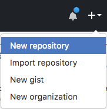

<!-- slide-column 80 -->


### Bob: add B as a collaborator

For this tutorial, both team members will need push access to the repository.
**Bob** should go to the repository's **collaborator settings**,
and add the GitHub username of **Alice** as a collaborator:

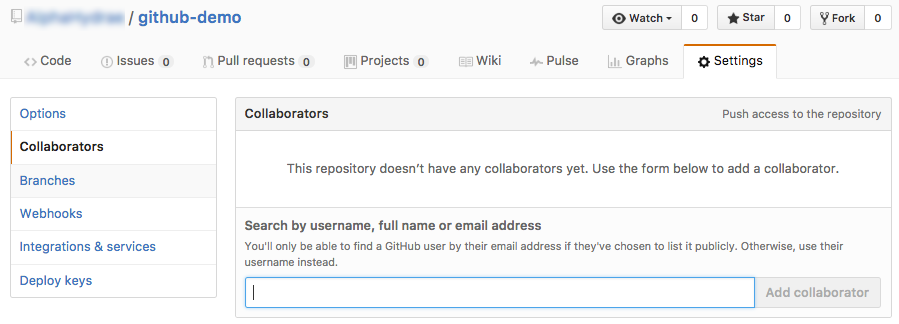

**Alice** must then **_accept the invitation sent by e-mail_** for the change to be effective.


### Bob: copy the remote SSH URL

**Bob** should copy the SSH URL of the GitHub repository:


**WARNING:** be sure to select the **SSH** URL, not the **HTTPS** URL
(which might be selected by default).


### Bob: add the remote to your local repository

**Bob** should move into their local repository and add the GitHub repository as a remote:

```bash
$> cd /path/to/projects/comem-archidep-git-branching

$> git remote add origin git@github.com:bob/github-demo.git
```

It's a convention to name the default remote **origin**.

You can check what remotes are available with `git remote`:

```bash
$> git remote -v
origin  git@github.com:bob/github-demo.git (fetch)
origin  git@github.com:bob/github-demo.git (push)
```


### Bob: push your commits to the shared repository

It's time for **Bob** to put the code in the shared GitHub repository.
This is done using the `git push` command:

```bash
$> git push -u origin main
Counting objects: 35, done.
Delta compression using up to 8 threads.
Compressing objects: 100% (33/33), done.
Writing objects: 100% (35/35), 4.16 KiB | 0 bytes/s, done.
Total 35 (delta 14), reused 11 (delta 2)
remote: Resolving deltas: 100% (14/14), done.
To github.com:bob/github-demo.git
 * [new branch]      main -> main
```

The command `git push [remote] [branch]` tells Git to push the commit pointed to by `[branch]` to the remote named `[remote]`.

The `-u` option (or `--set-upstream`) tells Git to remember that you have linked this branch to that remote.


### Bob: remote branches

<!-- slide-column 60 -->

<git-memoir name='github' chapter='bob-push' svg-height='300px'></git-memoir>

<!-- slide-column 40 -->

The commit objects and file snapshots have been **pushed** (or uploaded) to the GitHub repository.

This includes not only the commit pointed to by main, but also the **entire history** of the repository up to that commit.

<!-- slide-container -->

Note the **origin/main** branch that has appeared in your local repository.
This is a **remote-tracking branch**.
It tells you where the **main** branch points to on the **origin** remote (the GitHub repository in this case).


### Alice: get the remote repository's SSH URL

**Alice** can now go to the repository's page on GitHub (under **Bob**'s account) and copy the SSH URL:


**WARNING:** again, be sure to select the **SSH** URL, not the **HTTPS** URL
(which might be selected by default).


### Alice: clone the shared repository

**Alice** can now get a copy of the shared GitHub repository on their machine.
This is done using the `git clone` command:

```bash
$> git clone git@github.com:bob/github-demo.git
Cloning into 'github-demo'...
remote: Counting objects: 35, done.
remote: Compressing objects: 100% (21/21), done.
remote: Total 35 (delta 14), reused 35 (delta 14), pack-reused 0
Receiving objects: 100% (35/35), 4.16 KiB | 0 bytes/s, done.
Resolving deltas: 100% (14/14), done.

$> cd github-demo
```

The `git clone [url]` command copies the **remote** repository to your machine.


### Alice: remote branches

<!-- slide-column 60 -->

<git-memoir name='github' chapter='alice-pull' svg-height='275px'></git-memoir>

<!-- slide-column 40 -->

The entire history of the project is **pulled** (or downloaded) from the GitHub repository.

Git will also automatically checkout the **main** branch in the working directory so you have something to work from.

Again, Git has created a **remote-tracking branch** in Alice's repository,
so that you can know what the current state of the remote is.


### Alice: make local changes

**Alice** thinks that the project's filenames are too long. Let's fix that:

```bash
$> mv addition.js add.js
$> mv subtraction.js sub.js
$> git add .
$> git commit -m "Shorter filenames"
```


### Alice: check the state of branches

<!-- slide-column 70 -->

<git-memoir name='github' chapter='alice-commit' svg-height='275px'></git-memoir>

<!-- slide-column -->

This is now the state of the shared repository and **Alice**'s local repository.

There is a new commit in **Alice**'s repository that is not in the shared GitHub repository.


### Alice: push to the shared repository

Push to update the shared repository:

```bash
$> git push origin main
```

<git-memoir name='github' chapter='alice-push' svg-height='275px'></git-memoir>


### Bob: check the state of branches

<!-- slide-column 60 -->

<git-memoir name='github' chapter='bob-look' controls='false' svg-height='275px'></git-memoir>

<!-- slide-column 40 -->

This is now the state from **Bob**'s perspective.

Notice that the new commit is in the shared repository (on GitHub)
but that the remote-tracking branch origin/main **is not up-to-date** in **Bob**'s repository.

<!-- slide-container -->

Git does not automatically sync repositories.
**As far as Bob knows** looking at information from their local repository,
the main branch still points to `4f94ga` in the shared repository.


### Bob: fetch changes from the shared repository

**Bob** should now get the changes from the shared repository:

```bash
$> git fetch origin
remote: Counting objects: 2, done.
remote: Compressing objects: 100% (1/1), done.
remote: Total 2 (delta 1), reused 2 (delta 1), pack-reused 0
Unpacking objects: 100% (2/2), done.
From github.com:bob/github-demo
   4f94ga..92fb8c  main     -> origin/main
```

<!-- slide-column 70 -->

<git-memoir name='github' chapter='bob-fetch' svg-height='250px'></git-memoir>

<!-- slide-column -->

The new commit is now here and the remote-tracking branch has been updated.

However, the local main branch **has not moved** and the working directory has **not been updated**.


### Bob: check the state of branches

Now you can use `git merge` like in the previous tutorial to bring the changes of origin/main into main:

```bash
$> git merge origin/main
Updating 4f94ga..92fb8c
Fast-forward
 addition.js => add.js | 0
 1 file changed, 0 insertions(+), 0 deletions(-)
 rename addition.js => add.js (100%)
```

<!-- slide-column 70 -->

<git-memoir name='github' chapter='bob-merge' svg-height='240px'></git-memoir>

<!-- slide-column -->

As expected, main has been fast-forwarded to the commit pointed to by origin/main and the working directory has been updated.

**Bob**'s repository is now up-to-date.


### Using git pull

You can also use `git pull [remote] [branch]` to save time.

The following command:

```bash
$> git pull origin main
```

Is equivalent to running the two commands we just used:

```bash
$> git fetch origin
$> git merge origin/main
```


## Managing conflicting commit histories

<!-- slide-front-matter class: center, middle -->


### Bob: fix the bug

**Bob** now notices that the last change breaks the calculator.
This is because the files were renamed, but the `<script>` tags in `index.html` were not updated.
Fix that bug, then commit and push the change:

```bash
(Make the fix...)
$> git add index.html
$> git commit -m "Fix bad <script> tags"
$> git push origin main
```

<git-memoir name='github' chapter='bob-fix' svg-height='250px'></git-memoir>


### Alice: make other changes

**Alice**, not having noticed the bug, proceeds to make 2 changes on `index.html`:

* Add an `<h2>` title before each computation
* Put the two last `<script>` tags on one line

```html
*<h2>Addition</h2>
<p id="addition">...</p>

*<h2>Subtraction</h2>
<p id="subtraction">...</p>

<script src="calculations.js"></script>
*<script src="addition.js"></script><script src="subtraction.js"></script>
```


### Alice: push the other changes

Commit and push the changes:

```bash
$> git add index.html
$> git commit -m "Improve layout"
$> git push origin main
```

<git-memoir name='github' chapter='alice-fix' svg-height='250px'></git-memoir>


### Rejected pushes

```bash
To github.com:bob/github-demo.git
 ! [rejected]        main -> main (fetch first)
error: failed to push some refs to 'git@github.com:bob/github-demo.git'
hint: Updates were rejected because the remote contains work that you do
hint: not have locally. This is usually caused by another repository pushing
hint: to the same ref. You may want to first integrate the remote changes
hint: (e.g., 'git pull ...') before pushing again.
hint: See the 'Note about fast-forwards' in 'git push --help' for details.
```

<!-- slide-column 70 -->

<git-memoir name='github' chapter='alice-fix' controls='false' svg-height='250px'></git-memoir>

<!-- slide-column -->

The push was **rejected** by the remote repository. Why?

This is the state of **Alice**'s repository right now.

#### Alice: fetch the changes

Since Git tells Alice that the local copy of the remote repository is out of date, try fetching those changes:

```bash
$> git fetch origin
```

<git-memoir name='github' chapter='alice-fetch-changes' svg-height='325px'></git-memoir>

#### Alice: try to push again

```bash
$> git push origin main
To github.com:bob/github-demo.git
 ! [rejected]        main -> main (non-fast forward)
error: failed to push some refs to 'git@github.com:bob/github-demo.git'
hint: Updates were rejected because the tip of your current branch is behind
hint: its remote counterpart. Integrate the remote changes (e.g.
hint: 'git pull ...') before pushing again.
hint: See the 'Note about fast-forwards' in 'git push --help' for details.
```

<!-- slide-column 70 -->

<git-memoir name='github' chapter='alice-fetch-changes' controls='false' svg-height='315px'></git-memoir>

<!-- slide-column -->

The push was **rejected again**! **Why?**

This is the state of **Alice**'s repository right now.


### Divergent history

<!-- slide-column 70 -->

<git-memoir name='github' chapter='alice-fetch-changes' controls='false' svg-height='325px'></git-memoir>

<!-- slide-column -->

It's for the same reason as in the previous tutorial:
**Bob** and **Alice**'s work have diverged from a common ancestor.

A remote repository will **only accept fast-forward pushes** by default.


### Alice: pull changes from the shared repository

**Alice** wants to fetch **and** merge the changes made by **Bob**.
Let's use the `git pull` command:

```bash
$> git pull origin main
remote: Counting objects: 3, done.
remote: Compressing objects: 100% (2/2), done.
remote: Total 3 (delta 1), reused 3 (delta 1), pack-reused 0
Unpacking objects: 100% (3/3), done.
From github.com:bob/github-demo
 * branch            main     -> FETCH_HEAD
   92fb8c..3ff531    main     -> origin/main
Auto-merging index.html
CONFLICT (content): Merge conflict in index.html
Automatic merge failed; fix conflicts and then commit the result.
```

The fetch succeeded, but the merge failed because of a **conflict** on `index.html`.


### Alice: check the conflict markers

**Alice** should take a look at `index.html`:

```txt
<<<<<<< HEAD
    <script src="addition.js"></script><script src="subtraction.js"></script>
=======
    <script src="add.js"></script>
    <script src="sub.js"></script>
>>>>>>> 3ff5311406e73c7d2cc1691f9535214c2543937f
```

Let's make sure we keep it on one line while still renaming the files, and remove the conflict markers::

```txt
    <script src="add.js"></script><script src="sub.js"></script>
```

Mark the conflict as resolved and finish the merge:

```bash
$> git add index.html
$> git commit -m "Merge origin/main"
```


### Alice: check the state of branches

Now the state of **Alice**'s local repository is consistent with the state of the shared repository:
the commit pointed to by **main** is ahead of the commit pointed to by **origin/main**.

<git-memoir name='github' chapter='alice-pull-changes' svg-height='325px'></git-memoir>


### Alice: push the changes

The push will be accepted now:

```bash
$> git push origin main
```

<git-memoir name='github' chapter='alice-push-merge' svg-height='335px'></git-memoir>


### Bob: pull the changes

**Bob** can now pull those latest changes to keep up-to-date:

```bash
$> git pull origin main
```

<git-memoir name='github' chapter='bob-pull-merge' svg-height='335px'></git-memoir>


[distributed-workflows]: https://git-scm.com/book/en/v2/Distributed-Git-Distributed-Workflows
[git]: https://git-scm.com
[git-tutorial]: ../git/
[github]: https://github.com
<!-- START doctoc generated TOC please keep comment here to allow auto update -->
<!-- DON'T EDIT THIS SECTION, INSTEAD RE-RUN doctoc TO UPDATE -->

- [Cloud Computing](#cloud-computing)
  - [Client-server model](#client-server-model)
    - [Server-side](#server-side)
    - [Types of servers](#types-of-servers)
    - [[Internet hosting][internet-hosting]](#internet-hostinginternet-hosting)
      - [Types of web hosting](#types-of-web-hosting)
    - [[Virtualization][virtualization]](#virtualizationvirtualization)
      - [Virtualized server architecture](#virtualized-server-architecture)
  - [Cloud computing](#cloud-computing)
    - [What is cloud computing?](#what-is-cloud-computing)
    - [Why use cloud computing?](#why-use-cloud-computing)
    - [Deployment models](#deployment-models)
      - [Other deployment models](#other-deployment-models)
    - [Public clouds](#public-clouds)
  - [Service models](#service-models)
    - [What can I get?](#what-can-i-get)
    - [On premise data center](#on-premise-data-center)
    - [Infrastructure as a Service (IaaS)](#infrastructure-as-a-service-iaas)
      - [How does IaaS work?](#how-does-iaas-work)
    - [Platform as a Service (PaaS)](#platform-as-a-service-paas)
      - [How does PaaS work?](#how-does-paas-work)
    - [Function as a Service (FaaS)](#function-as-a-service-faas)
      - [How does FaaS work?](#how-does-faas-work)
    - [Mobile Backend as a Service (MBaas)](#mobile-backend-as-a-service-mbaas)
      - [How does MBaaS work?](#how-does-mbaas-work)
    - [Software as a Service (SaaS)](#software-as-a-service-saas)
    - [Level of abstraction](#level-of-abstraction)
  - [Trends](#trends)
    - [Service-oriented architecture (SOA)](#service-oriented-architecture-soa)
    - [Microservices](#microservices)
      - [[Microservice architecture][microservices-in-practice]](#microservice-architecturemicroservices-in-practice)
    - [Serverless computing](#serverless-computing)
  - [References](#references)
  - [TODO](#todo)

<!-- END doctoc generated TOC please keep comment here to allow auto update -->

# Cloud Computing

Learn what cloud computing is and about the common service models available today.

<!-- slide-include ../../BANNER.md -->


## Client-server model

The [client-server model][client-server-model] is one of the main ways distributed and networked computer systems are organized today.
In this model, **servers** share their resources with **clients**, who **request a server's content or services**.

<p class='center'></p>

> The communication is not only one way.
> In modern web applications, servers may also **push data to their clients**.

### Server-side

The **server** is what we will focus on.


### Types of servers

A server can provide many different kinds of content or services:

* A [**file server**][file-server] provides shared disk access accessible over the network,
  to store files such as text, image, sound or video.
* A [**database server**][db-server] houses an application that provides database services to other computer programs.
* A [**web server**][web-server] can serve contents over the Internet.
* An [**application server**][app-server] provides an environment to run web applications.

<p class='center'>
  
  
  
  
</p>

These are just a few examples.
There are many [types of servers][server-types] depending on the scenario and the resources you want to provide.
One computer may fulfill one or several of these roles.

### [Internet hosting][internet-hosting]

Not every individual and organization has access to vast computer resources.
Some companies provide Internet servers that can be owned or leased by customers.

One common example is [web hosting][web-hosting],
where server space is provided to make websites accessible over the Internet.

<p class='center'></p>

#### Types of web hosting

<!-- slide-column -->

[**Shared hosting**][shared-hosting]

Multiple websites (from a few to a few hundred) are placed on the same server
and **share a common pool of resources** (e.g. CPU, RAM).
This is the least expensive and least flexible model.

<p class='center'></p>

<!-- slide-column -->

[**Dedicated hosting**][dedicated-hosting]

Customers get full control over their own **physical server(s)**.
They are responsible for the security and maintenance of the server(s).
This offers the most flexibility and best performance.

<p class='center'></p>

<!-- slide-column -->

[**Virtual hosting**][virtual-hosting]

Using [virtualization][virtualization], physical server resources can be divided into **virtual servers**.
Customers gain full access to their own virtual space.

<p class='center'></p>

### [Virtualization][virtualization]

<!-- slide-column -->

**Hardware virtualization** refers to the creation of a **virtual machine** that acts like a real computer with an operating system.

A **hypervisor** is installed on the **host machine**.
It virtualizes CPU, memory, network and storage.

A virtual machine, also called the **guest machine**,
runs another operating system **isolated** from the host machine.

For example, a computer running Microsoft Windows may host a virtual machine running an Ubuntu Linux operating system.
Ubuntu-based software can be run in the virtual machine.

<!-- slide-column 55 -->


Popular virtualization solutions: [Linux KVM][kvm], [Parallels][parallels], [VirtualBox][virtualbox], [VMWare][vmware].

#### Virtualized server architecture

Using virtual machines provides several advantages:
applications can each run in an **isolated environment**
custom-tailored to their needs (operating system, libraries, etc).
**New virtual servers can be created in minutes.**
**Resource utilization is maximized** instead of hardware running idle.

<!-- slide-column -->

On the other hand, virtual machines require **additional management effort**
and their **performance is not as good** as dedicated servers.

But for many use cases **the benefits outweight the costs**,
which is why virtualization is heavily used in cloud computing.

<!-- slide-column 70 -->

<p class='center'></p>


## Cloud computing

<!-- slide-front-matter class: center, middle -->

<p class='center'></p>

### What is cloud computing?

<!-- slide-column -->

[Cloud computing][cloud] is nothing new.
It's simply a **pool of configurable computer system resources**.

These resources may be **servers**,
or **infrastructure** for those servers (e.g. network, storage),
or **applications** running on those servers (e.g. web applications).

<!-- slide-column 70 -->

<p class='center'></p>

### Why use cloud computing?

Cloud computing resources can be **rapidly provisioned** with **minimal management** effort, allowing great **economies of scale**.

Companies using cloud computing can **focus on their core business** instead of expending resources on computer infrastructure and maintenance.

<!-- slide-column -->

<p class='center'></p>

Pay-as-you-go models **minimize up-front computer infrastructure costs**.

They allow to more rapidly **adjust to fluctuating and unpredictable computing demands**.

<!-- slide-column -->

<p class='center'></p>

**Customization options are limited** since you do not have complete control over the infrastructure.

**Security and privacy** can be a concern depending on a business's legal requirements.

### Deployment models

<!-- slide-column -->

<p class='center'></p>

Cloud infrastructure operated solely **for a single organization**,
managed and hosted internally or by a third party.

These clouds are very capital-intensive (they require physical space, hardware, etc)
but are usually more customizable and secure.

**Providers:** Microsoft, IBM, Dell, VMWare, HP, Cisco, Red Hat.

<!-- slide-column -->

<p class='center'></p>

Cloud services **open for public use**, provided over the Internet.

Infrastructure is often shared through virtualization.
Security guarantees are not as strong.
However, costs are low and the solution is highly flexible.

**Platforms:** [Amazon Web Services][aws], [Google Cloud Platform][google-cloud], [Microsoft Azure][azure].

#### Other deployment models

<!-- slide-column -->

There are also **hybrid clouds** composed of two or more clouds bound together to benefit from the advantages of multiple deployment models.

For example, a platform may store sensitive data on a private cloud, but connect to other applications on a public cloud for greater flexibility.

<!-- slide-column 55 -->


<!-- slide-container -->

There also are a few [other deployment models][other-deployment-models],
for example **distributed clouds** where computing power can be provided by volunteers donating the idle processing resources of their computers.

### Public clouds

<!-- slide-column -->

Most public **cloud computing providers** such as Amazon, Google and Microsoft **own and operate the infrastructure** at their data center(s),
and **provide cloud resources via the Internet**.

<!-- slide-column 65 -->

<p class='center'></p>

<!-- slide-container -->

For example, the Amazon Web Services cloud was [initially developed internally][aws-history] to support Amazon's retail trade.
As their computing needs grew, they felt the need to build a computing infrastructure that was **completely standardized and automated**,
and that would **rely extensively on web services** for storage and other computing needs.

As that infrastructure grew, Amazon started **selling access to some of their services**,
initially virtual servers, as well as a storage and a message queuing service.
Today Amazon is one of the largest and most popular cloud services provider.


## Service models

<!-- slide-front-matter class: center, middle -->


### What can I get?

These are the main service models offered by cloud providers.

Model                                | Acronym     | What is provided                                                    | Example
:---                                 | :---        | :---                                                                | :---
[Infrastructure as a Service][iaas]  | **`IaaS`**  | Virtual machines, servers, storage, load balancers, network, etc.   | [Amazon Web Services][aws], [Google Cloud][google-cloud], [Microsoft Azure][azure]
[Platform as a Service][paas]        | **`PaaS`**  | Execution runtime, database, web server, development tools, etc.    | [Cloud Foundry][cloud-foundry], [Heroku][heroku], [OpenShift][openshift]
[Function as a Service][faas]        | **`FaaS`**  | Event-based hosting of individual functions.                        | [AWS Lambda][aws-lambda], [Azure Functions][azure-functions], [Cloud Functions][cloud-functions]
[Mobile Backend as a Service][mbaas] | **`MBaaS`** | Cloud storage, computing services and APIs for mobile applications. | [CloudBoost][cloudboost], [Firebase][firebase]
[Software as a Service][saas]        | **`SaaS`**  | Web applications such as CRM, email, games, etc.                    | [Dropbox][dropbox], [Gmail][gmail], [Slack][slack]

### On premise data center

<!-- slide-column 40 -->


<!-- slide-column -->

As an introduction to cloud service models,
this is a representation of the various technological layers you need to put in place
to deploy web applications in a modern cloud infrastructure.

If you have your own data center, you need to install and configure all of these layers yourself.

As you will see, the various **cloud service models abstract away part or all** of these layers,
so that you don't have to worry about them.

### Infrastructure as a Service (IaaS)

<!-- slide-column 40 -->


<!-- slide-column -->

[**IaaS**][iaas] provides fundamental IT infrastructure like **storage, networks and virtual machines** from the provider's data center(s).

The customer provides an **operating system image**, for example [Ubuntu][ubuntu],
which is run in a virtual machine by the provider.
The VM is the **unit of scale**, meaning that the customer pays per virtual machine, usually hourly.

The customer does not manage the physical infrastructure but has **complete control over the operating system** and can run **arbitrary software**.

Setting up the runtime environment (databases, web servers, monitoring, etc) for applications is the responsibility of the customer.

#### How does IaaS work?

System administrators connect to virtual machines run by the provider in their data center.
They have complete control over the operating system.
To run a website, they must set up the runtime environment themselves.


### Platform as a Service (PaaS)

<!-- slide-column 40 -->


<!-- slide-column -->

[**PaaS**][paas] platforms provide a **managed runtime environment**
where customers can run their applications without having to maintain the associated infrastructure.

All the customer has to do is provide the **application or software**.
The platform will run it with the necessary additional components (e.g. database).
Pricing is per application, often hourly.

This is **quicker** because applications can be deployed with minimal configuration,
without the complexity of setting up the runtime.
More time can be spent on developing the application.

However PaaS is **less flexible** since control of the runtime environment and its configuration is limited.
It also tends to be more expensive at larger scales.

#### How does PaaS work?

Developers send an application, for example a Laravel site written in PHP, to the provider, typically via Git.
The managed runtime environment then detects the type of application and runs it, along with the necessary resources,
and serves it over the Internet.


### Function as a Service (FaaS)

<!-- slide-column 40 -->


<!-- slide-column -->

[**FaaS**][faas] platforms store **individual functions** and run them in response to events.
Customers write simple functions which can access resources such as a database,
then define in which circumstances they are run (e.g. in response to client requests).

This model completely abstracts away both the infrastructure,
and the complexity of structuring an application.
The customer has no direct need to manage resources.

In contrast with IaaS and PaaS, nothing is kept running if nothing happens.
Functions are loaded and run as events occur.
**Pricing is based on execution time** (per millisecond) rather than application uptime.

The customer has little to no control over infrastructure, runtime and application layers.

#### How does FaaS work?

Developers write individual functions and publish them to the provider.
The platform provides various services to connect these functions together and to various resources for storage, communication, monitoring, etc.

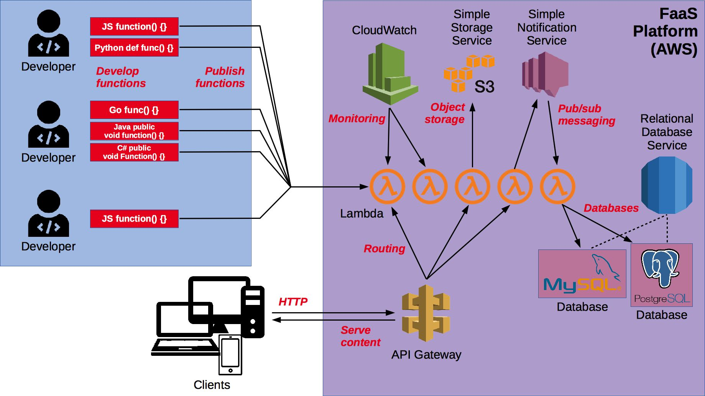

### Mobile Backend as a Service (MBaas)

<!-- slide-column 40 -->

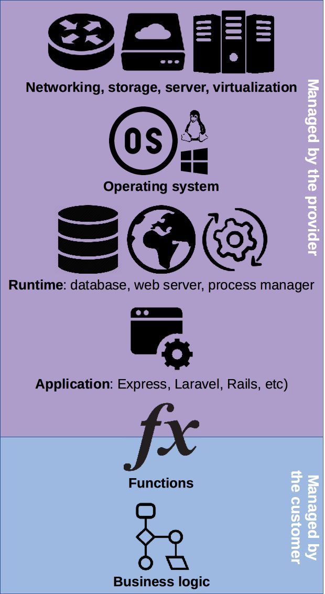

<!-- slide-column -->

[**MBaaS**][mbaas] provides **cloud storage and APIs** to power web and mobile applications,
with features such as user management, push notifications and social network integration.

A working backend is provided out of the box with this model.
The customer simply **uses the provided cloud APIs** in their frontend application,
and may configure how to handle data access and events.

This is the **quickest** solution to develop a frontend application,
since much less work needs to be done on the backend.

But it's also **less flexible** as you must use the specific services provided by the platform.
It also produces the most **vendor lock-in**: it would be difficult to switch a mobile application from one MBaaS platform to another.

#### How does MBaaS work?

<!-- slide-column 60 -->

Developers are provided a backend in the form of ready-made cloud APIs.
Most of the time, they can simply apply configuration instead of writing code.
For example, Google's [Firebase][firebase] platform provides a real-time database which automatically handles synchronization of updates to all devices.

<!-- slide-column -->

<p class='center'></p>

<!-- slide-container -->

<p class='center'>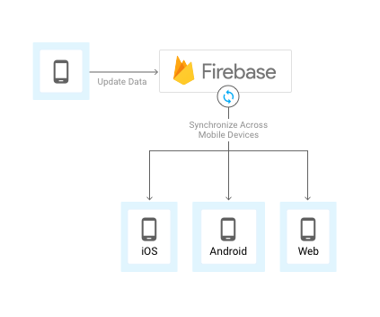</p>

### Software as a Service (SaaS)

<!-- slide-column 40 -->

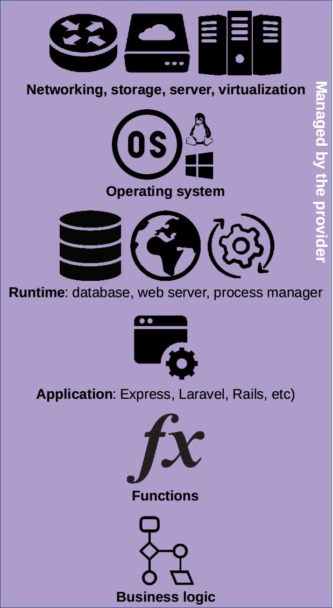

<!-- slide-column -->

[**SaaS**][saas] provides **on-demand** software over the Internet.

The software is **fully developed, managed and run by the provider**, so the customer has nothing to do except pay and use it.
Pricing is often per user and monthly.

This model offers the **least flexibility**, as the customer has no control over the operation or deployment of the software,
and limited control over its configuration.

### Level of abstraction

These models can be ordered by increasing level of abstraction,
from IaaS being the lowest level and most flexible service model,
to SaaS being the highest level and fastest-to-use service model.

<p class='center'>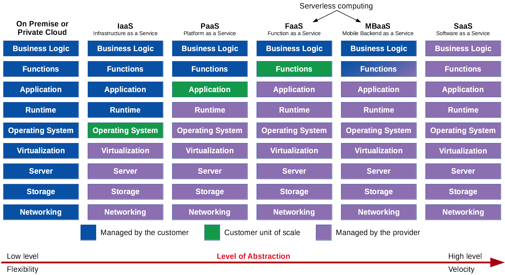</p>


## Trends

<!-- slide-front-matter class: center, middle -->


What's happening in the clouds?

### Service-oriented architecture (SOA)

[Service-oriented architecture][soa] is a software design style where services are provided by application components over a network.
This is popular in the cloud as it is easy to provision resources to deploy new components,
instead of having large monolithic applications.

<p class='center'>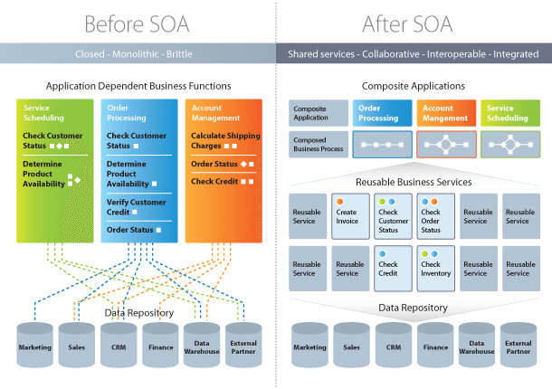</p>

### Microservices

There is a tendency in recent years to try to **decompose** monolithic applications into smaller, more flexible [microservices][microservices]
(a variant of service-oriented architecture).
The [Function-as-a-Service (FaaS)][faas] model is one more step in the same direction.

<p class='center'></p>

#### [Microservice architecture][microservices-in-practice]

<!-- slide-column -->

Enterprise software often offers hundreds of functionalities piled into a single monolithic application.
The deployment, troubleshooting, scaling and upgrading of such monsters is a nightmare.

Isolating services allows development to be parallelized as teams can work autonomously on separate services,
or even individual functions.
It also faciliates [continous delivery][cd] as each component can be deployed independently.

<!-- slide-column 25 -->

<p class='center'></p>

<!-- slide-container -->

<p class='center'></p>

### Serverless computing

The [Function-as-a-Service (FaaS)][faas] and [Mobile-Backend-as-a-Service (MBaaS)][mbaas]
are often considered to be part of the [**serverless computing**][serverless] model.

The name "serverless" does not mean that there is no server.
It just means that **the server is abstracted** and managed by the platform provider.

<!-- slide-column -->

<p class='center'></p>

* **Productivity**: the developer can focus on developing functions or business logic.
* **Cost-effective**: only the resources used are billed
  (whereas PaaS or IaaS resources may be underutilized).
* **Scalable**: the provider automatically scales resources to the demand.

<!-- slide-column -->

<p class='center'></p>

* **Greater latency**: infrequently-used code may be "shut down" when not in use.
* **Resource limits**: not suited to some workloads like high-performance computing.
* **Monitoring and debugging**: identifying performance problems may be more difficule than with traditional code.


## References

* [Advantages and Disadvantages of Virtual Server](https://www.esds.co.in/kb/advantages-and-disadvantages-of-virtual-server/)
* [Microservices in Practice][microservices-in-practice]


## TODO

* Additional diagrams for MBaaS & SaaS
* SOA, EaaS, https://en.wikipedia.org/wiki/Service-oriented_architecture
* Containers, CaaS
* container pictures


[app-server]: https://en.wikipedia.org/wiki/Application_server
[aws]: https://aws.amazon.com/
[aws-history]: https://en.wikipedia.org/wiki/Amazon_Web_Services#History
[aws-lambda]: https://aws.amazon.com/lambda/
[azure]: https://azure.microsoft.com/
[azure-functions]: https://azure.microsoft.com/en-us/services/functions/
[cd]: https://en.wikipedia.org/wiki/Continuous_delivery
[client-server-model]: https://en.wikipedia.org/wiki/Client%E2%80%93server_model
[cloud]: https://en.wikipedia.org/wiki/Cloud_computing
[cloudboost]: https://www.cloudboost.io/
[cloud-foundry]: https://www.cloudfoundry.org/
[cloud-functions]: https://cloud.google.com/functions/
[db-server]: https://en.wikipedia.org/wiki/Database_server
[dedicated-hosting]: https://en.wikipedia.org/wiki/Dedicated_hosting_service
[dropbox]: https://www.dropbox.com/
[faas]: https://en.wikipedia.org/wiki/Function_as_a_service
[file-server]: https://en.wikipedia.org/wiki/File_server
[firebase]: https://firebase.google.com/
[gmail]: https://www.google.com/gmail/
[google-cloud]: https://cloud.google.com/
[heroku]: https://www.heroku.com/
[iaas]: https://en.wikipedia.org/wiki/Infrastructure_as_a_service
[internet-hosting]: https://en.wikipedia.org/wiki/Internet_hosting_service
[kvm]: https://www.linux-kvm.org/
[mbaas]: https://en.wikipedia.org/wiki/Mobile_backend_as_a_service
[microservices]: https://en.wikipedia.org/wiki/Microservices
[microservices-in-practice]: https://medium.com/microservices-in-practice/microservices-in-practice-7a3e85b6624c
[openshift]: https://www.openshift.com/
[other-deployment-models]: https://en.wikipedia.org/wiki/Cloud_computing#Others
[paas]: https://en.wikipedia.org/wiki/Platform_as_a_service
[parallels]: https://www.parallels.com
[saas]: https://en.wikipedia.org/wiki/Software_as_a_service
[server-types]: https://en.wikipedia.org/wiki/Server_(computing)#Purpose
[serverless]: https://en.wikipedia.org/wiki/Serverless_computing
[shared-hosting]: https://en.wikipedia.org/wiki/Shared_web_hosting_service
[slack]: https://slack.com/
[soa]: https://en.wikipedia.org/wiki/Service-oriented_architecture
[ubuntu]: https://www.ubuntu.com/
[virtualbox]: https://www.virtualbox.org
[virtual-hosting]: https://en.wikipedia.org/wiki/Virtual_private_server
[virtualization]: https://en.wikipedia.org/wiki/Virtualization
[vmware]: https://www.vmware.com
[web-hosting]: https://en.wikipedia.org/wiki/Web_hosting_service
[web-server]: https://en.wikipedia.org/wiki/Web_server
<!-- START doctoc generated TOC please keep comment here to allow auto update -->
<!-- DON'T EDIT THIS SECTION, INSTEAD RE-RUN doctoc TO UPDATE -->

- [Linux](#linux)
  - [What is Linux?](#what-is-linux)
    - [Unix history](#unix-history)
    - [Why use Linux?](#why-use-linux)
    - [Linux distribution timeline](#linux-distribution-timeline)

<!-- END doctoc generated TOC please keep comment here to allow auto update -->

# Linux

Learn about the history of the Linux operating system.

<!-- slide-include ../../BANNER.md -->


## What is Linux?

<!-- slide-column -->

[Linux][linux] is a family of free and open-source software operating systems built around the [Linux kernel][linux-kernel],
an [operating system kernel][kernel] first released in 1991, by [Linus Torvalds][linus].

<!-- slide-column 40 -->


<!-- slide-container -->

It is based on [Unix][unix], an operating system released in 1971 at AT&T's [Bell Laboratories][bell-labs] in the United States.
As it was [proprietary software][proprietary], Linus Torvalds decided to release his own [open source][oss] kernel.

### Unix history


### Why use Linux?

There are many [reasons to use it][linux-pros]:

* Open source philosophy
* Low or no cost
* Better system stability
* Lightweight distributions (lower CPU/RAM usage & smaller size)

Some of these properties make Linux an ideal for:

* [Embedded systems][embedded] (e.g. [BusyBox][busybox] is only 2.1MB compressed).
* [Servers][linux-servers] (Linux is used as the operating system on more than 50% of all servers, and is used on most supercomputers).

> Note that no system is perfect.
> Linux also has [barriers to adoption][linux-cons],
> mostly the facts that it rarely comes pre-installed and that it requires users to know more about managing their operating system.

### Linux distribution timeline

Linux is not just one operating systems, it is a family of systems called [Linux distributions][linux-distros].
For example, on desktop or server, the most popular is [Ubuntu][ubuntu].

<p class='center'></p>

> This chart only shows the most popular distributions.
> [There are more][linux-timeline].


[bell-labs]: https://en.wikipedia.org/wiki/Bell_Labs
[busybox]: https://en.wikipedia.org/wiki/BusyBox
[embedded]: https://en.wikipedia.org/wiki/Embedded_system
[kernel]: https://en.wikipedia.org/wiki/Kernel_(operating_system)
[linus]: https://en.wikipedia.org/wiki/Linus_Torvalds
[linux]: https://en.wikipedia.org/wiki/Linux
[linux-cons]: https://en.wikipedia.org/wiki/Linux_adoption#Barriers_to_adoption
[linux-distros]: https://en.wikipedia.org/wiki/Linux_distribution
[linux-kernel]: https://en.wikipedia.org/wiki/Linux_kernel
[linux-pros]: https://en.wikipedia.org/wiki/Linux_adoption#Reasons_for_adoption
[linux-servers]: https://en.wikipedia.org/wiki/Linux#Servers,_mainframes_and_supercomputers
[linux-timeline]: images/linux-distribution-timeline.svg
[oss]: https://en.wikipedia.org/wiki/Open-source_software
[proprietary]: https://en.wikipedia.org/wiki/Proprietary_software
[ubuntu]: https://www.ubuntu.com/
[unix]: https://en.wikipedia.org/wiki/Unix
# Unix Environment Variables

Learn how to manage Unix environment variables.

<!-- slide-include ../../BANNER.md -->

**You will need**

* A Unix CLI

**Recommended reading**

* [Unix Processes](../unix-processes/)

<!-- START doctoc generated TOC please keep comment here to allow auto update -->
<!-- DON'T EDIT THIS SECTION, INSTEAD RE-RUN doctoc TO UPDATE -->

- [Environment](#environment)
  - [What is an environment?](#what-is-an-environment)
  - [Deployment](#deployment)
  - [Release management](#release-management)
- [Environment variables](#environment-variables)
  - [What is an environment variable?](#what-is-an-environment-variable)
  - [What are they for?](#what-are-they-for)
- [Managing environment variables](#managing-environment-variables)
  - [Getting an environment variable](#getting-an-environment-variable)
  - [Listing all environment variables](#listing-all-environment-variables)
  - [Setting an environment variable](#setting-an-environment-variable)
    - [Setting a variable for one command](#setting-a-variable-for-one-command)
    - [Setting a variable for a shell session](#setting-a-variable-for-a-shell-session)
    - [Setting a variable in the shell configuration file](#setting-a-variable-in-the-shell-configuration-file)
  - [Removing an environment variable](#removing-an-environment-variable)
  - [Getting environment variables from code](#getting-environment-variables-from-code)
  - [Environment variables are always strings](#environment-variables-are-always-strings)
- [References](#references)

<!-- END doctoc generated TOC please keep comment here to allow auto update -->


## Environment

<!-- slide-front-matter class: center, middle -->


### What is an environment?

In the context of software **deployment**, an [**environment**][env] is a
computer system or set of systems in which a program or component is deployed
and executed.

<!-- slide-column -->

<p class='center'></p>

When you develop and/or execute a program locally, your local computer is an
environment.

<!-- slide-column -->

<p class='center'></p>

When you transfer a program to a server and execute it there, that becomes
another environment.

### Deployment

In industrial use, the **development environment** (where changes are originally
made) and **production environment** (what end users use) are separated, often
with several stages in between.

<p class='center'></p>

The configuration of each environment may vary to suit the requirements of
development, testing, production, etc.

### Release management

<!-- slide-column -->

<p class='center'>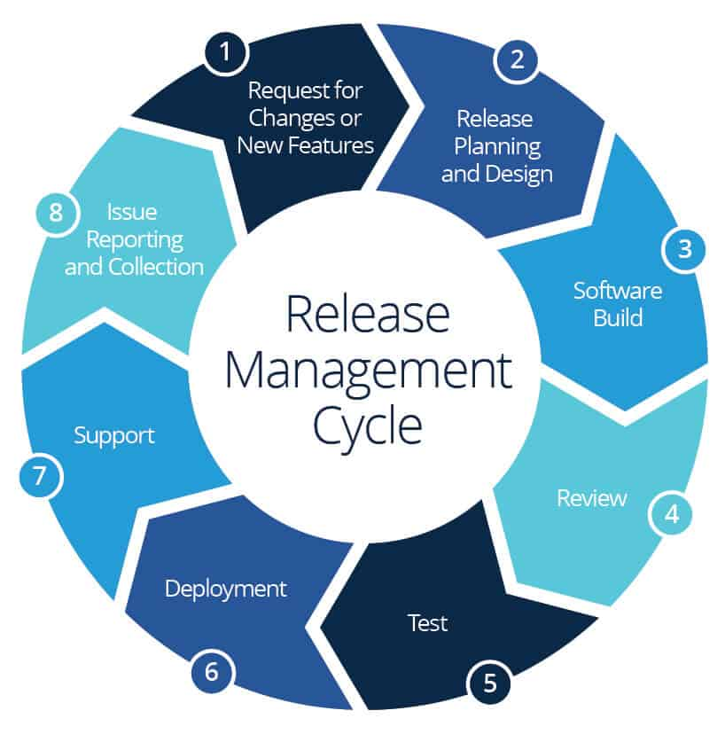</p>

<!-- slide-column -->

When using [agile software development][agile], teams are seeing much higher
quantities of software releases.

[Continuous delivery][cd] and [DevOps][devops] are processes where a program is
packaged and "moved" from one environment to the other (i.e. deployed) until it
reaches the production stage.

Modern software development teams use automation to speed up this process.


## Environment variables

<!-- slide-front-matter class: center, middle -->

Affecting processes since 1979.


### What is an environment variable?

An environment variable is a **named value that can affect the way running processes will behave** on a computer.

When a process runs on a Unix system, it may query variables such as:

* `HOME` - The home directory of the user running the process.
* `LANG` - The default locale.
* `TMP` - The directory in which to store temporary files.
* And more.

Another common example is the [`PATH`][path],
an environment variable that indicates in which directories to look for binaries to execute when typing commands in a shell.


### What are they for?

Environment variables can **affect the behavior of programs without modifying them**.

If a program bases some of its behavior on an environment variable,
you can simply change the value of the variable before running it,
allowing you to customize it without changing one line of code.

Environment variables can be used as a dynamic means of configuration,
an alternative to configuration files or hardcoded values.


## Managing environment variables

<!-- slide-front-matter class: center, middle -->

Getting them, listing them, setting them, deleting them.


### Getting an environment variable

To display the current value of an environment variable, use the `echo` command.
A variable can be referenced by its name prefixed with a dollar sign (`$`):

```bash
$> echo $USER
ubuntu

$> echo $HOME
/home/ubuntu

$> echo $SHELL
/bin/bash

$> echo $PATH
/usr/local/sbin:/usr/local/bin:/usr/sbin:/usr/bin:/sbin:/bin
```

If a variable is not set, nothing will be displayed:

```bash
$> echo $FOO
```


### Listing all environment variables

The `env` command prints all environment variables currently set in your shell, and their values:

```bash
$> env
LC_ALL=en_US.utf-8
LS_COLORS=rs=0:di=01;34:...
LANG=C.UTF-8
USER=ubuntu
PWD=/home/ubuntu
HOME=/home/ubuntu
LC_CTYPE=UTF-8
SSH_TTY=/dev/pts/0
MAIL=/var/mail/ubuntu
TERM=xterm-256color
SHELL=/bin/bash
PATH=/usr/local/sbin:/usr/local/bin:/usr/sbin:/usr/bin:/sbin:/bin
```


### Setting an environment variable

There are multiple ways to set an environment variable.
The lifetime of the variable depends on how you set it:

* You can set it for one command.
* You can set it for the current shell session.
* You can set it in your shell configuration file (e.g. `.bashrc`).

In order to test these techniques,
download this [simple script](https://git.io/fpdar) which prints the value of an environment variable if set:

```bash
$> curl -sL https://git.io/fpdar > print-env-var.sh

$> chmod 755 print-env-var.sh

$> ./print-env-var.sh PATH
The value of $PATH is /usr/local/sbin:/usr/local/bin:...

$> ./print-env-var.sh FOO
$FOO is not set
```

#### Setting a variable for one command

You can prefix a command by an environment variable assigment:

```bash
$> `FOO=bar` ./print-env-var.sh FOO
The value of $FOO is bar
```

This only sets the variable **for the process executed by that command**.
As you can see, the variable is still not set if we check later, even in the same shell session:

```bash
$> ./print-env-var.sh FOO
$FOO is not set
```

#### Setting a variable for a shell session

The `export` command exports an environment variable to all the child processes running in the current shell session:

```bash
$> `export FOO=bar`

$> ./print-env-var.sh FOO
The value of $FOO is bar

$> ./print-env-var.sh FOO
The value of $FOO is bar
```

As you can see, the variable remains set.

However, if you close the shell and reopen a new one, the variable is no longer set:

```bash
$> ./print-env-var.sh FOO
$FOO is not set
```

#### Setting a variable in the shell configuration file

If you add the `export` command to your shell configuration file (`.bash_profile` for [Bash][bash]),
it will be run every time you start a new shell:

```bash
$> `echo 'export FOO=bar' >> ~/.bash_profile`

$> cat ~/.bash_profile
export FOO=bar
```

This will not immediately take effect in the current shell,
as the configuration file is only evaluated when the shell starts.
But you can evaluate it with the `source` command:

```bash
$> source ~/.bash_profile

$> ./print-env-var.sh FOO
The value of $FOO is bar
```

The variable will still be set if you close this shell and launch another one:

```bash
$> ./print-env-var.sh FOO
The value of $FOO is bar
```


### Removing an environment variable

The `unset` command removes a variable from the environment:

```bash
$> ./print-env-var.sh FOO
The value of $FOO is bar

$> unset FOO

$> ./print-env-var.sh FOO
$FOO is not set
```

> Of course, if the variable is exported in your shell configuration file,
> this will only remove it for the current shell session.
> You must remove the export from the configuration file to remove the variable from future shells.


### Getting environment variables from code

Every programming language has a simple way of retrieving the value of environment variables:

Language     | Code
:---         | :---
C            | [`getenv("PATH")`](http://man7.org/linux/man-pages/man3/getenv.3.html)
Elixir       | [`System.get_env("FOO")`](https://hexdocs.pm/elixir/System.html#get_env/2)
Erlang       | [`os.get_env("FOO")`](http://erlang.org/doc/man/os.html#getenv-1)
Go           | [`os.Getenv("FOO")`](https://golang.org/pkg/os/#Getenv)
Java         | [`System.getenv("FOO")`](https://docs.oracle.com/en/java/javase/12/docs/api/java.base/java/lang/System.html#getenv%28java.lang.String%29)
Node.js      | [`process.env.FOO`](https://nodejs.org/api/process.html#process_process_env)
PHP          | [`getenv("FOO")`](https://www.php.net/manual/en/function.getenv.php)
Python       | [`os.getenv("FOO")`](https://docs.python.org/3/library/os.html#os.getenv)
Ruby         | [`ENV["FOO"]`](https://ruby-doc.org/core-2.6.5/ENV.html#method-c-5B-5D)
Rust         | [`env::var("FOO")`](https://doc.rust-lang.org/std/env/fn.var.html)


### Environment variables are always strings

You may put whatever kind of value you want into an environment variable:

```bash
export MEANING_OF_LIFE=42  # A number
export PERSON='{"name":"John Doe","age":24}'  # Serialized JSON
```

In your programming language of choice, however, the value will **always** be a
character string. It's up to you to parse it if you want to use it as another
type, for example in Node.js:

```js
> console.log(process.env.MEANING_OF_LIFE);
42
*> process.env.MEANING_OF_LIFE + 2
*'422'
> typeof process.env.MEANING_OF_LIFE
string
> parseInt(process.env.MEANING_OF_LIFE, 10) + 2
44

> process.env.PERSON.name
undefined
> JSON.parse(process.env.PERSON).name
'John Doe'
```


## References

* [Environment Variable][env-var]
* [Linux/Unix list of common environment variables](https://www.cyberciti.biz/howto/question/general/linux-unix-list-common-environment-variables.php)
* [All you need to know about Unix environment variables](https://www.networkworld.com/article/3215965/unix/all-you-need-to-know-about-unix-environment-variables.html)


[agile]: https://en.wikipedia.org/wiki/Agile_software_development
[bash]: https://en.wikipedia.org/wiki/Bash_(Unix_shell)
[cd]: https://en.wikipedia.org/wiki/Continuous_delivery
[devops]: https://en.wikipedia.org/wiki/DevOps
[env]: https://en.wikipedia.org/wiki/Deployment_environment
[env-var]: https://en.wikipedia.org/wiki/Environment_variable
[path]: https://en.wikipedia.org/wiki/Path_(computing)
# Unix Networking

Learn the basics of Unix networking and how to make TCP connections.

<!-- slide-include ../../BANNER.md -->

**You will need**

* A Unix CLI
* An Ubuntu server with a public IP address to connect to

**Recommended reading**

* [Unix Administration](../unix-admin/)
* [Unix Processes](../unix-processes/)

<!-- START doctoc generated TOC please keep comment here to allow auto update -->
<!-- DON'T EDIT THIS SECTION, INSTEAD RE-RUN doctoc TO UPDATE -->

- [Computer networking](#computer-networking)
  - [OSI model](#osi-model)
  - [TCP/IP model](#tcpip-model)
  - [OSI vs. TCP/IP](#osi-vs-tcpip)
  - [IP addressing](#ip-addressing)
    - [IP networks](#ip-networks)
    - [Subnetworks](#subnetworks)
    - [Reserved address spaces](#reserved-address-spaces)
    - [There's no place like 127.0.0.1](#theres-no-place-like-127001)
    - [0.0.0.0 is everyone](#0000-is-everyone)
    - [Network address translation](#network-address-translation)
  - [Ports](#ports)
    - [Multiplexing](#multiplexing)
    - [Registered port numbers](#registered-port-numbers)
    - [Well-known ports](#well-known-ports)
  - [Domain name system](#domain-name-system)
    - [DNS hierarchy](#dns-hierarchy)
- [Unix networking](#unix-networking)
  - [The `ip` command](#the-ip-command)
  - [The `ping` command](#the-ping-command)
  - [The `traceroute` command](#the-traceroute-command)
  - [The `mtr` command](#the-mtr-command)
  - [The `ss` command](#the-ss-command)
  - [The `nc` command](#the-nc-command)
- [Making connections](#making-connections)
  - [Raw TCP connection](#raw-tcp-connection)
  - [HTTP request](#http-request)
    - [Making an HTTP request to Google](#making-an-http-request-to-google)
    - [Following Google's redirect](#following-googles-redirect)
  - [HTTP response](#http-response)
    - [Making an HTTP request with a browser](#making-an-http-request-with-a-browser)
    - [Sending a plain text HTTP response](#sending-a-plain-text-http-response)
    - [Sending an HTTP response with HTML](#sending-an-http-response-with-html)
- [References](#references)

<!-- END doctoc generated TOC please keep comment here to allow auto update -->


## Computer networking

<!-- slide-front-matter class: center, middle -->


### OSI model

The [Open Systems Interconnection (OSI) model][osi] standardizes communications between computing system, allowing interoperability with standard protocols.

<p class='center'></p>

A layer serves the layer above it and is served by the layer below it.

### TCP/IP model

The [internet protocol suite][tcp-ip] is the conceptual model used on the Internet and similar computer networks.
It is commonly known as TCP/IP since the Transmission Control Protocol (TCP) and the Internet Protocol (IP) are its foundational protocols.

<p class='center'>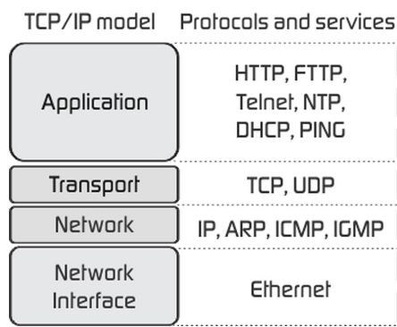</p>

It was originally developed for [ARPANET][arpanet].

### OSI vs. TCP/IP

The OSI and TCP/IP models describe the same technologies, but categorize them a little differently.

<p class='center'></p>

The OSI model is used more as a theoretical construct to reason about networking systems,
while the TCP/IP model is more in line with how Internet protocols are designed and used in practice.

### IP addressing

The [Internet Protocol (IP)][ip] is the principal communications protocol of the Internet.
It allows delivering packets from a source host to a destination host based solely on IP addresses.
It is a **network layer** protocol (OSI layer 3).

Version 4 of the protocol ([**IPv4**][ipv4]), in use since 1983, uses a 32-bit
address space typically represented in 4 dotted decimal notation, with each
octet (8 bits) containing a value between 0 and 255 (i.e. 2<sup>8</sup>
possibilities):

```
    `10.199.0.5`
```

Version 6 of the protocol ([**IPv6**][ipv6]) was developed more recently because the world is running out of IPv4 addresses
(4 billion IPv4 addresses is not enough in the [Internet of Things (IoT)][iot] world).
It's an [internet standard][internet-standard] since 2017.

It uses a 128-bit address space typically represented as 8 groups of 4 hexadecimal digits:

```
    `2001:0db8:0000:cbad:4321:0000:0000:1234`
```

#### IP networks

Each computer that is publicly accessible on the Internet has a **public IP address**.
To facilite routing, IP addresses are logically divided into networks.

<p class='center'></p>

For example, assuming we use the address `40.127.1.70` and a prefix of 16 bits:

* The **network prefix or identifier** would be the first 16 bits: `40.127`.
* The **host identifier** would be the last 16 bits: `1.70`.

This allows the physical routing devices that are part of the Internet to direct traffic to the correct geographical area and machine(s).

> The [Internet Assigned Numbers Authority (IANA)][iana] is the organization responsible for dividing the Internet itself into global networks,
> each in turn administered by regional organizations.
> You can find the list of registered networks in the [IPv4 Address Space Registry][iana-ipv4] and [IPv6 Address Space Registry][iana-ipv6].

#### Subnetworks

[Subnetting][subnet] can be used to further improve efficiency in the utilization of the relatively small address space available.

<p class='center'></p>

Instead of having thousands of computers in the same network all able to directly contact each other,
subnetting allows organizations to create smaller, isolated networks with fewer computers.

This can be used to define **complex network structures** within an organization or to **improve security**.

#### Reserved address spaces

Certain ranges of IP addresses are **reserved for private networks**.
In this address space you **cannot communicate with public machines** without a NAT gateway or proxy.

There are three reserved ranges in the IPv4 address space:

First address | Last address    | [Netmask][subnet] | [CIDR][cidr]
:---          | :---            | :---              | :---
10.0.0.0      | 10.255.255.255  | 255.0.0.0         | /8
172.16.0.0    | 172.31.255.255  | 255.240.0.0       | /12
192.168.0.0   | 192.168.255.255 | 255.255.0.0       | /16

Additionally, the following range is **reserved for a virtual network
interface**, allowing networking applications running on the same machine to
communicate with one another:

First address | Last address    | [Netmask][subnet] | [CIDR][cidr]
:---          | :---            | :---              | :---
127.0.0.1     | 127.255.255.255 | 255.0.0.0         | /8

#### There's no place like 127.0.0.1

`localhost` is a hostname that refers to the current computer used to access it.
It normally resolves resolves to the IPv4 loopback address `127.0.0.1`, and to
the IPv6 loopback address `::1`.

When you or a program makes a request to `localhost` or `127.0.0.1`, you are
contacting your own computer, bypassing network hardware but otherwise behaving
the same way as any other network call.

<p class='center'></p>

#### 0.0.0.0 is everyone

You will sometimes encounter  [`0.0.0.0`][0000]. This is not an actual IP
address.

One computer can have several IP addresses. Processes that listen for incoming
requests (e.g. a database or a web server) generally allow you to **restrict
which IP address they can be reached on**. You may only want to accept requests
to one specific address.

When you want to allow anyone to reach the process on any IP address the
computer may have, you can sometimes use **`0.0.0.0`** as a special notation
that means "**all IP addresses on the local machine**". The IPv6 equivalent is
`::`.

#### Network address translation

[Network address translation (NAT)][nat] is a method of **remapping one IP address space into another** as traffic goes through a routing device.

<!-- slide-column 40 -->

It is very commonly used for **IP masquerading**, a technique that hides an entire IP address space (such as private IP addresses) behind a single public IP address.
The router typically translates the private IP addresses of computers in an organization's network into a single public IP address assigned to the organization.

<!-- slide-column -->


<!-- slide-container -->

Other computers on the Internet see the traffic as originating from the routing device with the public IP address instead of the hidden computer in the private network.
This technique helps conserve IPv4 address space.

### Ports

In computer networking, a port is an **endpoint of communication** associated
with an IP address and protocol type. The most commonly used protocols that use
ports are the [Transmission Control Protocol (TCP)][tcp] and the [User Datagram
Protocol (UDP)][udp], which are **transport layer** protocols (OSI layer 4).

A port is represented as an unsigned 16-bit number, from 0 to 65,535
(2<sup>16</sup> - 1).

A port number is always associated with an IP address and the type of transport
protocol used for communication. For example, when a browser displays a web
page, it is generally making a TCP connection to an IP address on port 80.

You can see this information if you access a web page with a command-line HTTP
client like [cURL][curl]:

```bash
$> curl -v http://google.com/
...
** Connected to google.com (216.58.215.238) port 80 (#0)
...
```

#### Multiplexing

<!-- slide-column 45 -->

A typical computer only has one IP address.

However, one client can **open many connections at the same time to a given IP
address and server port** (up to 65535, one for each source port). A client can
also open multiple connections to **different ports** at the same time.

<!-- slide-column -->


<!-- slide-container -->

For example, a client may open 4 simultaneous TCP connections to a server:

* On port 22 to connect with an SSH client.
* On port 25 to retrieve mails with the SMTP protocol.
* On port 80 to request a web page with a browser using the HTTP protocol.
* On port 80 (again) to simultaneously retrieve a JavaScript file using the HTTP protocol.

#### Registered port numbers

The [Internet Assigned Numbers Authority (IANA)][iana] maintains a list of the [official assignments of port numbers][iana-ports] for specific uses,
although this is not always respected in practice.

Here are some of the most common:

Port    | Use
:---    | :---
20, 21  | FTP
22      | SSH
25      | SMTP
53      | DNS
80, 443 | HTTP
3306    | MySQL database
5432    | PostgreSQL database
27017   | MongoDB database

See the [full list][registered-ports].

#### Well-known ports

The port numbers in the range from 0 to 1023 are the **well-known ports** or **system ports**.
They are used by system processes that provide widely used types of network services, such as SSH or DNS.

On Unix-like operating systems, a process must execute with **superuser privileges** to be able to bind a network socket on a well-known port.

### Domain name system

The **Domain Name System (DNS)** is a hierarchical decentralized naming system for computers connected to the Internet or a private network.
Most prominently, it **translates human-readable domain names** (like `google.com`) **to numerical IP addresses** (like `40.127.1.70`) needed for locating computers with the underlying network protocols.
The Domain Name System has been an essential component of the functionality of the Internet since 1985.

<p class='center'></p>

#### DNS hierarchy

The [Internet Corporation for Assigned Names and Numbers (ICANN)][icann] is responsible for managing [top-level domains (TLDs)][tld] like `.com`.
Management of second-level domains and so on is delegated to other organizations.

<p class='center'></p>

You can buy your own [generic top-level domain][gtld] since 2012 for $185,000.


## Unix networking

<!-- slide-front-matter class: center, middle -->


> Useful commands for unix networking.

### The `ip` command

The **`ip`** command is used to manipulate and display IP network information.
Type `ip address` to check your computer's IP address(es).

```bash
$> ip address
1: `lo`: <LOOPBACK,UP,LOWER_UP> mtu 65536 qdisc noqueue ...
    link/loopback 00:00:00:00:00:00 brd 00:00:00:00:00:00
    inet `127.0.0.1`/8 scope host lo
       valid_lft forever preferred_lft forever
    inet6 `::1`/128 scope host
       valid_lft forever preferred_lft forever
2: `eth0`: <BROADCAST,MULTICAST,UP,LOWER_UP> mtu 9001 ...
    link/ether 06:5f:44:85:36:92 brd ff:ff:ff:ff:ff:ff
    inet `172.31.39.219`/20 brd 172.31.47.255 scope global dynamic eth0
       valid_lft 2665sec preferred_lft 2665sec
    inet6 `fe80::45f:44ff:fe85:3692`/64 scope link
       valid_lft forever preferred_lft forever
```

In this sample output, there are **two network interfaces**:

* The [virtual loopback interface][loopback] (`lo`) through which applications
  can communicate on the computer itself without actually hitting the network.
* A physical Ethernet interface (`eth0`), which has the private IP address
  `172.31.39.219`. This is the computer's address in its local network.

### The `ping` command

The [`ping` command][ping] tests the reachability of a host on an IP network.
It measures the round-trip time for messages sent to a computer and echoed back.
The name comes from [active sonar][ping-sonar] terminology that sends a pulse of sound and listens for the echo to detect objects under water.

It uses the [Internet Control Message Protocol (ICMP)][icmp], a **network layer** protocol (OSI layer 3).

```bash
$> ping -c 1 google.com
PING `google.com` (`172.217.21.238`) 56(84) bytes of data.
64 bytes from example.net (172.217.21.238): icmp_seq=1 ttl=53 time=`1.12 ms`

--- google.com ping statistics ---
1 packets transmitted, 1 received, 0% packet loss, time 0ms
rtt min/avg/max/mdev = 1.125/1.125/1.125/0.000 ms
```

In this example, you can see that the domain name `google.com` was translated to the public IP address `172.217.21.238` by the Domain Name System,
and that the round-trip to that computer took 1.12 milliseconds.

> Remove the `-c 1` option to keep pinging once per second.

### The `traceroute` command

The [`traceroute` command][traceroute] displays the path and transit delays of packets across an IP network.

```bash
$> traceroute google.com
traceroute to google.com (172.217.22.78), 30 hops max, 60 byte packets
 1  example.amazonaws.com (54.93.0.48)  18.214 ms ...
 2  100.66.0.184 (100.66.0.184)  13.718 ms ...
 3  100.66.0.91 (100.66.0.91)  25.227 ms ...
 ...
 7  52.93.111.27 (52.93.111.27)  18.485 ms ...
 8  74.125.49.104 (74.125.49.104)  0.740 ms ...
 9  108.170.251.129 (108.170.251.129)  1.636 ms ...
10  72.14.232.35 (72.14.232.35)  0.689 ms ...
11  example.net (172.217.22.78) 0.583 ms ...
```

<!-- slide-column -->

Router addresses can be superimposed upon maps of their physical locations.
This example shows a request from New Zealand to an IP in Massachusetts which takes a route that passes through Europe.

<!-- slide-column -->


### The `mtr` command

The `mtr` command, originally named **M**att's **tr**aceroute, combines the `ping` and `traceroute` utilities into a single network diagnostic tool.

```bash
$> mtr google.com
                           My traceroute  [v0.92]
ip-172-31-39-219 (172.31.39.219)                   2018-12-05T15:55:42+0000
 Host                            Loss%   Snt   Last   Avg  Best  Wrst StDev
 1. ???
 2. ???
 3. ???
 4. 100.65.1.225                 0.0%    13    0.4   0.5   0.4   1.1   0.2
 5. 52.93.23.133                 0.0%    13    3.9   1.8   1.4   3.9   0.8
 6. 54.239.107.138               0.0%    13    1.9   2.7   1.8   7.2   1.7
 7. 52.93.111.11                 0.0%    13    1.6   2.3   1.4   9.9   2.3
 8. 209.85.149.182               0.0%    13    3.2   3.9   1.5  22.5   5.8
 9. 108.170.252.1                0.0%    13    2.4   2.3   2.1   3.0   0.2
10. 66.249.95.169                0.0%    13    2.2   2.2   1.8   3.4   0.5
11. example.net                  0.0%    13    1.2   1.2   1.2   1.5   0.1
```

### The `ss` command

The [**s**ocket **s**tatistics (`ss`) command][ss] (or the older `netstat` command) displays information about the open [**network sockets**][socket] on the computer.

> A socket is the software representation of a network communication's endpoint.
> For a TCP connection in an IP network, it corresponds to a connection made on an IP address and port number.

```bash
$> ss -tlpn
State   Recv-Q  Send-Q  Local Address:Port  Peer Address:Port
LISTEN  0       80          127.0.0.1:3306       0.0.0.0:*     mysqld...
LISTEN  0       128     127.0.0.53%lo:53         0.0.0.0:*     systemd-resolve...
LISTEN  0       128           0.0.0.0:22         0.0.0.0:*     sshd...
LISTEN  0       128              [::]:22            [::]:*     sshd...
```

The above command shows which processes are listening for TCP connections.
In this example, we can see that there is a MySQL database listening on port 3306,
a DNS resolver on port 53, and an SSH server on port 22.

### The `nc` command

The [**n**et**c**at (`nc`) command][nc] can read from and write to network connections using TCP or UDP.

```bash
$> nc -zv -w 2 google.com 80
Connection to google.com 80 port [tcp/http] succeeded!
$> nc -zv -w 2 google.com 81
nc: connect to google.com port 81 (tcp) timed out: Operation now in progress
nc: connect to google.com port 81 (tcp) failed: Network is unreachable
```

For example, the above 2 commands check whether port 80 and 81 are open on the computer reached by resolving the domain name `google.com`.


## Making connections

<!-- slide-front-matter class: center, middle -->

<p class='center'></p>

### Raw TCP connection

Assuming Bob's server has the public IP address `W.X.Y.Z` and Alice's server has the public IP address `S.T.U.V`.

<!-- slide-column -->

Bob should use `nc` to listen for TCP connections on port 3000:

```bash
$> nc -l 3000
```

If Bob types some text and presses Enter to send it,
it should be displayed in Alice's terminal.

```bash
$> nc -l 3000
*Hello
World
```

<!-- slide-column -->

Alice should use `nc` to connect to TCP port 3000 on Bob's server:

```bash
$> nc W.X.Y.Z 3000
```

Similarly, if Alice types and sends some text, it should appear in Bob's terminal:

```bash
$> nc W.X.Y.Z 3000
Hello
*World
```

<!-- slide-container -->

You have a two-way TCP connection running.

### HTTP request

Playing with TCP is all well and good, but it's a little low level.
Let's do something that your browser does every day: an HTTP request.

Find out Google's IP address (`O.P.Q.R` in this example):

```bash
$> ping -c 1 google.com
PING google.com (`O.P.Q.R`) 56(84) bytes of data.
64 bytes from example.net (O.P.Q.R): icmp_seq=1 ttl=53 time=0.890 ms
...
```

As a reminder, a basic [HTTP request][http-req] looks like this:

```
GET /path HTTP/1.1
Header1: Value1
Header2: Value2
```

The first line, the status line, indicates the [HTTP method][http-methods], resource path and protocol version.
The next lines are [headers][http-headers] to send additional parameters to the server.

#### Making an HTTP request to Google

Open a TCP connection to the Google IP address you previously found:

```bash
$> nc O.P.Q.R 80
```

Type the following lines exactly, followed by **two new lines** to terminate the message:

```
GET / HTTP/1.1
Host: google.com
```

You have just sent an HTTP request to one of Google's servers,
asking for the website `google.com` with the `Host` header.
It should respond with something like this:

```
HTTP/1.1 301 Moved Permanently
Location: http://www.google.com/
...
```

By responding with the HTTP status code [301 Moved Permanently][http-301],
Google's server is telling you that the website `google.com` has permanently moved to `www.google.com`.

#### Following Google's redirect

The connection should still be open.
You can make another request, this time to `www.google.com`,
by typing the following lines exactly, again followed by **two new lines**:

```
GET / HTTP/1.1
Host: www.google.com
```

This time the server should send you Google's home page,
in HTML format as indicated by the `Content-Type` header:

```
HTTP/1.1 200 OK
Date: Wed, 05 Dec 2018 17:33:14 GMT
Content-Type: text/html; charset=ISO-8859-1
...

<!doctype html>
<html itemscope="" itemtype="http://schema.org/WebPage" lang="de">
...
</html>
```

### HTTP response

Let's make a real-world request with an actual browser this time.

Listen for TCP connections on your server on port 3000:

```bash
$> nc -l 3000
```

#### Making an HTTP request with a browser

Assuming that your server has the public IP address `K.L.M.N`,
visit `http://K.L.M.N:3000` in your browser.

Your browser will make an HTTP request to the computer at IP address `K.L.M.N` on port `3000`.
You should see the request in the terminal where netcat is running:

```
GET / HTTP/1.1
Host: 3.121.150.168:3000
Connection: keep-alive
Cache-Control: max-age=0
Upgrade-Insecure-Requests: 1
User-Agent: Mozilla/5.0 (Macintosh; Intel Mac OS X 10_12_6) AppleWebKit/537.36 (KHTML, like Gecko) Chrome/70.0.3538.110 Safari/537.36
Accept: text/html,application/xhtml+xml,application/xml;q=0.9,image/webp,image/apng,*/*;q=0.8
Accept-Encoding: gzip, deflate
Accept-Language: en-US,en;q=0.9,fr;q=0.8,pt;q=0.7
```

#### Sending a plain text HTTP response

Type or copy-paste the following text into the terminal:

```
HTTP/1.1 200 OK
Content-Type: text/plain

Hello World
```

Stop netcat with Ctrl-C.
The client should display the text once the connection has been closed.

#### Sending an HTTP response with HTML

Re-run the netcat command on the server:

```bash
$> nc -l 3000
```

Re-visit `http://K.L.M.N:3000` in your browser,
then type or copy-paste the following text into the terminal once you have received the request:

```
HTTP/1.1 200 OK
Content-Type: text/html

<!DOCTYPE html>
<html lang="en">
  <head>
    <meta charset="utf-8">
    <title>Some HTML</title>
    <style>body { color: red; }</style>
  </head>
  <body>
    <h1>This is HTML</h1>
  &lt;/body&gt;
&lt;/html&gt;
```

Stop netcat with Ctrl-C.
You should see the HTML text appear in your browser.


## References

* [Internet Protocol][ip]
  * [IP address](https://en.wikipedia.org/wiki/IP_address)
     * [IPv4][ipv4] & [IPv6][ipv6]
     * [Subnetworks][subnet]
     * [Network Address Translation (NAT)][nat]
  * [Ports][port]
     * [List of TCP and UDP port numbers][registered-ports]
* [Ops School Curriculum](http://www.opsschool.org)
  * [Networking 101](http://www.opsschool.org/networking_101.html)
  * [Networking 202](http://www.opsschool.org/networking_201.html)
* [Unix Networking Basics for the Beginner](https://www.networkworld.com/article/2693416/unix-networking-basics-for-the-beginner.html)
* [Unix Top Networking Commands and What They Tell You](https://www.networkworld.com/article/2697039/unix-top-networking-commands-and-what-they-tell-you.html)
* [What happens when you type google.com into your browser and press enter?](https://github.com/alex/what-happens-when)


[0000]: https://en.wikipedia.org/wiki/0.0.0.0
[arpanet]: https://en.wikipedia.org/wiki/ARPANET
[cidr]: https://en.wikipedia.org/wiki/Classless_Inter-Domain_Routing
[curl]: https://curl.haxx.se
[dns]: https://en.wikipedia.org/wiki/Domain_Name_System
[gtld]: https://en.wikipedia.org/wiki/Generic_top-level_domain
[http-301]: https://httpstatuses.com/301
[http-headers]: https://en.wikipedia.org/wiki/List_of_HTTP_header_fields
[http-methods]: https://developer.mozilla.org/en-US/docs/Web/HTTP/Methods
[http-req]: https://developer.mozilla.org/en-US/docs/Web/HTTP/Messages#HTTP_Requests
[http-res]: https://developer.mozilla.org/en-US/docs/Web/HTTP/Messages#HTTP_Responses
[iana]: https://www.iana.org
[iana-ipv4]: https://www.iana.org/assignments/ipv4-address-space/ipv4-address-space.xhtml
[iana-ipv6]: https://www.iana.org/assignments/ipv6-address-space/ipv6-address-space.xhtml
[iana-ports]: https://www.iana.org/assignments/service-names-port-numbers/service-names-port-numbers.xhtml
[icann]: https://en.wikipedia.org/wiki/ICANN
[icmp]: https://en.wikipedia.org/wiki/Internet_Control_Message_Protocol
[internet-standard]: https://en.wikipedia.org/wiki/Internet_Standard
[iot]: https://en.wikipedia.org/wiki/Internet_of_things
[ip]: https://en.wikipedia.org/wiki/Internet_Protocol
[ipv4]: https://en.wikipedia.org/wiki/IPv4
[ipv6]: https://en.wikipedia.org/wiki/IPv6
[loopback]: https://en.wikipedia.org/wiki/Loopback#Virtual_loopback_interface
[mtr]: https://en.wikipedia.org/wiki/MTR_(software)
[nat]: https://en.wikipedia.org/wiki/Network_address_translation
[nc]: https://en.wikipedia.org/wiki/Netcat
[osi]: https://en.wikipedia.org/wiki/OSI_model
[ping]: https://en.wikipedia.org/wiki/Ping_(networking_utility)
[ping-sonar]: https://en.wikipedia.org/wiki/Sonar#Active_sonar
[port]: https://en.wikipedia.org/wiki/Port_(computer_networking)
[registered-ports]: https://en.wikipedia.org/wiki/List_of_TCP_and_UDP_port_numbers
[socket]: https://en.wikipedia.org/wiki/Network_socket
[ss]: http://man7.org/linux/man-pages/man8/ss.8.html
[subnet]: https://en.wikipedia.org/wiki/Subnetwork
[tcp]: https://en.wikipedia.org/wiki/Transmission_Control_Protocol
[tcp-ip]: https://en.wikipedia.org/wiki/Internet_protocol_suite
[tld]: https://en.wikipedia.org/wiki/Top-level_domain
[traceroute]: https://en.wikipedia.org/wiki/Traceroute
[udp]: https://en.wikipedia.org/wiki/User_Datagram_Protocol
# Unix Processes

Learn about processes in Unix operating systems, as well as how to manage them and make them communicate.

<!-- slide-include ../../BANNER.md -->

**You will need**

* A Unix CLI
* An Ubuntu server to connect to

**Recommended reading**

* [Command Line Introduction](../cli/)
* [Secure Shell (SSH)](../ssh/)

<!-- START doctoc generated TOC please keep comment here to allow auto update -->
<!-- DON'T EDIT THIS SECTION, INSTEAD RE-RUN doctoc TO UPDATE -->

- [What is a process?](#what-is-a-process)
  - [Unix processes](#unix-processes)
- [Process ID](#process-id)
  - [What is a process identifier?](#what-is-a-process-identifier)
  - [Parent processes](#parent-processes)
  - [The `ps` command](#the-ps-command)
    - [Listing all processes](#listing-all-processes)
    - [Process tree](#process-tree)
  - [Running more processes](#running-more-processes)
    - [Sleeping process](#sleeping-process)
  - [Other monitoring commands](#other-monitoring-commands)
- [Exit status](#exit-status)
  - [What is an exit status?](#what-is-an-exit-status)
  - [Retrieving the exit status in a shell](#retrieving-the-exit-status-in-a-shell)
  - [Retrieving the exit status in code](#retrieving-the-exit-status-in-code)
  - [Meaning of exit statuses](#meaning-of-exit-statuses)
- [Standard streams](#standard-streams)
  - [The good old days](#the-good-old-days)
  - [Unix streams](#unix-streams)
    - [stdin, stdout & stderr](#stdin-stdout--stderr)
    - [Streams, the keyboard, and the terminal](#streams-the-keyboard-and-the-terminal)
    - [Stream inheritance](#stream-inheritance)
    - [Optional input stream](#optional-input-stream)
    - [Optional output stream](#optional-output-stream)
  - [Stream redirection](#stream-redirection)
  - [Redirect standard output stream](#redirect-standard-output-stream)
    - [How to use standard output redirection](#how-to-use-standard-output-redirection)
  - [Redirect standard error stream](#redirect-standard-error-stream)
  - [Both standard output and error streams](#both-standard-output-and-error-streams)
    - [Redirect standard output stream (curl)](#redirect-standard-output-stream-curl)
    - [Redirect standard error stream (curl)](#redirect-standard-error-stream-curl)
    - [Redirect both standard output and error streams (curl)](#redirect-both-standard-output-and-error-streams-curl)
    - [Combine standard output and error streams (curl)](#combine-standard-output-and-error-streams-curl)
  - [Discard an output stream](#discard-an-output-stream)
    - [The `/dev/null` device](#the-devnull-device)
    - [Redirect a stream to the null device](#redirect-a-stream-to-the-null-device)
    - [Other redirections to the null device](#other-redirections-to-the-null-device)
  - [Redirect one output stream to another](#redirect-one-output-stream-to-another)
  - [Redirect standard input stream](#redirect-standard-input-stream)
    - [Here documents](#here-documents)
- [Pipelines](#pipelines)
  - [What is a pipeline?](#what-is-a-pipeline)
  - [A simple pipeline](#a-simple-pipeline)
  - [The Unix philosophy](#the-unix-philosophy)
  - [A more complex pipeline](#a-more-complex-pipeline)
  - [Trying it out](#trying-it-out)
    - [Pipelines and redirections](#pipelines-and-redirections)
    - [Your tools](#your-tools)
- [Signals](#signals)
  - [What is a signal?](#what-is-a-signal)
  - [Common Unix signals](#common-unix-signals)
    - [The terminal interrupt signal (`SIGINT`)](#the-terminal-interrupt-signal-sigint)
  - [The `kill` command](#the-kill-command)
    - [Trapping signals](#trapping-signals)
    - [The `KILL` signal](#the-kill-signal)
  - [Unix signals in the real world](#unix-signals-in-the-real-world)
- [References](#references)

<!-- END doctoc generated TOC please keep comment here to allow auto update -->


## What is a process?

A [process][process] is an **instance of a computer program that is being executed**.

<!-- slide-column -->

This is a C **program**.
A program is a passive collection of **instructions stored on disk**:

```c
 #include <stdio.h>

int main()
{
   printf("Hello, World!");
   return 0;
}
```

<!-- slide-column -->

A **process** is the actual **execution of a program** that has been loaded into memory:

<p class='center'>
  
  
</p>

<!-- slide-container -->

**Every time you run an executable** file or an application, **a process is created**.
Simple programs only need one process.
More complex applications may launch other child processes for greater performance.
For example, most modern browsers will run at least one child process per tab.


### Unix processes

Processes work differently depending on the operating system.
We will focus on processes in Unix-like systems,
which have the following features:

| Feature                     | Description                                                                                                         |
| :---                        | :---                                                                                                                |
| [Process ID (PID)][pid]     | A number uniquely identifying a process at a given time.                                                            |
| [Exit status][exit-status]  | A number given when a process exits, indicating whether it was successful.                                          |
| [Standard streams][streams] | Preconnected input and output communication channels between a process and its environment.                         |
| [Pipelines][pipes]          | A way to chain processes in sequence by their standard streams, a form of [inter-process communication (IPC)][ipc]. |
| [Signals][signals]          | Notifications sent to a process, a form of [inter-process communication (IPC)][ipc].                                |

> These features have been standardized for Unix-like systems
> as the [Portable Operating System Interface (POSIX)][posix].


## Process ID

<!-- slide-front-matter class: center, middle -->

> Identifying running processes.

<p class='center'>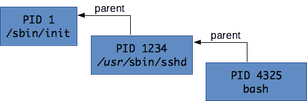</p>

### What is a process identifier?

Any process that is created in a Unix-like system is assigned an **identifier (or PID)**.
This ID can be used to reference the process, for example to terminate it with the `kill` command.
Each new process gets the next available PID.

PIDs are sometimes reused as processes die and are created again,
but **at any given time, a PID uniquely identifies a specific process**.

### Parent processes

The process with PID 0 is the **system process**,
the most low-level process managed directly by the kernel.

The first thing it does is run the **[init process][init]**, which naturally gets PID 1 (the next available PID).
The init process is responsible for initializing the system.
Most other processes are either launched by the init process directly, or by one of its children.

All processes retain a reference to the **parent process** that launched it.
The ID of the parent process is commonly called **PPID (parent process ID)**.

### The `ps` command

The `ps` (**p**rocess **s**tatus) command displays currently-running processes:

```bash
$> ps
  PID TTY          TIME CMD
14926 pts/0    00:00:00 bash
14939 pts/0    00:00:00 ps
```

You can obtain more information with the `-f` (full format) option:

```bash
$> ps -f
UID        PID  PPID  C STIME TTY          TIME CMD
root     15237 15158  1 17:48 pts/0    00:00:00 -bash
root     15251 15237  0 17:48 pts/0    00:00:00 ps -f
```

#### Listing all processes

Of course, there are more than 2 processes running on your computer.
Add the `-e` (every) option to see all running processes.
The list will be much longer.
This is an abbreviated example:

```bash
$> ps -ef
UID        PID  PPID  C STIME TTY          TIME CMD
root         1     0  0 09:38 ?        00:00:30 /sbin/init
root         2     0  0 09:38 ?        00:00:30 [kthread]
...
root       402     1  0 09:39 ?        00:00:00 /lib/systemd/systemd-journald
syslog     912     1  0 09:39 ?        00:00:00 /usr/sbin/rsyslogd -n
root      1006     1  0 09:39 ?        00:00:00 /usr/sbin/cron -f
...
root      1700     1  0 Sep11 ?        00:00:00 /usr/sbin/sshd -D
jdoe      3350  1700  0 17:52 ?        00:00:00 sshd: jdoe@pts/0
jdoe      3378  3350  0 15:32 pts/0    00:00:00 -bash
jdoe      3567  3378  0 15:51 pts/0    00:00:00 `ps -ef`
```

> Note that the command you just ran, `ps -ef`, is in the process list (at the bottom in this example).
> This is because it was running while it was listing the other processes.

#### Process tree

On some Linux distributions like Ubuntu,
the `ps` command also accepts a `--forest` option which visually shows the relationship between processes and their parent:

```bash
$> ps -ef --forest
UID        PID  PPID  C STIME TTY          TIME CMD
...
root      1700     1  0 Sep11 ?        00:00:00 /usr/sbin/sshd -D
jdoe      3350  1700  0 17:52 ?        00:00:00  \_ sshd: jdoe@pts/0
jdoe      3378  3350  0 15:32 pts/0    00:00:00      \_ -bash
jdoe      3567  3378  0 15:51 pts/0    00:00:00          \_ ps -ef
```

You can clearly see that:

* Process 1700, the SSH server (`d` is for [daemon][daemon]),
  was launched by the init process (PID 1) and is run by `root`.
* Process 3350 was launched by the SSH server when you connected.
  It represents your terminal device, named `pts/0` here.
* Process 3378 is the bash login shell that was launched when you connected
  and is attached to terminal `pts/0`.
* Process 3567 is the `ps` command you launched from the shell.

### Running more processes

Let's run some other processes and see if we can list them.

Open a new terminal on your local machine and connect to the same server.

If you go back to the first terminal and run the `ps` command again,
you should see both virtual terminal processes corresponding to your 2 terminals,
as well as the 2 bash shells running within them:

```bash
$> ps -ef --forest
...
root      1700     1  0 Sep11 ?        00:00:00 /usr/sbin/sshd -D
jdoe      3350  1700  0 18:21 ?        00:00:00  \_ sshd: jdoe@pts/0
jdoe      3378  3350  0 18:21 pts/0    00:00:00  |   \_ -bash
jdoe      3801  3378  0 18:22 pts/0    00:00:00  |       \_ ps -ef --forest
jdoe      3789  1700  0 18:21 ?        00:00:00  \_ sshd: jdoe@pts/1
jdoe      3791  3789  0 18:21 pts/1    00:00:00      \_ -bash
```

#### Sleeping process

Run a `sleep` command in the second terminal:

```bash
$> sleep 1000
```

It launches a process that does nothing for 1000 seconds, but keeps running.

It will block your terminal during that time,
so go back to the other terminal and run the following `ps` command,
with an additional `-u jdoe` option to filter only processes belonging to your user:

```bash
$> ps -f -u jdoe --forest
UID        PID  PPID  C STIME TTY          TIME CMD
...
jdoe      3350  1700  0 09:39 ?        00:00:00 sshd: jdoe@pts/0
jdoe      3378  3350  0 09:39 pts/0    00:00:00  \_ -bash
jdoe      3823  3378  0 16:41 pts/0    00:00:00      \_ ps -f -u jdoe --forest
jdoe      3789  1700  0 15:32 ?        00:00:00 sshd: jdoe@pts/1
jdoe      3791  3789  0 15:32 pts/1    00:00:00  \_ -bash
jdoe      3812  3791  0 16:31 pts/1    00:00:00      \_ `sleep 1000`
```

You can indeed see the running process started with the `sleep` command.
You can stop it with `Ctrl-C` (in the terminal when it's running) when you're done.

### Other monitoring commands

Here are other ways to inspect processes and have more information on their resource consumption:

* The [`top` command][top] (meaning **t**able **o**f **p**rocesses) show processes along with CPU and memory consumption.
  It's an interactive command you can exit with `q`.
* The [`htop` command][htop] does the same thing, but is prettier
  (although not all Linux distributions have it installed by default).
* The [`free` command][free] is not directly related to processes,
  but it helps you know how much memory is remaining on your system.

```bash
$> free -m
              total        used        free      shared  buff/cache   available
Mem:            985          90         534           0         359         751
Swap:             0           0           0
```


## Exit status

<!-- slide-front-matter class: center, middle -->

> How children indicate success to their parent.

<p class='center'>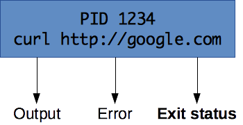</p>

### What is an exit status?

The **exit status** of a process is a small number (typically from 0 to 255) passed
from a child process to its parent process when it has finished executing.

It is meant to allow the child process to indicate how or why it exited.

It's common practice for the exit status of Unix/Linux programs to be **0 to indicate success**,
and **greater than 0 to indicate an error**
(it is sometimes also called an *error level*).

### Retrieving the exit status in a shell

In a typical shell like [Bash][bash],
you can retrieve the exit status of last executed command from the special variable `$?`:

```bash
$> ls /
...

$> echo $?
0

$> ls file-that-does-not-exist
ls: cannot access 'file-that-does-not-exist': No such file or directory

$> echo $?
2
```

### Retrieving the exit status in code

This is not a feature that is limited to command line use.
When running a program from an application, you can also obtain the exit status.

For example:

* By using the `&$return_var` reference when calling PHP's [`exec` function][php-exec].
* By calling the [`Process#exitValue()` method][java-process-exit-value] after calling `Runtime#exec(String command)` in Java.
* By listening to the `close` event when calling Node.js's [`spawn` function][node-spawn].

### Meaning of exit statuses

The meaning of exit statuses is unique to the program you are running.
For example, the manual of the `ls` command documents the following values:

```bash
Exit status:
  0      if OK,
  1      if minor problems (e.g., cannot access subdirectory),
  2      if serious trouble (e.g., cannot access command-line argument).
```

But this will be different for other programs or applications.

The only thing you can rely on for the majority of programs
is that **0 is good, anything else is probably bad**.


## Standard streams

<!-- slide-front-matter class: center, middle -->

> **Standard streams** are preconnected input and output
> communication channels between a process and its environment.

<p class='center'>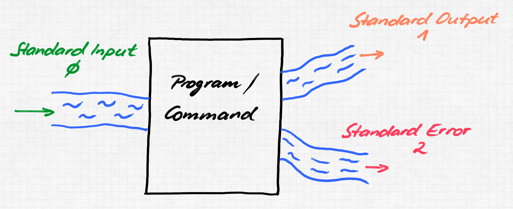</p>

### The good old days

In **pre-Unix** systems, programs had to **explicitly connect to input and output devices**.
This was done differently for each device (e.g. magnetic tape drive, disk drive, printer, etc) and operating system.
For example, IBM mainframes used a [job control language (JCL)][jcl] to establish connections between programs and devices.

<!-- slide-column 25 -->

**Unix file copy**

`cp a.txt b.txt`

<!-- slide-column -->

**JCL copy instructions for [OS/360][os360]**

```
//IS198CPY JOB (IS198T30500),'COPY JOB',CLASS=L,MSGCLASS=X
//COPY01   EXEC PGM=IEBGENER
//SYSPRINT DD SYSOUT=*
//SYSUT1   DD DSN=a.txt,DISP=SHR
//SYSUT2   DD DSN=b.txt,
//            DISP=(NEW,CATLG,DELETE),
//            SPACE=(CYL,(40,5),RLSE),
//            DCB=(LRECL=115,BLKSIZE=1150)
//SYSIN  DD DUMMY
```

### Unix streams

Unix introduced **abstract devices** and the concept of a **data stream**:
an ordered sequence of data bytes which can be read until the end of file (EOF).

A program may also write bytes as desired and need not declare how many there will be or how to group them.
The data going through a stream may be **text** with any encoding **or binary data**.

This was groundbreaking at the time because a program no longer had to know or care what kind of device it is communicating with,
as had been the case until then.

#### stdin, stdout & stderr

Any new Unix process is **automatically connected** to the following streams out of the box:

Stream          | Shorthand | Description
:---            | :---      | :---
Standard input  | `stdin`   | Stream **data** (often text) **going into a program**.
Standard output | `stdout`  | Stream where a program writes its **output data**.
Standard error  | `stderr`  | Another output stream programs can use to output **error messages or diagnostics**. It is independent from standard output, allowing output and errors to be distinguished.

> There are 2 output streams in order to solve the [semipredicate problem][semipredicate]:
> it's difficult to distinguish between actual output data and error messages
> if both are in the form of text and displayed in the same place.

#### Streams, the keyboard, and the terminal

<!-- slide-column 45 -->

Another Unix breakthrough was to **automatically associate**:

* The **input stream** with your **terminal keyboard**;
* The **output and error streams** with your **terminal display**.

This is done by default unless a program chooses to do otherwise.

For example, when your favorite shell, e.g. [Bash][bash], is running,
it automatically receives keyboard input, and its output data and errors are automatically displayed in the terminal.

<!-- slide-column -->


#### Stream inheritance

A child will **automatically inherit the standard streams of its parent process**
(unless redirected, more on that later).

For example, when you run an `ls` command,
you do not have to specify that the resulting list of directories should be displayed in the terminal.
The standard output of the parent process, in this case your shell (e.g. Bash) is inherited by the `ls` process.

Similarly, when you run an SSH client with the `ssh` command to communicate with another machine,
you do not have to explicitly connect your keyboard input to this new process.
As it's a child process of the shell, it inherits the same standard input.

#### Optional input stream

A process is not obligated to use its input or output streams.
For example, **the `ls` command** produces output (or an error) but **takes no input**
(it has arguments, but that does not come from the input data stream).

<p class='center'>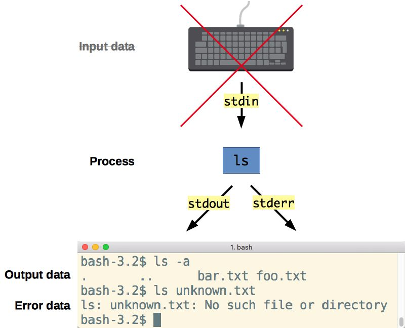</p>

#### Optional output stream

**The `cd` command** takes no input and **produces no output** either,
although it can produce an error.

<p class='center'>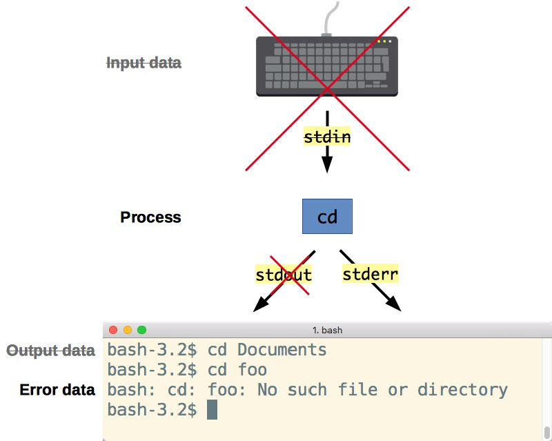</p>

### Stream redirection

The standard streams can be **redirected**.

Redirection means capturing output from a file or command,
and sending it as input to another file or command.

Any Unix process has a number of [file descriptors][fd].
They are an abstract indicator used to access a file or other input/output resource such as a pipe or socket.

The first 3 file descriptors correspond to the standard streams by default:

File descriptor | Stream
:---            | :---
`0`             | Standard input (`stdin`)
`1`             | Standard output (`stdout`)
`2`             | Standard error (`stderr`)

### Redirect standard output stream

The `>` shell operator **redirects an output stream**.

For example, the following line runs the `ls` command,
but instead of displaying the result in the terminal,
the **standard output stream (file descriptor `1`) is redirected** to the file `data.txt`.

```bash
$> ls -a `1> data.txt`
```

#### How to use standard output redirection

You can do the same with any command that produces output:

```bash
$> echo Hello `1> data.txt`
```

Note that the `>` operator **overwrites the file**.
Use `>>` instead to **append to the end of the file**:

```bash
$> echo World `1>> data.txt`
```

If you specify no file descriptor, **standard output is redirected by default**:

```bash
$> echo Hello `> data.txt`
$> echo Again `>> data.txt`
```

### Redirect standard error stream

Note that error messages are not redirected using the redirect operator like in the previous example.
They are still displayed in the terminal and the file remains empty:

```bash
$> ls unknown-file `> error.txt`
ls: unknown-file: No such file or directory

$> cat error.txt
```

This is because **most commands send errors to the standard error stream (file descriptor `2`)** instead of the standard output stream.

If you want to redirect the error message to a file, you must **redirect the standard error stream instead**:

```bash
$> ls unknown-file `2> error.txt`

$> cat error.txt
ls: unknown-file: No such file or directory
```

### Both standard output and error streams

Some commands will **send data to both output streams** (standard output and standard error).
As we've seen, both are displayed in the terminal by default.

For example, the `curl` (**C**lient **URL**) command is used to make HTTP requests.
By default, it only outputs the HTTP response body to the standard output stream,
but with the `-v` option it also prints diagnostics information to the standard error stream:

```bash
$> `curl -L -v https://git.io/fAp8D`
  % Total    % Received % Xferd  Average Speed   Time    Time     Time  Current
                                 Dload  Upload   Total   Spent    Left  Speed
  0     0    0     0    0     0      0      0 --:--:-- --:--:-- --:--:--     0
 TCP_NODELAY set
 Connected to git.io (54.152.127.232) port 443 (#0)
...
Hello World
...
```

Here, `Hello World` is the output data, while the rest of the output is the diagnostics information on the standard error stream.

#### Redirect standard output stream (curl)

This example demonstrates how the **standard output and error streams** can be **redirected separately**.

The following version redirects standard output to the file `curl-output.txt`.
As you can see, the `Hello World` output data is no longer displayed since it has been redirected to the file,
but the diagnostics information printed on the standard error stream is still displayed:

```bash
$> curl -L -v https://git.io/fAp8D `> curl-output.txt`
  % Total    % Received % Xferd  Average Speed   Time    Time     Time  Current
                                 Dload  Upload   Total   Spent    Left  Speed
  0     0    0     0    0     0      0      0 --:--:-- --:--:-- --:--:--     0
 TCP_NODELAY set
 Connected to git.io (54.152.127.232) port 443 (#0)
...

$> ls
curl-output.txt

$> cat curl-output.txt
Hello World
```

#### Redirect standard error stream (curl)

The following version redirects standard error to the file `curl-error.txt`.
This time, the `Hello World` output data is displayed in the terminal as with the initial command,
but the diagnostics information has been redirected to the file:

```bash
$> curl -L -v https://git.io/fAp8D `2> curl-error.txt`
Hello World

$> ls
curl-error.txt curl-output.txt

$> cat curl-error.txt
  % Total    % Received % Xferd  Average Speed   Time    Time     Time  Current
                                 Dload  Upload   Total   Spent    Left  Speed
  0     0    0     0    0     0      0      0 --:--:-- --:--:-- --:--:--     0
 TCP_NODELAY set
 Connected to git.io (54.152.127.232) port 443 (#0)
...
```

#### Redirect both standard output and error streams (curl)

You can **perform both redirections at once** in one command:

```bash
$> curl -L -v https://git.io/fAp8D `> curl-output.txt 2> curl-error.txt`

$> ls
curl-error.txt curl-output.txt

$> cat curl-error.txt
  % Total    % Received % Xferd  Average Speed   Time    Time     Time  Current
                                 Dload  Upload   Total   Spent    Left  Speed
  0     0    0     0    0     0      0      0 --:--:-- --:--:-- --:--:--     0
 TCP_NODELAY set
 Connected to git.io (54.152.127.232) port 443 (#0)
...

$> cat curl-output.txt
Hello World
```

#### Combine standard output and error streams (curl)

In some situations, you might want to **redirect all of a command's output**
(both the standard output stream and error stream) to the same file.

You can do that with the `&>` operator:

```bash
$> curl -L -v https://git.io/fAp8D `&> curl-result.txt`

$> cat curl-result.txt
  % Total    % Received % Xferd  Average Speed   Time    Time     Time  Current
                                 Dload  Upload   Total   Spent    Left  Speed
  0     0    0     0    0     0      0      0 --:--:-- --:--:-- --:--:--     0
 TCP_NODELAY set
 Connected to git.io (54.152.127.232) port 443 (#0)
...
Hello World
...
```

> `&> file.txt` is equivalent to using both `1> file.txt` and `2> file.txt`.

### Discard an output stream

Sometimes you might not be interested in one of the output streams.

For example, let's say you want to display the diagnostics information from a `curl` command to identify a network issue,
but you **don't care about the standard output**.
You don't want to have to delete a useless file either.

#### The `/dev/null` device

The file `/dev/null` is available on all Unix-like systems and is a [**null device**][null-device] (sometimes also called a *black hole*).
It's a [Unix device file][device-file] that you can write anything to, but that will discard all received data.

It never contains anything:

```bash
$> cat /dev/null
```

Even after you write to it:

```bash
$> echo Hello World > /dev/null

$> cat /dev/null
```

#### Redirect a stream to the null device

When you don't care about an output stream, you can simply **redirect it to the null device**.
In this example, the standard output stream is redirected to the null device, and therefore discarded,
while the standard error stream is displayed normally:

```bash
$> curl -L -v https://git.io/fAp8D `> /dev/null`
  % Total    % Received % Xferd  Average Speed   Time    Time     Time  Current
                                 Dload  Upload   Total   Spent    Left  Speed
  0     0    0     0    0     0      0      0 --:--:-- --:--:-- --:--:--     0
 TCP_NODELAY set
 Connected to git.io (54.152.127.232) port 443 (#0)
...
```

> Please send complaints to `/dev/null`.

#### Other redirections to the null device

You can also redirect the standard error stream to the null device:

```bash
$> curl -L -v https://git.io/fAp8D `2> /dev/null`
Hello World
```

Or you can redirect both output streams.
In this case, all output, diagnostics information and error messages will be discarded:

```bash
$> curl -L -v https://git.io/fAp8D `&> /dev/null`
```

### Redirect one output stream to another

You can also redirect one output stream into another output stream.

<!-- slide-column -->

For example, the `echo` command prints its data to the standard output stream by default:

<!-- slide-column -->

```bash
$> echo Hello World
Hello World

$> echo Hello World > /dev/null

$> echo Hello World 2> /dev/null
Hello World
```

<!-- slide-container -->

The `i>&j` operator redirects file descriptor `i` to file descriptor `j`.

<!-- slide-column -->

This `echo` command has its data redirected to the standard error stream:

<!-- slide-column 60 -->

```bash
$> echo Hello World `1>&2`
Hello World

$> echo Hello World `> /dev/null 1>&2`
Hello World

$> echo Hello World `2> /dev/null 1>&2`
```

<!-- slide-container -->

> This can be useful if you're writing a shell script
and want to print error messages to the standard error stream.

### Redirect standard input stream

Just as a command's output can be redirected to a file, its **input can be redirected from a file**.

Let's create a file for this example:

```bash
$> echo foo > bar.txt
```

<!-- slide-column -->

The `cat` command can read a file by having it specified as an argument:

<!-- slide-column -->

```bash
$> cat bar.txt
foo
```

<!-- slide-container -->

<!-- slide-column -->

If given no argument, it will **read and display the data from its standard input stream** (as you type on your keyboard and press `Enter`):

<!-- slide-column -->

```bash
$> cat
Hello
Hello
World
World
```

<!-- slide-container -->

<!-- slide-column -->

The `<` operator will **redirect a file into a command's standard input stream**:

<!-- slide-column -->

```bash
$> cat `< bar.txt`
foo
```

#### Here documents

The `<<` operator also performs **standard input stream redirection** but is a bit different.
It's called a [**here document**][here-document]
and can be used to to send multiline input to a command,
preserving line breaks and other whitespace.

Typing the following command `cat` command starts a here document delimited by the string `EOF`:

```bash
$> cat `<< EOF`
Hello
World
EOF
```

> After you type the first line, you won't get a prompt back.
> The here document remains open and you can type more text.
> Typing `EOF` again and pressing `Enter` closes the document.

The same text you typed will be printed by `cat`, with line breaks preserved:

```
Hello
World
```


## Pipelines

<!-- slide-front-matter class: center, middle -->

> The [**Unix philosophy**][unix-philosophy]: the power of a system comes more from the relationships among programs than from the programs themselves.

<p class='center'></p>

### What is a pipeline?

Remember that all Unix systems standardize the following:

* All processes have a standard input stream.
* All processes have a standard output stream.
* Data streams transport text or binary data.

Therefore, the **standard output stream** of process A can be **connected to the standard input stream** of another process B.

<p class='center'>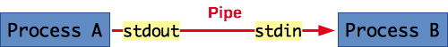</p>

Processes can be **chained into a pipeline, each process transforming data and passing it to the next process**.

### A simple pipeline

The `|` operator (a vertical pipe) is used to connect two processes together.

Let's use two commands, one that prints text as output and one that reads text as input:

<!-- slide-column -->

* The `ls` (**l**i**s**t) command produces a list of files and directories.
* The `wc` (**w**ord **c**ount) command can count words, lines, characters or bytes.
  With the `-l` option, it counts the number of lines in its input.

You can pipe them together like this:

```bash
$> ls -a | wc -l
```

This **redirects (pipes) the output of the `ls` command into the input of the `wc` command**.

<!-- slide-column -->


### The Unix philosophy

Pipelines are one of the core features of Unix-like systems.

Because **Unix programs** can be easily chained together,
they **tend to be simpler and smaller**.
Complex tasks can be achieved by chaining many small programs together.

This is, in a few words, the [Unix philosophy][unix-philosophy]:

* Write programs that **do one thing and do it well**.
* Write programs to **work together**.
* Write programs to **handle text streams**, because that is a universal interface.

> Although many programs handle text streams, others also handle binary streams.
> For example, the [ImageMagick][imagemagick] library can process images.

### A more complex pipeline

This command pipeline combines 5 different commands,
processing the text data at each step and passing it along to the next command to arrive at the final result.
**Each of these commands only knows how to do one thing**:

<!-- slide-column 40 -->

```bash
$> `find . -type f | \`
   `sed 's/.*\///' | \`
   `egrep ".+\.[^\.]+$" | \`
   `sed 's/.*\.//' | \`
   `sort | \`
   `uniq -c`

 147 jpg
10925 js
2158 json
  15 less
  45 map
1515 md
```

<!-- slide-column -->

* `find` is used to recursively list all files in the current directory.
* `sed` (**s**tream **ed**itor) is used to obtain the files' basenames.
* `egrep` is used to filter out names that do not have an extension.
* `sed` is used again to transform basenames into just their extension.
* `sort` is used to sort the resulting list alphabetically.
* `uniq` is used to group identical adjacent lines and count them.

The final result is a list of file extensions and the number of files with that extension.

### Trying it out

Here's a link to a file containing some text: https://git.io/fAjRa

Download it to your computer with the following command:

```bash
$> curl -L https://git.io/fAjRa > rainbow.txt
```

#### Pipelines and redirections

Start by simply displaying the file:

```bash
$> cat rainbow.txt
Somewhere over the rainbow
...
```

**Use command pipelines and stream redirections to**:

* Count the number of lines and characters in the text.
* Print the lines of the text containing the word `rainbow`.
  * Do the same but without any duplicates
* Print the second word of each line in the text.
* Compress the text and save it to `rainbow.txt.gz`.
* Count the number of times the letter `e` or the word `the` is used.
* Display a list of the unique words in the text along with the number of times each word is used,
  sorted from the least used to the most used.

> For example, `cat rainbow.txt | wc -w` counts the number of words in the text.

#### Your tools

Here are commands you might find useful for the exercise.
They all operate on the data received from their standard input stream,
and print the result on their standard output stream,
so they can be piped into each other:

.commands-table[

Command                             | Description
:---                                | :---
`cut -d ' ' -f <n>`                 | Select word in column `<n>` of each line (using one space as the delimiter).
`fold -w 1`                         | Print one character by line.
`grep <letterOrWord>`               | Select only lines that contain a given letter or word, e.g. `grep foo`.
`gzip -c`                           | Compress data.
`sort`                              | Sort lines alphabetically.
`tr '[:upper:]' '[:lower:]'`        | Convert all uppercase characters to lowercase.
`tr -s '[[:punct:][:space:]]' '\n'` | Split by word.
`uniq [-c]`                         | Filter out repeated lines (`-c` also counts them).
`wc [-l] [-w] [-m]`                 | Count lines, words or characters.

]


## Signals

<!-- slide-front-matter class: center, middle -->

> Sending notifications to processes, and then killing them.

<p class='center'></p>

### What is a signal?

A signal is an **asynchronous notification sent to a process** to notify it that an event has occurred.

<p class='center'>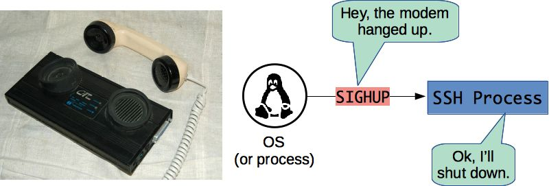</p>

If the process has registered a **signal handler** for that specific signal, it is executed.
Otherwise the **default signal handler** is executed.

### Common Unix signals

A signal is defined by the `SIG` prefix followed by a mnemonic name for the signal.
Some signals also have a standard number assigned to them.
Here are the most commonly encountered Unix signals:

Signal     | Number | Default handler       | Description
:---       | ---:   | :---                  | :---
`SIGHUP`   | 1      | Terminate             | Hangup.
`SIGINT`   | 2      | Terminate             | Terminal interrupt signal.
`SIGKILL`  | 9      | Terminate             | Kill (cannot be caught or ignored).
`SIGQUIT`  | 3      | Terminate (core dump) | Terminal quit signal.
`SIGTERM`  | 15     | Terminate             | Termination signal.
`SIGUSR1`  | -      | Terminate             | User-defined signal 1.
`SIGUSR2`  | -      | Terminate             | User-defined signal 2.
`SIGWINCH` | -      | Ignore                | Terminal window size changed.

Here's a more complete list: [POSIX signals][signals-list].

#### The terminal interrupt signal (`SIGINT`)

When you type `Ctrl-C` in your terminal to terminate a running process, you are actually using Unix signals.

The shortcut is interpreted by your shell,
which then sends a **terminal interrupt signal**, or **`SIGINT`**, to the running process.

Most processes handle that signal by terminating (altough some don't respond to it, like some interactive helps, e.g. `man ls`).

### The `kill` command

The `kill` command **sends a signal to a process**.

Since the default signal handler for most signals is to terminate the process,
it often has that effect, hence the name "kill".

Its syntax is:

```
kill [-<SIGNAL>] <PID>
kill [-s <SIGNAL>] <PID>
```

.commands-table[

Command             | Effect
:---                | :---
`kill 10000`        | Send the **default `SIGTERM` signal** to process with PID `10000`.
`kill -s HUP 10000` | Send the `SIGHUP` signal to that same process.
`kill -HUP 10000`   | Equivalent to the previous command.
`kill -1 10000`     | Equivalent to the previous command (1 is the official POSIX number for `SIGHUP`).

]

#### Trapping signals

This command will run a
[badly behaved script](https://gist.github.com/AlphaHydrae/162f28e3e2bd9355a95914e04cd4dd0c/91dda64d9e0ca26168d25195a189ca6a69a14ee6)
which traps and ignores all signals sent to it:

```bash
$> curl -s -L https://git.io/JitFQ|sh -s
Hi, I'm running with PID 10000
Try and kill me!
```

Since it ignores the `SIGINT` signal among others,
you will not be able to stop it with `Ctrl-C`.

Open another terminal and try to kill the process by referring to its PID
(which is `10000` in this example but will be different on your machine):

```bash
$> kill 10000
$> kill -s HUP 10000
$> kill -s QUIT 10000
$> kill -s USR1 10000
```

The script will simply log that it is ignoring your signal and continue executing.

#### The `KILL` signal

There is one signal that cannot be ignored: **the `KILL` signal**.

Although a process can detect the signal and attempt to perform additional operations,
**the OS will permanently kill the process** shortly after it is received,
and the process can do nothing to prevent it.

Send a `KILL` signal to the process with the same PID as before:

```bash
$> kill -s KILL 10000
```

The script will finally have the decency to die.

### Unix signals in the real world

Many widely-used programs react to Unix signals, for example:

* [Nginx][nginx-signals]
* [PostgreSQL][postgres-signals]
* [OpenSSH][sshd-signals]

<!-- slide-column -->

A common example is the `SIGHUP` signal.
Originally it was meant to indicate that the modem hanged up.

That's not relevant to programs not directly connected to a terminal, but some programs repurposed it for another use.

Many background services like Nginx and PostgreSQL will reload their configuration (without shutting down) when receiving that signal.
Many other tools follow this convention.

<!-- slide-column 30 -->


## References

* [I/O Redirection (The Linux Documentation Project)](https://www.tldp.org/LDP/abs/html/io-redirection.html)
* [Here Documents (The Linux Documentation Project)][here-document]
* [Unix/Linux - Shell Input/Output Redirections](https://www.tutorialspoint.com/unix/unix-io-redirections.htm)
* [Signals - Unix fundamentals 201 - Ops School Curriculum](http://www.opsschool.org/unix_signals.html)


[bash]: https://en.wikipedia.org/wiki/Bash_(Unix_shell)
[daemon]: https://en.wikipedia.org/wiki/Daemon_(computing)
[device-file]: https://en.wikipedia.org/wiki/Device_file
[exit-status]: https://en.wikipedia.org/wiki/Exit_status
[fd]: https://en.wikipedia.org/wiki/File_descriptor
[free]: https://www.howtoforge.com/linux-free-command/
[here-document]: http://tldp.org/LDP/abs/html/here-docs.html
[htop]: https://hisham.hm/htop/
[imagemagick]: https://en.wikipedia.org/wiki/ImageMagick
[init]: https://en.wikipedia.org/wiki/Init
[ipc]: https://en.wikipedia.org/wiki/Inter-process_communication
[java-process-exit-value]: https://docs.oracle.com/javase/7/docs/api/java/lang/Process.html#exitValue()
[jcl]: https://en.wikipedia.org/wiki/Job_Control_Language
[nginx-signals]: http://nginx.org/en/docs/control.html
[node-spawn]: https://nodejs.org/api/child_process.html#child_process_child_process_spawn_command_args_options
[null-device]: https://en.wikipedia.org/wiki/Null_device
[os360]: https://en.wikipedia.org/wiki/OS/360_and_successors
[php-exec]: http://php.net/manual/en/function.exec.php
[pid]: https://en.wikipedia.org/wiki/Process_identifier
[pipes]: https://en.wikipedia.org/wiki/Pipeline_(Unix)
[posix]: https://en.wikipedia.org/wiki/POSIX
[postgres-signals]: https://www.postgresql.org/docs/current/static/app-postgres.html#id-1.9.5.13.9
[process]: https://en.wikipedia.org/wiki/Process_(computing)
[ps-fields]: https://kb.iu.edu/d/afnv
[semipredicate]: https://en.wikipedia.org/wiki/Semipredicate_problem#Multivalued_return
[signals]: https://en.wikipedia.org/wiki/Signal_(IPC)
[signals-list]: https://en.wikipedia.org/wiki/Signal_(IPC)#POSIX_signals
[sshd-signals]: https://linux.die.net/man/8/sshd
[streams]: https://en.wikipedia.org/wiki/Standard_streams
[top]: https://linux.die.net/man/1/top
[unix-philosophy]: https://en.wikipedia.org/wiki/Unix_philosophy
# Advanced Packaging Tool

Learn what the Advanced Packaging Tool (APT) is and the basics of its `apt` command.

<!-- slide-include ../../BANNER.md -->

**You will need**

* A Unix CLI
* An Ubuntu operating system

**Recommended reading**

* [Unix Administration](../unix-admin/)

<!-- START doctoc generated TOC please keep comment here to allow auto update -->
<!-- DON'T EDIT THIS SECTION, INSTEAD RE-RUN doctoc TO UPDATE -->

- [What is APT?](#what-is-apt)
  - [Why use a package manager?](#why-use-a-package-manager)
  - [There are many package managers](#there-are-many-package-managers)
  - [Package lists](#package-lists)
- [The `apt` command line](#the-apt-command-line)
  - [The `apt list` command](#the-apt-list-command)
  - [The `apt search` command](#the-apt-search-command)
  - [The `apt show` command](#the-apt-show-command)
  - [The `apt install` command](#the-apt-install-command)
    - [Installing with superuser privileges](#installing-with-superuser-privileges)
    - [Using new packages](#using-new-packages)
    - [Installing more complex (and useful) packages](#installing-more-complex-and-useful-packages)
    - [Confirming installation](#confirming-installation)
  - [The `apt update` command](#the-apt-update-command)
    - [Checking for package updates](#checking-for-package-updates)
  - [The `apt upgrade` and `apt full-upgrade` commands](#the-apt-upgrade-and-apt-full-upgrade-commands)
    - [Upgrading packages](#upgrading-packages)
    - [Rebooting after an upgrade](#rebooting-after-an-upgrade)
  - [The `apt remove` command](#the-apt-remove-command)
  - [The `apt autoremove` command](#the-apt-autoremove-command)
  - [The `apt-get` and `apt-cache` commands](#the-apt-get-and-apt-cache-commands)
- [Reference](#reference)

<!-- END doctoc generated TOC please keep comment here to allow auto update -->


## What is APT?

<!-- slide-front-matter class: center, middle -->

> **Advanced Package Tool (APT)** handles the installation and removal of software on [Debian][debian], [Ubuntu][ubuntu] and other [Linux][linux] distributions.
> It automates the retrieval and configuration of software packages, either from precompiled files or by compiling source code.


### Why use a package manager?

* Use tools that **other developers** have written to solve particular problems.
* Regularly check if there are any **upgrades** and download them.
* **Share** your own tools with the community to **reuse** functionality.

<p class='center'></p>


### There are many package managers

For **operating systems**:

Package manager                          | OS
:---                                     | :---
[Advanced Package Tool (APT)][apt]       | Debian, Ubuntu
[Homebrew (brew)][homebrew]              | Mac OS X
[Yellowdog Updater, Modified (yum)][yum] | RHEL, Fedora, CentOS

For **programming languages**:

Package manager      | Language
:---                 | :---
[Composer][composer] | PHP
[Maven][maven]       | Java
[npm][npm]           | Node.js
[RubyGems][rubygems] | Ruby
[pip][pip]           | Python


### Package lists

To see available packages for each distribution, you can go there:

* [Debian packages][debian-packages]
* [Ubuntu packages][ubuntu-packages]


## The `apt` command line

<!-- slide-front-matter class: center, middle -->


### The `apt list` command

Running `apt list` will display all available packages, which will be quite a long list:

```bash
$> `apt list | wc -l`
61613
```

You can display already installed packages by adding the `--installed` option:

```bash
$> `apt list --installed | wc -l`
510

$> `apt list --installed`
Listing...
accountsservice/bionic,now 0.6.45-1ubuntu1 amd64 [installed]
acl/bionic,now 2.2.52-3build1 amd64 [installed]
acpid/bionic,now 1:2.0.28-1ubuntu1 amd64 [installed]
...
```


### The `apt search` command

Search for new packages to install using the `apt search <name>` command.

For example, you could run this command if you need to install the `nc` (netcat) command:

```bash
$> `apt search netcat`
Sorting... Done
Full Text Search... Done
...

netcat/bionic 1.10-41.1 all
  TCP/IP swiss army knife -- transitional package

...
```

Or you could search for the MySQL database:

```bash
$> `apt search mysql`
...
```

Of course, it will also find all packages related to MySQL (which will be a lot).


### The `apt show` command

Get detailed information about a package before installing it with the `apt show <name>` command:

```bash
$> `apt show mysql-server`
Package: mysql-server
Version: 5.7.24-0ubuntu0.18.04.1
Priority: optional
Section: database
Installed-Size: 110 kB
Download-Size: 9,948 B
Homepage: http://dev.mysql.com/
...
Description: MySQL database server (metapackage depending on the latest version)
 ...
 MySQL is a fast, stable and true multi-user, multi-threaded SQL database
 server. SQL (Structured Query Language) is the most popular database query
 language in the world. The main goals of MySQL are speed, robustness and
 ease of use.
```


### The `apt install` command

The `apt install <name>...` command will download, configure and install a new package (or multiple packages).

Of course, not any user can do this:

```bash
$> `apt install cowsay`
E: Could not open lock file ... (13: Permission denied)
E: Unable to acquire the dpkg frontend lock (...), are you root?
```

#### Installing with superuser privileges

The `apt install` command requires **superuser privileges** to install anything.

Try it again with `sudo`:

```bash
$> `sudo apt install cowsay`
Reading package lists... Done
Building dependency tree
Reading state information... Done
Suggested packages:
  filters cowsay-off
The following NEW packages will be installed:
  cowsay
0 upgraded, 1 newly installed, 0 to remove and 4 not upgraded.
Need to get 17.7 kB of archives.
After this operation, 89.1 kB of additional disk space will be used.
Get:1 ... cowsay all 3.03+dfsg2-4 [17.7 kB]
Fetched 17.7 kB in 0s (271 kB/s)
Selecting previously unselected package cowsay.
(Reading database ... 84877 files and directories currently installed.)
Preparing to unpack .../cowsay_3.03+dfsg2-4_all.deb ...
Unpacking cowsay (3.03+dfsg2-4) ...
Setting up cowsay (3.03+dfsg2-4) ...
Processing triggers for man-db (2.8.3-2ubuntu0.1) ...
```

#### Using new packages

The package you just installed provides the very useful [`cowsay`][cowsay] command.

Try it out:

```bash
$> `cowsay hello world`
 _____________
< hello world >
 -------------
        \   ^__^
         \  (oo)\_______
            (__)\       )\/\
                ||----w |
                ||     ||
```

#### Installing more complex (and useful) packages

The previous example was a very simple script which was easy to install.

You will often install bigger packages, like for example a [Java Development Kit (JDK)][jdk] to run Java applications.
This kind of package has **dependencies**, meaning that it needs other packages in order to function.

For example, the [`default-jdk`][default-jdk] package, which installs a JDK, requires:

* The [`default-jre`][default-jre] package which provides a [Java Runtime Environment (JRE)][jre].
* The [`fontconfig`][fontconfig] package which is a font configuration library.
* The [`libcups2`][libcups2] package which provides Unix printing utilities.
* And many others...

#### Confirming installation

When installing such a package, APT will list the dependencies that will be installed **in addition to the package your requested**,
and ask for your confirmation:

```bash
$> `sudo apt install default-jdk`
Reading package lists... Done
Building dependency tree
Reading state information... Done
*The following additional packages will be installed:
* adwaita-icon-theme at-spi2-core ca-certificates-java ...
Suggested packages:
  default-java-plugin libasound2-plugins alsa-utils colord ...
0 upgraded, 145 newly installed, 0 to remove and 4 not upgraded.
Need to get 164 MB of archives.
After this operation, 574 MB of additional disk space will be used.
*Do you want to continue? [Y/n] n
Abort.
```


### The `apt update` command

You might have noticed that the `list` and `show` commands are quite fast.
That's because they **don't fetch any data from the network**:
the package lists and package information is stored locally on the computer.

Of course, **this local information becomes out of date** as new package versions are released to the official package repositories.
You can update your local information with `apt update` (which requires superuser privileges):

```bash
$> `sudo apt update`
Get:1 http://security.ubuntu.com/ubuntu bionic-security InRelease [83.2 kB]
Hit:2 http://eu-west-2.ec2.archive.ubuntu.com/ubuntu bionic InRelease
Get:3 http://eu-west-2.ec2.archive.ubuntu.com/ubuntu ... [88.7 kB]
Get:4 http://eu-west-2.ec2.archive.ubuntu.com/ubuntu ... [74.6 kB]
...
Fetched 2,400 kB in 1s (3,706 kB/s)
Reading package lists... Done
Building dependency tree
Reading state information... Done
4 packages can be upgraded. Run 'apt list --upgradable' to see them.
```

You now have up-to-date information about all available packages.

#### Checking for package updates

As you may have seen, `apt update` will helpfully tell you if there are any new versions available for the packages you already installed:

```bash
4 packages can be upgraded. Run 'apt list --upgradable' to see them.
```

As indicated, you can run the `apt list --upgradable` command to list those available upgrades and decide whether you want to install them or not:

```bash
$> `apt list --upgradable`
Listing... Done
python3-software-properties/bionic-updates 0.96.24.32.6 all
  [upgradable from: 0.96.24.32.5]
python3-update-manager/bionic-updates 1:18.04.11.8 all
  [upgradable from: 1:18.04.11.7]
software-properties-common/bionic-updates 0.96.24.32.6 all
  [upgradable from: 0.96.24.32.5]
update-manager-core/bionic-updates 1:18.04.11.8 all
  [upgradable from: 1:18.04.11.7]
```


### The `apt upgrade` and `apt full-upgrade` commands

When you have packages to upgrade, you could of course manually `apt install` each of them,
but there are also two helpful commands that can do it for you:

* `apt upgrade`

  This command will upgrade all packages that have new versions,
  installing any new dependencies that may be required.

  However, it will behave conservatively and **never remove packages that are currently installed**.
  This is to avoid problems in case new versions of your installed packages have widely different dependencies.
* `apt full-upgrade`

  This command will do the same as `apt upgrade`, but in addition,
  it will automatically remove any packages that were dependencies of previous versions of your packages
  but are no longer needed by the new versions.

The second is "more dangerous" as you have to make sure that none of the removed packages will impact your computer.
Use it with caution.

#### Upgrading packages

The `apt upgrade` and `apt full-upgrade` commands will always ask for confirmation before
upgrading, installing or removing any package:

```bash
$> `sudo apt upgrade`
Reading package lists... Done
Building dependency tree
Reading state information... Done
Calculating upgrade... Done
*The following packages will be upgraded:
* python3-software-properties python3-update-manager
* software-properties-common update-manager-core
4 upgraded, 0 newly installed, 0 to remove and 0 not upgraded.
Need to get 75.6 kB of archives.
After this operation, 0 B of additional disk space will be used.
*Do you want to continue? [Y/n] n
Abort.
```

> **A word of caution:**
> do not install or upgrade packages without at least a basic understanding of what they do
> and how they might be used by your operating system and applications.
> Otherwise you risk breaking your system.

#### Rebooting after an upgrade

Some packages can be upgraded in place.
Other packages may **require the computer to be restarted** for the upgrade to take effect.

When that is the case, there will be a warning on the shell every time you connect:

```bash
$> ssh user@example.com
Welcome to Ubuntu
...
**** System restart required ***
```

This means that the upgrade process will only be complete once you restart the computer with `sudo reboot`.


### The `apt remove` command

You can remove a package with the `apt remove <name>` command.
It will always ask for confirmation:

```bash
$> `sudo apt remove cowsay`
Reading package lists... Done
Building dependency tree
Reading state information... Done
*The following packages will be REMOVED:
*  cowsay
0 upgraded, 0 newly installed, 1 to remove and 4 not upgraded.
After this operation, 89.1 kB disk space will be freed.
*Do you want to continue? [Y/n] n
Abort.
```

This command will uninstall binaries but not configuration files.
Use `apt purge <name>` to also remove the configuration files.


### The `apt autoremove` command

The `apt autoremove` command cleans up packages that were previously required but are no longer useful.

Most of the time, there will probably be nothing to remove:

```bash
$> `sudo apt autoremove`
Reading package lists... Done
Building dependency tree
Reading state information... Done
0 upgraded, 0 newly installed, 0 to remove and 4 not upgraded.
```

> It's good practice to run it after an upgrade and reboot,
> to make sure there are no unused packages taking up space on the computer.


### The `apt-get` and `apt-cache` commands

The `apt` command is actually a higher-level frontend to the older and lower-level `apt-get` and `apt-cache` command.
`apt` is simpler to user, but you will find many examples of these older commands on the internet.

They are mostly equivalent:

`apt` command      | older equivalent
:---               | :---
`apt list`         | `dpkg -l`
`apt search`       | `apt-cache search`
`apt install`      | `apt-get install`
`apt update`       | `apt-get update`
`apt upgrade`      | `apt-get upgrade`
`apt full-upgrade` | `apt-get dist-upgrade`

> You can also see these equivalent commands with `man apt`.


## Reference

* [`man apt`](http://manpages.ubuntu.com/manpages/xenial/man8/apt.8.html)
* [Using apt commands in Linux](https://itsfoss.com/apt-command-guide/)


[apt]: https://wiki.debian.org/Apt
[composer]: https://getcomposer.org/
[cowsay]: https://en.wikipedia.org/wiki/Cowsay
[debian]: https://www.debian.org/
[debian-packages]: https://www.debian.org/distrib/packages
[default-jdk]: https://packages.ubuntu.com/bionic/default-jdk
[default-jre]: https://packages.ubuntu.com/bionic/default-jre
[fontconfig]: https://packages.ubuntu.com/bionic/fontconfig
[homebrew]: https://brew.sh/
[jdk]: https://en.wikipedia.org/wiki/Java_Development_Kit
[jre]: https://en.wikipedia.org/wiki/Java_virtual_machine#Java_Runtime_Environment
[libcups2]: https://packages.ubuntu.com/bionic/libcups2
[linux]: https://en.wikipedia.org/wiki/Linux
[maven]: https://maven.apache.org/
[npm]: https://www.npmjs.com/
[pip]: https://pypi.org/project/pip/
[rubygems]: https://rubygems.org/
[ubuntu]: https://www.ubuntu.com/
[ubuntu-packages]: https://packages.ubuntu.com/
[yum]: http://yum.baseurl.org/
# Git Introduction

Learn the basics of [Git][git], one of the most popular distributed version control systems.
This is a condensed version of the first chapters of the [Git Book](https://git-scm.com/book/en/v2), which you should read if you want more detailed information on the subject.

<!-- slide-include ../../BANNER.md -->

**You will need**

* A Unix CLI

**Recommended reading**

* [Command line](../cli/)

<!-- START doctoc generated TOC please keep comment here to allow auto update -->
<!-- DON'T EDIT THIS SECTION, INSTEAD RE-RUN doctoc TO UPDATE -->

- [What is Git?](#what-is-git)
- [What is version control?](#what-is-version-control)
- [A short history](#a-short-history)
  - [**Local** version control systems](#local-version-control-systems)
  - [**Centralized** version control systems](#centralized-version-control-systems)
  - [**Distributed** version control systems](#distributed-version-control-systems)
- [Git basics](#git-basics)
  - [Snapshots, not differences](#snapshots-not-differences)
  - [Git has integrity](#git-has-integrity)
  - [What's in a Git project?](#whats-in-a-git-project)
    - [The Git directory](#the-git-directory)
    - [The working directory (also called the working tree)](#the-working-directory-also-called-the-working-tree)
    - [The staging area (also called the index)](#the-staging-area-also-called-the-index)
  - [The basic Git workflow](#the-basic-git-workflow)
    - [Using the staging area](#using-the-staging-area)
- [Getting started](#getting-started)
  - [Git and the command line](#git-and-the-command-line)
    - [Installing Git](#installing-git)
  - [First-time Git setup](#first-time-git-setup)
  - [Choosing a default branch name](#choosing-a-default-branch-name)
  - [Creating a new repository](#creating-a-new-repository)
  - [Checking the status of your files](#checking-the-status-of-your-files)
  - [Adding new files](#adding-new-files)
    - [Tracking new files](#tracking-new-files)
    - [Checking staged changes](#checking-staged-changes)
  - [Committing your changes](#committing-your-changes)
  - [Modifying files](#modifying-files)
    - [Staging modified files](#staging-modified-files)
    - [Modifying a staged file](#modifying-a-staged-file)
    - [Checking staged and unstaged changes](#checking-staged-and-unstaged-changes)
    - [Staging area versus working directory](#staging-area-versus-working-directory)
    - [Committing partially staged changes](#committing-partially-staged-changes)
  - [Moving and removing files](#moving-and-removing-files)
    - [Adding all changes](#adding-all-changes)
- [Viewing the commit history](#viewing-the-commit-history)
  - [Viewing the changes in the history](#viewing-the-changes-in-the-history)
  - [Other log options](#other-log-options)
- [Ignoring files](#ignoring-files)
  - [Committing the ignore file](#committing-the-ignore-file)
  - [Status of ignored files](#status-of-ignored-files)
  - [Global ignore file](#global-ignore-file)
- [Undoing things](#undoing-things)
  - [Unmodifying a modified file](#unmodifying-a-modified-file)
  - [Unstaging a staged file](#unstaging-a-staged-file)
  - [Changing the commit message](#changing-the-commit-message)
  - [Adding changes to a commit](#adding-changes-to-a-commit)

<!-- END doctoc generated TOC please keep comment here to allow auto update -->


## What is Git?

<a href='https://git-scm.com'></a>

Git is a **version control system (VCS)** originally developed by Linus Torvalds, the creator of Linux.
Its goals are:

* **Speed**
* **Simple** design
* Strong support for **non-linear development** (thousands of parallel branches)
* Fully **distributed**
* Able to handle **large projects** like the Linux kernel efficiently (speed and data size)


## What is version control?

> A system that records changes to a file or set of files over time so that you can recall specific versions later.

<p class='center'></p>

What can I do with it?

* **Revert** specific files (or an entire project) back to a previous state.
* **Compare** changes over time.
* See who last modified something that might be causing a problem, when the issue was introduced, and more.
* **Recover** if you screw things up or lose files.
* **Collaborate** on a project as a distributed team.


## A short history

<!-- slide-front-matter class: center, middle -->


### **Local** version control systems

<!-- slide-column -->

Basically, you **manually** copy your files into other directories to keep old versions.

Systems such as [RCS][rcs] automate this process.

<!-- slide-column -->


<!-- slide-container -->

**But:**

* It's easy to accidentally edit the wrong files
* It's hard to **collaborate** on different versions with other people


### **Centralized** version control systems

<!-- slide-column -->

Systems such as [CVS][cvs] and [Subversion][svn] use a **single central server** that keeps all the versioned files.
and clients get files from there.

Administrators have **fine-grained control** over who can do what.

<!-- slide-column -->


<!-- slide-container -->

**But:**

* The centralized server is a **single point of failure**
* If proper backups are not kept, the history of the project **can be lost**

> (You could also consider storing your files in a shared Dropbox, Google Drive, etc. to be a kind of centralized version control system.
> However, it's doesn't have as many tools for **consulting and manipulating the history** of your project, or to **collaborate on source code**.)


### **Distributed** version control systems

<!-- slide-column -->

Systems such as [Git][git] and [Mercurial][mercurial] are **distributed**.
Clients **fully mirror** the repository, not just the latest snapshot.

* Each client has a **full backup** of the project
* Different [types of collaborative workflows][distributed-workflows] can be used

<!-- slide-column -->


## Git basics

<!-- slide-front-matter class: center, middle -->


### Snapshots, not differences

<!-- slide-column 45 -->

Unlike other version control systems, Git stores its data as **snapshots** instead of file-based changes.

Because Git stores all versions of all files **locally**, most Git operations are almost instantaneous and do not require a connection to a server:

* Browsing the history
* Checking a file's changes from a month ago
* Committing

<!-- slide-column -->

**Changes (Subversion)**


**Snapshots (Git)**


<!-- slide-notes -->

Git thinks of its data more like a set of **snapshots** of a miniature filesystem.

Every time you save the state of your project in Git, it basically takes a picture of what all your files look like at that moment and stores a reference to that snapshot.
To be efficient, **if files have not changed, Git doesn't store the file again**, just a link to the previous identical file it has already stored.
Git thinks about its data more like a stream of snapshots.


### Git has integrity

All Git objects are identified by a [SHA-1][sha1] hash that looks like this:

```
24b9da6552252987aa493b52f8696cd6d3b00373
```

You will see them all over the place in Git.
Often you will only see a prefix (the first 6-7 characters):

```
24b9da6
```

Because all content is [hashed][hash], it's virtually impossible for files to be
lost or corrupted without Git knowing about it. This functionality is built into
Git at the lowest levels and is integral to its philosophy.


### What's in a Git project?

The file structure in a Git project looks like this:

```txt
my-project:
  .git:
    HEAD
    config
    hooks
    index
    objects
    ...
  file1.txt
  file2.txt
  dir:
    file3.txt
```

A Git project has three main parts:

* The Git directory
* The working directory
* The staging area (also called the index)

#### The Git directory

The Git directory is where Git stores all the **snapshots** of the different **versions** of your files.
This is the most important part of Git, and it is what is copied when you clone a repository from another computer or a server.

It's located in the `.git` directory in the project's directory:

```txt
my-project:
* .git:
*   HEAD
*   config
*   hooks
*   index
*   objects
*   ...
  file1.txt
  file2.txt
  dir:
    file3.txt
```

You should never modify any of the files in this directory yourself;
you could easily corrupt the Git repository.

It is hidden by default, but you can see it on the command line.

#### The working directory (also called the working tree)

The working directory contains the **files you are currently working on**; that is, **one specific version** of your project.
These files are pulled out of the compressed database in the Git directory and placed in your project's directory for you to use or modify:

```txt
*my-project:
  .git:
    HEAD
    config
    hooks
    index
    objects
    ...
* file1.txt
* file2.txt
* dir:
*   file3.txt
```

#### The staging area (also called the index)

The staging area is a file, generally contained in your Git directory, that stores information about **what will go into the next commit (or version)**.

Before file snapshots are **committed** in the Git directory, they must go through the *staging area*:

```txt
my-project:
  .git:
    HEAD
    config
    hooks
*   index
    objects
    ...
  file1.txt
  file2.txt
  dir:
    file3.txt
```


### The basic Git workflow

This is one of the **most important things to remember about Git**:

<p class='center'></p>

* You **check out** a specific version of your files into the *working
  directory*.
* You **modify** files (or add new files) in your *working directory*.
* You **stage** the files, adding snapshots of them to your *staging area*.
* You make a **commit**, which takes the files as they are in the *staging area*
  and stores these snapshots permanently to your *Git directory*.

#### Using the staging area

New snapshots of files **MUST go through the staging area** to be **committed** into the Git directory.


## Getting started

The rest of this documentation is a tutorial where you will learn how to:

* Configure Git for the first time
* Create a new repository
* Check the status of your files
* Track new files
* Stage and commit modified files
* Move and remove files
* Ignore files


### Git and the command line

There are a lot of different ways to use Git: the original **command line
tools** and various **GUIs** of varying capabilities. But the command line is
the only place you can run **all** Git commands with all their options.

If you know how to run the command line version, you can easily figure out how
to use the GUI version, while the opposite is not necessarily true. So the
**command line** is what we will use.

Some of you may already have Git installed. Run the following command in your
CLI to make sure:

```bash
$> git --version
git version 2.11.0
```

#### Installing Git

On **macOS**, Git may already be installed. If not, it is part of the
command-line tools, which you can install by running the following command:

```bash
$> xcode-select --install
```

On **Windows**, you should have Git if you have Git Bash installed. If not, you
can download it directly from https://git-scm.com/download/win

Otherwise, follow the [official installation instructions][install-git].


### First-time Git setup

Now that you have Git, you must configure your **identity**: your user name and
e-mail address. This is important because **every Git commit uses this
information**, and it's *immutably* baked into every commit you make.

Use the `git config` command to do this:

```bash
$> git config --global user.name "John Doe"
$> git config --global user.email john.doe@example.com
```

You can also run the command with the `--list` option to check that the settings
were successfully applied:

```bash
$> git config --list
user.name=John Doe
user.email=john.doe@example.com
```

> Note that with the `--global` option, Git will store these settings in your user configuration file (`~/.gitconfig`),
> so you only need to do this **once on any given computer**.
> You can also change them at any time by running the commands again.
> Run `cat ~/.gitconfig` to display this file.


### Choosing a default branch name

You should also configure a default branch name, like `main`, for all your
repositories:

```bash
$> git config --global init.defaultBranch main
```

We will talk more about branches later. If you don't perform this configuration
now, you may see this warning when creating your first repository:

```bash
$> git init
hint: Using 'master' as the name for the initial branch. This default branch name
hint: is subject to change. To configure the initial branch name to use in all
hint: of your new repositories, which will suppress this warning, call:
hint:
hint: 	git config --global init.defaultBranch <name>
hint:
hint: Names commonly chosen instead of 'master' are 'main', 'trunk' and
hint: 'development'. The just-created branch can be renamed via this command:
hint:
hint: 	git branch -m <name>
```


### Creating a new repository

Let's get started by creating a directory for our new project:

```bash
$> cd /path/to/projects
$> mkdir hello-project
```

Go into the directory and run `git init` to create a Git repository:

```bash
$> cd hello-project
$> git init
Initialized empty Git repository in ~/hello-project
```

This creates a Git directory (`.git`) with an empty object database.
At this point, nothing in your project is tracked yet.


### Checking the status of your files

The main tool you use to determine which files are in which state is the `git status` command.
If you run it in the repo you just created, you should see something like this:

```bash
$> git status
On branch main

Initial commit

nothing to commit (create/copy files and use "git add" to track)
```

This means you have an empty repo with no commits, and a **clean working directory** – there is nothing there.

As you can see, Git often helps you by telling you what you can do next: you need to start adding some files.

> **The `git status` command is your best friend when using Git.**
> Do not hesitate to use it at any time to check in what state you are.


### Adding new files

In the project's directory, write "Hello World" into a `hello.txt` file and "Hi Bob" into a `hi.txt` file:

```bash
$> echo "Hello World" > hello.txt
$> echo "Hi Bob" > hi.txt
```

Re-run the `git status` command:

```bash
$> git status
On branch main

Initial commit

Untracked files:
  (use "git add <file>..." to include in what will be committed)

  hello.txt
  hi.txt

nothing added to commit but untracked files present (use "git add" to track)
```

Those files are **untracked**.
Git will not include them in the repository unless you **explicitly** tell it to do so.

#### Tracking new files

In order to begin tracking a new file, you must use the `git add` command:

```bash
$> git add hello.txt
$> git add hi.txt
$> git status
On branch main

Initial commit

Changes to be committed:
  (use "git rm --cached <file>..." to unstage)

    new file:   hello.txt
    new file:   hi.txt
```

The files are now **staged**: they will be in the next commit.

**Tips:**

* `git add *.txt` would have added the two files in one command.
* `git add .` would have added all the files in the current directory (recursively).

#### Checking staged changes

Git can show you what you have **staged**:

```diff
$> git diff --staged

diff --git a/hello.txt b/`hello.txt`
new file mode 100644
index 0000000..557db03
--- /dev/null
+++ b/hello.txt
@@ -0,0 +1 @@
+Hello World
diff --git a/hi.txt b/`hi.txt`
new file mode 100644
index 0000000..e5db1d9
--- /dev/null
+++ b/hi.txt
@@ -0,0 +1 @@
+Hello Bob
```

It shows you each staged file and the changes in those files.


### Committing your changes

Now that your staging area is set up the way you want it, you can **commit** your changes with the `git commit` command.
This command takes a `--message` or `-m` option where you should put a short description of the changes you made:

```bash
$> git commit -m "Add hello and hi files"

[main (root-commit) `c90aa36`] Add hello and hi files
 2 files changed, 2 insertions(+)
 create mode 100644 hello.txt
 create mode 100644 hi.txt
```

Note that Git gives you the beginning of the new commit's SHA-1 checksum (`c90aa36` in this example, but it will be different on your machine)
along with change statistics and other information.

```bash
$> git status
On branch main
nothing to commit, working tree clean
```


### Modifying files

Let's make some changes.
Add one line to both files:

```bash
echo "You are beautiful" >> hello.txt
echo "Hi Jane" >> hi.txt
```

And see what Git tells us:

```bash
$> git status
On branch main
Changes not staged for commit:
  (use "git add <file>..." to update what will be committed)
  (use "git checkout -- <file>..." to discard changes in working directory)

  modified:   hello.txt
  modified:   hi.txt

no changes added to commit (use "git add" and/or "git commit -a")
```

Git has identified the **modified files** different from the last commit,
but they are **not staged**, meaning that if you try to commit now, those changes will **not** be committed.

#### Staging modified files

Stage the changes on the `hello.txt` file and check the status:

```bash
$> git add hello.txt

$> git status
On branch main
Changes to be committed:
  (use "git reset HEAD <file>..." to unstage)

  modified:   hello.txt

Changes not staged for commit:
  (use "git add <file>..." to update what will be committed)
  (use "git checkout -- <file>..." to discard changes in working directory)

  modified:   hi.txt
```

If you commit now, only the changes on `hello.txt` will be included in the snapshot, while the changes in `hi.txt` will remain uncommitted.

#### Modifying a staged file

Before committing, let's make another change to `hello.txt` and check the status:

```bash
$> echo "I see trees of green" >> hello.txt

$> git status
On branch main
Changes to be committed:
  (use "git reset HEAD <file>..." to unstage)

  modified:   hello.txt

Changes not staged for commit:
  (use "git add <file>..." to update what will be committed)
  (use "git checkout -- <file>..." to discard changes in working directory)

  modified:   hello.txt
  modified:   hi.txt
```

`hello.txt` is shown both under "Changes to be committed" and "Changes not staged for commit".
What does this mean?

#### Checking staged and unstaged changes

<!-- slide-column 40 -->

Use `git diff` with the `--staged` option to show **staged** changes.

<!-- slide-column -->

```diff
$> git diff --staged
diff --git a/hello.txt b/hello.txt
index 557db03..2136a8e 100644
--- a/hello.txt
+++ b/hello.txt
@@ -1 +1,2 @@
 Hello World
+You are beautiful
```

<!-- slide-container -->

<!-- slide-column 40 -->

You can also use it without the option to see **unstaged** changes.

<!-- slide-column -->

```diff
$> git diff
diff --git a/hello.txt b/hello.txt
index 2136a8e..730ea5a 100644
--- a/hello.txt
+++ b/hello.txt
@@ -1,2 +1,3 @@
 Hello World
 You are beautiful
+I see trees of green
diff --git a/hi.txt b/hi.txt
index e5db1d9..f74a87a 100644
--- a/hi.txt
+++ b/hi.txt
@@ -1 +1,2 @@
 Hello Bob
+Hi Jane
```

#### Staging area versus working directory

This example shows you that the working directory and the staging area and really two separate steps.

* The version of `hello.txt` you have **staged** contains two lines of text ("Hello World" and "You are beautiful").
  This is what will be committed.

* The version of `hello.txt` in the **working directory** has an additional line of text ("I see trees of green") which you added later.
  It will not be included in the next commit unless you stage the file again.

<p class='center'></p>

#### Committing partially staged changes

Commit now:

```bash
$> git commit -m "The world is beautiful"
[main b65ec9c] The world is beautiful
 1 file changed, 1 insertion(+)
```

As expected, the changes we did not stage are still **uncommitted**.

```bash
$> git status
On branch main
Changes not staged for commit:
  (use "git add <file>..." to update what will be committed)
  (use "git checkout -- <file>..." to discard changes in working directory)

  modified:   hello.txt
  modified:   hi.txt

no changes added to commit (use "git add" and/or "git commit -a")
```

Let's fix that:

```bash
$> git add .
$> git commit -m "New lines in hello.txt and hi.txt"
[main dfc6c75] New lines in hello.txt and hi.txt
 2 files changed, 2 insertions(+)
```


### Moving and removing files

Git has a `git mv` and `git rm` command, but nobody uses them for day-to-day
work on files. It's simpler to just move or remove the files yourself. Rename
`hi.txt` to `people.txt` in your editor or with this command:

```bash
$> mv hi.txt people.txt
```

Then see what Git tells you:

```bash
$> git status
On branch main
Changes not staged for commit:
  (use "git add/rm <file>..." to update what will be committed)
  (use "git checkout -- <file>..." to discard changes in working directory)

  deleted:    hi.txt

Untracked files:
  (use "git add <file>..." to include in what will be committed)

  people.txt

no changes added to commit (use "git add" and/or "git commit -a")
```

#### Adding all changes

You can tell Git to add all changes (additions, modifications and removals):

```bash
$> git add .

$> git status
On branch main
Changes to be committed:
  (use "git reset HEAD <file>..." to unstage)

  renamed:    hi.txt -> people.txt
```

Note that Git can now tell that the file was moved.

Many developers simply modify and manipulate files in their favorite editor or IDE, then use the command above.

You may commit the rename now:

```bash
$> git commit -m "Rename hi.txt to people.txt"
```


## Viewing the commit history

Git has a very powerful `log` command:

```bash
$> git log
commit 739b7c8987d72879f79ac7979as8f9db790a82da
Author: John Doe <john.doe@example.com>
Date:   Mon Jan 23 11:50:09 2017 +0100

    Rename hi.txt to people.txt

commit e753ceb86806b285aa105a846c7295e826439637
Author: John Doe <john.doe@example.com>
Date:   Mon Jan 23 11:50:07 2017 +0100

    New lines in hello.txt and hi.txt

commit 4c56257f622c53f1ddeaf3d58b6729b01b35aedb
Author: John Doe <john.doe@example.com>
Date:   Mon Jan 23 11:50:00 2017 +0100

    The world is beautiful

...
```


### Viewing the changes in the history

With the `--patch` option, you can see that Git shows you the differences you introduced in each commit:

```diff
$> git log --patch
commit e753ceb86806b285aa105a846c7295e826439637
Author: John Doe <john.doe@example.com>
Date:   Mon Jan 23 11:50:07 2017 +0100

    New lines in hello.txt and hi.txt

diff --git a/hello.txt b/hello.txt
index 2136a8e..730ea5a 100644
--- a/hello.txt
+++ b/hello.txt
@@ -1,2 +1,3 @@
 Hello World
 You are beautiful
+I see trees of green
diff --git a/hi.txt b/hi.txt
index e5db1d9..f74a87a 100644
--- a/hi.txt
+++ b/hi.txt
@@ -1 +1,2 @@
 Hello Bob
+Hi Jane
```


### Other log options

The `git log` has many options to customize its output or limit what commits it shows you.
Here are some other useful options:

Option     | Limit to
:-         | :-
`--stat`   | Show the list of changed files
`--pretty` | Show the commit history with a [custom format][git-log-pretty-formats]
`-(n)`     | Only the last n commits
`--after`  | Only commits made after the specified date
`--before` | Only commits made before the specified date
`--author` | Only commits whose author matches the specified string
`--grep`   | Only commits with a commit message containing the string
`-S`       | Only commits adding or removing code matching the string

Use `git help log` or read [the documentation][git-log] to learn more.


## Ignoring files

Sometimes there are files you don't want to commit in your repository:

* Log files
* Dependencies
* Build artifacts

You can tell Git not to track them by adding a `.gitignore` file to your repository.
Create it now with this content:

```
**.log
*node_modules
```


### Committing the ignore file

Do not forget to stage and commit the `.gitignore` file:

```bash
$> git add .gitignore
$> git commit -m "Ignore file"
```

> That way, when you start collaborating with the other developers in your team,
> the same files will be ignored on their machine.


### Status of ignored files

Ignored files are no longer shown when using `git status`:

```bash
$> echo data > app.log

$> git status
On branch main
nothing to commit, working tree clean
```


### Global ignore file

There are **some files you might want to always ignore** for all projects on your machine.

For example, macOS creates `.DS_Store` files in directories you open in the Finder.
There is no reason to keep these files in your Git history,
and they are useless on other operating systems.

You can create a **global ignore file** in your home directory to ignore them:

```bash
$> echo ".DS_Store" >> ~/.gitignore
```

Run the following command to configure Git to use this file.
You only have to do it once on each machine:

```bash
$> git config --global core.excludesfile ~/.gitignore
```

`.DS_Store` files will no longer show up in your `git status` output,
and they will not be staged or committed.


## Undoing things

There are several ways of undoing things with Git.
We'll review a few of the tools available.

**_Be careful:_** you can't always undo some of these operations.


### Unmodifying a modified file

Sometimes you make a change and you realize it was wrong or you don't need it anymore.
Git actually tells you what to do to discard that change:

```bash
$> echo "Hi Steve" >> people.txt
$> git status
On branch main
Changes not staged for commit:
  (use "git add <file>..." to update what will be committed)
  `(use "git checkout -- <file>..." to discard changes in working directory)`

  modified:   people.txt

no changes added to commit (use "git add" and/or "git commit -a")
```

Simply use `git checkout` as instructed:

```bash
$> git checkout people.txt

$> git status
On branch main
nothing to commit, working tree clean
```

Note that in this case, **the change is forever lost** as it was never committed.


### Unstaging a staged file

If you have staged a file but realize you don't want it in the next commit anymore, Git also tells you what to do:

```bash
$> echo "Hi Steve" >> people.txt
$> git add people.txt
$> git status
On branch main
Changes to be committed:
  `(use "git restore --staged <file>..." to unstage)`

  modified:   people.txt
```

Use `git restore` as instructed:

```bash
$> git restore --staged people.txt
```

The changes will still be in the file in the working directory.
If you want to completely get rid of them, you can use `git checkout` as shown before.


### Changing the commit message

Commit a new change:

```bash
$> echo Wolf >> people.txt
$> git add people.txt
$> git commit -m "Fix teh prblme"
```

Oops, you've used the wrong commit message. Want to change it?

```bash
$> git commit --amend -m "Fix the problem"
```

> **Be careful:** this changes the commit and its SHA-1 hash. You should not do
> this if you have already shared this commit with others.


### Adding changes to a commit

Make two changes but only commit one of them:

```bash
$> echo a > a.txt
$> echo b > b.txt
$> git add a.txt
$> git commit -m "Add a & b"
```

Oops, you forgot to stage one file. Want to add it to the last commit?

```bash
$> git add b.txt
$> git commit --amend
```

Your editor will open to give you the opportunity to change the message if you
want, but you do not have to. Simply save and exit the editor. The changes to
`b.txt` will now also be in the last commit.

> **Be careful:** this changes the commit and its SHA-1 hash. You should not do
> this if you have already shared this commit with others.


[cvs]: https://en.wikipedia.org/wiki/Concurrent_Versions_System
[distributed-workflows]: https://git-scm.com/book/en/v2/Distributed-Git-Distributed-Workflows
[dsstore]: https://en.wikipedia.org/wiki/.DS_Store
[git]: https://git-scm.com/
[git-log]: https://git-scm.com/book/en/v2/Git-Basics-Viewing-the-Commit-History
[git-log-pretty-formats]: https://git-scm.com/docs/git-log#_pretty_formats
[hash]: https://en.wikipedia.org/wiki/Hash_function
[install-git]: https://git-scm.com/book/en/v2/Getting-Started-Installing-Git
[mercurial]: https://www.mercurial-scm.org/
[rcs]: https://en.wikipedia.org/wiki/Revision_Control_System
[sha1]: https://en.wikipedia.org/wiki/SHA-1
[svn]: https://subversion.apache.org/
<!-- START doctoc generated TOC please keep comment here to allow auto update -->
<!-- DON'T EDIT THIS SECTION, INSTEAD RE-RUN doctoc TO UPDATE -->

- [Unix Administration](#unix-administration)
  - [File system](#file-system)
    - [Case-sensitivity](#case-sensitivity)
    - [File hierarchy](#file-hierarchy)
      - [Inspecting volumes](#inspecting-volumes)
      - [Common Unix directories](#common-unix-directories)
    - [Unix file types](#unix-file-types)
  - [Unix users](#unix-users)
    - [User access](#user-access)
    - [Permissions](#permissions)
      - [User categories](#user-categories)
      - [Checking file permissions](#checking-file-permissions)
  - [Administrative access](#administrative-access)
    - [The `sudo` command](#the-sudo-command)
      - [The sudoers file](#the-sudoers-file)
    - [The `su` command](#the-su-command)
      - [Performing tasks as another user](#performing-tasks-as-another-user)
      - [Performing administrative tasks as root](#performing-administrative-tasks-as-root)
    - [User database files](#user-database-files)
      - [The `/etc/passwd` file](#the-etcpasswd-file)
      - [The `/etc/group` file](#the-etcgroup-file)
      - [The shadow files](#the-shadow-files)
  - [User management](#user-management)
    - [Creating a login user](#creating-a-login-user)
      - [Checking the created login user](#checking-the-created-login-user)
    - [Creating a system user](#creating-a-system-user)
      - [Checking the created system user](#checking-the-created-system-user)
    - [Difference between login and system users](#difference-between-login-and-system-users)
    - [Other useful user management commands](#other-useful-user-management-commands)
  - [Permission management](#permission-management)
    - [The `chown` command](#the-chown-command)
    - [The `chmod` command](#the-chmod-command)
      - [Symbolic modes](#symbolic-modes)
      - [Using symbolic modes](#using-symbolic-modes)
      - [Octal modes](#octal-modes)
      - [Using octal modes](#using-octal-modes)
  - [References](#references)
  - [TODO](#todo)

<!-- END doctoc generated TOC please keep comment here to allow auto update -->

# Unix Administration

Learn the basics of Unix and Unix-like operating systems like Linux, and how to manage them from the command line.

<!-- slide-include ../../BANNER.md -->


## File system

The **file system** controls how data is stored and retrieved.
Without it, information on a storage medium such as a hard drive would be one large body of data,
with no way to tell where one piece of information stops and the next begins.

Various file systems exit:

| Operating system or device type | Common file systems |
| :---                            | :---                |
| Linux                           | ext2, ext3, ext4    |
| macOS                           | HFS, APFS           |
| Windows                         | NTFS                |
| USB                             | FAT, exFAT          |

### Case-sensitivity

One of the differences between File systems is how they would treat these file names:

* `a-file.txt`
* `A-file.txt`
* `A-fIlE.txt`
* `A-FILE.txt`

When you use macOS or Windows, your file system is probably HFS, APFS or NTFS.
These file systems are **case-insensitive**, meaning that all the file names above represent the same file.
You **cannot create both `a-file.txt` and `A-FILE.txt` in the same directory**.
As far as the file system is concerned, that's the same file.

When you use Linux, your file system is probably in the [Extended File System (ext)][ext] family.
It is a **case-sensitive** file system.
The 4 names above represent **4 different files**.

It is important to know this difference when you are transferring files between different file systems.

### File hierarchy

In Unix-like systems, the file system is said to be **rooted**,
meaning that there is **always one root**, denoted by the path `/`.

Separate volumes such as disk partitions, removable media and network shares belong to the same file hierarchy
(unlike Windows for example, where each drive has a letter that is the root of its file system tree).

Such volumes can be **mounted** on a directory, causing the volume's file system tree to appear as that directory in the larger tree.

#### Inspecting volumes

The `df` (**d**isk **f**ree) shows you all volumes and the available space on each of them
(the `-h` option displays size in a human-readable format instead of the raw number of bytes):

```bash
$> df -h
Filesystem      Size  Used Avail Use% Mounted on
tmpfs            99M  608K   98M   1% /run
/dev/sda1       9.7G  1.4G  8.3G  15% /
tmpfs           493M     0  493M   0% /dev/shm
tmpfs           5.0M     0  5.0M   0% /run/lock
tmpfs           493M     0  493M   0% /sys/fs/cgroup
/dev/sdb1        50G   19G   28G  41% /network-drive
```

You can see that **there is only one root (`/`)**,
and that all other volumes are **mounted** somewhere in the file hierarchy.

For example, the last line represents a network drive mounted under the `/network-drive` directory.
The [`/etc/fstab` file (**f**ile **s**ystems **tab**le)][fstab] defines mounted volumes.

#### Common Unix directories

| Directory | Description                                                 |
| :---      | :---                                                        |
| `/bin`    | Fundamental binaries like `ls` or `cp`.                     |
| `/boot`   | Files required to successfully boot.                        |
| `/dev`    | Devices, i.e. file representations of (pseudo-)peripherals. |
| `/etc`    | System-wide configuration files.                            |
| `/home`   | User home directories.                                      |
| `/lib`    | Shared libraries needed by programs in `/bin`.              |
| `/media`  | Default mount point for removable devices (USB, etc).       |
| `/opt`    | Locally installed software.                                 |
| `/root`   | Home directory of the `root` superuser.                     |
| `/sbin`   | System binaries (for system administration).                |
| `/tmp`    | Temporary files not expected to survive a reboot.           |
| `/usr`    | Non-system-critical executables, libraries and resources.   |
| `/var`    | Variable files (e.g. lock/log files, databases).            |

> From [Unix Filesystem Conventional Directory Layout][unix-layout].

### Unix file types

Unix-like systems have regular files and directories like most other systems.
But in addition to these, it represents various other things as files.

| Type                          | Description                                                           |
| :---                          | :---                                                                  |
| File                          | A regular file.                                                       |
| Directory                     | A directory containing one or more files.                             |
| [Symbolic link][unix-symlink] | A reference to another file.                                          |
| [Named pipe][unix-named-pipe] | A connector from the output of one process to the input of another.   |
| [Socket][unix-socket]         | A bidirectional endpoint for inter-process communication.             |
| [Device][unix-device-file]    | Representations of physical or logical peripherals (e.g. hard drive). |


## Unix users

Unix and Unix-like systems like Linux are multi-user systems,
meaning that more than one user can have access to the system at the same time.

A **user** is **anyone who uses the system**.
This may be:

* A **person**, like Alice or Bob.
* A **system service**, like a MySQL database or an SSH server.

A Unix system maintains a list of user accounts representing these people and system services,
each with a different **name** such as `alice`, `bob` or `sshd`.
Each of these user accounts is also identified by a **numerical user ID (or UID)**.

> Note that one person may have multiple user accounts on a Unix system,
> as long as they each have a different name.

### User access

Managing users is done for the purpose of security by limiting access in certain ways, such as file permissions.

The **superuser**, named `root`, has complete access to the system and its configuration.
It is intended for administrative use only.

Unix also has the notion of **groups**.
Much like a user account, a group is identified by a **name** and by a **numerical group ID (or GID)**.
Each user belongs to a **main group**, and can also be **added to other groups**,
which grants that user all privileges assigned to each group.

<!-- slide-column -->

> A Unix system usually creates a main group for each user, with the same name as the user.
> For example, user `alice` has the `alice` group as its main group.
>
> This provides a quick way of giving `bob` access to `alice`'s files
> by adding him to the `alice` group, if necessary.

<!-- slide-column 45 -->


### Permissions

Someone who logs in on a Unix system can use any file their user account is permitted to access.
The system determines whether or not a user or group can access a file based on the permissions assigned to it.

There are **three different permissions** for file, directories and executables.
They are represented by one character:

| Permission | For files                                            | For directories                                  |
| :--------- | :--------------------------------------------------- | :----------------------------------------------- |
| `r`        | **Read** the contents of the file.                   | **List** the directory.                          |
| `w`        | **Write** to the file (modify it).                   | **Create** or **delete** files in the directory. |
| `x`        | **Execute** the file (if it's a binary or a script). | **Traverse** the directory.                      |

The symbol `-` (a hyphen) indicates that no access is permitted.

#### User categories

Each of the three permissions are assigned to three different categories of users:

| Category | Description                                                |
| :---     | :---                                                       |
| `owner`  | The **user** who owns the file.                            |
| `group`  | The **group** that owns the file (any user in that group). |
| `other`  | Any other user with access to the system.                  |

#### Checking file permissions

When you run the `ls` command with the **`-l` option** (long format),
you can see more information about files, including their **type and permissions**:

```bash
$> ls -l
drwxr-xr-x 2 root root 4096 Sep  7 12:16 some-directory
-rwxr-x--- 1 root vip   755 Jan 18  2018 some-executable
-rw-r----- 1 bob  bob   321 Jan 18  2018 some-file
lrwxrwxrwx 1 bob  bob   39  Jan 18  2018 some-link -> some-file
```

Column 1 represents the permissions assigned to the file, while columns 3 and 4 represent their ownership.
The first 10-letter column can be separated into one letter for the type of file,
and three 3-letter groups for owner, group and other permissions respectively:

```
TYPE  OWNER PERM  GROUP PERM  OTHER PERM  OWNER  GROUP
d     rwx         r-x         r-x         root   root  ... some-directory
-     rwx         r-x         ---         root   vip   ... some-executable
-     rw-         r--         ---         bob    bob   ... some-file
l     rwx         rwx         rwx         bob    bob   ... some-link -> some-file
```

> There are [other file types][unix-file-types] like named pipes (`p`), sockets (`s`) and device files (`b` or `c`),
> but they are outside the scope of this course.


## Administrative access

Many administrative tasks such as installing packages, managing users or changing file permissions
can only be performed by the `root` user.

If you have the `root` user's password (or an authorized public key), you can **log in as root** directly.
But **you should avoid it** as often as possible.

It is **dangereous to log in as `root`**.
One wrong move and you could irreversibly damage the system.
For example:

* Delete a system-critical file or files.
* Change permissions on system-critical executables.
* Lock yourself out of the system (e.g. by disabling SSH on a server).

### The `sudo` command

The `sudo` command (which means "**s**uper**user** **do**") offers another approach to giving users administrative access.

When **trusted users** precede an administrative command with `sudo`,
they are prompted for **their own password**.
Once authenticated, the administrative command is **executed as if by the `root` user**.

```bash
$> ls -la /root
ls: cannot open directory '/root': Permission denied

$> sudo ls -la /root
[sudo] password for jdoe:
drwx------  4 root root 4096 Sep 12 14:53 .
drwxr-xr-x 24 root root 4096 Sep 12 14:44 ..
-rw-------  1 root root  137 Sep 11 09:51 .bash_history
-rw-r--r--  1 root root 3106 Apr  9 11:10 .bashrc
...
```

> Only trusted users can use `sudo`.
> Unauthorized usage will be [reported][xkcd-incident].
> The relevant logs can be checked with `sudo journalctl $(which sudo)`
> (if you are a trusted user).

#### The sudoers file

The `/etc/sudoers` file defines which users are trusted to use sudo.
This is a classic example (the basic syntax is [described here][sudoers]):

```
Defaults        env_reset
Defaults        secure_path="/usr/local/sbin:/usr/local/bin:..."

root    ALL=(ALL:ALL) ALL
%admin ALL=(ALL) ALL
%sudo   ALL=(ALL:ALL) ALL
```

This configuration allows members of the `sudo` group to execute any command
(i.e. they are trusted users).

> **WARNING:** **NEVER edit this file by hand**,
> as you will break the `sudo` command if you introduce syntax errors into the file.
> Use the `visudo` command which will not let you save unless the file is valid.

> With these defaults settings common to most Unix systems,
> you can simply add a user to the `sudo` group to make them trusted `sudo` users.

### The `su` command

The `su` command (which means "**s**witch **u**ser") is also a common administrative tool.
As its name indicates, it can be used to log in as another user.
If you are a trusted sudoer, you can use it to become another user:

```bash
$> whoami
bob

$> ls -la /home/alice
ls: cannot open directory '/home/alice': Permission denied

*$> sudo su -l alice
[sudo] password for bob:

$> whoami
alice
```

> The `-l` option of the `su` command makes sure you get a **login shell**,
> i.e. an environment similar to what you get when actually logging in.
> If you don't use it, you will have a minimal shell environment that might be missing some things.

#### Performing tasks as another user

The previous `su` command opens a new shell in which you are logged in as `alice`.
You can do whatever you need to do with the files accessible only to `alice`,
then go back to your previous shell with `exit`:

```bash
$> ls -la /home/alice
total 20
drwxr-x--- 2 alice alice 4096 Sep 12 16:35 .
drwxr-xr-x 6 root  root  4096 Sep 12 16:35 ..
-rw-r--r-- 1 alice alice  220 Apr  4 18:30 .bash_logout
...

$> echo foo > ~/bar.txt

$> cat /home/alice/bar.txt
foo

$> exit

$> whoami
bob
```

#### Performing administrative tasks as root

You can also use the `su` command to log in as `root`.
You can perform any necessary administrative tasks without `sudo` (since you are `root`),
then again go back to your previous shell with `exit`:

```bash
$> sudo su -l root

$> whoami
root

$> journalctl $(which sudo)
...

$> exit

$> whoami
bob
```

> **WARNING:** as mentionned before, be careful not to break the system when you are `root`.


### User database files

These files define what user accounts and groups are available on a Unix system:

| File           | Contents                                                                                                                                              |
| :---           | :---                                                                                                                                                  |
| `/etc/passwd`  | List of user accounts, as well as their primary group, home directory and default shell (it originally also contained user passwords, hence the name) |
| `/etc/shadow`  | Hashes of user passwords (more secure than storing them in word-readable `/etc/passwd`)                                                               |
| `/etc/group`   | List of groups and their members                                                                                                                      |
| `/etc/gshadow` | Hashes of group passwords (optional), group administrators                                                                                            |

You should **never edit these files by hand**.

Unix systems provides various **system administration commands** for this purpose, such as `useradd`, `passwd` and `groupadd` for Linux.

#### The `/etc/passwd` file

Each line in [`/etc/passwd`][etc-passwd] defines a user account, with data separated by semicolons:

```
jdoe:x:500:500:jdoe:/home/jdoe:/bin/bash
```

* **Username** (`jdoe`) - The name of the user account (used to log in).
* **Password** (`x`) - User password (or `x` if the password is stored in `/etc/shadow`).
* **User ID (UID)** (`500`) - The numerical equivalent of the username.
* **Group ID (GID)** (`500`) - The numerical equivalent of the user's primary group name (often the same as the UID for most users, on a Unix system with default settings).
* **GECOS** (`jdoe`) - Historical field used to store extra information (usually the user's full name).
* **Home directory** (`/home/jdoe`) - The absolute path to the user's home directory.
* **Shell** (`/bin/bash`) - The program automatically launched whenever the user logs in (e.g. on a terminal or through SSH).
  This can be used to prevent some users, like system users, from logging in (e.g. by using `/bin/false` or `/usr/sbin/nologin`).

#### The `/etc/group` file

Each line in [`/etc/group`][etc-group] defines a group, also semicolon-separated:

```
vip:x:512:bob,eve
```

* **Group name** (`vip`) - The name of the group.
* **Group password** (`x`) - Optional group password (or `x` if the password is stored in `/etc/gshadow`).
  If specified, allows users not part of the group to join it with the correct password.
* **Group ID (GID)** (`512`) - The numerical equivalent of the group name.
* **Member list** (`bob,eve`) - A comma-separated list of the users belonging to the group.

#### The shadow files

Both `/etc/passwd` and `/etc/group` must be **readable by anyone** on a Unix system,
because they are used by many programs to perform the translation from username to UID and from group name to GID.

It is therefore bad practice to store passwords in these files, even encrypted or hashed.
Any user might copy them and attempt a brute-force attack (which could be done on a separate, dedicated infrastructure).

Therefore, the corresponding shadow files exist:

* [`/etc/shadow`][etc-shadow] stores password hashes for user accounts, and other security-related data such as password expiration dates.
* [`/etc/gshadow`][etc-gshadow] stores password hashes for groups, and other security-related such as who is the group administrator.

These files are only readable by the `root` user
(or any user that belongs to the `root` or `shadow` groups).


## User management

The following commands can be used to create, modify and delete users:

| Command    | Purpose                                                                                            |
| :---       | :---                                                                                               |
| `useradd`  | Create a new user account (and by default, a corresponding group).                                 |
| `usermod`  | Modify an existing user account.                                                                   |
| `userdel`  | Delete a user account.                                                                             |
| `deluser`  | Friendlier frontend to the `userdel` command. Delete a user account or remove a user from a group. |
| `groupadd` | Create a new group.                                                                                |
| `groupmod` | Modify an existing group.                                                                          |
| `groupdel` | Delete a group.                                                                                    |
| `passwd`   | Change (or set) a user's password.                                                                 |

Use `man COMMAND` to read their manual, e.g. `man useradd`.

> Note that these commands are specific to [Ubuntu][ubuntu].
> They might differ slightly in other Linux distributions or other Unix systems.

### Creating a login user

To create a **login user** (e.g. a user that can be used by an actual person to log in to the machine),
you will need to use the `useradd` and `passwd` command:

```bash
$> sudo useradd -m -s /bin/bash jdoe

$> sudo passwd jdoe
Enter new UNIX password:
Retype new UNIX password:
passwd: password updated successfully
```

The `-m` option to the `useradd` commands instructs it to also create a home directory for the user,
which by default will be `/home/jdoe` in this case.

The `-s` option specifies the user's login shell.
Since it defaults to a simple [Bourne shell][sh] (`/bin/sh`) on most systems,
in this example we use the more advanced [Bash shell][bash] (`/bin/bash`) for the user's convenience.

> It is possible to give an encrypted password directly to the `useradd` command with the `-p` option instead of using `passwd`,
> but it's bad practice because running commands can be seen by other users with `ps`.

#### Checking the created login user

You can see the newly created user (and corresponding group)
by looking at the last line of the relevant user database files:

```bash
$> tail -n 1 /etc/passwd
jdoe:x:1004:1004::/home/jdoe:/bin/bash

$> tail -n 1 /etc/group
jdoe:x:1004:
```

> Note that on a typical Linux, regular users will have UIDs starting at 1000 and incremented every time a new user is created.
> This is defined by the `UID_MIN` and `UID_MAX` options in the `/etc/login.defs` file.

### Creating a system user

To create a **system user** (e.g. a technical user that will need to run an application or service, but does not need to log in),
the `useradd` command is sufficient:

```bash
$> sudo useradd --system -s /usr/sbin/nologin jdoe
```

The user is created a bit differently with the `--system` option:

* No aging information is stored in `/etc/shadow`.
* The UID/GID is chosen in a different range, to help quickly differentiate system users from login users.

> You can also add the `-m` option if necessary.
> Some applications or services might expect the user to have a home directory.

#### Checking the created system user

Check the user database files again:

```bash
$> tail -n 1 /etc/passwd
myapp:x:999:999::/home/myapp:/usr/sbin/nologin

$> tail -n 1 /etc/group
myapp:x:999:
```

(Note that a home directory is configured even if it wasn't created.
This is not an issue.)

> System users use a different UID range by default,
> specified by the `SYS_UID_MIN` and `SYS_UID_MAX` options in the `/etc/login.defs` file.

You can try to use `su` to try to switch to that user.
It won't work:

```bash
$> sudo su -l myapp
No directory, logging in with HOME=/
This account is currently not available.
```

> If you really need to log in as that user for administative purposes,
> the `su` command allows you to change the shell.
> For this example, the command would be `sudo su -l -s /bin/bash myapp`.

### Difference between login and system users

There is **no fundamental difference between a login and a system user**.
It's simply an organizational distinction to make life easier for system administrators.

* Both login and system users are stored in the same user database files with the same format.
* A login user can log in because it has a password and a login shell.
* A system user has no password and no login shell and therefore cannot log in.
* A system user has a UID in a different range by default.
  (This difference can be utilized by the GUI,
  for example to omit system users when populating a username dropdown list at login.)

> You can even transform a login user into a system user and vice-versa through judicious use of the `usermod` command.

### Other useful user management commands

Here's a few command examples for common administrative tasks:

| Example                             | Effect                                                                                                                                                     |
| :---                                | :---                                                                                                                                                       |
| `usermod -a -G vip jdoe`            | Add user `jdoe` to group `vip`.                                                                                                                            |
| `deluser jdoe vip`                  | Remove user `jdoe` from group `vip`.                                                                                                                       |
| `userdel -r jdoe`                   | Remove user `jdoe` and its home directory.                                                                                                                 |
| `passwd --lock jdoe`                | Remove the password for user `jdoe` (note that it may still be possible for that user to log in using other authentication methods, such as a public key). |
| `usermod -s /usr/sbin/nologin jdoe` | Lock user `jdoe` out of the system (note that this will not disconnect the user if already connected, but it prevents future logins).                      |


## Permission management

The following commands can be used to change the ownership or permissions of files:

| Command | Purpose                                                                     |
| :---    | :---                                                                        |
| `chmod` | Change the **mode** (another name for file permissions) of a file or files. |
| `chown` | Change the **owner** (and optionally the group) of a file or files.         |

Use `man COMMAND` to read their manual, e.g. `man chmod`.

### The `chown` command

The `chown` command is quite simple to use.
The following command changes the owner of `file.txt` to `alice`:

```bash
$> sudo chown alice file.txt
```

The following command changes the owner of `file.txt` to `bob` and its group to `vip`:

```bash
$> sudo chown bob:vip file.txt
```

You can also recursively change the owner and group of a directory and all its files:

```bash
$> sudo chown -R bob:bob /home/bob
```

> **WARNING:** be **extremely careful when changing ownership recursively**.
> Changing the ownership of system-critical files may break your system.
> **Make sure you typed the correct path.**

### The `chmod` command

The [`chmod` command][chmod] is used to change file permissions and is a little more complicated.
It has two syntaxes to specify which permissions you want: **symbolic modes** and **octal modes**.

With **symbolic modes**, you specify which permissions you want with letters similar to those shown by `ls -l`,
and you have more control over which specific permissions you want to add or remove:

```bash
$> sudo chmod ug+x script.sh
$> sudo chmod a-w readonly.txt
$> sudo chmod o-rwx secret.txt
```

With **octal modes**, you specify all of a file's permissions at once.
You cannot add a remove a specific permission without also setting the others:

```bash
$> sudo chmod 755 executable.sh
$> sudo chmod 640 secret.txt
```

#### Symbolic modes

The symbolic syntax of the `chmod` command is:

```
chmod [references][operator][modes] file
```

The `[references]` correspond to user categories:

| Reference | Category | Description                               |
| :-------- | :------- | :---------------------------------------- |
| `u`       | User     | The user who owns the file (the owner).   |
| `g`       | Group    | The group that owns the file.             |
| `o`       | Others   | Any other user with access to the system. |
| `a`       | All      | All three of the above, same as `ugo`.    |

The available `[operators]` are:

| Operator | Description                                                    |
| :------- | :------------------------------------------------------------- |
| `+`      | Add permissions (modes) to the specified category of users.    |
| `-`      | Remove permissions from the specified category of users.       |
| `=`      | Set the exact permissions for the specified category of users. |

#### Using symbolic modes

The symbolic syntax basically allows you to specify:

* What category of user you want to change permissions for (`u`, `g`, `o` or
  `a`).
* What kind of change you want to do (add new permissions with `+`, remove some
  with `-` or set exact permissions with `=`).
* What permissions (modes) you want to change (`r`, `w` or `x`).

For example, the following command adds `r` (read) and `w` (write) permissions to `u` (the owner of the file):

```bash
$> sudo chmod u+rw file.txt
```

The following command sets the permissions for `g` (the group of the file) to `r` (read) and `x` (execute):

```bash
$> sudo chmod g=rx file.txt
```

#### Octal modes

Unix file permissions can be represented in [octal (base-8) notation][octal-modes]:

| Octal | Permissions             | Modes | Binary |
| :---  | :---                    | :---  | :---   |
| 7     | read, write and execute | `rwx` | 111    |
| 6     | read and write          | `rw-` | 110    |
| 5     | read and execute        | `r-x` | 101    |
| 4     | **read only**           | `r--` | 100    |
| 3     | write and execute       | `-wx` | 011    |
| 2     | **write only**          | `-w-` | 010    |
| 1     | **execute only**        | `--x` | 001    |
| 0     | none                    | `---` | 000    |

You can represent an entire file's permissions with 3 octal digits:

* `755` is equivalent to `rwxr-xr-x`.
* `751` is equivalent to `rwxr-x--x`.
* `640` is equivalent to `rw-r-----`.

#### Using octal modes

The octal syntax does not allow you to make a granular change to a specific permissions (e.g. `u+x`).
However, it does allow you to easily change an entire file's permissions in one command.

For example, the following command sets permissions `rwxr-xr-x` to `script.sh`:

```bash
$> sudo chmod 755 script.sh
```

The following command sets permissions `rw-r-----` to `secret.txt`:

```bash
$> sudo chmod 640 secret.txt
```


## References

* [Red Hat Enterprise Linux - Introduction to System Administration](https://access.redhat.com/documentation/en-US/Red_Hat_Enterprise_Linux/4/html/Introduction_To_System_Administration/)
* [Red Hat Enterprise Linux - Security Guide](https://access.redhat.com/documentation/en-US/Red_Hat_Enterprise_Linux/4/html/Security_Guide/)


## TODO

* https://en.wikipedia.org/wiki/Everything_is_a_file
* Ports
  * netcat
  * HTTP request
  * https://www.networkworld.com/article/2693416/unix-networking-basics-for-the-beginner.html
* Magic files
* POSIX (https://en.wikipedia.org/wiki/POSIX)
* Useful commands
  * Find files
  * whoami
  * id
* Package management
* Environment variables


[bash]: https://en.wikipedia.org/wiki/Bash_(Unix_shell)
[chmod]: https://en.wikipedia.org/wiki/Chmod
[etc-group]: https://access.redhat.com/documentation/en-US/Red_Hat_Enterprise_Linux/4/html/Introduction_To_System_Administration/s3-acctspgrps-group.html
[etc-gshadow]: https://access.redhat.com/documentation/en-US/Red_Hat_Enterprise_Linux/4/html/Introduction_To_System_Administration/s3-acctsgrps-gshadow.html
[etc-passwd]: https://access.redhat.com/documentation/en-US/Red_Hat_Enterprise_Linux/4/html/Introduction_To_System_Administration/s2-acctsgrps-files.html
[etc-shadow]: https://access.redhat.com/documentation/en-US/Red_Hat_Enterprise_Linux/4/html/Introduction_To_System_Administration/s3-acctsgrps-shadow.html
[ext]: https://en.wikipedia.org/wiki/Extended_file_system
[fstab]: https://en.wikipedia.org/wiki/Fstab
[octal-modes]: https://en.wikipedia.org/wiki/File_system_permissions#Numeric_notation
[sh]: https://en.wikipedia.org/wiki/Bourne_shell
[sudoers]: http://toroid.org/sudoers-syntax
[ubuntu]: https://www.ubuntu.com/
[unix-device-file]: https://en.wikipedia.org/wiki/Device_file
[unix-file-types]: https://en.wikipedia.org/wiki/Unix_file_types
[unix-layout]: https://en.wikipedia.org/wiki/Unix_filesystem#Conventional_directory_layout
[unix-named-pipe]: https://en.wikipedia.org/wiki/Named_pipe
[unix-socket]: https://en.wikipedia.org/wiki/Unix_domain_socket
[unix-symlink]: https://en.wikipedia.org/wiki/Symbolic_link
[xkcd-incident]: https://xkcd.com/838/
# Process Management on Linux

Learn about process management on Linux and how to do it with [systemd][systemd].

<!-- slide-include ../../BANNER.md -->

<!-- START doctoc generated TOC please keep comment here to allow auto update -->
<!-- DON'T EDIT THIS SECTION, INSTEAD RE-RUN doctoc TO UPDATE -->

- [What is process management?](#what-is-process-management)
  - [Process managers](#process-managers)
  - [Lightweight process managers](#lightweight-process-managers)
- [Systemd](#systemd)
  - [What is systemd?](#what-is-systemd)
  - [Unit files](#unit-files)
  - [Service unit file](#service-unit-file)
  - [Location of unit files](#location-of-unit-files)
  - [The `systemctl` command](#the-systemctl-command)
  - [The `journalctl` command](#the-journalctl-command)
- [References](#references)

<!-- END doctoc generated TOC please keep comment here to allow auto update -->


## What is process management?

Many processes must run for a computer to do its job.

Which processes to run and when to run them depends on the use case:

* On a desktop computer, you need processes to be launched to display the graphical user interface (GUI), for example.
* On a web-facing server, you probably need to run a database and a web server at least.

Some processes may have **dependencies**:
i.e. they might need other processes to be already running in order to run properly themselves.
For example, a PHP application might need a MySQL database to store some data.

Processes also need to be **managed**, i.e. it should be easy to start them, stop them, restart them,
or to configure them to automatically restart if they crash.

### Process managers

**Process managers** are programs that fulfill this role:
i.e. make sure that the correct processes are run in the correct order and are managed correctly thereafter.

Most operating systems have a process manager built in:

Process manager                              | Operating system
:---                                         | :---
[launchd][launchd]                           | [macOS][macos]
[Service Control Manager (SCM)][windows-scm] | [Windows][windows]
[systemd][systemd]                           | Many [Linux][linux] distributions
[Unix System V][unix-system-v] init system   | [Unix][unix]

> Some of these do more than just process management,
> like systemd which also manages the Linux init process to bootstrap the operating system.

### Lightweight process managers

Simpler process managers also exist,
meant to be used to run and manage one application.
Some of them are generic while others are specific to a programming language:

Process manager           | Written in       | Can run
:---                      | :---             | :---
[God][god]                | [Ruby][ruby]     | *Any executable*
[PHP FPM][php-fpm]        | [PHP][php]       | PHP programs
[PM2][pm2]                | [Node.js][node]  | Node.js programs
[Supervisor][supervisord] | [Python][python] | *Any executable*

They are easier to use but have fewer features.
For example, none of those can handle dependencies between processes.


## Systemd

<!-- slide-front-matter class: center, middle -->


### What is systemd?

[Systemd][systemd] provides not only process management,
but also the fundamental building blocks of a [Linux][linux] operating system,
such as an [init system][init].

<p class='center'></p>

> Systemd is a replacement for the [Unix System V][unix-system-v] init system
> and has been the de facto standard for most Linux distributions since 2015.

### Unit files

Systemd records the instructions on how to launch and manage a process in a configuration file referred to as a [**unit file**][systemd-unit].
It supports many unit file types such as `service`, `socket`, `timer`, etc.

The start of a unit file usually looks like this:

```
[Unit]
Description=Something to run

[Install]
WantedBy=something-else.target

...
```

`[Unit]` is one section in the configuration file.
There will be other sections depending on the type of unit file.

`[Install]` is an optional section that can be used to express dependencies between units.
Here, the `WantedBy` option specifies that this unit will be started after the `something-else` unit has been started.

### Service unit file

The unit file type that interests us is [`service`][systemd-service],
which will configure, launch and manage a long-running process such as a database or application.

A service unit file will have a `[Service]` section.
Common options are:

Option             | Description
:---               | :---
`ExecStart`        | Command to run to start the service
`WorkingDirectory` | Directory in which to run the command
`User`             | User to run the process as (can be used to limit access)

And [many more][systemd-service-options].

### Location of unit files

Unit files are named after their type.
For example, a `service` unit file will be named `something.service`.

Systemd will look in several directories for unit files:

Location              | Description
:---                  | :---
`/lib/systemd/system` | Unit files installed by the operating system or by packages (e.g. a database)
`/etc/systemd/system` | Unit files installed by the system administrator

### The `systemctl` command

<!-- slide-front-matter class: commands-table -->

The `systemctl` or **system** **c**on**t**ro**l** command can be used to enable/disable and start/stop units once their configuration file is in place:

Command                          | Description
:------------------------------- | :-----------------------------------------------------------------------------------------------
`sudo systemctl status <unit>`   | Display the current status of a unit.
`sudo systemctl enable <unit>`   | Enable a new unit file. This will enable it to start on boot if it has the correct dependencies.
`sudo systemctl start <unit>`    | Start a unit.
`sudo systemctl stop <unit>`     | Stop a unit.
`sudo systemctl restart <unit>`  | Restart (stop and start) a unit.
`sudo systemctl reenable <unit>` | Re-enable an existing unit file after its dependencies have been modified.
`sudo systemctl daemon-reload`   | Reload unit files after they have been modified.

### The `journalctl` command

<!-- slide-front-matter class: commands-table -->

Services started with systemd have their standard output and standard error streams collected and logged by [journald][systemd-journald],
one of the default services provided by systemd itself.
The `systemctl status` command sometimes shows you an excerpt of these logs.

The `journalctl` command allows you to read the full logs:

Command                        | Description
:---                           | :---
`sudo journalctl -u <unit>`    | Display a unit's logs.
`sudo journalctl -f -u <unit>` | Display and follow a unit's logs in real time.


## References

* [Systemd Unit Configuration][systemd-unit]
* [Systemd Service Configuration][systemd-service]
* [Systemd Execution Environment Configuration][systemd-exec]
* [Red Hat Enterprise Linux - System Administrator's Guide - Managing Services With Systemd](https://access.redhat.com/documentation/en-us/red_hat_enterprise_linux/7/html/system_administrators_guide/chap-managing_services_with_systemd)
* [Systemd journald Service][systemd-journald]


[god]: http://godrb.com/
[init]: https://en.wikipedia.org/wiki/Init
[launchd]: https://en.wikipedia.org/wiki/Launchd
[linux]: https://en.wikipedia.org/wiki/Linux
[macos]: https://en.wikipedia.org/wiki/MacOS
[node]: https://nodejs.org/en/
[pm2]: http://pm2.keymetrics.io/
[php]: http://www.php.net/
[php-fpm]: http://php.net/manual/en/install.fpm.php
[ruby]: https://www.ruby-lang.org/
[python]: https://www.python.org/
[supervisord]: http://supervisord.org/
[systemd]: https://en.wikipedia.org/wiki/Systemd
[systemd-exec]: https://www.freedesktop.org/software/systemd/man/systemd.exec.html
[systemd-journald]: https://www.freedesktop.org/software/systemd/man/systemd-journald.service.html
[systemd-service]: https://www.freedesktop.org/software/systemd/man/systemd.service.html
[systemd-service-options]: https://www.freedesktop.org/software/systemd/man/systemd.service.html#Options
[systemd-unit]: https://www.freedesktop.org/software/systemd/man/systemd.unit.html
[unix]: https://en.wikipedia.org/wiki/Unix
[unix-system-v]: https://en.wikipedia.org/wiki/UNIX_System_V
[windows]: https://en.wikipedia.org/wiki/Microsoft_Windows
[windows-scm]: https://en.wikipedia.org/wiki/Service_Control_Manager
# Domain Name System (DNS)

Learn the basics of the [Domain Name System (DNS)][dns] and configure a domain name for your server with [Gandi.net][gandi].

<!-- slide-include ../../BANNER.md -->

**You will need**

* A server with a public IP address
* A Gandi account that is the administrator or technical contact for a domain

**Recommended reading**

* [Unix Networking](../unix-networking/)

<!-- START doctoc generated TOC please keep comment here to allow auto update -->
<!-- DON'T EDIT THIS SECTION, INSTEAD RE-RUN doctoc TO UPDATE -->

- [What is the Domain Name System?](#what-is-the-domain-name-system)
  - [Domain name system](#domain-name-system)
  - [DNS hierarchy](#dns-hierarchy)
  - [DNS zone](#dns-zone)
  - [DNS zone file](#dns-zone-file)
    - [DNS record types](#dns-record-types)
    - [DNS record example](#dns-record-example)
    - [DNS subdomain record example](#dns-subdomain-record-example)
- [Managing DNS on Gandi.net](#managing-dns-on-gandinet)
  - [Buying a domain name](#buying-a-domain-name)
  - [Configuring a domain](#configuring-a-domain)
  - [Configuring the domain's DNS zone](#configuring-the-domains-dns-zone)
    - [Seeing the raw DNS zone text](#seeing-the-raw-dns-zone-text)
  - [Adding a DNS record](#adding-a-dns-record)

<!-- END doctoc generated TOC please keep comment here to allow auto update -->


## What is the Domain Name System?

<!-- slide-front-matter class: center, middle -->


### Domain name system

The [**Domain Name System (DNS)**][dns] is a hierarchical decentralized naming system for computers connected to the Internet or a private network.
Most prominently, it **translates human-readable domain names** (like `google.com`) **to numerical IP addresses** (like `40.127.1.70`) needed for locating computers with the underlying network protocols.
The Domain Name System has been an essential component of the functionality of the Internet since 1985.

<p class='center'></p>

### DNS hierarchy

The [Internet Corporation for Assigned Names and Numbers (ICANN)][icann] is responsible for managing [top-level domains (TLDs)][tld] like `.com`.
Management of second-level domains and so on is delegated to other organizations.

<p class='center'></p>

You can buy your own [generic top-level domain][gtld] since 2012 for $185,000.

### DNS zone

A [DNS zone][dns-zone] is a subset of the domain name space for which administrative responsibility has been delegated to a single manager.

<p class='center'></p>

For example, Microsoft has purchased the rights to manage the `microsoft.com` domain and all its subdomains from the manager of the `.com` [top-level domain (TLD)][tld].
Once they have those rights, they can create any number of subdomains for their business needs.

You can also purchase a domain name as an individual, giving you the right to manage that portion of the DNS hierarchy.

### DNS zone file

A [DNS zone file][dns-zone-file] is a text file that describes a [DNS zone][dns-zone].
It contains **mappings between domain name and IP addresses** and other resources, in the form of resource records.

A **resource record** is described by one line in the following format:

```
name   ttl   record class   record type   record data
```

The meaning of each field is:

* `name` - Subdomain name (or `@` for the domain itself).
* `ttl` - Time during which DNS resolution of this record should be cached.
* `record class` - Namespace of the record information, usually `IN` for the Internet.
* `record type` - Type of record.
* `record data` - Record data (depending on the record type).

#### DNS record types

There are multiple [**record types**][dns-record-types].
These are some of the most common:

Type    | Description           | Function
:---    | :---                  | :---
`A`     | Address record        | Maps a domain name to an IPv4 address.
`AAAA`  | IPv6 address record   | Maps a domain name to an IPv6 address.
`CNAME` | Canonical name record | Alias of one name to another (e.g. `www`).
`MX`    | Mail exchange record  | Maps a domain name to a list of message transfer agents.
`SOA`   | Start of authority    | Authoritative information about the zone, e.g. primary name server & email of the domain administrator.
`TXT`   | Text record           | Arbitrary machine-readable data.

#### DNS record example

Let's look at a real example which you might find in a zone file:

```
@   1800   IN   A   18.213.200.101
```

Assuming this is the zone file for the domain `example.com`,
here is how to read that record:

* It is an Internet record (`IN`).
* The `@` name indicates that it concerns the domain `example.com` itself.
* It is an `A` record, meaning that it maps `example.com` to the IPv4 address `18.213.200.101`.
* It defines a cache time of 1800 seconds (30 minutes) during which clients will not perform DNS resolution again if they have the mapping already.

#### DNS subdomain record example

Let's look at another example:

```
blog   1800   IN   A   3.120.180.32
```

Assuming this is the zone file for the domain `example.com`,
here is how to read that record:

* It is an Internet record (`IN`).
* It concerns the subdomain `blog.example.com`.
* It is an `A` record, meaning that it maps `blog.example.com` to the IPv4 address `3.120.180.32`.
* It defines a cache time of 1800 seconds (30 minutes) during which clients will not perform DNS resolution again if they have the mapping already.


## Managing DNS on Gandi.net

<!-- slide-front-matter class: center, middle -->


### Buying a domain name

Most web hosting companies like [Gandi][gandi] allow you to easily check whether a domain name is available,
i.e. whether there is already a manager for that subset of the DNS hierarchy, or if you are free to buy it for yourself.

Check out [their shop][gandi-shop] to see if your dream domain name is available.

<p class='center'></p>

### Configuring a domain

Once you have bought a domain name, you access its management interface from your account:

<p class='center'>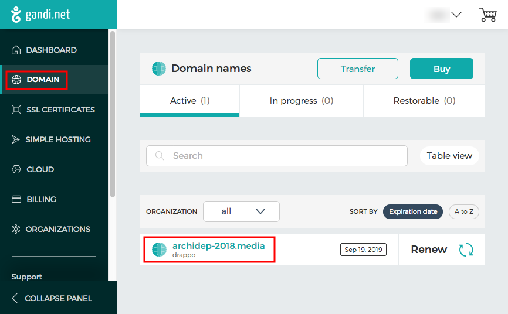</p>

### Configuring the domain's DNS zone

Gandi offers many services such as email accounts or SSL certificates.
The one that interests us is the management of the domain's **DNS zone**:

<p class='center'>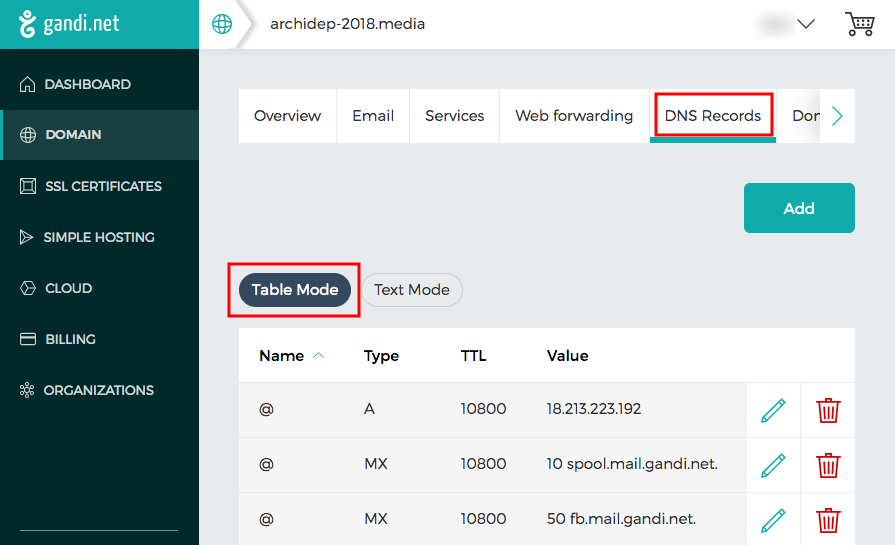</p>

> By default, Gandi displays the DNS zone in a human-readable table.

#### Seeing the raw DNS zone text

Advanced users can also see and edit the real DNS zone file:

<p class='center'></p>

### Adding a DNS record

The interface allows you to very easily add a DNS record.
For example, this screenshot shows how to add an `example` subdomain pointing to the IP address `1.1.1.1`:

<p class='center'>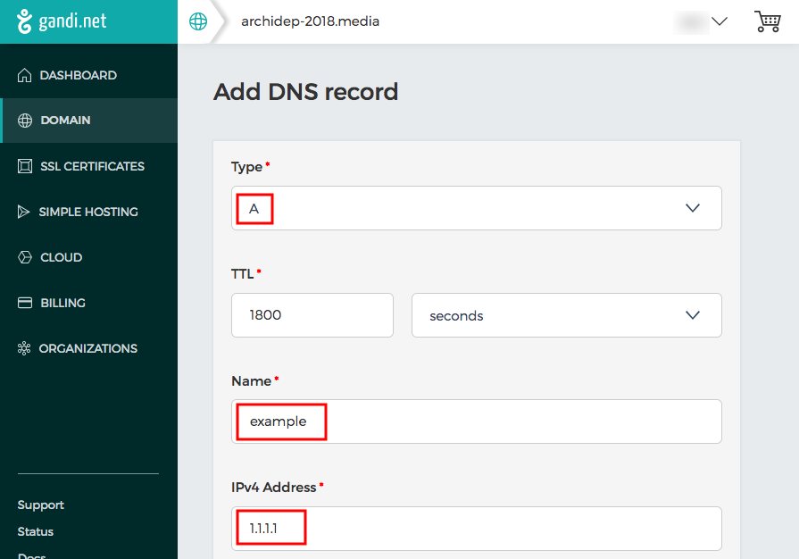</p>


[dns]: https://en.wikipedia.org/wiki/Domain_Name_System
[dns-record-types]: https://en.wikipedia.org/wiki/List_of_DNS_record_types
[dns-zone]: https://en.wikipedia.org/wiki/DNS_zone
[dns-zone-file]: https://en.wikipedia.org/wiki/Zone_file
[gandi]: https://www.gandi.net/
[gandi-shop]: https://shop.gandi.net/
[gtld]: https://en.wikipedia.org/wiki/Generic_top-level_domain
[icann]: https://en.wikipedia.org/wiki/ICANN
[tld]: https://en.wikipedia.org/wiki/Top-level_domain
# TLS/SSL Certificates

Learn about SSL certificates, how to create your own and how to request some from [Let's Encrypt][letsencrypt].

<!-- slide-include ../../BANNER.md -->

**You will need**

* A Unix CLI
* A server with an Ubuntu operating system a public IP address
  * A website deployed on that server behind an [nginx][nginx] reverse proxy

**Recommended reading**

* [Reverse Proxying](../reverse-proxy/)

<!-- START doctoc generated TOC please keep comment here to allow auto update -->
<!-- DON'T EDIT THIS SECTION, INSTEAD RE-RUN doctoc TO UPDATE -->

- [What is a TLS or SSL certificate?](#what-is-a-tls-or-ssl-certificate)
  - [Public key certificates](#public-key-certificates)
  - [What is a TLS certificate good for?](#what-is-a-tls-certificate-good-for)
- [Validity of TLS certificates](#validity-of-tls-certificates)
  - [What's in a TLS certificate?](#whats-in-a-tls-certificate)
    - [Decoding the contents of a TLS certificate](#decoding-the-contents-of-a-tls-certificate)
  - [Configuring nginx to use you TLS certificate](#configuring-nginx-to-use-you-tls-certificate)
  - [Invalid certificate authority](#invalid-certificate-authority)
    - [Self-signed root certificate](#self-signed-root-certificate)
  - [How to make a certificate valid](#how-to-make-a-certificate-valid)
  - [Chain of trust](#chain-of-trust)
    - [Viewing a certificate's chain of trust](#viewing-a-certificates-chain-of-trust)
    - [Intermediate certificates](#intermediate-certificates)
    - [Root certificate authorities](#root-certificate-authorities)
  - [Root certificate validity](#root-certificate-validity)
    - [Trusted CA Certificate Lists](#trusted-ca-certificate-lists)
- [Obtaining a TLS certificate](#obtaining-a-tls-certificate)
  - [Domain validation](#domain-validation)
  - [Purchasing TLS certificates](#purchasing-tls-certificates)
  - [Let's Encrypt](#lets-encrypt)
    - [Certbot](#certbot)
- [References](#references)

<!-- END doctoc generated TOC please keep comment here to allow auto update -->


## What is a TLS or SSL certificate?

<!-- slide-front-matter class: center, middle -->

<p class='center'></p>

### Public key certificates

A [**public key certificate**][pubkey-certificate] is an electronic document
that proves the ownership of a public key using [public key cryptography][pubkey].

A [**TLS or SSL certificate**][tls-certificate] is a type of public key certificate
that allows a computer such as a **web server** to prove that it owns a public key.

> SSL is the original Secure Sockets Layer protocol first published in 1995 and which is now deprecated.
> TLS is the newer and more secure [Transport Layer Security][tls] protocol first published in 1999,
> its latest version being TLS 1.3 published in 2018 (at the time of writing).
> Although TLS is used today, TLS certificates are sometimes still called "SSL certificates".

A TLS certificate is linked to one or multiple domain name:

* For example `google.com` or `www.microsoft.com`.
* It could also be `*.example.com`.
  In this case, it's a **wildcard certificate** valid for all matching subdomains.

### What is a TLS certificate good for?

A TLS certificate is one of the components that allows a server to **communicate securely over HTTPS** using the TLS protocol.

<p class='center'></p>

* The client and server agree on a [cipher suite][cipher-suite] (cipher and hash functions) they both support.
* The server provides its TLS certificate and the client confirms its validity.
* A symmetric encryption key is exchanged using the asymmetric [Diffie-Hellman key exchange][dh].
* The client and server can now communicate securely by using symmetric encryption to encrypt all traffic.


## Validity of TLS certificates

Your browser will not simply accept any TLS certificate as valid.
You can generate your own TLS certificate to test this.

On your server, run the following commands:

```bash
$> `mkdir ~/certificate`

$> `cd ~/certificate`

$> `openssl req -newkey rsa:2048 -nodes -keyout key.pem \`
   `-x509 -days 365 -out certificate.pem`

Generating a 2048 bit RSA private key
...
You are about to be asked to enter information that will be incorporated
into your certificate request.
...
Country Name (2 letter code) [AU]:CH
State or Province Name (full name) [Some-State]:Vaud
Locality Name (eg, city) []:Yverdon
Organization Name (eg, company) [Internet Widgits Pty Ltd]:HEIG-VD
Organizational Unit Name (eg, section) []:
Common Name (e.g. server FQDN or YOUR name) []:john-doe.archidep.ch
Email Address []:john.doe@heig-vd.ch
```

### What's in a TLS certificate?

The previous command generated two files:

* A **TLS certificate** in the `certificate.pem` file.
* A **private key** in the `key.pem` file.

```bash
$> `ls`
certificate.pem key.pem
```

The `certificate.pem` file is simply a Base64-encoded plain text file:

```bash
$> `cat certificate/certificate.pem`
-----BEGIN CERTIFICATE-----
MIID7jCCAtagAwIBAgIJAPPUhT7FLeLRMA0GCSqGSIb3DQEBCwUAMIGLMQswCQYD
VQQGEwJDSDENMAsGA1UECAwEVmF1ZDEQMA4GA1UEBwwHWXZlcmRvbjEQMA4GA1UE
...
```

#### Decoding the contents of a TLS certificate

A TLS certificate is not encrypted.
You can decode its contents with the following command:

```bash
$> `openssl x509 -text -noout -in certificate.pem`
Certificate:
    Data:
        Version: 3 (0x2)
        Serial Number:
            ef:ea:3a:93:c5:74:a8:e7
    Signature Algorithm: sha256WithRSAEncryption
        Issuer: C = CH, ST = Vaud, L = Yverdon, O = HEIG-VD,
                CN = john-doe.archidep.ch,
                emailAddress = john-doe@heig-vd.ch
        Validity
            Not Before: Jan 15 14:28:11 2019 GMT
            Not After : Jan 15 14:28:11 2020 GMT
...
```

### Configuring nginx to use you TLS certificate

Assuming you already have a website deployed with nginx, add the following lines to its configuration file:

```bash
server {

  listen 80;
* listen 443 ssl;
* ssl_certificate /home/john_doe/certificate/certificate.pem;
* ssl_certificate_key /home/john_doe/certificate/key.pem;
* ssl_protocols TLSv1 TLSv1.1 TLSv1.2;
* ssl_ciphers HIGH:!aNULL:!MD5;

  server_name john-doe.archidep.ch;
  root /home/john_doe/my-website;
  index index.html;
}
```

Reload nginx's configuration with `sudo nginx -s reload`.

> The `listen 443 ssl` directive instructs nginx to also listen on port 443 (HTTPS) for this site.
> The [`ssl_certificate`][nginx-ssl-certificate-directive] directive makes it serve the specified TLS certificate file to clients.
> The [`ssl_certificate_key`][nginx-ssl-certificate-key-directive] directive makes it
> use the private key in the specified file to perform the asymmetric cryptography in the TLS protocol.

### Invalid certificate authority

If you access your website with this configuration, you will see the following:

<p class='center'>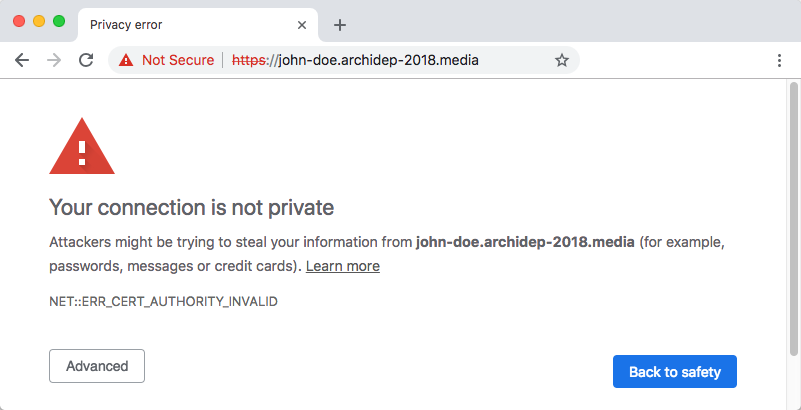</p>

In this example, Chrome indicates that there is an error of type `NET::ERR_CERT_AUTHORITY_INVALID` error.
This means that there is no valid **certificate authority** that guarantees that this certificate is valid.

#### Self-signed root certificate

Your TLS certificate is not valid because is is a **self-signed** certificate.

<p class='center'>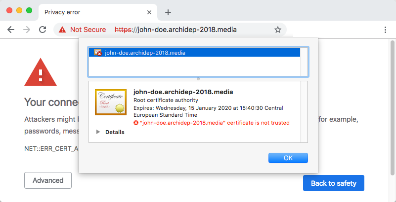</p>

As you can see, the certificate details indicates that it is a **root certificate**,
meaning that no other certificate authority guarantees its validity.
Since you signed it yourself (by running the earlier `openssl req` command),
and you are not a valid certificate authority, it is considered invalid by your browser.

### How to make a certificate valid

To be valid, a TLS certificate must be **signed by a valid certificate authority**.
This signature is a [digital signature][digital-signature] using [public key cryptography][pubkey]:

* The certificate authority has a **private and public key pair**.
* They will **use their private key to create a signature** of your certificate.
* They will **distribute their public key** so that anyone in possession of your certificate and their public key can **verify the signature**.

Of course, the certificate authority that signed your certificate must prove that it owns the public key that is being distributed.
To do this, it provides a public key certificate of its own, similar to your own TLS certificate.

### Chain of trust

Your TLS certificate and various other public key certificates are thus linked together in a **chain of trust**:

<p class='center'>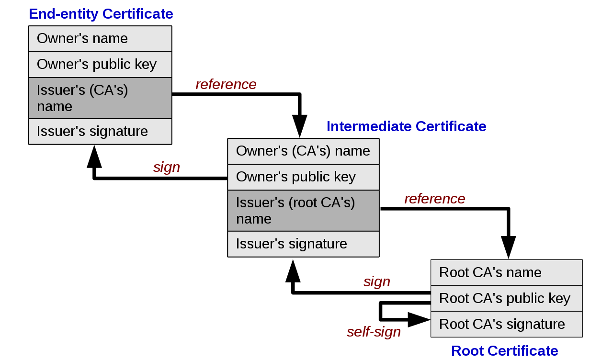</p>

Each certificate, starting with your own **end-user certificate**
(or end-entity certificate) is signed by the next certificate authority,
proving its validity to the client.
This is a type of [public key infrastructure][pki].

#### Viewing a certificate's chain of trust

Browsers allow you to view a TLS certificate's chain of trust:

<p class='center'>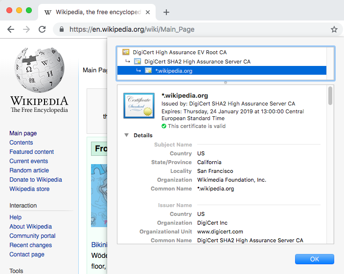</p>

#### Intermediate certificates

In this example, there are 3 certificates in the chain, but there could be more.
All certificates in the middle are **intermediate certificate authorities**:

<p class='center'>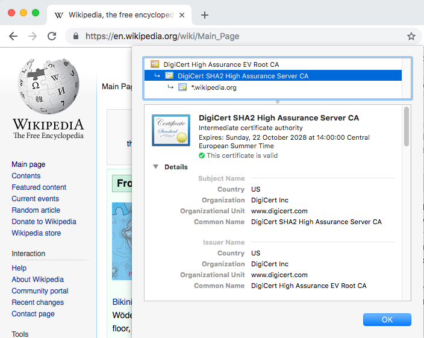</p>

#### Root certificate authorities

The **root certificate authority** is the one at the top of the chain:

<p class='center'></p>

### Root certificate validity

As you can see in the chain of trust diagram, the **root certificate** is self-signed:
there is no inherent difference between it and a certificate you have generated yourself with `openssl req`.

<p class='center'></p>

How then does the browser know that a root certificate authority is valid?

#### Trusted CA Certificate Lists

Browsers and operating systems have **hardcoded lists of root certificates** that are considered to be **trusted**.
For example:

* [Trusted Root Certificates in iOS][ios-root-ca-list]
* [Trusted Root Certificates in Mozilla Firefox][mozilla-root-ca-list]

When your browser checks a TLS's certificate chain of trust,
it expects the chain's root certificate to be one of the **already trusted** ones;
otherwise, the TLS certificate is deemed invalid.

In other words, if you want to launch a new company to issue valid TLS certificates,
you must contact Mozilla, Apple, Microsoft, etc. to have them include your new root certificate
in their programs:

* [Apple Root Program][apple-root-ca]
* [Microsoft Root Program][microsoft-root-ca]
* [Mozilla Root Program][mozilla-root-ca]
* [Oracle Root Program][oracle-root-ca]


## Obtaining a TLS certificate

To obtain a valid TLS certificate, you need to request one from a [**certification authority (CA)**][ca].
In 2018, the 3 most popular CAs are:

* [IdenTrust][identrust]
* [Comodo][comodo]
* [DigiCert][digicert]

Before the certification authority will give you a signed, valid TLS certificate,
they will make you go through **domain validation**.
In other words, they will ask you to **prove that you are the legitimate owner of the domain**
indicated in the certificate.

### Domain validation

There are multiple techniques to do that.
For example, assuming that you own the domain `example.com`
and request a TLS certificate for that domain from a CA:

* **HTTP validation:** the CA can ask you to put a file at `http://example.com/abc.txt` containing a random validation token.
  Doing this proves that you control the server which serves the content for the domain.
* **DNS validation:** the CA can ask you to create a custom DNS record for your domain.
  Doing this proves that you control the DNS zone file for the domain.
* **Email validation:** the CA can send you a mail with a validation link at `admin@example.com`.
  Following the link proves that you are the administrator of the domain,
  since only you could manage that email address.

### Purchasing TLS certificates

Some certificate authorities sell you TLS certificates.
What you pay for is:

* **Compatibility:** Not all root certificates are as widespread.
  Some may be present in more browsers and operating systems.
  By paying more, you may get a certificate that is certified to be compatible with more clients.
* **Warranty:** Many certificate authorities will pay you a given sum of money
  if your security is compromised because of a weakness in their TLS certificate.
  You may increase that warranty by purchasing a more expensive certificate.
* **[Extended Validation Certificate (EV)][ev-certificate]:**
  Certificate authorities can validate that a legal entity is the owner of a domain,
  enabling the browser to display a so-called "green-bar certificate".

  

### Let's Encrypt

[Let's Encrypt][letsencrypt] is a **free, automated, and open certificate authority (CA)**, run for the public's benefit.
It is a service provided by the [Internet Security Research Group (ISRG)][isrg].
The key principles behind Let's Encrypt are:

* **Free:** Anyone who owns a domain name can use Let's Encrypt to obtain a valid TLS certificate at zero cost.
* **Automatic:** Software running on a web server can painlessly obtain a certificate,
  securely configure it for use, and automatically take care of renewal.
* **Secure:** Let's Encrypt will serve as a platform for advancing TLS security best practices,
  both on the CA side and by helping site operators properly secure their servers.
* **Transparent:** All certificates issued or revoked will be publicly recorded and available for anyone to inspect.
* **Open:** The automatic issuance and renewal protocol will be published as an open standard that others can adopt.
* **Cooperative:** Much like the underlying Internet protocols themselves,
  Let's Encrypt is a joint effort to benefit the community, beyond the control of any one organization.

#### Certbot

[Certbot][certbot] is a tool made by the [Electronic Frontier Foundation (EFF)][eff].
It can be installed on any Linux server and will:

* Help you **obtain Let's Encrypt certificates**.
* **Configure your web server,** such as [Apache][apache] or [nginx][nginx],
  to use the certificates.
* Set up **automatic renewal** for these certificates.


## References

* [Public-key Certificate][pubkey-certificate]
  * [Public Key Cryptography][pubkey]
  * [Chain of Trust][chain-of-trust]
* [Certificate Authority (CA)][ca]
  * [Let's Encrypt][letsencrypt]
* [Generating a self-signed certificate using OpenSSL][self-signed]
* [Nginx - Configuring HTTPS servers][nginx-ssl]


[apache]: https://www.apache.org
[apple-root-ca]: https://www.apple.com/certificateauthority/ca_program.html
[ca]: https://en.wikipedia.org/wiki/Certificate_authority
[certbot]: https://certbot.eff.org/
[chain-of-trust]: https://en.wikipedia.org/wiki/Chain_of_trust
[cipher-suite]: https://en.wikipedia.org/wiki/Cipher_suite
[comodo]: https://www.comodo.com
[dh]: https://en.wikipedia.org/wiki/Diffie%E2%80%93Hellman_key_exchange
[digicert]: https://www.digicert.com
[digital-signature]: https://en.wikipedia.org/wiki/Digital_signature
[eff]: https://www.eff.org
[ev-certificate]: https://en.wikipedia.org/wiki/Extended_Validation_Certificate
[identrust]: https://www.identrust.com
[ios-root-ca-list]: https://support.apple.com/en-gb/HT204132
[isrg]: https://letsencrypt.org/isrg/
[letsencrypt]: https://letsencrypt.org/
[microsoft-root-ca]: https://docs.microsoft.com/en-us/previous-versions//cc751157(v=technet.10)
[mozilla-root-ca]: https://www.mozilla.org/en-US/about/governance/policies/security-group/certs/policy/
[mozilla-root-ca-list]: https://wiki.mozilla.org/CA/Included_Certificates
[nginx]: http://nginx.org/
[nginx-ssl]: http://nginx.org/en/docs/http/configuring_https_servers.html
[nginx-ssl-certificate-directive]: http://nginx.org/en/docs/http/ngx_http_ssl_module.html#ssl_certificate
[nginx-ssl-certificate-key-directive]: http://nginx.org/en/docs/http/ngx_http_ssl_module.html#ssl_certificate_key
[oracle-root-ca]: https://www.oracle.com/technetwork/java/javase/javasecarootcertsprogram-1876540.html
[pki]: https://en.wikipedia.org/wiki/Public_key_infrastructure
[pubkey]: https://en.wikipedia.org/wiki/Public-key_cryptography
[pubkey-certificate]: https://en.wikipedia.org/wiki/Public_key_certificate
[self-signed]: https://www.ibm.com/support/knowledgecenter/SSMNED_5.0.0/com.ibm.apic.cmc.doc/task_apionprem_gernerate_self_signed_openSSL.html
[tls]: https://en.wikipedia.org/wiki/Transport_Layer_Security
[tls-certificate]: https://en.wikipedia.org/wiki/Public_key_certificate#TLS/SSL_server_certificate
[tls-procedure]: https://en.wikipedia.org/wiki/Transport_Layer_Security#Description
# Reverse Proxying

Learn what a reverse proxy is, and put it in practice using nginx.

<!-- slide-include ../../BANNER.md -->

**You will need**

* A Unix CLI
* A server with an Ubuntu operating system and a public IP address

**Recommended reading**

* [Unix Administration](../unix-admin/)
* [Unix Networking](../unix-networking/)
* [APT](../apt/)

<!-- START doctoc generated TOC please keep comment here to allow auto update -->
<!-- DON'T EDIT THIS SECTION, INSTEAD RE-RUN doctoc TO UPDATE -->

- [What is a proxy?](#what-is-a-proxy)
  - [Types of proxy servers](#types-of-proxy-servers)
    - [Tunneling proxy](#tunneling-proxy)
    - [Forward proxy](#forward-proxy)
      - [Anonymous or transparent](#anonymous-or-transparent)
    - [Reverse proxy](#reverse-proxy)
- [Why use a reverse proxy?](#why-use-a-reverse-proxy)
  - [Hiding internal architecture](#hiding-internal-architecture)
  - [Hiding multi-component websites](#hiding-multi-component-websites)
  - [SSL termination or authentication](#ssl-termination-or-authentication)
  - [Scalability](#scalability)
    - [Load balancing](#load-balancing)
  - [Other uses](#other-uses)
- [nginx](#nginx)
  - [What is nginx?](#what-is-nginx)
    - [Apache vs. nginx](#apache-vs-nginx)
  - [Installing nginx](#installing-nginx)
    - [Making sure it's working](#making-sure-its-working)
  - [Nginx configuration files](#nginx-configuration-files)
    - [The main configuration file](#the-main-configuration-file)
    - [Includes](#includes)
    - [`sites-available` vs. `sites-enabled`](#sites-available-vs-sites-enabled)
    - [Reloading nginx's configuration](#reloading-nginxs-configuration)
    - [Common nginx directives](#common-nginx-directives)
- [nginx configuration examples](#nginx-configuration-examples)
  - [How to use these examples](#how-to-use-these-examples)
  - [Static website configuration](#static-website-configuration)
  - [Reverse proxy configuration](#reverse-proxy-configuration)
  - [Load balancing configuration](#load-balancing-configuration)
- [References](#references)
- [TODO](#todo)

<!-- END doctoc generated TOC please keep comment here to allow auto update -->


## What is a proxy?

<!-- slide-front-matter class: center, middle -->


> A [**proxy server**][proxy] is a computer or application that acts as an **intermediary** for requests from clients seeking resources from other servers.

### Types of proxy servers

There are 3 main kinds of proxy servers:

* A [**tunneling proxy**][tunneling-proxy] or [**gateway**][gateway] passes **unmodified requests and responses** from a client to a server.
* A [**forward proxy**][open-proxy] is used to retrieve data from a server usually on the Internet.
* A [**reverse proxy**][reverse-proxy] is an **internal-facing proxy** used to control and protect access to servers in a **private network**.

#### Tunneling proxy

A [tunneling proxy][tunneling-proxy] can pass **unmodified requests and responses** from one network to another.
It can also be used to encapsulate a protocol into another, such as running IPv6 over IPv4.

<!-- slide-column -->

For example, an SSH connection may be relayed by a proxy server to a different target server.
The proxy server simply passes the packets through, with no ability to compromise the security of the communication.

<!-- slide-column -->


<!-- slide-container -->

[**Virtual private networks (VPN)**][vpn] use tunneling protocols, usually with an additional layer of encryption.

#### Forward proxy

A **forward proxy** retrieves data from a server on behalf of a client.

<p class='center'></p>

<!-- slide-column -->

An [**open proxy**][open-proxy] is a forward proxy accessible by any Internet user.
It can be either **anonymous** or **transparent**.

##### Anonymous or transparent

<!-- slide-column -->

An **anonymous forward proxy** reveals its identity as a server but conceals that of the client.
Since the target server does not know who the original client is, it can be used to protect privacy.
[VPNs][vpn] are often used in combination with this type of proxy server.

A **transparent forward proxy** identifies both itself and the original client through the use of HTTP headers.
It can be used to cache websites.

Schools often use this kind of proxy to restrict access to particular websites (e.g. Facebook).

<!-- slide-column -->


<!-- slide-container -->

When many clients go through the same forward proxy server, its IP address may get banned,
since the target server only sees one computer (the proxy) making too many requests at the same time.

#### Reverse proxy

A [**reverse proxy**][reverse-proxy] is a server that **appears to clients to be an ordinary server**,
but actually **transmit their requests to** one or more **other servers in an internal private network** which handle the requests.

<p class='center'></p>

<!-- slide-column -->

The response from the private server is returned as if it was coming from the proxy server itself,
leaving the client with no knowledge of the structure of the internal network.

<!-- slide-column -->

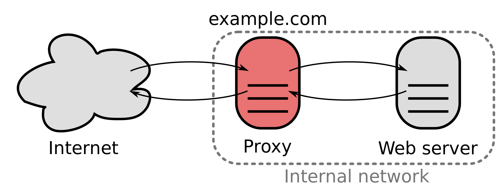


## Why use a reverse proxy?

<!-- slide-front-matter class: center, middle -->


### Hiding internal architecture

Reverse proxies can **hide the existence and characteristics of an internal network's private servers**.
Since the client only sees the proxy server, it is unaware of the complexity of the internal architecture
and does not have to worry about it.

<p class='center'></p>

In a scenario where you have only a single public IP address available,
a reverse proxy allows you to make multiple private servers accessible on that IP address through the proxy server.

### Hiding multi-component websites

Modern websites can be complex applications, often with a **separate frontend and backend** developed by different teams with different technologies.
Putting a reverse proxy in front can make it **appear as one single website** on a single domain name, avoiding [CORS][cors] issues.

<p class='center'></p>

### SSL termination or authentication

Managing SSL certificates to provide websites over HTTPS is rather complex.
It can be hard to configure some frameworks or tools to ensure they are only using secure communications.

<p class='center'></p>

A reverse proxy can help by being the **secure endpoint** with all the SSL certificates,
then **forwarding unencrypted requests** to the servers or applications in the private network.

Similarly, a reverse proxy could also require **authentication** before letting a client access an insecure application,
adding security without having to modify the application itself.

### Scalability

[Scalability][scalability] is the capability of a computer system to handle a growing amount of work,
such as many clients making requests to an application at the same time.

<!-- slide-column -->

There are [2 broad ways][horizontal-and-vertical-scaling] of adding more resources for a particular application.

**Vertical scaling** consists in using a more powerful computer,
with more CPU, RAM, throughput, etc.
The added power will allow the server to serve more clients.

<!-- slide-column 60 -->


<!-- slide-container -->

**Horizontal scaling** means adding more computers to handle the same work.
For example, 3 instances of a web application can probably handle 3 times as many clients at the same time.
Computers or applications can be combined in [clusters][cluster] to improve performance.

#### Load balancing

A common function of reverse proxies is to perform [**load balancing**][load-balancing],
i.e. the distribution of workloads across multiple servers to achieve **horizontal scaling**.

<p class='center'>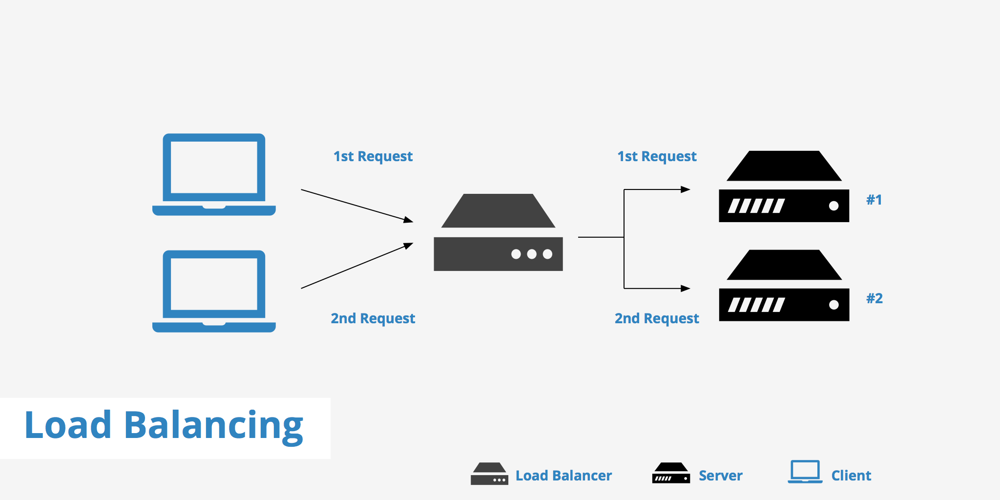</p>

As multiple clients arrive simultaneously,
the reverse proxy will distribute requests to different servers,
spreading the load between them.

### Other uses

Reverse proxies also have [other uses][reverse-proxy-uses] such as:

* Cache static content and dynamic content to reduce load on internal servers.
  This is known as [web acceleration][web-acceleration].
* Optimize content by transparently compressing it to speed up loading times.
* *Spoon-feeding*, a technique where the reverse proxy temporarily stores a dynamically generated page,
  then serves it to the client a little bit at a time.
  This avoids the internal server having to wait for slow clients such as mobile applications.
* Protect against [denial-of-service (DoS) attacks][dos] and distributed denial-of-service (DDoS) attacks.
* Allow [A/B testing][ab-testing] by dynamically modifying served content.


## nginx

<!-- slide-front-matter class: center, middle, image-header -->


### What is nginx?

[nginx][nginx] is an HTTP and reverse proxy server used by more than 25% of the busiest sites in December 2018.
It was developed to solve the [C10k problem][c10k], i.e. the capability of a computer system to handle ten thousand concurrent connections,
thanks to its [event-driven architecture][nginx-performance]. It also has [many other features][nginx-features] to serve modern web applications.

It is a concurrent of the well-known [Apache HTTP server][apache].

<p class='center'></p>

#### Apache vs. nginx

Although Apache is still used to serve more websites,
nginx leads the pack in web performance,
and is used more for the busiest websites.

<p class='center'></p>

### Installing nginx

<!-- slide-front-matter class: center, image-header -->

<p class='center'></p>

It's as simple as installing it with APT:

```bash
$> sudo apt install nginx
```

#### Making sure it's working

APT should automatically launch nginx, which will start listening on port 80 right away.

```bash
$> ss -tlpn
State  Recv-Q Send-Q Local Address:Port
LISTEN 0      128          0.0.0.0:`80`   ... users:(("`nginx`",...)
LISTEN 0      128             [::]:`80`   ... users:(("`nginx`",...)
...
```

You can check that the service is running with the following command:

```bash
$> sudo systemctl status nginx
```

<!-- slide-column -->

You should be able to access your server's public IP address in a browser and see nginx's welcome message:

<!-- slide-column -->

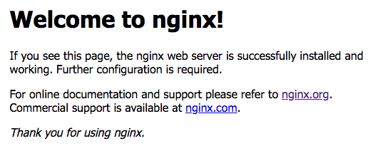

### Nginx configuration files

Nginx stores its configuration in the `/etc/nginx` directory.

<!-- slide-column 40 -->

```bash
$> ls -1 /etc/nginx
*conf.d
fastcgi.conf
fastcgi_params
koi-utf
koi-win
mime.types
modules-available
modules-enabled
*nginx.conf
proxy_params
scgi_params
*sites-available
*sites-enabled
snippets
uwsgi_params
win-utf
```

<!-- slide-column -->

The most important files are highlighted:

* `nginx.conf` is the main configuration file.
  Everything starts from there.
* `conf.d` is a directory to store reusable configuration fragments.
* `sites-available` is a directory where website configuration files are stored.
* `sites-enabled` is a directory containing symbolic links to the configurations in `sites-available`.

#### The main configuration file

The main `/etc/nginx/nginx.conf` file is a tree-like structure formed of **contexts** delimited by braces (`{` and `}`).
Each context contains configuration related to a specific area of concern.

The basic structure is as follows:

```nginx
# Main context: global nginx options

events {
  # Events context: connection handling options
}

http {
  # HTTP context: web server & reverse proxy configuration

  server {
    # Server context: website configuration
  }

  server {
    # Another server...
  }
}
```

These contexts can contain a number of [directives][nginx-directives].

#### Includes

Nginx has an [`include` directive][nginx-include] which allows you to split the configuration into several files instead of having one big file.
As you can see, nginx already includes several other files out of the box:

```
$> grep include /etc/nginx/nginx.conf
include /etc/nginx/modules-enabled/*.conf;
include /etc/nginx/mime.types;
include /etc/nginx/conf.d/*.conf;
include /etc/nginx/sites-enabled/*;
```

The most important include is `/etc/nginx/sites-enabled/*`.
Any file in there will be loaded in the `http` context,
which means they a good place to define `server` contexts in.

#### `sites-available` vs. `sites-enabled`

By convention, nginx has two directories for website configuration files:

* **`sites-available`** contains the actual configuration files.
  For example, you could create a file at `/etc/nginx/sites-available/example-site` to configure nginx to serve your website.

  This directory is **not** included by nginx,
  so configuration files in it are not automatically picked up.
* **`sites-enabled`** contains **symbolic links** to the configuration files in `sites-available`.

  This directory is included by nginx.
  Configuration files in it (or links to configuration files) are automatically loaded.

Things are set up like this so that you can work on configuration files in `sites-available`
but not actually enable them until you put the symbolic link in `sites-enabled`.
It also allows you to **quickly disable** a website without deleting its configuration file.

```
/etc/nginx/sites-available/example-site
/etc/nginx/sites-enabled/example-site -> /etc/nginx/sites-available/example-site
```

#### Reloading nginx's configuration

When you put new symbolic links in `sites-enabled`, nginx will not automatically reload them.

You can restart nginx, which will make it reload the configuration,
but you can also tell it to **reload its configuration without shutting down**.
Nginx reacts to [some Unix signals][nginx-signals] in certain ways.
Notably, it reloads its configuration when receiving a `HUP` signal.

You can send the signal to the nginx master process yourself with the `kill` command,
or you can simply reload the associated systemd service, which will send the signal for you:

```bash
$> sudo systemctl reload nginx
```

#### Common nginx directives

Nginx has many [directives][nginx-directives] that can be put in various contexts.

These are the most commonly used ones in the `server` context,
used to serve websites (static or dynamic):

Directive                              | Example value                              | Description
:---                                   | :---                                       | :---
[`listen`][nginx-directive-listen]     | `80`, `localhost:8000`                     | Port (and optional address) on which to listen and accept requests from.
[`server_name`][nginx-server-names]    | `example.com, www.example.com`             | Comma-separated list of domain names. Determine which `server` block handles client requests.
[`root`][nginx-directive-root]         | `/home/john_doe/www/site`, `/var/www/site` | The root directory for requests.
[`index`][nginx-directive-index]       | `index.html`                               | Define files that will be used as an index, i.e. served by default if there is no URL path.
[`location`][nginx-directive-location] | `/api`, `~* \.jpg$`                        | Vary configuration based on the URL.


## nginx configuration examples

<!-- slide-front-matter class: center, middle -->


### How to use these examples

Each of the following examples can be put in a separate file in the `/etc/nginx/sites-available` directory:

* Copy a website configuration example.
* Save it in `/etc/nginx/sites-available/example`.
* Create a symbolic link to it in `/etc/nginx/sites-enabled` with this command (this is one command on 3 lines):

  ```bash
  $> sudo ln -s \
       /etc/nginx/sites-available/example \
       /etc/nginx/sites-enabled/example
  ```
* Check that you have not made a mistake:

  ```bash
  $> sudo nginx -t
  ```
* Instruct nginx to reload its configuration with this command:

  ```bash
  $> sudo systemctl nginx reload
  ```

### Static website configuration

This configuration tells nginx to serve the static files in the directory `/home/john_doe/example`
when a request arrives on port 80 for the domain `example.com`.
This demonstrates nginx's capabilities as a basic **web server**.

```nginx
server {
  listen `80`;
  server_name `example.com`;
  root `/home/john_doe/example`;
  index index.html;

  # Cache images, icons, video, audio, HTC, etc.
  location ~* \.(?:jpg|jpeg|gif|png|ico|cur|gz|svg|mp4|ogg|ogv|webm|htc)$ {
    access_log off;
    add_header Cache-Control "max-age=2592000";
  }
}
```

> The `Cache-Control` header is sent to the client's browser to tell it that
> these media files (`jpg`, `png`, etc) can be cached, i.e. there's no need to
> redownload them the next time.

### Reverse proxy configuration

This configuration tells nginx to forward any request on port 80 for the domain `dynamic.example.com`
to the application or server at address `http://127.0.0.1:3000`,
making it behave as a **reverse proxy**.

```nginx
server {
  listen 80;
  server_name dynamic.example.com;
  root /path/to/static/files;

  # Proxy requests for dynamic content to another server/application.
  location / {
    `proxy_pass http://127.0.0.1:3000;`
  }
}
```

> In this example, the `proxy_pass` address is a local address,
> but it could well be the IP address of another server in an internal network.

### Load balancing configuration

This configuration tells nginx to perform **load balancing** on incoming requests on port 80 for the domain `big.example.com`.
With the [`upstream` directive][nginx-upstream], it defines a cluster of 4 servers among which to distribute the load.

```nginx
# Cluster of applications or servers to handle requests.
upstream `big_server_com` {
  server 127.0.0.3:8000 weight=5; # local application
  server 127.0.0.3:8001 weight=5; # local application
  server 10.192.67.3:8000; # separate server
  server 10.192.56.12:8001; # separate server
}

server {
  listen 80;
  server_name big.example.com;

  # Proxy requests to the cluster.
  location / {
    `proxy_pass http://big_server_com;`
  }
}
```

> By default, nginx uses a [weighted round robin][weighted-round-robin] algorithm to decide
> to which server each request is proxied. A `weight` parameter can be specified to direct
> more requests to specific servers.


## References

* [Proxy server][proxy]
  * [Tunneling proxy][tunneling-proxy]
  * [Open proxy][open-proxy]
  * [Reverse proxy][reverse-proxy]
      * [Load balancing][load-balancing]
      * [Scalability][scalability]
* [Nginx Documentation][nginx-docs]
  * [Nginx Beginner's Guide](http://nginx.org/en/docs/beginners_guide.html)
* [Digital Ocean][digital-ocean]
  * [How to Install Nginx on Ubuntu 18.04](https://www.digitalocean.com/community/tutorials/how-to-install-nginx-on-ubuntu-18-04)
  * [Understanding the Nginx Configuration File Structure and Configuration Contexts](https://www.digitalocean.com/community/tutorials/understanding-the-nginx-configuration-file-structure-and-configuration-contexts)


## TODO

* cors configuration


[ab-testing]: https://en.wikipedia.org/wiki/A/B_testing
[apache]: https://httpd.apache.org/
[c10k]: https://en.wikipedia.org/wiki/C10k_problem
[cluster]: https://en.wikipedia.org/wiki/Computer_cluster
[cors]: https://en.wikipedia.org/wiki/Cross-origin_resource_sharing
[digital-ocean]: https://www.digitalocean.com/
[dos]: https://en.wikipedia.org/wiki/Denial-of-service_attack
[gateway]: https://en.wikipedia.org/wiki/Gateway_(telecommunications)
[horizontal-and-vertical-scaling]: https://en.wikipedia.org/wiki/Scalability#Horizontal_and_vertical_scaling
[load-balancing]: https://en.wikipedia.org/wiki/Load_balancing_(computing)
[nginx]: http://nginx.org/
[nginx-directive-index]: http://nginx.org/en/docs/http/ngx_http_index_module.html#index
[nginx-directive-listen]: http://nginx.org/en/docs/http/ngx_http_core_module.html#listen
[nginx-directive-location]: http://nginx.org/en/docs/http/ngx_http_core_module.html#location
[nginx-directive-root]: http://nginx.org/en/docs/http/ngx_http_core_module.html#root
[nginx-directives]: http://nginx.org/en/docs/dirindex.html
[nginx-docs]: http://nginx.org/en/docs/
[nginx-features]: http://nginx.org/en/#basic_http_features
[nginx-include]: http://nginx.org/en/docs/ngx_core_module.html#include
[nginx-performance]: https://www.nginx.com/blog/inside-nginx-how-we-designed-for-performance-scale/
[nginx-server-names]: http://nginx.org/en/docs/http/server_names.html
[nginx-signals]: http://nginx.org/en/docs/control.html
[nginx-upstream]: http://nginx.org/en/docs/http/ngx_http_upstream_module.html
[open-proxy]: https://en.wikipedia.org/wiki/Open_proxy
[proxy]: https://en.wikipedia.org/wiki/Proxy_server
[reverse-proxy]: https://en.wikipedia.org/wiki/Reverse_proxy
[reverse-proxy-uses]: https://en.wikipedia.org/wiki/Reverse_proxy#Uses_of_reverse_proxies
[scalability]: https://en.wikipedia.org/wiki/Scalability
[tunneling-proxy]: https://en.wikipedia.org/wiki/Tunneling_protocol
[vpn]: https://en.wikipedia.org/wiki/Virtual_private_network
[web-acceleration]: https://en.wikipedia.org/wiki/Web_accelerator
[weighted-round-robin]: https://en.wikipedia.org/wiki/Weighted_round_robin
# Platform-as-a-Service (PaaS)

Learn to deploy web applications on Platform-as-a-Service (PaaS) cloud
application platforms such as [GitHub Pages][github-pages], [Netlify][netlify]
and [Render][render].

<!-- slide-include ../../BANNER.md -->

**You will need**

* [Git][git]
* A free [GitHub][github] account

**Recommended reading**

* [Command line](../cli/)
* [Git](../git/), [Git branching](../git-branching/), [Collaborating with
  Git](../git-collaborating), [Git hooks](../git-hooks)

<!-- START doctoc generated TOC please keep comment here to allow auto update -->
<!-- DON'T EDIT THIS SECTION, INSTEAD RE-RUN doctoc TO UPDATE -->

- [What is PaaS?](#what-is-paas)
  - [Cloud service models](#cloud-service-models)
  - [Infrastructure as a Service (IaaS)](#infrastructure-as-a-service-iaas)
  - [Platform as a Service (PaaS)](#platform-as-a-service-paas)
  - [How does a PaaS platform work?](#how-does-a-paas-platform-work)
  - [Is it magic?](#is-it-magic)
  - [How do I use a PaaS platform?](#how-do-i-use-a-paas-platform)

<!-- END doctoc generated TOC please keep comment here to allow auto update -->


## What is PaaS?

<!-- slide-front-matter class: center, middle -->

> **Platform-as-a-Service (PaaS)** is a **cloud deployment** service model where
> the developer deploys applications without the complexity of building and
> maintaing the infrastructure.

> [Heroku][heroku], one of the first cloud platforms, has been in development
> since June 2007, when it supported only the Ruby programming language, but now
> supports Java, **Node.js**, Scala, Clojure, Python, PHP, and Go. Today there
> are many alternatives such as [Netlify][netlify], [Fly][fly] or
> [Render][render].


### Cloud service models

Cloud-computing providers offer their services according to **different models**, some of which are listed below:

| Service models                      | What they provide         | Examples                                 |
| :---------------------------------- | :------------------------ | :--------------------------------------- |
| [Infrastructure as a Service][iaas] | Servers, virtual machines | Amazon EC2, Azure (Microsoft), Rackspace |
| [*Platform as a Service*][paas]     | *Runtime environments*    | Heroku, OpenShift, Netlify, Fly, Render  |
| [Software as a Service][saas]       | Online services           | Gmail                                    |
| [Functions as a Service][faas]      | Serverless environments   | Amazon Lambda, OpenWhisk (IBM)           |


### Infrastructure as a Service (IaaS)

With traditional cloud providers, you have to **set up, maintain and operate**
the **infrastructure** on which your applications are run:

<p class='center'></p>

You'll often need a professional **system administrator** to do that for sizable
projects.


### Platform as a Service (PaaS)

The goal of PaaS platforms is to get **straight to building applications**.


* Higher-level programming
* Reduced complexity
* Effective deployment with built-in infrastructure
* Easier maintenance
* Scaling

It's also a part of the [DevOps][devops] movement where software **dev**elopers increasingly step into the world of **op**eration**s** and vice-versa.


### How does a PaaS platform work?

PaaS platforms usually run your applications inside **containers** on a fully
**managed runtime environment**.

As a developer, you will deploy your **code** written with your favorite
programming language and framework to a **build system** which automatically
performs the necessary steps to build and deploy your application.

The various other components required to run and deploy your applications, such
as the **database** and **reverse proxy** are installed and configured for you.
The **system and language** stacks are **monitored, patched, and upgraded**, so
it's always ready and up-to-date.

### Is it magic?

A PaaS platform will often assume you are following the **conventions** of the
language or framework you're using. For example, when deploying a Node.js
application, many PaaS platforms assume:

* You are using npm, the Node.js Package Manager, and have a `package.json`
  file.
* The dependencies for your application can be installed by executing `npm
  install`.
* Your application can be run by executing `npm start`.

Similar conventions exist for each language supported by Heroku (e.g. using
Maven for Java, Composer for PHP, Bundler for Ruby).

As for automation, it is usually achieved through [Git hooks][git-hooks]. New
versions of your application will be **automatically deployed every time you
push your latest commits**.

### How do I use a PaaS platform?

You will usually **deploy by pushing your commits to a remote Git repository**,
hosted either directly on the PaaS platform you are using, or on GitHub (or your
favorite hosting service) if the PaaS platform supports it.

Many PaaS platforms offer **free plans with restrictions**. For example, Render
lets you use one free PostgreSQL database for 90 days. You can of course whip
out your credit card and pay to use it longer, or to have more
storage/power/etc.

When you need to **configure your application**, PaaS platforms will usually
allow you to define [**environment variables**][env-vars] through a web
interface. These variables will be provided to your application when it is
deployed.

Some PaaS platforms provide **command line tools** to help make and manage your
deployments. For example, there is the [Heroku CLI][heroku-cli] and the [Netlify
CLI][netlify-cli].


[devops]: https://en.wikipedia.org/wiki/DevOps
[env-vars]: https://en.wikipedia.org/wiki/Environment_variable
[faas]: https://en.wikipedia.org/wiki/Function_as_a_Service
[fly]: https://fly.io
[git]: https://git-scm.com
[git-hooks]: https://git-scm.com/book/gr/v2/Customizing-Git-Git-Hooks
[github]: https://github.com
[github-pages]: https://pages.github.com
[heroku]: https://www.heroku.com/home
[heroku-cli]: https://devcenter.heroku.com/articles/heroku-cli
[iaas]: https://en.wikipedia.org/wiki/Cloud_computing
[netlify]: https://www.netlify.com
[netlify-cli]: https://docs.netlify.com/cli/get-started/
[paas]: https://en.wikipedia.org/wiki/Platform_as_a_service
[render]: https://render.com
[saas]: https://en.wikipedia.org/wiki/Software_as_a_service
# Git Hooks

Learn the basics of Git hooks.

<!-- slide-include ../../BANNER.md -->

**You will need**

* A Unix CLI
* [Git][git]

**Recommended reading**

* [Git Introduction](../git/)
* [Git Branching](../git-branching/)
* [Collaborating with Git](../git-collaborating/)
* [Shell Scripting](../shell-scripting/)

<!-- START doctoc generated TOC please keep comment here to allow auto update -->
<!-- DON'T EDIT THIS SECTION, INSTEAD RE-RUN doctoc TO UPDATE -->

- [What is a Git hook?](#what-is-a-git-hook)
  - [What kind of hooks are there?](#what-kind-of-hooks-are-there)
  - [How can I create a hook?](#how-can-i-create-a-hook)
    - [Hooks are not under version control](#hooks-are-not-under-version-control)
  - [How do I use a hook?](#how-do-i-use-a-hook)
  - [What are hooks good for?](#what-are-hooks-good-for)
- [References](#references)

<!-- END doctoc generated TOC please keep comment here to allow auto update -->


## What is a Git hook?

A Git hook is **an executable file** that can be **triggered when certain
actions occur**. Hooks can be any kind of executable file, e.g. a compiled
binary program, a shell script, a Ruby script, a Python script, etc.

Hooks must be executable files with a specific name in the `hooks` directory
inside a repository's Git directory (inside the `.git` directory in a normal
repository).

You can find example hook files in most Git repositores:

```bash
$> cd /path/to/a/git/repository

$> cat .git/hooks/pre-commit.sample
#!/bin/sh
#
# An example hook script to verify what is about to be committed.
...
```

> These example files are not triggered because they are not executable and do not have the right name.

### What kind of hooks are there?

Hook scripts must have a specific name (and be executable) to be triggered.

These hook scripts are only limited by a developer's imagination.
Some example hook scripts include:

Hook           | Example usage
:---           | :---
`pre-commit`   | Check the commit message for spelling errors.
`pre-receive`  | Enforce project coding standards.
`post-commit`  | Email/SMS team members of a new commit.
`post-receive` | Push the code to production.

You can type the `git help hooks` command to get the full list of hooks and their documentation.
A full list is also available [here][git-hooks].

### How can I create a hook?

Create a new repository:

```bash
$> cd /path/to/projects
$> mkdir git-hook-example
$> cd git-hook-example
$> git init
```

Create a hook script named `pre-commit` that will be executed before every commit:

```bash
$> echo '#!/bin/bash' > .git/hooks/pre-commit
$> echo 'echo You are about to commit...' >> .git/hooks/pre-commit
$> chmod +x .git/hooks/pre-commit
```

You now have a `pre-commit` hook script:

```bash
$> cat .git/hooks/pre-commit
#!/bin/bash
echo You are about to commit...
```

#### Hooks are not under version control

Note that hooks are not part of the working tree and thus **cannot be put under version control**:

```bash
$> git status
On branch main

No commits yet

nothing to commit (create/copy files and use "git add" to track)
```

> This is a good thing, as you don't want people to be able to send malicious hook scripts to your machine
> every time you clone a repository from the Internet.

### How do I use a hook?

Following the previous example, make a commit and the `pre-commit` hook will be automatically triggered:

```bash
$> echo content > file.txt
$> git add .
$> git commit -m "Test"

You are about to commit...

[main 14b306d] Test
 1 file changed, 1 insertion(+), 1 deletion(-)
```

### What are hooks good for?

Hooks can be a way to automate repetitive or mundane tasks,
like removing trailing spaces at each commit.

Or they can be used to automate deployments,
for example to run the latest version of a server-side application every time new commits are pushed.


## References

* [Pro Git Book](https://git-scm.com/book/en/v2)
  * [Customizing Git - Git Hooks](https://git-scm.com/book/en/v2/Customizing-Git-Git-Hooks)
* [Git Hooks][git-hooks]


[git]: https://git-scm.com
[git-hooks]: https://githooks.com
# Automated Testing

Learn about the various kinds of automated tests and write some in JavaScript and PHP.

<!-- slide-include ../../BANNER.md -->

**You will need**

* A Unix CLI
* A code editor (like [Visual Studio Code][vscode])
* [Node.js][node] 10.x and [PHP][php] 5+ installed
* Basic knowledge of JavaScript and PHP

**Recommended reading**

* [Continuous Software Development](../continuous/)

<!-- START doctoc generated TOC please keep comment here to allow auto update -->
<!-- DON'T EDIT THIS SECTION, INSTEAD RE-RUN doctoc TO UPDATE -->

- [What is automated testing?](#what-is-automated-testing)
  - [Manual testing](#manual-testing)
  - [Automated testing](#automated-testing)
  - [Test frameworks](#test-frameworks)
    - [Which test framework should I use?](#which-test-framework-should-i-use)
  - [Types of automated tests](#types-of-automated-tests)
  - [Yet another classification](#yet-another-classification)
- [Unit tests](#unit-tests)
- [What is a unit test?](#what-is-a-unit-test)
  - [How to write a unit test](#how-to-write-a-unit-test)
  - [Assertions](#assertions)
  - [Write PHP unit tests](#write-php-unit-tests)
    - [Install a PHP test runner](#install-a-php-test-runner)
    - [Install PHPUnit](#install-phpunit)
    - [Create a test file](#create-a-test-file)
    - [Anatomy of a PHPUnit test case](#anatomy-of-a-phpunit-test-case)
    - [Run your first test](#run-your-first-test)
    - [PHPUnit assertions](#phpunit-assertions)
      - [Failing assertions](#failing-assertions)
      - [Successful assertions](#successful-assertions)
    - [Write some tests](#write-some-tests)
  - [Write JavaScript unit tests](#write-javascript-unit-tests)
    - [Install a JavaScript test runner](#install-a-javascript-test-runner)
    - [Create a Mocha test file](#create-a-mocha-test-file)
    - [Running Mocha tests](#running-mocha-tests)
      - [Mocha test structure](#mocha-test-structure)
      - [Add a shortcut npm script for Mocha](#add-a-shortcut-npm-script-for-mocha)
    - [Assertion library](#assertion-library)
    - [Import the code to test](#import-the-code-to-test)
    - [Write a test](#write-a-test)
  - [Mocking](#mocking)
    - [Not a unit test](#not-a-unit-test)
    - [Can I still make it a unit test?](#can-i-still-make-it-a-unit-test)
    - [Install a mocking library](#install-a-mocking-library)
    - [How do I create a mock object?](#how-do-i-create-a-mock-object)
    - [Mocking example](#mocking-example)
    - [Why use mocks?](#why-use-mocks)
  - [Why write unit tests?](#why-write-unit-tests)
    - [Disadvantages of unit tests](#disadvantages-of-unit-tests)
- [Integration tests](#integration-tests)
  - [Write some integration tests](#write-some-integration-tests)
  - [Advantages and disadvantages of integration testing](#advantages-and-disadvantages-of-integration-testing)
- [API tests](#api-tests)
  - [Benefits of API tests](#benefits-of-api-tests)
  - [Testing a web API](#testing-a-web-api)
  - [Install an API test library](#install-an-api-test-library)
  - [Using SuperTest](#using-supertest)
  - [Write API tests](#write-api-tests)
- [End-to-end tests](#end-to-end-tests)
  - [Install Selenium WebDriver](#install-selenium-webdriver)
  - [Create a file for your end-to-end test](#create-a-file-for-your-end-to-end-test)
    - [Run your end-to-end test](#run-your-end-to-end-test)
  - [Selenium WebDriver API](#selenium-webdriver-api)
  - [Implement the end-to-end test](#implement-the-end-to-end-test)
- [Test-Driven Development (TDD)](#test-driven-development-tdd)
  - [What is test-driven development?](#what-is-test-driven-development)
  - [Apply TDD](#apply-tdd)
    - [Write the test first](#write-the-test-first)
    - [Make sure the test fails](#make-sure-the-test-fails)
    - [Implement the feature](#implement-the-feature)
    - [Make sure the test passes](#make-sure-the-test-passes)
  - [Enable the rest of the tests again](#enable-the-rest-of-the-tests-again)
  - [Why write automated tests?](#why-write-automated-tests)
    - [Fix the bug and run the tests again](#fix-the-bug-and-run-the-tests-again)
- [Behavior-Driven Development (BDD)](#behavior-driven-development-bdd)
  - [Cucumber & Gherkin](#cucumber--gherkin)
  - [Install Cucumber](#install-cucumber)
  - [Add a Cucumber feature test](#add-a-cucumber-feature-test)
    - [Run a feature test](#run-a-feature-test)
    - [Unimplemented steps](#unimplemented-steps)
  - [The Cucumber world](#the-cucumber-world)
  - [Cucumber steps](#cucumber-steps)
    - [Implement a step](#implement-a-step)
    - [Implement the remaining steps](#implement-the-remaining-steps)
    - [All the steps](#all-the-steps)
  - [Run the full Cucumber feature](#run-the-full-cucumber-feature)
  - [Why use Cucumber?](#why-use-cucumber)
- [References](#references)

<!-- END doctoc generated TOC please keep comment here to allow auto update -->


## What is automated testing?

<!-- slide-front-matter class: center, middle -->

<p class='center'></p>

### Manual testing

When writing or modifying software, especially large software,
you must regularly **test** it to make sure it works.
**Manual testing** is basically testing the software yourself,
whether it's a desktop or mobile application, or a website.
You'll browse through the pages or screens, fill and submit forms, trigger actions, etc.

In a large company, this might be handled by specialized [Quality Assurance (QA)][qa] engineers.
Whether you or a QA engineer is doing it, manual testing has certain disadvantages:

* It is **time-consuming**.
  Testing a large software application manually can take hours or even days.
  You might skip some tests to save time, allowing bugs to stay hidden.
* It is **boring** and **repetitive**.
  This makes it more likely that you will make a mistake while testing and miss a bug.

### Automated testing

Running functions, making HTTP calls or clicking on specific buttons does not have to be done by a human being.
A program can do it just as well.

[Test automation][automated-tests] is the use of special **testing software**:

* The test software is **separate from the software being tested**.
* It **executes tests automatically** instead of manually.
* It compares **actual outcomes** (what actually happens)
  versus **expected** outcomes (what you expected to happen when writing the test).

Note that **automated tests are not a replacement for automated tests**.
They are complementary in that they can be used to accelerate or automate tests
that can be run by a machine instead of a human.

### Test frameworks

There are many test frameworks written in various languages.
These are all **test runners**, i.e. they can be used to write and execute tests:

Frameworks                                                                             | Tests written in
:---                                                                                   | :---
[Mocha][mocha], [Jasmine][jasmine], [Jest][jest], [SuperTest][supertest], [Tape][tape] | [JavaScript][js]
[JUnit][junit], [JMeter][jmeter], [Robotium][robotium]                                 | [Java][java]
[PHPUnit][phpunit]                                                                     | [PHP][php]
[RSpec][rspec], [test-unit][ruby-test-unit]                                            | [Ruby][ruby]
[doctest][doctest], [unittest][python-unittest]                                        | [Python][python]
[Apium][appium], [Cucumber][cucumber], [Selenium WebDriver][selenium-webdriver]        | *Various languages*

#### Which test framework should I use?

It depends on what kind of test you want to write.

If you want to test an individual PHP function, for example,
you must use a test framework written in the same language,
such as [PHPUnit][phpunit].

However, if you want to test an API or drive a mobile application or website,
it does not matter in which language the test framework is written,
as long as it can make the required HTTP calls or click on the correct buttons.

For example:

* [SuperTest][supertest] is a JavaScript tool to test APIs.
  It could be used to test an API implemented in PHP with Laravel,
  or with any other language or framework.
* [Selenium WebDriver][selenium-webdriver] is a tool to automate browser tests.
  It can test any web application or site, regardless of the language or framework used to implement
  that application or site.

### Types of automated tests

There are various types of automated tests,
and some of these types overlap.
Not everybody agrees how they should be called:

<!-- slide-column -->


<!-- slide-column -->


<!-- slide-column -->


### Yet another classification

This is how we will separate the 3 main types of tests in this guide:

Type                                     | What is tested                           | Properties
:---                                     | :---                                     | :---
[Unit tests][unit-testing]               | Things in isolation                      | Fastest, easiest to maintain
[Integration tests][integration-testing] | Things together                          |
End-to-end tests                         | Whole system from the user's perspective | Slower, harder to maintain

There are also other specialized types of tests which we will not focus on,
like [performance tests][performance-testing], which can be used
to test the response time or scalability of software or infrastructure.


## Unit tests

<!-- slide-front-matter class: center, middle -->

<p class='center'></p>

## What is a unit test?

The goal of [unit testing][unit-testing] is to test **individual units of source code in isolation**.
You can view a **unit** as the **smallest testable part of your software**.

For example, you might test an individual JavaScript function:

```js
function add(a, b) {
  return a + b;
}
```

### How to write a unit test

When writing a unit test for a piece of code, you want to identify the **inputs** and **outputs** (or side effects) of that code.

```js
function add(a, b) {
  return a + b;
}
```

In this case:

* There are two numbers as inputs, `a` and `b`.
* There is one number as output.

### Assertions

Once you have the inputs and outputs, you want to define **assertions** on how that code should behave.

```js
function add(a, b) {
  return a + b;
}
```

Assertions are the outputs you expect for specific inputs.
For example:

* For inputs 2 and 3, the **expected** output is 5.
* For inputs -3 and 4, the **expected** output is 1.
* For inputs 10 and -12, the **expected** output is -2.

When implementing unit tests, you will execute the code and use assertions to compare the **actual** output value with the **expected** one.

### Write PHP unit tests

You'll work with this [sample PHP project][php-sample] for your first unit tests.
It is a simple command line script to print statistics on a file's contents.

Follow the usage instructions in the README to make sure you can execute the script locally.

The output should look something like this:

```bash
$> `php file-stats.php data/rainbow.txt`
File: /path/to/data/rainbow.txt
Lines: 51
Words: 255
Characters: 1284
Size: 1.25KB
```

#### Install a PHP test runner

To execute our future PHP unit tests, we'll need a test framework, including a **test runner**.
The most popular one for PHP is [PHPUnit][phpunit].

To install PHPUnit, you will first need to install [Composer][composer],
the dependency manager for PHP. It can install packages created by the PHP community, including PHPUnit.

> You can install Composer in a directory by simply downloading it,
> in which case you must run it with `php composer.phar [args...]`.
> Or you can install it globally, in which case you can simply run it with `composer [args...]`.
> These installation methods are described in the documentation.

#### Install PHPUnit

Once you have Composer installed, you can install PHPUnit with it.
Run this command in the `comem-archidep-php-automated-tests` directory:

```bash
$> `composer require --dev phpunit/phpunit '^7'`
./composer.json has been updated
Loading composer repositories with package information
Updating dependencies (including require-dev)
Package operations: 28 installs, 0 updates, 0 removals
  ...
  - Installing phpunit/phpunit (7.5.2): Loading from cache
...
Generating autoload files
```

If you have successfully installed it, you should be able to check its version:

```bash
$> `./vendor/bin/phpunit --version`
PHPUnit 7.0.0 by Sebastian Bergmann and contributors.
```

#### Create a test file

You will now create your first test file.
Create a `tests` directory and save the following contents to `tests/file-stats.php`:

```php
<?php
declare(strict_types=1);

use PHPUnit\Framework\TestCase;

require(dirname(__FILE__) . '/../src/functions.php');
use function FileStats\countBytes;
use function FileStats\countCharacters;
use function FileStats\countLines;
use function FileStats\countWords;
use function FileStats\formatBytes;

final class FileStatsTest extends TestCase
{
    public function testSomething(): void
    {
    }
}
?>
```

#### Anatomy of a PHPUnit test case

What you just pasted is a PHPUnit **test suite** composed of one **test case**:

* It inherits from the `PHPUnit\Framework\TestCase` class.
* It has methods with names that begin with `test`.
  Those are what PHPUnit will execute when running the file.

<p class='center'></p>

#### Run your first test

You can run all the test cases in a file with this command:

```bash
$> `./vendor/bin/phpunit --bootstrap vendor/autoload.php tests/file-stats.php`
PHPUnit 7.5.2 by Sebastian Bergmann and contributors.

R                                                                   1 / 1 (100%)

Time: 29 ms, Memory: 4.00MB

There was 1 risky test:

1) FileStatsTest::testSomething
This test did not perform any assertions

/path/to/projects/comem-archidep-php-automated-tests/tests/file-stats.php:12

OK, but incomplete, skipped, or risky tests!
Tests: 1, Assertions: 0, Risky: 1.
```

As you can see, the `testSomething` method was executed,
but the test runner is warning us that it **did not perform any assertions**.

A test that performs no assertions is basically useless, since it tests nothing.

#### PHPUnit assertions

PHPUnit is not only a test runner, but also provides functions to make assertions.
Here are a few:

Assertion                            | Description
:---                                 | :---
`assertEquals($expected, $actual)`   | Reports an error if `$expected` and `$actual` are not equal.
`assertEmpty($actual)`               | Reports an error if `$actual` is not empty.
`assertContains($needle, $haystack)` | Reports an error if `$haystack` does not contain `$needle`.
`assertFileExists($file)`            | Reports an error if `$file` is not an actual file.

These are just a few examples, here's a [complete list][phpunit-assertions].

##### Failing assertions

Write an assertion in the `testSomething` method that you know to be false.
For example, `1` and `2` are not equal:

```php
public function testSomething(): void {
  $this->assertEquals(1, 2);
}
```

If you run this test, you will see something like the following output:

```php
F                                                                   1 / 1 (100%)
Time: 30 ms, Memory: 4.00MB

There was 1 failure:

1) FileStatsTest::testSomething
Failed asserting that 2 matches expected 1.
```

It of course failed because the **actual value**, `2`, is not equal to the **expected value**, `1`,
which what you **asserted** should be the case.

> Note that if you run `echo $?` right after running the test,
> you will see that PHPUnit exited with a non-zero code
> to indicate that the tests failed.

##### Successful assertions

This time, update the assertion to something you know to be true:

```php
public function testSomething(): void {
  $this->assertEquals(3, 1 + 2);
}
```

Then run the test again:

```php
.                                                                   1 / 1 (100%)

Time: 27 ms, Memory: 4.00MB

OK (1 test, 1 assertion)
```

This time, the assertion succeeded because the **expected** and **actual** values are in fact equal,
so the test runner completed without incident.

> This time, running `echo $?` right after running the test returns zero,
> since all tests completed successfully.

#### Write some tests

Read the file `src/functions.php`.
It contains various functions.
Write **at least one test for each function**.
As a reminder:

* Determine each function's **inputs** and **outputs**.
* Write a test that **calls a function** with specific inputs.
* Write an assertion to check that the **actual result** matches **what you expected**.

For example:

```php
public function testCountWords() {
  $input = 'Hello World';
  $expectedResult = 2;
  $actualResult = countWords($input);
  $this->assertEquals($expectedResult, $actualResult);
}
```

Of if you want to be concise:

```php
public function testCountWords() {
  $this->assertEquals(2, countWords('Hello World'));
}
```

### Write JavaScript unit tests

In the previous exercice, the functions you were testing were implemented in PHP.
Since the tests actually execute the functions, they must be implemented in PHP as well.

Now you will switch to this [sample JavaScript project][js-sample] implemented with [Node.js][node] (a server-side JavaScript runtime).

Follow the usage instructions and make sure you can visit http://localhost:3000 and see the application working.
As you can see, it's a very simple project, just to have something to test.

Take some time to read the [contents of the `lib` directory][js-sample-lib],
as that is the code you will write unit tests for.
Note the use of the [decorator pattern][decorator].

You can also read the [`buildGreeting` function in `routes/greeter.js`][js-sample-build-greeting],
which shows how these classes are used.

#### Install a JavaScript test runner

To write JavaScript tests, you will need to install a test runner in the same language.
In this tutorial, you will use [Mocha][mocha], one of the most popular JavaScript test frameworks.

Run the following command in the project's directory to install Mocha as a development tool:

```bash
$> npm install --save-dev mocha
```

> [npm][npm] is the most popular JavaScript package manager and the world's largest software repository.

#### Create a Mocha test file

Create a `tests` directory and save the following contents into a file named `tests/code.test.js`:

```js
describe('Subject', function() {
  it('should do something', function() {
  });

  it('should do something else', function() {
  });
});
```

Mocha provides two basic methods to organize tests:

* `describe` allows you to indicate a brief description of the **subject of the following tests**.
* `it` defines a test case, including a brief description of the test.

  > It's good practice to start the description with the word "should",
  > so that test cases read "it should ..." which sounds like proper English.

#### Running Mocha tests

Run the following command to execute all files with names ending with `.test.js` in the `tests` directory:

```bash
$> ./node_modules/mocha/bin/mocha 'tests/**/*.test.js'

  Subject
    ✓ should test something
    ✓ should test something else

  2 passing (6ms)
```

As you can see, Mocha read your test cases and executed the two functions passed to `it`.
Mocha considers a test successful if it does nothing.

##### Mocha test structure

The calls to `describe` and `it` form a structure.
In this example, the two `it` functions are within the `describe` function:

```js
describe('`Subject`', function() {
  it('`should do something`', function() {
  });

  it('`should do something else`', function() {
  });
});
```

This structure is reflected in the output:

```bash
$> ./node_modules/mocha/bin/mocha 'tests/**/*.test.js'

  `Subject`
    ✓ `should test something`
    ✓ `should test something else`

  2 passing (6ms)
```

##### Add a shortcut npm script for Mocha

To avoid typing that rather complex Mocha command every time,
you can add the following line in the `package.json` file:

```json
  ...
  "scripts": {
    "dev": "cross-env DEBUG=greeter:* nodemon ./bin/www",
    `"mocha": "mocha tests/**/*.test.js",`
    "start": "node ./bin/www"
  }
  ...
```

This defines an [npm script][npm-scripts] that allows you to run the command by simply typing `npm run mocha`:

```bash
$> `npm run mocha`

  Greeter
    ✓ should test something
    ✓ should test something else

  2 passing (6ms)
```

#### Assertion library

Earlier when you wrote unit tests in PHP, assertions were provided out of the box by PHPUnit.
Mocha does not do this. It is a minimalistic test framework, focusing only on running tests.

You will have to install an **assertion library**, i.e. a library that focuses on helping you to write assertions.
There are many like [Chai][chai], [Must.js][mustjs] or [Should.js][shouldjs].

You will use [Chai][chai] for this tutorial.
It's a popular assertion library with a [Behavior-Driven Development][bdd] syntax:

```js
expect(1 + 2).to.equal(3);
```

Install it by running the following command in the project's directory:

```bash
$> npm install --save-dev chai
```

#### Import the code to test

Add the following lines to the top of your `tests/code.test.js` file:

```js
const { expect } = require('chai');

const ExcitementDecorator = require('../lib/excitement-decorator');
const Greeter = require('../lib/greeter');
const LoudDecorator = require('../lib/loud-decorator');
const RandomDecorator = require('../lib/random-decorator');
```

These lines import the classes to test from the relevant files,
so that they are available in the test file.

#### Write a test

Now you have everything you need to write some JavaScript tests.
Take a minute to look at the [assertions provided by Chai][chai-assertions],

Write a simple test:

```js
describe('Greeter', function() {
  it('should produce a simple greeting', function() {
    // TODO: Create a greeter and call its "toString()" method.
    // TODO: Assert that the expected result should be equal to "Hi Bob".
  });
});
```

### Mocking

The loud decorator works like this:

```js
let greeter = new Greeter();
greeter.setName('Bob');
greeter.setSalutation('Hi');
console.log(greeter.toString()); // Hi Bob

let greeter = new LoudDecorator(greeter);
greeter.setLoud();
console.log(greeter.toString()); // HI BOB
```

Write a unit test for it.

#### Not a unit test

You might have written something similar to this:

```js
describe('LoudDecorator', function() {
  it('should make a greeting louder', function() {

    let greeter = new Greeter();
    greeter.setName('Bob');
    greeter.setSalutation('Hi');

    greeter = new LoudDecorator(greeter);
    greeter.setLoud();

    expect(greeter.toString()).to.equal('HI BOB');
  });
});
```

It could be argued that **this is not a unit test**.

Why? Because it does not test the smallest possible unit of code in isolation.
**It tests two things:** both `Greeter` and `LoudDecorator`.
If the test fails, it might be **hard to identify which of these two components has the bug**.

This is why this test could be better described as an [**integration test**][integration-testing],
i.e. a test on multiple components working together.

#### Can I still make it a unit test?

What if you wanted to test `LoudDecorator` alone?

You would need a way to pass it something that looks like a `Greeter` object,
without using the actual `Greeter` class.

Enter the concept of [mocks][mocking].
A **mock object** is a simulated object that mimics the behavior of a real object in a controlled way.
To take a real metaphor, car designers use a crash test dummy to simulate the dynamic behavior of a human in vehicle impacts.

#### Install a mocking library

Much like with assertions, Mocha does not provide any mocking functionality by default.

However, there are many JavaScript mocking libraries like [JsMockito][jsmockito], [Sinon][sinon], [testdouble.js][testdoublejs].
You will use Sinon in this tutorial.

Install it by running the following command in the project's directory:

```bash
$> npm install --save-dev sinon
```

Add the following line to the top of your `tests/code.test.js` file:

```js
const { fake } = require('sinon');
```

#### How do I create a mock object?

Sinon has a `fake` method that can be used to easily create customizable fake functions:

```js
const fakeFunc = fake.returns(2);
console.log(fakeFunc()); // 2
```

You can create a mock object by adding fake functions to it:

```js
const mockObject = {
  hello: fake.returns('Hello')
};

console.log(mockObject.hello()); // Hello
```

Armed with your new mocking knowledge, write a better test for `LoudDecorator`,
one that **does not use the `Greeter` class**, but creates a mock greeter object instead.

#### Mocking example

Here's the same test as before but with a mock object instead of the real greeter object:

```js
it('should make a greeting louder', function() {

  const mockGreeter = {
    toString: fake.returns('Hello')
  };

  const decorator = new LoudDecorator(mockGreeter);
  decorator.setLoud();

  expect(decorator.toString()).to.equal('HELLO');
});
```

By mocking the dependencies of `LoudDecorator`,
you are writing a **true unit test** since you are only testing `LoudDecorator` itself.
If the dependency is complex, that is probably a good thing.

#### Why use mocks?

If an object has any of the following characteristics, it may be useful to use a mock object in its place:

* The object supplies **non-deterministic results** (e.g. the current time or the current temperature).
* It has **states that are difficult to create** or reproduce (e.g. a network error).
* It is **slow** (e.g. a complete database, which would have to be initialized before the test).
* It does not yet exist or **may change behavior**.
* It would have to include information and methods exclusively for testing purposes (and not for its actual task).

### Why write unit tests?

Unit tests allow to isolate each part of a program and **prove that each individual part is correct**.

> Unit tests provide a strict, written contract.

Unit tests **find problems early in the development cycle**.

> The process of writing unit tests forces the programmer to think through inputs, outputs, and error conditions,
> and thus more crisply define the unit's desired behavior.
> The cost of finding a bug when the code is first written is considerably lower than the cost of detecting, identifying, and correcting the bug later.

Unit tests may **reduce uncertainty** in the units themselves.

> By testing the parts of a program first and then testing the sum of its parts, integration testing becomes much easier.

Unit tests provide a sort of **living documentation** of the system.

> Looking at a unit's tests can give a basic understanding of the unit's interface.

#### Disadvantages of unit tests

Unit tests **will not catch every error in the program**, because they cannot evaluate every execution path in any but the most trivial programs.
They will not catch integration errors or broader system-level errors.

Software testing is a combinatorial problem.
For every logical branch (true or false), a test case must be written, which is quite **time-consuming** and might not be worth the effort.

To obtain the intended benefits from unit testing, **rigorous discipline is needed** throughout the software development process.
You must keep track of which tests have been written already, which are missing,
and ensure that failures are reviewed and addressed immediately.


## Integration tests

When doing integration tests, individual software **units are combined and tested as a group**.
This **ensures that components work well together**, not only individually as tested by unit tests.

<p class='center'></p>

The tools used to write integration tests are often the same as for unit tests,
so you do not need to install any new library.

### Write some integration tests

Go back to the sample PHP project and write an integration test for the `countBytes` and `formatBytes` function working together,
similarly to how they are used [in the `file-stats.php` script][php-sample-integration].

Go back to the sample JavaScript project and write an integration test using the `Greeter`, `ExcitementDecorator` and `LoudDecorator` together,
similarly to how they are used [in the `buildGreeting` function][js-sample-build-greeting].

### Advantages and disadvantages of integration testing

**Advantages**

* Integration tests help **discover interfacing problems** between components.
* Integration tests **catch system-level issues**, such as broken database schema, mistaken cache integration, and so on,
  which might be difficult to identify with unit tests.

**Disadvantages**

* **Finding bugs is more difficult** than with unit tests.
  When an integration test fails, since multiple components are combined, it may be unclear which one is causing the bug.


## API tests

[API testing][api-testing] is a part of [integration testing][integration-testing].

Specifically, it involves **testing application programming interfaces (APIs)** directly
to **determine if they meet expectations** for functionality, reliability, performance and security.

For example, your application may provide a [RESTful][rest] API or an [RPC][rpc] API accessible over the Internet.
Automated tests can make HTTP calls to these APIs and compared actual outcomes with expected outcomes.

> API tests are a type of integration test since they test all components of your API working together.

### Benefits of API tests

API testing is considered critical for automating testing
because APIs now serve as the primary interface to application logic.
Higher level end-to-end tests are also more difficult to maintain
with the short release cycles and frequent changes commonly used with iterative software development.

<p class='center'></p>

### Testing a web API

The sample JavaScript project you used to write JavaScript unit tests also provides a web API.
Make sure you have it available on http://localhost:3000 by running `npm run dev` in the project's directory.

You should be able to access the web API with this URL: http://localhost:3000/greeter?excitement=1&loud=&name=Bob&salutation=Hello

It should return a [JSON][json] response with the text "Hello Bob!".

You can write tests that do the same and assert that the response is as expected.

### Install an API test library

Mocha does not provide any API testing functionality out of the box,
but there are many tools that can help you do this such as [REST-assured][rest-assured], [SoapUI][soapui] or [SuperTest][supertest].

You will use SuperTest, a JavaScript API testing library, in this tutorial.
It has a nice syntax to easily make HTTP requests to your API.

Install it by running the following command in the project's directory:

```bash
$> npm install --save-dev supertest
```

> Note that you do **not** have to use a JavaScript API testing tool to test a web API implemented in JavaScript.
> As long as it can make HTTP calls, any tool in any language will do.

### Using SuperTest

Here's an example of how to write a test with SuperTest:

```js
const { expect } = require('chai');
const supertest = require('supertest');

describe('Google', function() {
  it('should display its home page', async function() {

    // Make a GET request on www.google.com
    const response = await supertest('http://www.google.com').get('/');

    // Assert that the response status code is 200 OK
    expect(response.status).to.equal(200);

    // Assert that the response contains the text "Google"
    expect(response.text).to.have.string('Google');
  });
});
```

This test retrieves the Google home page and makes two assertions,
one on the status code of the response, and one on the body.

You can save this test to a new file named `tests/api.test.js` and run `npm run mocha` again to execute it.

### Write API tests

Write at least two tests for the greeter API:

* Test that simply calling the `/greeter` API without any parameters returns a default greeting.
* Test that a more complex greeting is created by sending URL query parameters (like `name` or `excitement`).

> Read the [Chai API][chai-assertions] to see what kind of assertions might be useful for these tests.


## End-to-end tests

End-to-end tests, or [Graphical User Interface (GUI) tests][gui-testing] are automated tests
focused on testing the whole system from the user perspective.

<p class='center'>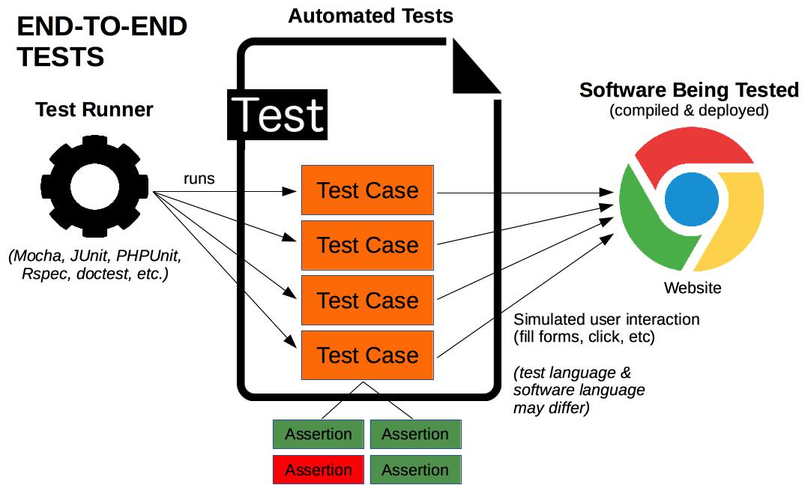</p>

For example, testing tools like [Selenium WebDriver][selenium-webdriver] allow you to control
a browser and simulate a user by navigating to web pages, filling forms, clicking buttons, etc.

### Install Selenium WebDriver

Run the following command in the project's directory to install Selenium WebDriver:

```bash
$> npm install --save-dev selenium-webdriver
```

Also follow the additional [installation instructions][selenium-webdriver-install] for your operating system if applicable.
For example for Google Chrome, you may need to download the Chrome driver to a directory,
and put that directory into your `PATH`.

> To add a directory to the `PATH` on Windows,
> modify your [system's `Path` environment variable][windows-path].
> Double-click on the `Path` variable and add the full path to the directory as a new entry.

> To add a directory to the `PATH` on Linux or macOS,
> save the following command to your `.bash_profile` file,
> then restart your terminal:
>
>     export PATH=$PATH:/path/to/directory

### Create a file for your end-to-end test

Save the following contents to a file named `tests/e2e.test.js`:

```js
const webdriver = require('selenium-webdriver');
const { By } = require('selenium-webdriver');
const port = process.env.PORT || 3000;
const baseUrl = process.env.BASE_URL || \`http://localhost:${port}`;

describe('Greeter web page', function() {
  this.timeout(10000);

  let driver;

  beforeEach(async function() {
    driver = await new webdriver.Builder()
      .forBrowser('chrome') // Change to your browser if required
      .build();
  });

  afterEach(async function() {
    await driver.quit();
  });

  it('should produce a complex greeting', async function() {
    await driver.get(baseUrl);
  });
});
```

#### Run your end-to-end test

Make sure you have a terminal open with the `npm run dev` command running,
and the application available at http://localhost:3000 before the next step.

Run the tests again with `npm run mocha`
Mocha should execute the new test case, open your browser,
display the page, and immediately close the browser.

### Selenium WebDriver API

Selenium offers various features to inspect and manipulate web pages.

For example, you can retrieve a DOM element by its `name` attribute,
which is useful for finding a form field:

```js
const nameInputField = await driver.findElement(By.name('name'));
```

You can then type into that field by using the field's `sendKeys` method:

```js
await nameInputField.sendKeys('Bob');
```

Or if the element is a checkbox, you could click on it with the `click` method:

```js
const checkbox = await driver.findElement(By.name('enabled'));
await checkbox.click();
```

Read the [Selenium WebDriver API][selenium-webdriver-api] for information on other methods at your disposal.
For example, the `findElement` method returns [`WebElement`][selenium-webdriver-api-web-element] instances.

### Implement the end-to-end test

Here's a working test for the Greeter API.
This code goes into the `should produce a complex greeting` test
below the `driver.get` call:

```js
// Click the random checkbox
const randomInput = await driver.findElement(By.name('random'));
await randomInput.click();
// Fill the name field
const nameInput = await driver.findElement(By.name('name'));
await nameInput.clear();
await nameInput.sendKeys('webdriver');
// Fill the excitement field
const excitementInput = await driver.findElement(By.name('excitement'));
await excitementInput.clear();
await excitementInput.sendKeys('2');
// Click the loud checkbox
const loudCheckbox = await driver.findElement(By.name('loud'));
await loudCheckbox.click();

// Wait until the correct greeting is displayed in the title
await driver.wait(async function() {
  const title = await driver.findElement(By.css('h1.jumbotron-heading'));
  const text = await title.getText();
  return text === 'HELLO WEBDRIVER!!'; // Check its expected value
});

await new Promise(resolve => setTimeout(resolve, 1000));
```


## Test-Driven Development (TDD)

<!-- slide-front-matter class: center, middle -->

<p class='center'></p>

### What is test-driven development?

As the name implies, [test-driven development][tdd] is **driven by tests**.

When you want to add a new feature to your software,
instead of developing your code first, then writing your tests, you use this process:

1. Define the requirements for the new feature.
2. **Write a test for the feature first.**

   > The test will fail at first, since the feature does not exist yet.
3. **Then,** implement the feature by writing the necessary code.

   > Until the test succeeds.
4. Finally, refactor your code to improve it if necessary.

This process improves code quality because it forces you to really think about
your features up front to write the tests, before even starting to write one line of feature code.

### Apply TDD

You will add a new feature: the `Greeter` class should have a customizable separator.

For example, if you set the separator to a comma and a space,
a greeter with its name set to `Bob` and its salutation set to `Hi` should produce `Hi, Bob` instead of `Hi Bob`.
The end result should work like this:

```js
const greeter = new Greeter();
greeter.setName('Bob');
greeter.setSalutation('Hi');
greeter.setSeparator(', ');

console.log(greeter.toString()); // "Hi, Bob"
```

#### Write the test first

**Write the test for this new feature first.**

Your test should call `setSeparator` and make an assertion that the result should be "Hi, Bob":

```js
it.only('should produce a greeting with a separator', function() {

  const greeter = new Greeter();
  greeter.setName('Bob');
  greeter.setSalutation('Hi');
  greeter.setSeparator(', ');

  expect(greeter.toString()).to.equal('Hi, Bob');
});
```

> Note the `.only` after `it`.
> This makes Mocha execute only that test for now.
> You will remove it later when you are done implementing the feature.

#### Make sure the test fails

When you run this new test, it should fail, since you have not implemented the `setSeparator` method yet:

```bash
$> npm run mocha

  Greeter
    1) should produce a greeting with a separator

  0 passing (10ms)
  1 failing

  1) Greeter
       should produce a greeting with a separator:
     TypeError: greeter.setSeparator is not a function
      at Context.<anonymous> (tests/code.test.js:11:13)
```

#### Implement the feature

Add the following getter and setter to the `Greeter` class:

```js
getSeparator() {
  return this.separator;
}

setSeparator(separator) {
  this.separator = separator;
}
```

Then modify the last line in the `toString` method to this:

```js
return \`${this.getSalutation()}${this.getSeparator()}${this.getName()}`;
```

#### Make sure the test passes

Now that you have implemented the feature, the test should pass:

```bash
$> npm run mocha

Greeter
    ✓ should produce a greeting with a separator

  1 passing (7ms)
```

You have implemented your first feature using test-driven development:

* You implemented a failing test first.
* Then you implemented the feature to make the test pass.

### Enable the rest of the tests again

Remove the `.only` from your test.
If you run the tests with `npm run mocha` again,
you will probably see some tests failing:

```
2 passing (12s)
5 failing
```

You should see errors similar to this:

```
1) Greeter API
     should produce a simple greeting:

    AssertionError: expected { greeting: 'HelloundefinedWorld' }
      to deeply equal { greeting: 'Hello World' }

    + expected - actual

     {
    -  "greeting": "HelloundefinedWorld"
    +  "greeting": "Hello World"
     }

    at Context.<anonymous> (tests/api.test.js:17:35)
    at process._tickCallback (internal/process/next_tick.js:68:7)
```

### Why write automated tests?

Thanks to the tests you wrote earlier,
you can easily identify that after implementing this latest separator feature,
you have introduced a **change in behavior**.

This is also called a **regression**,
because things that previously worked do not work anymore.
In other words, you have introduced a bug.

#### Fix the bug and run the tests again

You can easily fix the issue by modifying the constructor of the `Greeter` class as follows:

```js
constructor() {
  this.separator = ' ';
}
```

Now that you have done so,
your automated test suite allows you to quickly check
that everything works as it did before:

```bash
$> npm run mocha

  Greeter API
    ✓ should produce a simple greeting (40ms)
    ✓ should produce a complex greeting
  ...

  7 passing (4s)
```


## Behavior-Driven Development (BDD)

[Behavior-driven development][bdd] is quite similar to test-driven development:
you start with the tests, then you implement the features.

The difference is that instead of writing tests only in code,
you use a [domain-specific language (DSL)][dsl] that allows you to express business requirements in readable language.

This theoretically allows more business-oriented project members to participate in the definition of automated tests.

### Cucumber & Gherkin

You will use [Cucumber][cucumber], a very popular BDD test framework and runner.
It has a [JavaScript implementation][cucumber-js].

Cucumber uses [Gherkin][gherkin],
a language that allows you to define business requirements with
a simple structure sentence using the keywords `Given`, `Then` and `When`:

```
Feature: Guess the word

  # The first example has two steps
  Scenario: Maker starts a game
    When the Maker starts a game
    Then the Maker waits for a Breaker to join

  # The second example has three steps
  Scenario: Breaker joins a game
    Given the Maker has started a game with the word "silky"
    When the Breaker joins the Maker's game
    Then the Breaker must guess a word with 5 characters
```

### Install Cucumber

Run the following command in the project's directory to install Cucumber:

```bash
$> npm install --save-dev cucumber cucumber-pretty
```

Add the following line to your `package.json` file to facilitate running the `cucumber` command:

```json
  ...
  "scripts": {
    `"cucumber": "cucumber-js -f node_modules/cucumber-pretty",`
    "dev": "cross-env DEBUG=greeter:* nodemon ./bin/www",
    "mocha": "mocha 'tests/**/*.test.js'",
    "start": "node ./bin/www"
  }
  ...
```

You should now be able to run Cucumber by typing `npm run cucumber`.

### Add a Cucumber feature test

Creates a `features` directory and save the following contents to a file named `features/greeter.feature`:

```txt
Feature: Greeter
  In order to be properly greeted
  As a customer
  I must give my name and salutation

  Scenario: simple greeting
    Given I am named "Bob"
    And I want to be saluted with "Hi"
    When I am greeted
    Then the greeting should be "Hi Bob"
```

#### Run a feature test

If you execute `npm run cucumber`,
you should see that Cucumber will read the feature file you created,
parse the Gherkin language, and execute the `Given`, `When` and `Then` steps one by one.

```
Feature: Greeter

  Scenario: simple greeting
    Given I am named "Bob"
    ? undefined
    And I want to be saluted with "Hi"
    ? undefined
    When I am greeted
    ? undefined
    Then the greeting should be "Hi Bob"
    ? undefined
```

#### Unimplemented steps

Cucumber will also warn you that these `Given`, `When` and `Then` steps are not implemented:

```Warnings:
1) Scenario: simple greeting # features/greeter.feature:6
   ? Given I am named "Bob"
       Undefined. Implement with the following snippet:

         Given('I am named {string}', function (string) {
           // Write code here that turns the phrase above into concrete actions
           return 'pending';
         });
...
```

This is to be expected.
Cucumber cannot magically determine what you mean by `Given that I am named "Bob"`.

It is your job to tell Cucumber how to interpret these steps by writing the corresponding code.
You will need to set up the necessary support files in a new `features/support` directory.

### The Cucumber world

Cucumber runs scenarios in a [World][cucumber-world].
The world is simply a JavaScript object which is the context in which
Cucumber steps will be executed.
In other words, the world will be available as `this` in the steps' implementation.

Create a world by saving the following contents to a file named `features/support/world.js`:

```js
const { setWorldConstructor } = require('cucumber')

const Greeter = require('../../lib/greeter');

class GreeterWorld {
  constructor() {
    this.greeter = new Greeter();
  }
}

setWorldConstructor(GreeterWorld);
```

This world defines a `this.greeter` variable which you will use when next implementing the steps.

### Cucumber steps

Cucumber suggests how you may implement the steps in the warnings it prints:

```js
Given('I am named {string}', function(string) {
  // Write code here that turns the phrase above into concrete actions
  return 'pending';
});
```

This code should go into a new file named `features/support/steps.js`.
Create this file now with these lines at the top:

```js
const { expect } = require('chai')
const { Given, When, Then } = require('cucumber')
```

#### Implement a step

Do as instructed by the warning and implement the required code.

For the first `Given I am named {string}` step,
you want to set the greeter's name.
You might remember that you just defined `this.greeter` in the Cucumber world,
so you can use it in this step:

```js
Given('I am named {string}', function(name) {
  this.greeter.setName(name);
});
```

Do the same for the salutation step:

```js
Given('I want to be saluted with {string}', function(salutation) {
  this.greeter.setSalutation(salutation);
});
```

These are the **setup** steps of this scenario.

#### Implement the remaining steps

The `When I am greeted` step is the **action** in this scenario.
It should create the greeting and store the result in a variable
so that you can run assertions on it later:

```js
When('I am greeted', function() {
  this.greeting = this.greeter.toString();
});
```

The `Then the greeting should be "..."` step is the **assertion** in this scenario.
In it, you should assert that the actual greeting matches the expected one:

```js
Then('the greeting should be {string}', function(greeting) {
  expect(this.greeting).to.equal(greeting);
});
```

#### All the steps

The final `steps.js` file should look like this:

```js
const { expect } = require('chai')
const { Given, When, Then } = require('cucumber')

Given('I am named {string}', function(name) {
  this.greeter.setName(name);
});

Given('I want to be saluted with {string}', function(salutation) {
  this.greeter.setSalutation(salutation);
});

When('I am greeted', function() {
  this.greeting = this.greeter.toString();
});

Then('the greeting should be {string}', function(greeting) {
  expect(this.greeting).to.equal(greeting);
});
```

### Run the full Cucumber feature

Armed with your world and steps,
you can now run the fully functional Cucumber scenario:

```bash
$> npm run cucumber

Feature: Greeter

  Scenario: simple greeting
    Given I am named "Bob"
    And I want to be saluted with "Hi"
    When I am greeted
    Then the greeting should be "Hi Bob"

1 scenario (1 passed)
4 steps (4 passed)
0m00.004s
```

### Why use Cucumber?

To sum up,
Cucumber is simply another test runner.
You could implement unit tests, integration tests, API tests or end-to-end tests with it,
provided that you implement the required code in the Cucumber world and steps.

What makes it valuable compared to standard test frameworks is:

* Tests are written with a **human-readable syntax**,
  making them easy to understand.
* With the support of a development team to actually implement the steps,
  the Gherkin feature files themselves could conceivably be **written by
  business-oriented team members with no programming skills**.


## References

* [Test Automation][automated-tests]
  * [Unit Testing][unit-testing]
  * [Integration Testing][integration-testing]
  * [System Testing][system-testing]
  * [API Testing][api-testing]
  * [GUI Testing][gui-testing]
  * [Performance Testing][performance-testing]
* [Smartbear - Automated Testing](https://smartbear.com/learn/automated-testing/)
* [The 3 Types of Automated Tests](https://learn.techbeacon.com/units/3-types-automated-tests)
* [Atlassian CI/CD - Types of Software Testing](https://www.atlassian.com/continuous-delivery/software-testing/types-of-software-testing)
* [I Don't Write Unit Tests Because... The Excuses](https://edwardthienhoang.wordpress.com/2014/10/29/i-dont-write-unit-tests-because-the-excuses/)


[acceptance-testing]: https://en.wikipedia.org/wiki/Acceptance_testing
[api]: https://en.wikipedia.org/wiki/Application_programming_interface
[api-testing]: https://en.wikipedia.org/wiki/API_testing
[appium]: https://appium.io
[automated-tests]: https://en.wikipedia.org/wiki/Test_automation
[bdd]: https://en.wikipedia.org/wiki/Behavior-driven_development
[chai]: https://www.chaijs.com
[chai-assertions]: https://www.chaijs.com/api/bdd/
[composer]: https://getcomposer.org
[cucumber]: https://cucumber.io/
[cucumber-js]: https://github.com/cucumber/cucumber-js
[cucumber-world]: https://github.com/cucumber/cucumber-js/blob/master/docs/support_files/world.md
[decorator]: https://en.wikipedia.org/wiki/Decorator_pattern
[doctest]: https://pythontesting.net/framework/doctest/doctest-introduction/
[dsl]: https://en.wikipedia.org/wiki/Domain-specific_language
[gherkin]: https://docs.cucumber.io/gherkin/reference/
[gui-testing]: https://en.wikipedia.org/wiki/Graphical_user_interface_testing
[integration-testing]: https://en.wikipedia.org/wiki/Integration_testing
[jasmine]: https://jasmine.github.io
[java]: https://www.java.com
[jest]: https://jestjs.io
[jmeter]: https://jmeter.apache.org/
[js]: https://en.wikipedia.org/wiki/JavaScript
[js-sample]: https://github.com/MediaComem/comem-archidep-js-automated-tests
[js-sample-build-greeting]: https://github.com/MediaComem/comem-archidep-js-automated-tests/blob/a1d78d25b303ccb64e606e270c4b0f1b2296b495/routes/greeter.js#L22-L45
[js-sample-lib]: https://github.com/MediaComem/comem-archidep-js-automated-tests/tree/master/lib
[jsmockito]: https://jsmockito.org
[json]: https://www.json.org
[junit]: https://junit.org
[mocha]: https://mochajs.org
[mocking]: https://en.wikipedia.org/wiki/Mock_object
[mustjs]: https://github.com/moll/js-must
[node]: https://nodejs.org
[npm]: https://www.npmjs.com
[npm-scripts]: https://docs.npmjs.com/misc/scripts
[performance-testing]: https://en.wikipedia.org/wiki/Software_performance_testing
[php]: http://php.net
[php-sample]: https://github.com/MediaComem/comem-archidep-php-automated-tests
[php-sample-integration]: https://github.com/MediaComem/comem-archidep-php-automated-tests/blob/b86ffe31fdbd9f51ef58491fa44f09737f1adb4a/file-stats.php#L25
[phpunit]: https://phpunit.de
[phpunit-assertions]: https://phpunit.readthedocs.io/en/7.4/assertions.html
[python]: https://www.python.org
[python-unittest]: https://docs.python.org/3/library/unittest.html
[qa]: https://en.wikipedia.org/wiki/Quality_assurance
[rest]: https://en.wikipedia.org/wiki/Representational_state_transfer
[rest-assured]: http://rest-assured.io
[robotium]: https://github.com/RobotiumTech/robotium
[rpc]: https://en.wikipedia.org/wiki/Remote_procedure_call
[rspec]: http://rspec.info
[ruby]: https://www.ruby-lang.org
[ruby-test-unit]: https://test-unit.github.io
[soapui]: https://www.soapui.org
[selenium-webdriver]: https://www.seleniumhq.org/projects/webdriver/
[selenium-webdriver-api]: https://seleniumhq.github.io/selenium/docs/api/javascript/module/selenium-webdriver/
[selenium-webdriver-api-web-element]: https://seleniumhq.github.io/selenium/docs/api/javascript/module/selenium-webdriver/index_exports_WebElement.html
[selenium-webdriver-install]: https://www.npmjs.com/package/selenium-webdriver#installation
[shouldjs]: http://shouldjs.github.io
[sinon]: https://sinonjs.org
[supertest]: https://github.com/visionmedia/supertest
[system-testing]: https://en.wikipedia.org/wiki/System_testing
[tape]: https://github.com/substack/tape
[tdd]: https://en.wikipedia.org/wiki/Test-driven_development
[testdoublejs]: https://github.com/testdouble/testdouble.js/
[unit-testing]: https://en.wikipedia.org/wiki/Unit_testing
[vscode]: https://code.visualstudio.com
[windows-path]: https://www.computerhope.com/issues/ch000549.htm

# Continuous Software Development

Learn about continuous integration, continuous testing, continuous delivery and continuous deployment.

<!-- slide-include ../../BANNER.md -->

**Recommended reading**

* [Collaborating with Git](../git-collaborating/)

<!-- START doctoc generated TOC please keep comment here to allow auto update -->
<!-- DON'T EDIT THIS SECTION, INSTEAD RE-RUN doctoc TO UPDATE -->

- [What is continuous software development?](#what-is-continuous-software-development)
  - [Continuous et al.](#continuous-et-al)
  - [The waterfall model](#the-waterfall-model)
  - [Iterative software development](#iterative-software-development)
    - [Advantages of iterative software development](#advantages-of-iterative-software-development)
  - [Agile software development](#agile-software-development)
  - [What is continuous software development, again?](#what-is-continuous-software-development-again)
- [Continuous Integration (CI)](#continuous-integration-ci)
- [Continuous Testing (CT)](#continuous-testing-ct)
- [Continuous delivery (CDE)](#continuous-delivery-cde)
- [Continuous deployment (CD)](#continuous-deployment-cd)
- [Continuous software development](#continuous-software-development)
- [References](#references)

<!-- END doctoc generated TOC please keep comment here to allow auto update -->


## What is continuous software development?

<!-- slide-front-matter class: center, middle -->

<p class='center'></p>

### Continuous et al.

Continuous software development is an umbrella term that describes several aspects of [**iterative software development**][iterative]:

* [**C**ontinuous **I**ntegration (CI)][ci]
* [**C**ontinuous **T**esting (CT)][ct]
* [**C**ontinous **D**elivery (CDE)][cde]
* [**C**ontinous **D**eployment (CD)][cd]

### The waterfall model

Iterative development is a solution to the problems of the earlier **waterfall model** of software development.
In this model, progress flows in largely one direction through the phases of conception, design, implementation, verification and maintenance.

<!-- slide-column -->

The idea came from the manufacturing and construction industries,
and was initially applied to software development.

However, it makes it **difficult to respond to changes in requirements**.
If you are already in the verification phase, it's too late for new design and implementation.

<!-- slide-column 65 -->


### Iterative software development

In contrast, iterative software development consists in developing software through **repeated cycles** (iterations) and in smaller portions at a time (incrementally).

<p class='center'>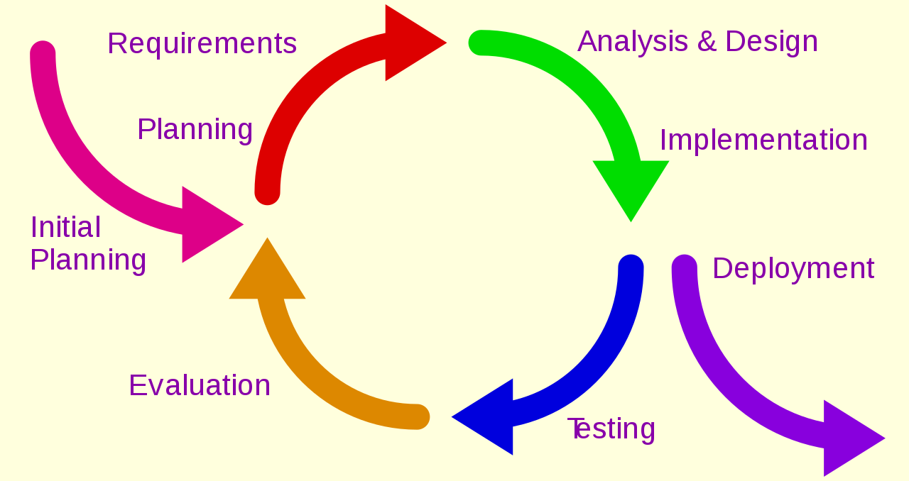</p>

The planning, analysis, implementation, testing and evaluation **phases are repeated at each iteration** throughout the project.

#### Advantages of iterative software development

The main advantages of developing iteratively are:

* **User involvement:** the customer is involved at each and every iteration for planning and requirements,
  which makes it much easier to identify problems and react to changes in requirements.
* **Human resources:** less staff is required compared to the waterfall model.
* **Time limitation:** the first iterations can potentially be delivered within weeks while a waterfall project usually takes months.

### Agile software development

[**Agile software development**][agile] is one of the most popular iterative development models.

It was popularized by the [Manifesto for Agile Software Development][agile-manifesto]
which describes the values and principles espoused by the model.
It has been adopted by many software development companies to improve the quality and speed of software.

There are various [agile frameworks][agile-frameworks] you can use to organize your work.
Each has a slightly different focus:

* [eXtreme Programming (XP)][xp] (focus on practices)
* [Kanban][kanban] (focus on workflow)
* [Scrum][scrum] (focus on workflow)

### What is continuous software development, again?

To use agile software development or other iterative development models,
you **must be able to move and react quickly**.

Hence these various so-called "continuous" practices which help achieve this:

Practice                                  | Description
:---                                      | :---
[**C**ontinuous **I**ntegration (CI)][ci] | Regularly merge developer work to a shared mainline to avoid "integration hell".
[**C**ontinuous **T**esting (CT)][ct]     | Automate testing to reduce feedback waiting time for developers.
[**C**ontinous **D**elivery (CDE)][cde]   | Automate software delivery so that it can be reliably released at any time.
[**C**ontinous **D**eployment (CD)][cd]   | Automate software deployment to regularly provide new features to users.


## Continuous Integration (CI)

[**C**ontinuous **I**ntegration (CI)][ci] is the practice of merging all developer work to a shared mainline regularly,
instead of having each developer work independently for days or weeks on end, and suffering when the time comes to integrate their work back into the mainline.

<p class='center'></p>

This is often managed with [version control][vcs] systems such as [Git][git].
A software development team may define a [workflow][git-workflows] determining when to merge work back into the mainline
(typically the `master` branch).


## Continuous Testing (CT)

[**C**ontinuous **T**esting (CT)][ct] is the practice of using automated tests
to obtain immediate feedback while developing instead of waiting for the Quality Assurance (QA) engineers to manually test the software.

<!-- slide-column 60 -->

Software such as websites or mobile applications have traditionally been tested manually.
However, it **takes time to go through all possible paths** through an application and make sure it works.
Every time code changes, someone potentially broke something that a manual tester might fail to notice.

**Tests can be automated by writing them in code,**
increasing their speed and avoiding boring and repetitive click work for manual testers.

<!-- slide-column -->


<!-- slide-container -->

Automated tests are often integrated into the continuous pipeline by running them automatically
every time changes are pushed to **version control**.


## Continuous delivery (CDE)

[**C**ontinous **D**elivery (CDE)][cde] is the practice of ensuring that software can be reliably released at any time,
usually by automating the building, testing and releasing of software.
This is often called a **deployment pipeline**.

<p class='center'></p>


## Continuous deployment (CD)

[**C**ontinous **D**eployment (CD)][cd] is one step further than [**C**ontinous **D**elivery (CDE)][cde]:
also automating the deployment of the software in addition to its delivery.

<p class='center'></p>


## Continuous software development

<!-- slide-column -->

To recap, continuous software development is the practice of regularly
integrating, testing, delivering and deploying software, usually through automation.

<!-- slide-column 60 -->

<p class='center'></p>

<!-- slide-container -->

There are many tools to help you do this.
These are just a few examples:

Tool                   | Description
:---                   | :---
[Jenkins][jenkins]     | Open source automation server
[Travis CI][travis]    | Free continuous integration and testing service
[GitLab CI][gitlab-ci] | Continous integration and delivery service
[Codacy][codacy]       | Automated code review service


## References

* [Iterative development][iterative] vs. [Waterfall model][waterfall]
  * [Agile Software Development][agile]: [Kanban][kanban], [Scrum][scrum], [eXtreme Programming][xp]
* [Continuous Integration][ci]
  * [Git Workflows][git-workflows]
     * [A Successful Git Branching Model][git-model]
     * [A Successful Git Branching Model Considered Harmful][git-model-harmful]
* [Continuous Testing][ct]
* [Continous Delivery][cde]
* [Continous Deployment][cd]


[agile]: https://en.wikipedia.org/wiki/Agile_software_development
[agile-frameworks]: https://en.wikipedia.org/wiki/Agile_software_development#Agile_software_development_methods
[agile-manifesto]: https://agilemanifesto.org/
[cd]: https://en.wikipedia.org/wiki/Continuous_deployment
[cde]: https://en.wikipedia.org/wiki/Continuous_delivery
[ci]: https://en.wikipedia.org/wiki/Continuous_integration
[codacy]: https://www.codacy.com/
[ct]: https://en.wikipedia.org/wiki/Continuous_testing
[git]: https://git-scm.com/
[gitlab-ci]: https://about.gitlab.com/product/continuous-integration/
[git-model]: https://nvie.com/posts/a-successful-git-branching-model/
[git-model-harmful]: https://barro.github.io/2016/02/a-succesful-git-branching-model-considered-harmful/
[git-workflows]: https://git-scm.com/book/en/v2/Git-Branching-Branching-Workflows
[iterative]: https://en.wikipedia.org/wiki/Iterative_and_incremental_development
[jenkins]: https://jenkins.io/
[kanban]: https://en.wikipedia.org/wiki/Kanban_(development)
[scrum]: https://en.wikipedia.org/wiki/Scrum_(software_development)
[travis]: https://jenkins.io/
[vcs]: https://en.wikipedia.org/wiki/Version_control
[waterfall]: https://en.wikipedia.org/wiki/Waterfall_model
[xp]: https://en.wikipedia.org/wiki/Extreme_programming
